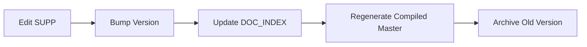

# SOW Development Framework

> **Purpose**: Guide for ongoing SOW development to get NewPOPSys v1 ready for dev.
> **Last Updated**: 2025-12-19

---

## Quick Start

| Task | Location | Action |
|------|----------|--------|
| **Read full SOW** | [MASTER_SOW_COMPILED](file:///I:/Shared%20drives/VG%20Development/PopSystem/SOW/01_Main_SOW/MASTER_SOW_COMPILED_v1_34.md) | Single file with all 32 SUPPs |
| **Navigate docs** | [00_DOC_INDEX](file:///I:/Shared%20drives/VG%20Development/PopSystem/SOW/00_Index/00_DOC_INDEX.md) | Document registry with links |
| **Edit a SUPP** | `99_Archive_MD_Converted/02_SUPPs/[Module]/` | Markdown files to edit |

---

## 1. Document Update Workflow

See [Module Responsibility + Hand-offs](../04_Reference/NewPOPSys_v1_Mermaid_Charts.md#10-module-responsibility--hand-offs) and [Personas by Module](../04_Reference/NewPOPSys_v1_Mermaid_Charts.md#12-personas-by-module) charts.

This framework defines how we move from "Draft" → "Locked" → "Compiled" for the SOW.
Core Principle: **The SOW is code.** treating specs as immutable updates.



### Steps:
1. **Edit** the SUPP markdown file in `99_Archive_MD_Converted/02_SUPPs/[Module]/`
2. **Bump version** in the filename (`v0.2` → `v0.3`)
3. **Update** `00_Index/00_DOC_INDEX.md` with new version
4. **Regenerate** the compiled Master SOW
5. **Archive** old version to `99_Archive_Superseded/`

---

## Dev-Ready Checklist

### Status Summary

| Item | Status | Owner |
|------|--------|-------|
| All SUPPs status = "Locked" | ✅ Complete | All 34 SUPPs locked |
| Q&A Gates answered | ✅ Complete | See [STAKEHOLDER_QA_GATES.md](./STAKEHOLDER_QA_GATES.md) |
| Pilot scale confirmed | ✅ Complete | MASTER_SOW Section 4.2 |

### Q&A Gates - ALL COMPLETE (Section 4.2 / 13.3)

See [STAKEHOLDER_QA_GATES.md](./STAKEHOLDER_QA_GATES.md) for full details and source references.

1. **Pilot Scale** ✅
   - [x] 2 PSP tenants (Visual Graphx, Speedy CPS)
   - [x] 2-3 brands per PSP (Good2Go confirmed)
   - [x] Up to 1,000 stores per brand
   - [x] Variable campaign volume per staging phase
   - [x] ≥1 photo per item per location per campaign

2. **Store Execution Workflow** ✅
   - [x] Two-stage workflow: Receipt Survey + Install Survey (SUPP-017)
   - [x] Edge cases and exception handling documented (SUPP-019)

3. **PSP Fulfillment** ✅
   - [x] PSP manages batching internally (SUPP-016)
   - [x] Split shipments supported (SUPP-016)
   - [x] Automated reorder workflow (SUPP-019)

4. **Integration Requirements** ✅
   - [x] Webhook events defined (SUPP-006)
   - [x] Inbound events from PSP defined (SUPP-006)
   - [x] Integration points documented (SUPP-002)

5. **Retention Policy** ✅
   - [x] 90-day retention confirmed (SUPP-008)
   - [x] Export formats: CSV/XLSX, PDF, JSON, XML (SUPP-005)

---

## SUPP Status Summary

### By Status

| Status | Count | Action |
|--------|-------|--------|
| 🟢 **Locked** | 25 | Ready for dev |
| 🟡 **In Review** | 7 | Needs stakeholder approval |
| ⚪ **Draft** | 0 | — |

### SUPPs In Review (Need Approval)

1. SUPP-004 — Notifications and Escalation Matrix
2. SUPP-015 — Campaigns Kits Assignment
3. SUPP-018 — Verification Photo Review Retake
4. SUPP-027 — Notifications Webhooks Deliverability
5. SUPP-035 — Field Level Data Model Tables Enums
6. SUPP-036 — Screens Onboarding and Store Foundation
7. SUPP-037 — Screens SurveyBuilder and StoreSurveys

---

## Module Priority (Recommended Build Order)

Based on dependencies and Master SOW Section 13.### 4. Module Priority (Build Order)

| Layer | Focus | Status | Modules |
|-------|-------|--------|---------|
| 1 | Core Foundation | **Complete** | SUPP-002 (Domain v0.3), SUPP-003 (RBAC), SUPP-035 (Schema v0.9) |
| 2 | Store & Survey | **Complete** | SUPP-013 (Store v0.2), SUPP-014 (Survey v0.4) |
| 3 | Campaign | **Complete** | SUPP-015 (Campaign v0.3 - Two-Stage Logic) |
| 4 | Fulfillment | **Complete** | SUPP-016 (Order v0.4 - MIS & Split Ship) |
| 5 | Execution | **Complete** | SUPP-017 (Exec v0.3), SUPP-018 (Retake v0.3), SUPP-019 (Automation v0.3) |
| 6 | Platform | **Complete** | SUPP-004 (Notify v0.4), SUPP-006 (Webhook v0.5) |

---

## Gap Analysis

### Content Gaps to Fill

| SUPP | Gap | Action |
|------|-----|--------|
| SUPP-015 | Store selection UX not fully specified | Add wireframes/flows |
| SUPP-035 | Missing some enum values | Complete data model |
| SUPP-036/037 | Screens need component specs | Add UI details |

### Missing Documentation

| Document | Purpose | Priority |
|----------|---------|----------|
| API Contract Spec | OpenAPI/Zod schemas | High |
| Database ERD | Visual schema diagram | Medium |
| UI Style Guide | Design tokens, components | Medium |

---

## Folder Reference

```
SOW/
├── 00_Index/              # Registry + this framework
├── 01_Main_SOW/           # Compiled Master SOW (Markdown)
├── 02_SUPPs/              # Original DOCX (reference only)
├── 03_Context_Docs/       # Strategic direction (Markdown)
├── 04_Reference/          # Reference materials (Markdown)
├── Templates/             # SOW templates (Markdown)
├── 99_Archive_MD_Converted/          # All Markdown files (working set)
├── 99_Archive_DOCX/       # Archived DOCX originals
├── 99_Archive_Superseded/ # Old versions
└── 99_Archive_Working/    # Historical working files
```

---

## Documentation Maintenance Rules

When modifying the SOW, follow these rules to keep documentation consistent and complete.

### Rule 1: Update Glossary on New Terms

When adding or modifying:
- **New entity** → Add to [GLOSSARY.md](./GLOSSARY.md) > Core Entities
- **New status/enum** → Add to GLOSSARY.md > Status Enumerations (with transitions)
- **New event** → Add to GLOSSARY.md > Event Triggers
- **New persona/role** → Add to GLOSSARY.md > Personas & Roles
- **New workflow concept** → Add to GLOSSARY.md > Workflow Terminology

### Rule 2: Update Mermaid Charts on State/Flow Changes

When modifying:
- **Status state machine** → Update [NewPOPSys_v1_Mermaid_Charts.md](../04_Reference/NewPOPSys_v1_Mermaid_Charts.md)
- **Entity relationships** → Update [NewPOPSys_v1_ERD.md](../04_Reference/NewPOPSys_v1_ERD.md)
- **Workflow/process flow** → Add flowchart to Mermaid Charts
- **Sequence of events** → Add sequenceDiagram to Mermaid Charts

**Chart Index by Type:**
| Type | Use For |
|------|---------|
| `stateDiagram-v2` | Status lifecycles, state machines |
| `flowchart` | Architecture, data flow, module handoffs |
| `sequenceDiagram` | Multi-actor workflows, exception handling |
| `erDiagram` | Entity relationships, data model |

### Rule 3: Cross-Reference Updates

When updating a SUPP:
1. Check if changes affect the Glossary → Update
2. Check if changes affect state diagrams → Update Mermaid Charts
3. Check if changes affect entity model → Update ERD
4. Update the `Last Updated` date in modified files

### Rule 4: Archive, Don't Delete

- Never delete old diagrams — archive to `99_Archive/`
- Keep Mermaid code as source of truth (not PNG/SVG exports)
- Archived images: `99_Archive/Legacy_Images/`
- Archived DOCX: `99_Archive/DOCX/`

### Authoritative Reference Files

| File | Purpose | Location |
|------|---------|----------|
| Glossary | All terminology definitions | [00_Index/GLOSSARY.md](./GLOSSARY.md) |
| State Charts | All status diagrams | [04_Reference/NewPOPSys_v1_Mermaid_Charts.md](../04_Reference/NewPOPSys_v1_Mermaid_Charts.md) |
| ERD | Entity relationships | [04_Reference/NewPOPSys_v1_ERD.md](../04_Reference/NewPOPSys_v1_ERD.md) |
| API Spec | OpenAPI contract | [API/openapi.yaml](../../API/openapi.yaml) |
| Data Model | Field-level schema | [02_Data_Model/SUPP-035](../02_Data_Model/) |

---

## Next Steps

1. ~~**Complete Q&A Gates**~~ ✅ Done - See [STAKEHOLDER_QA_GATES.md](./STAKEHOLDER_QA_GATES.md)
2. **Review SUPPs in "In Review" status** - get stakeholder approval (7 remaining)
3. **Fill content gaps** - add missing specs to identified SUPPs
4. ~~**Create API spec**~~ ✅ Done - See [API/openapi.yaml](../../API/openapi.yaml)
5. **Start dev sprint planning** - use Module Priority order
6. **Build multi-agent harness** - See [IMPLEMENTATION_ROADMAP.md](../../AutoCoder_Harness/IMPLEMENTATION_ROADMAP.md)

