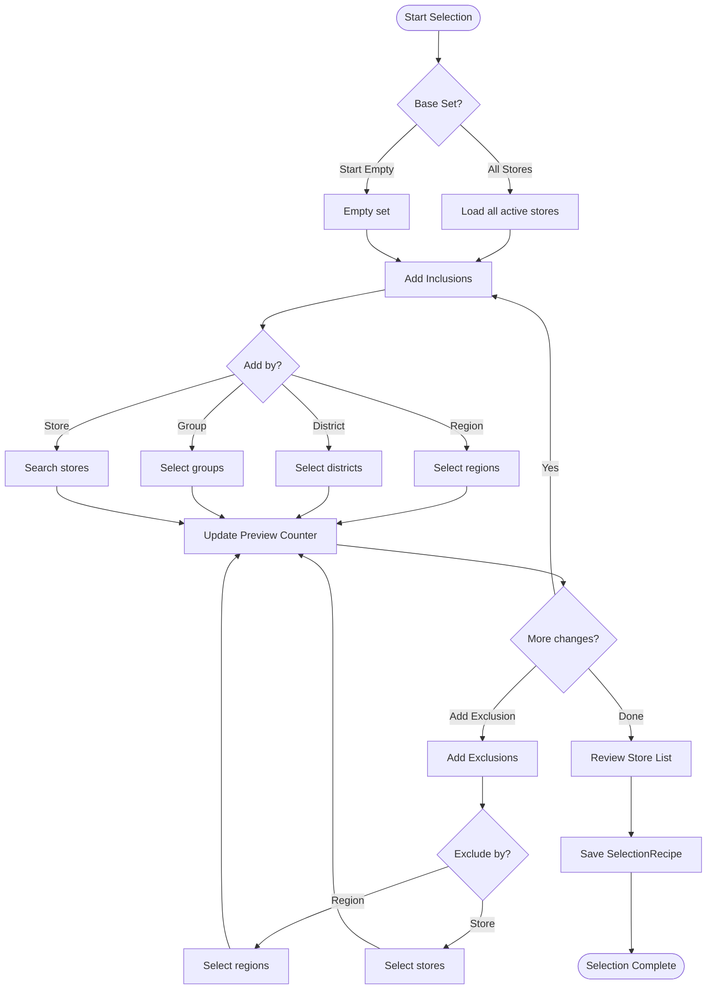

# SUPP-015 — Brand Admin Module — Campaigns Kits Assignment

> **Version**: v0.4
> **Status**: Locked
> **Updated**: 2025-12-19  
> **Dependencies**: SUPP-013 (Stores), SUPP-014 (Survey Builder)

---

## Purpose
Define campaign creation, store selection, kit modeling, and the **dynamic generation of store tasks** (Receipt & Install). This engine drives fulfillment and execution.

---

## 1. Store Selection UX

User interface for selecting participating stores. Must handle 1000+ stores efficiently.

See [Campaign Flow chart](../04_Reference/NewPOPSys_v1_Mermaid_Charts.md#9-campaign-flow-end-to-end) for end-to-end context.

### 1.1 Selection Workflow

```
┌─────────────────────────────────────────────────────────────────────┐
│                     STORE SELECTION BUILDER                          │
├─────────────────────────────────────────────────────────────────────┤
│  Base Set: ( ) All Active Stores  (●) Start Empty                   │
├─────────────────────────────────────────────────────────────────────┤
│                                                                      │
│  ┌─ INCLUDE (Add to selection) ──────────────────────────────────┐  │
│  │                                                                │  │
│  │  [+ Add Region]  [+ Add District]  [+ Add Group]  [+ Add Store]│  │
│  │                                                                │  │
│  │  ┌──────────────────────────────────────────────────────────┐ │  │
│  │  │ ✓ West Coast (Region)                    │ 312 stores   │ │  │
│  │  │ ✓ High Volume (Group)                    │ 156 stores   │ │  │
│  │  │ ✓ Store #1042 - Portland Downtown        │   1 store    │ │  │
│  │  └──────────────────────────────────────────────────────────┘ │  │
│  └────────────────────────────────────────────────────────────────┘  │
│                                                                      │
│  ┌─ EXCLUDE (Remove from selection) ─────────────────────────────┐  │
│  │                                                                │  │
│  │  [+ Exclude Region] [+ Exclude District] [+ Exclude Store]    │  │
│  │                                                                │  │
│  │  ┌──────────────────────────────────────────────────────────┐ │  │
│  │  │ ✗ Store #1089 - Portland Airport (temp closed)│ -1 store │ │  │
│  │  └──────────────────────────────────────────────────────────┘ │  │
│  └────────────────────────────────────────────────────────────────┘  │
│                                                                      │
├─────────────────────────────────────────────────────────────────────┤
│  Selected: 468 stores                          [View Store List ▼]  │
└─────────────────────────────────────────────────────────────────────┘
```

### 1.2 Selection Modes

| Mode | Description | Use Case |
|------|-------------|----------|
| **All Stores** | Start with all active stores, subtract exclusions | National campaign |
| **Start Empty** | Start with nothing, add inclusions | Regional/targeted campaign |
| **Copy from Campaign** | Clone selection from previous campaign | Follow-up campaign |

### 1.3 Selection Criteria Types

| Criteria | Selector | Behavior |
|----------|----------|----------|
| **Region** | Dropdown + checkboxes | Includes all stores in selected regions |
| **District** | Typeahead search | Includes all stores in selected districts |
| **Territory** | Typeahead search | Includes all stores in selected territories |
| **Store Group** | Dropdown + checkboxes | Includes all stores in selected custom groups |
| **Individual Store** | Search by name/number | Adds specific stores |
| **Store Status** | Checkbox filter | Only active stores by default; optionally include TEMP_CLOSED |

### 1.4 Selection Logic

```
finalStores = (baseSet === 'ALL' ? allActiveStores : emptySet)
              ∪ includedRegions
              ∪ includedDistricts
              ∪ includedTerritories
              ∪ includedGroups
              ∪ includedStores
              − excludedRegions
              − excludedDistricts
              − excludedTerritories
              − excludedStores
              ∩ {stores where status = ACTIVE or explicitly included}
```

### 1.5 Real-Time Preview

- **Counter**: Updates immediately as criteria change
- **View List**: Modal showing all selected stores with search/filter
- **Export**: Download store list as CSV for review
- **Conflicts**: Warns if store appears in both include and exclude

### 1.6 SelectionRecipe Persistence

Saved as JSON to enable re-evaluation when store data changes:

```json
{
  "version": 1,
  "baseSet": "EMPTY",
  "include": {
    "regions": ["uuid-west-coast", "uuid-northeast"],
    "districts": [],
    "territories": [],
    "groups": ["uuid-high-volume"],
    "stores": ["uuid-store-1042"]
  },
  "exclude": {
    "regions": [],
    "districts": [],
    "stores": ["uuid-store-1089"]
  },
  "statusFilter": ["ACTIVE"],
  "resolvedAt": "2025-01-15T10:30:00Z",
  "resolvedCount": 468
}
```

**Re-evaluation**: When a store moves regions or group membership changes, the recipe can be re-run to update the assignment list (admin review required).

### 1.7 Large Scale Handling

| Scale | Behavior |
|-------|----------|
| < 100 stores | Instant rendering, full list visible |
| 100-500 stores | Virtualized list, paginated preview |
| 500-1000 stores | Lazy-load preview, summary counts by region |
| > 1000 stores | Summary only, export for full list |

### 1.8 Store Selection Flow Diagram



See [Campaign lifecycle chart](../04_Reference/NewPOPSys_v1_Mermaid_Charts.md#8-campaign-lifecycle-state-diagram) for campaign state transitions.

---

## 2. Kit Model & Version Pinning
- **KitDefinition**: Reusable template of items.
- **Pinning**: At assignment, system pins the store's `SurveyVersion` and `LayoutVersion`.
    - *Why?* Ensures "Window 1" doesn't change meaning mid-campaign.
    - *Rebase*: Admin can "Rebase to Latest" with audit trail if layout changes.

---

## 3. Dynamic Survey Generation (The "Two-Stage" Model)
The system automatically generates two distinct task sets for the store based on the Kit.

### Stage 1: Receipt Survey (Logistics)
- **Trigger**: When Shipment status = `DELIVERED` (or manual "Receive" action).
- **Source**: Derived from `StoreOrder` line items.
- **Content**:
    - Checklist of all shipped items (Name, SKU, Qty).
    - "Did you receive this?" [Yes/No].
    - If No/Damaged: Triggers **Issue Reporting** flow (SUPP-019).
- **Outcome**: `ReceiveVerification` record.

### Stage 2: Install Survey (Execution)
- **Trigger**: Campaign Start Date OR Receipt Confirmed.
- **Source**: Derived from `AssignmentItem` mappings.
- **Content**:
    - Grouped by Location Slot (e.g. "Front Window").
    - For each item in slot:
        - "Install [Item Name]".
        - "Take Photo" (based on Photo Rules).
        - Verification Checklist (e.g. "Surface cleaned?").
- **Outcome**: `CompletionSubmission` with photos.

---

## 4. Order Generation
- **Trigger**: "Publish Campaign" action.
- **Process**:
    1.  Resolve Store Selection → `StoreAssignments`.
    2.  Resolve Kit Items → `AssignmentItems`.
    3.  Generate `StoreOrder` for each store.
    4.  Items mapped 1:1 to `OrderLines` (unless consolidated).
- **Output**: Orders ready for PSP pickup (API/Webhook).

---

## 5. Entities (Draft)

### Campaign
| Field | Notes |
|-------|-------|
| `selection_recipe_json` | Stored inclusion/exclusion logic |
| `kit_definition_id` | Linked kit |
| `status` | DRAFT, PUBLISHED, ACTIVE, COMPLETED |

### KitDefinition
| Field | Notes |
|-------|-------|
| `items[]` | List of `KitItemDefinition` |
| `items[].sku` | Product identifier |
| `items[].slot_type` | Where it goes (e.g. "Window") |
| `items[].photo_rule_id` | Default photo requirements |

---

## 6. Acceptance Criteria
1.  **Selection**: Can select stores by Region/Group/List and save recipe.
2.  **Pinning**: Assignments lock the store's layout version.
3.  **Receipt Survey**: Automatically generated list of items to check off.
4.  **Install Survey**: Automatically generated photo tasks per item/slot.
5.  **Orders**: Published campaign generates one order per store.

