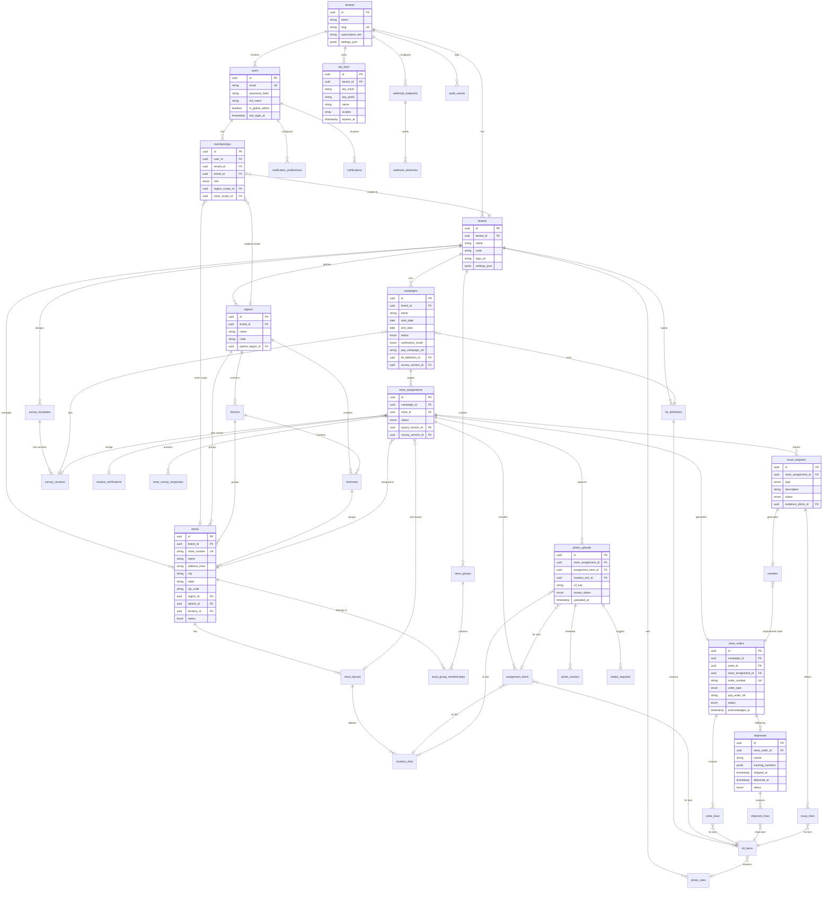
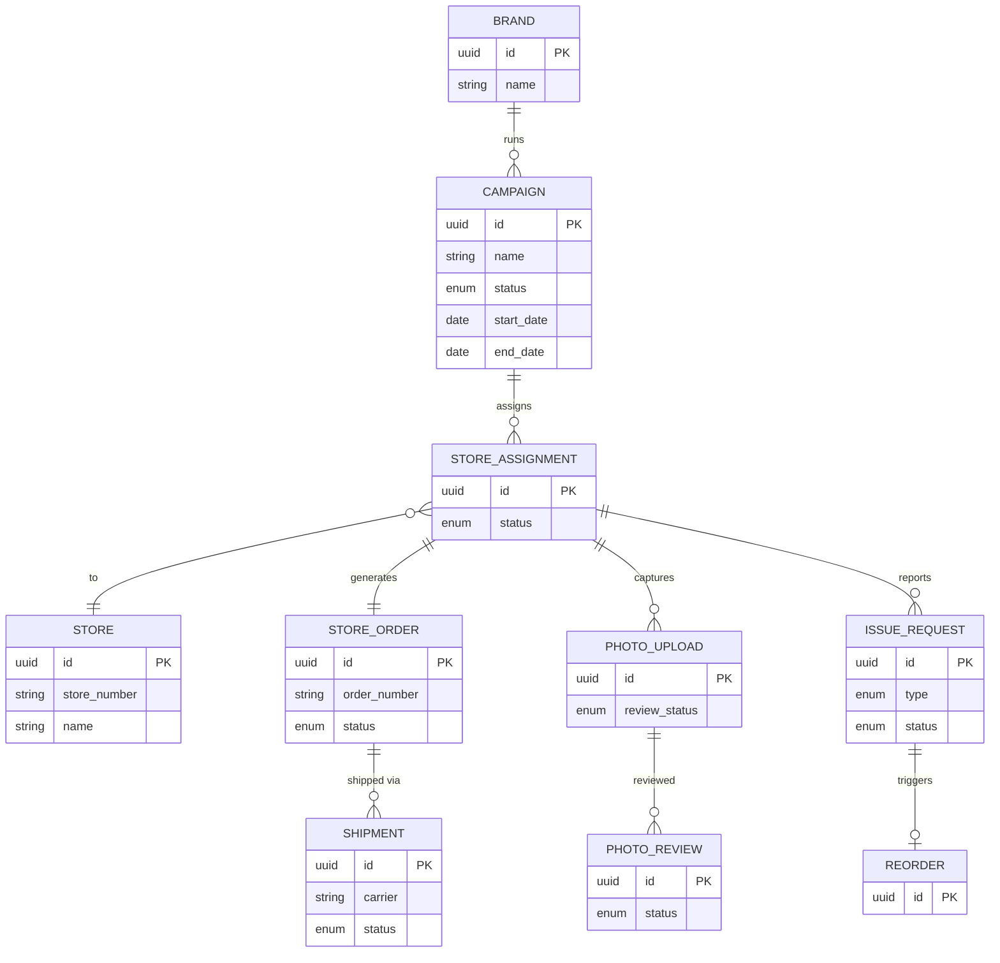
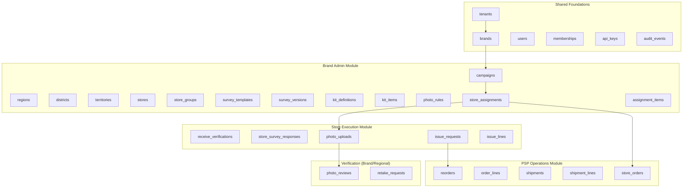

# NewPOPSys v1 — Entity Relationship Diagram

> **Updated**: 2025-12-19
> **Source**: SUPP-002 (Domain Model), SUPP-035 (Field-Level Data Model)
> Paste into [Mermaid Live](https://mermaid.live) to render.

---

## Full ERD (All Entities)

---

## Simplified Core Loop ERD

---

## Module Ownership

---

## Legend

| Symbol | Meaning |
|--------|---------|
| `||--o{` | One-to-Many |
| `}o--||` | Many-to-One |
| `||--||` | One-to-One |
| `}o--o{` | Many-to-Many |
| `PK` | Primary Key |
| `FK` | Foreign Key |
| `UK` | Unique Key |

---

*End of ERD*
