# NewPOPSys v1 — Mermaid Charts (Verified Syntax)

> **Updated**: 2025-12-19
> Paste these into [Mermaid Live](https://mermaid.live) to render.

## Chart Index

### State Diagrams
1. [FulfillmentStatus](#2-fulfillmentstatus-state-diagram-qty-derived) - Shipment/delivery states
2. [AssignmentItemStatus](#5-assignmentitemstatus-state-diagram) - Item lifecycle at store
3. [IssueRequestStatus](#6-issuerequestatus-state-diagram) - Issue/reorder workflow
4. [StoreAssignmentStatus](#7-storeassignmentstatus-state-diagram) - Store execution states
5. [Campaign lifecycle](#8-campaign-lifecycle-state-diagram) - Campaign states
6. [PhotoReviewStatus](#11-photoreviewstatus-state-diagram) - Photo review states

### Flow & Architecture Diagrams
7. [Roll-up architecture](#1-roll-up-architecture-qty--item--store--campaign) - Qty flow from PSP to Campaign
8. [StorePhase derivation](#4-storephase-derivation-parallel-lanes) - How StorePhase is computed
9. [Campaign Flow](#9-campaign-flow-end-to-end) - End-to-end campaign flow
10. [Module Responsibility + Hand-offs](#10-module-responsibility--hand-offs) - Portal ownership & handoffs
11. [Personas by Module](#12-personas-by-module) - Role assignments
12. [Status Interrelation](#13-status-interrelation-across-modules) - Status ownership
13. [Promo Item - Slot Interrelation](#14-promo-item---slot-status-interrelation) - Item/slot binding
14. [Store Selection Flow](#15-store-selection-flow) - Campaign store targeting UX

### Sequence Diagrams
15. [Partial shipment + receipt exception](#3-partial-shipment--receipt-exception-sequence) - Exception handling flow

---

## 1) Roll-up architecture (qty → item → store → campaign)
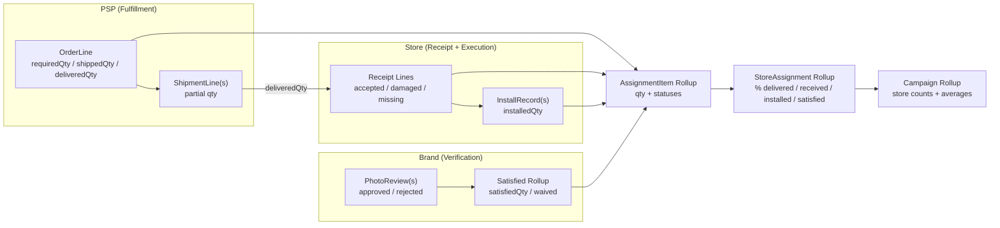

---

## 2) FulfillmentStatus state diagram (qty-derived)
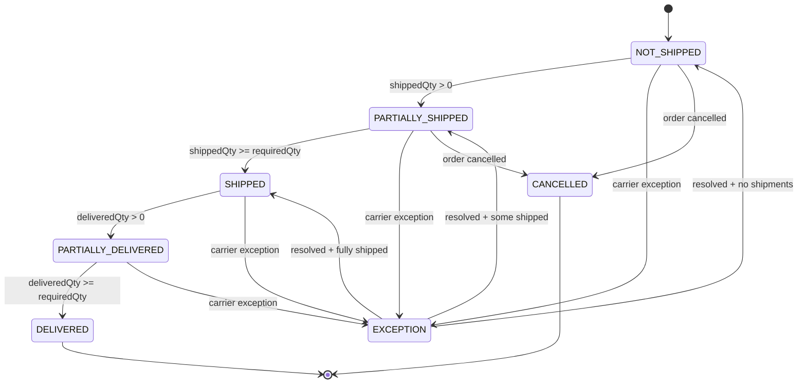

---

## 3) Partial shipment + receipt exception (sequence)
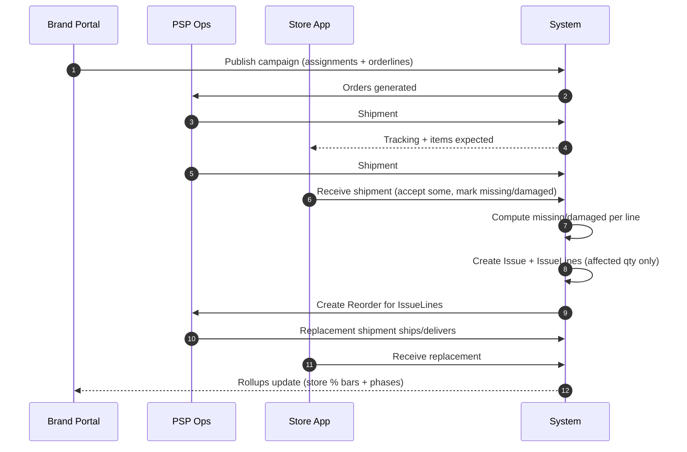

---

## 4) StorePhase derivation (parallel lanes)
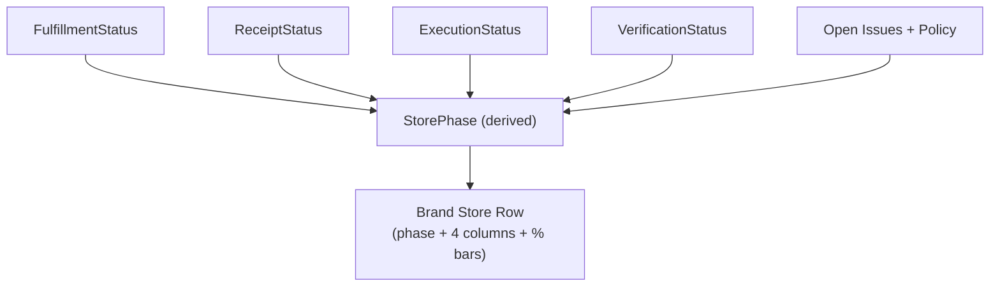

---

## 5) AssignmentItemStatus state diagram
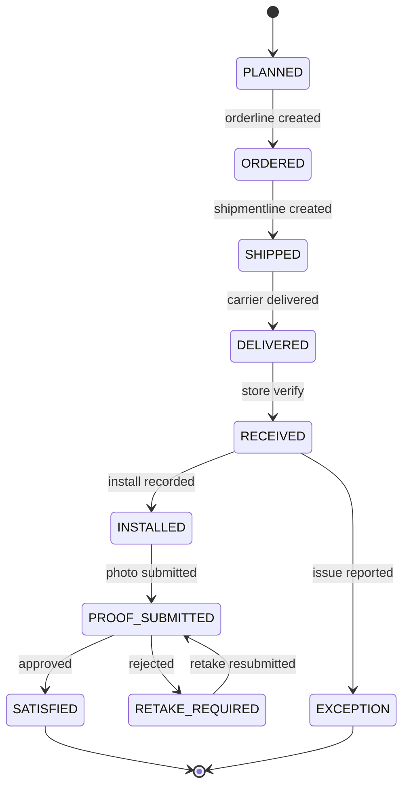

---

## 6) IssueRequestStatus state diagram
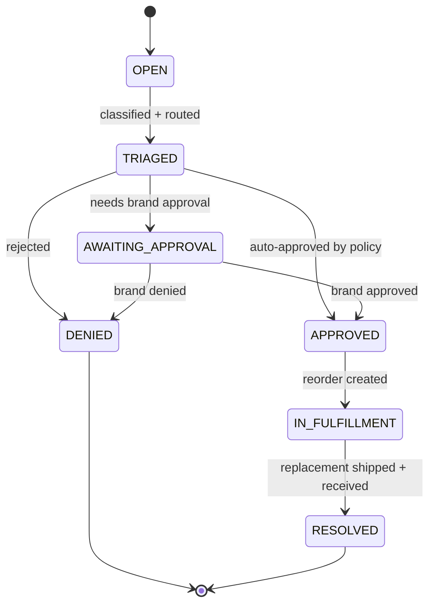

---

## 7) StoreAssignmentStatus state diagram
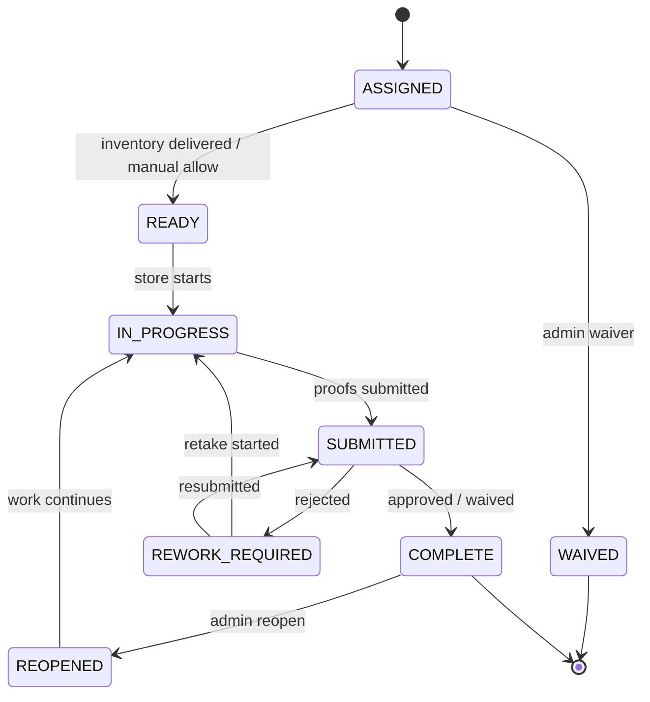

---

## 8) Campaign lifecycle state diagram
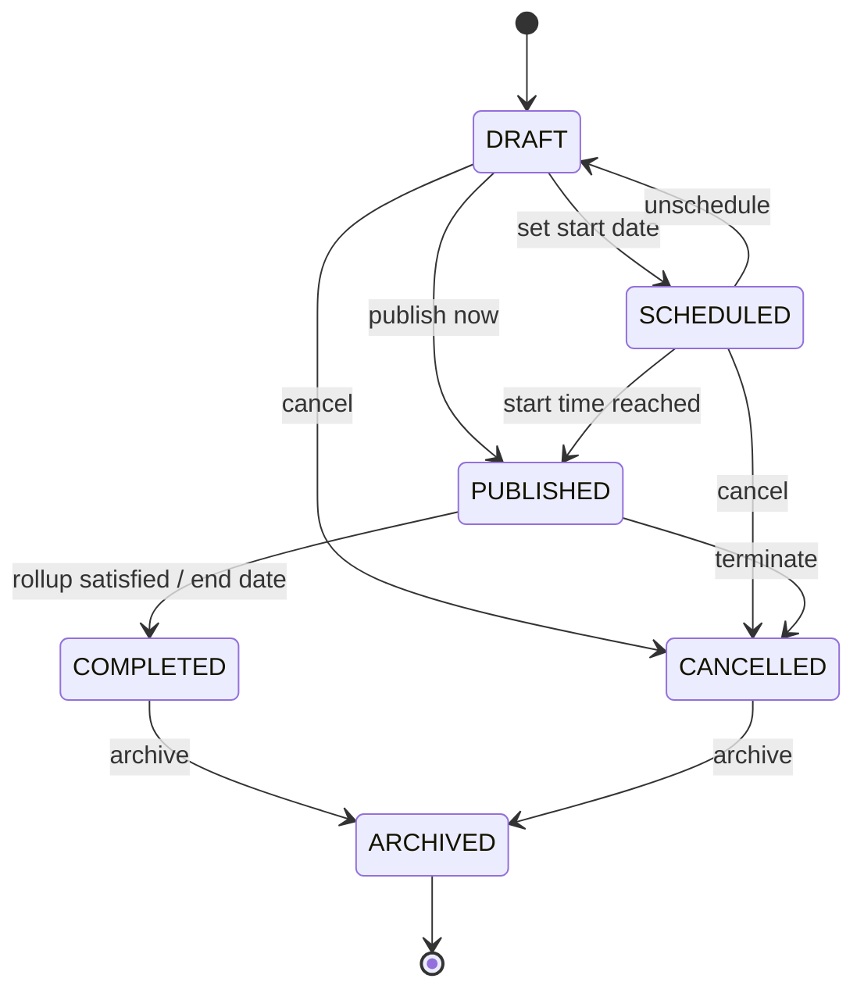

---

## 9) Campaign Flow (end-to-end)
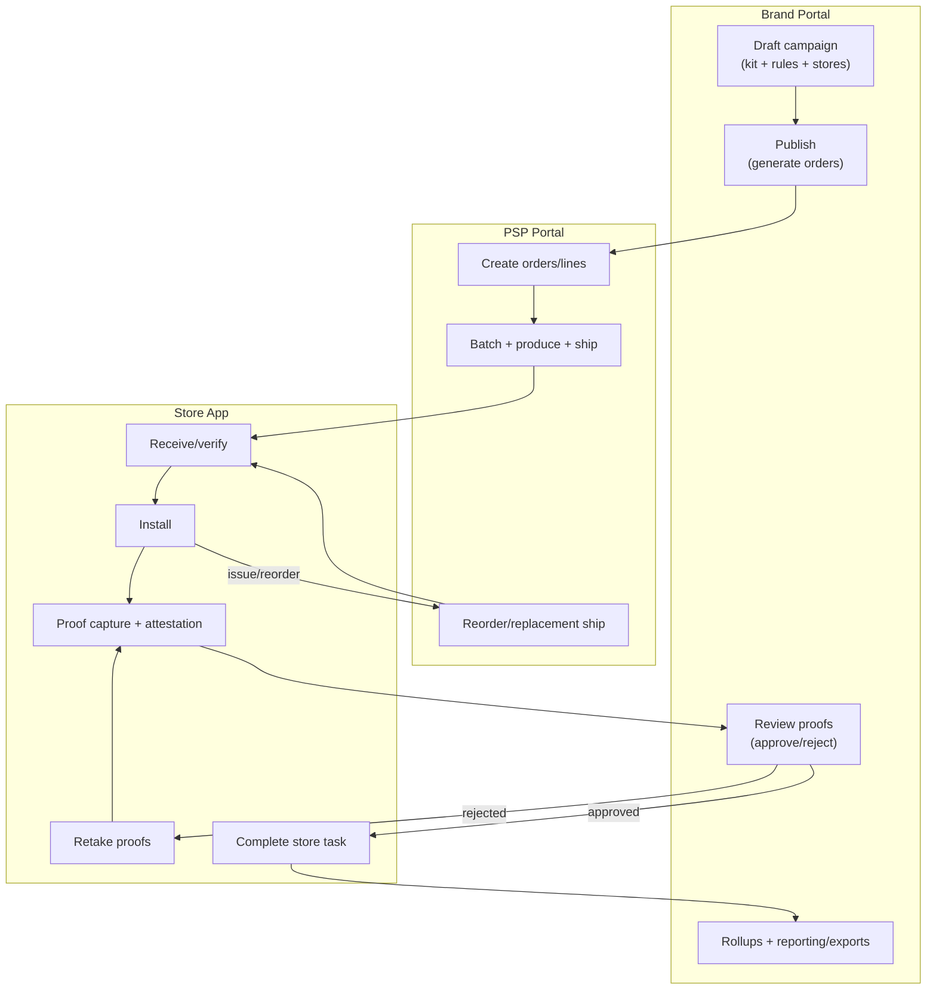

---

## 10) Module Responsibility + Hand-offs
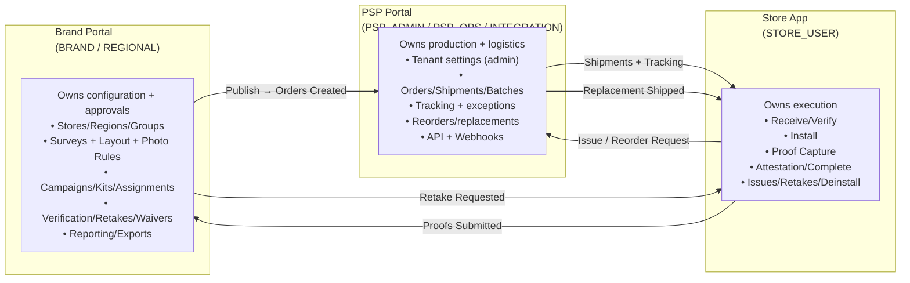

---

## 11) PhotoReviewStatus state diagram
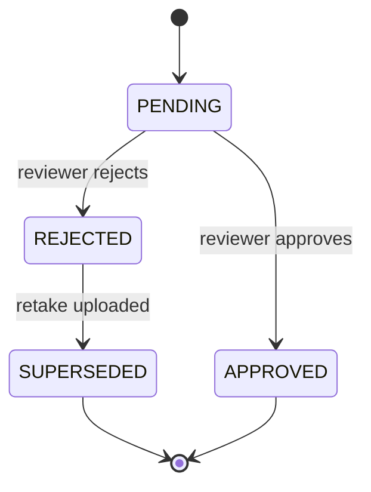

---

## 12) Personas by Module
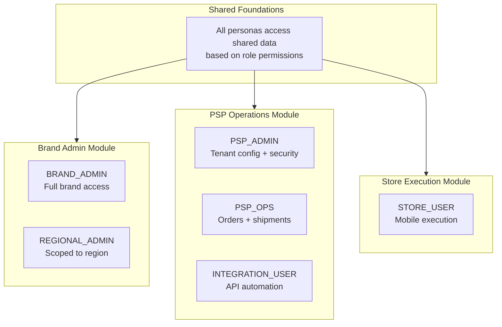

---

## 13) Status Interrelation Across Modules
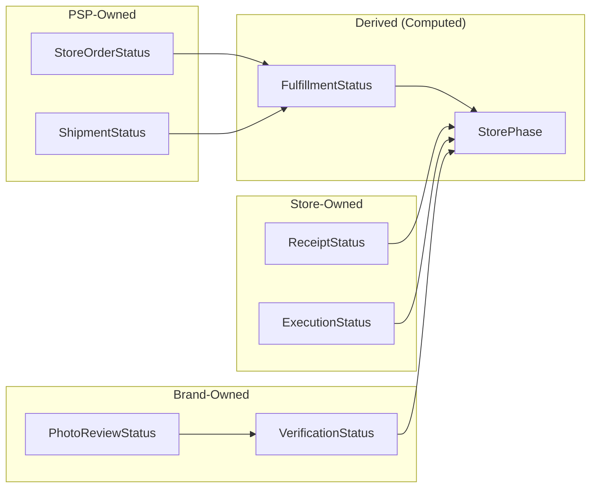

---

## 14) Promo Item - Slot Status Interrelation
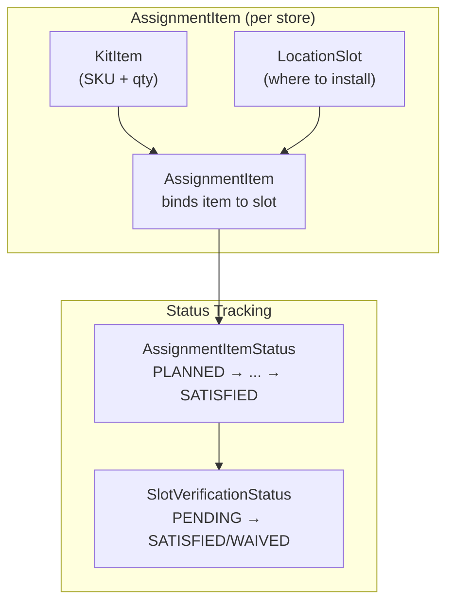

---

## 15) Store Selection Flow
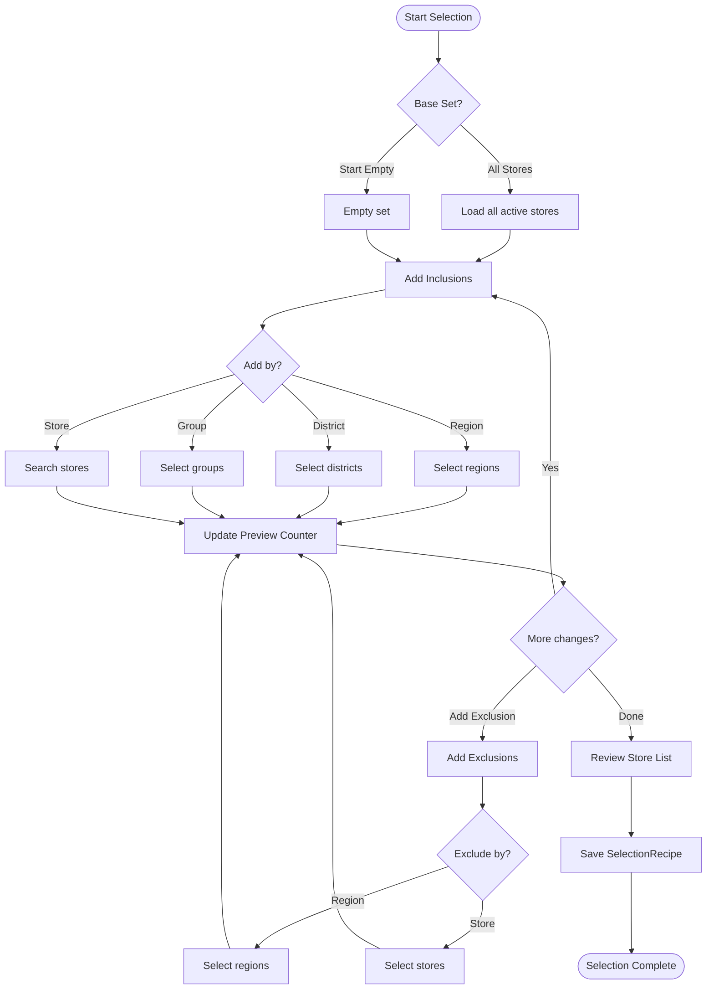
