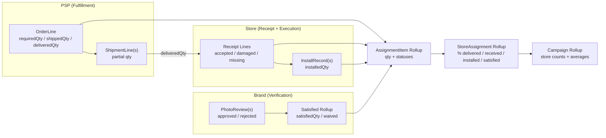

# Roll-up Architecture

Shows how quantities flow from PSP fulfillment through store execution to campaign rollups.

## Data Flow

| Source | Aggregates To | Metrics |
|--------|---------------|---------|
| OrderLine | AssignmentItem | Required, shipped, delivered qty |
| ReceiptLine | AssignmentItem | Accepted, damaged, missing |
| InstallRecord | AssignmentItem | Installed qty |
| PhotoReview | AssignmentItem | Satisfied, waived |
| AssignmentItem | StoreAssignment | % complete per phase |
| StoreAssignment | Campaign | Store counts, averages |
