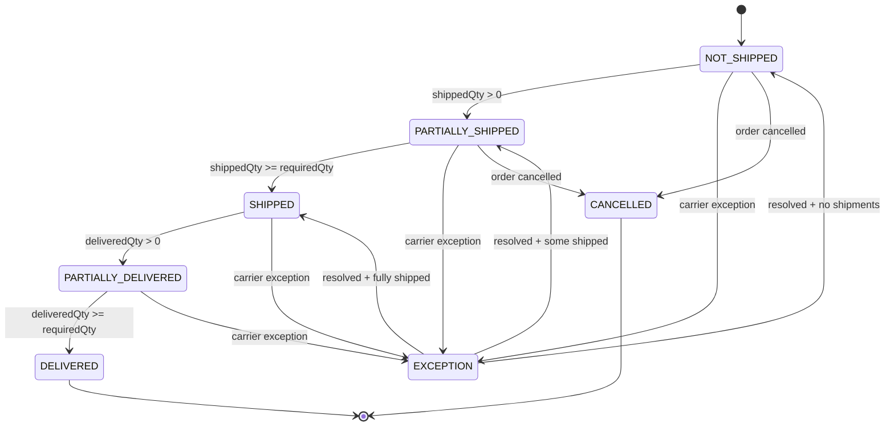

# FulfillmentStatus State Diagram

Shows the quantity-derived states for shipment and delivery tracking.

## States

| State | Trigger |
|-------|---------|
| NOT_SHIPPED | Initial state |
| PARTIALLY_SHIPPED | Some qty shipped |
| SHIPPED | All required qty shipped |
| PARTIALLY_DELIVERED | Some qty delivered |
| DELIVERED | All required qty delivered |
| EXCEPTION | Carrier exception reported |
| CANCELLED | Order cancelled |
