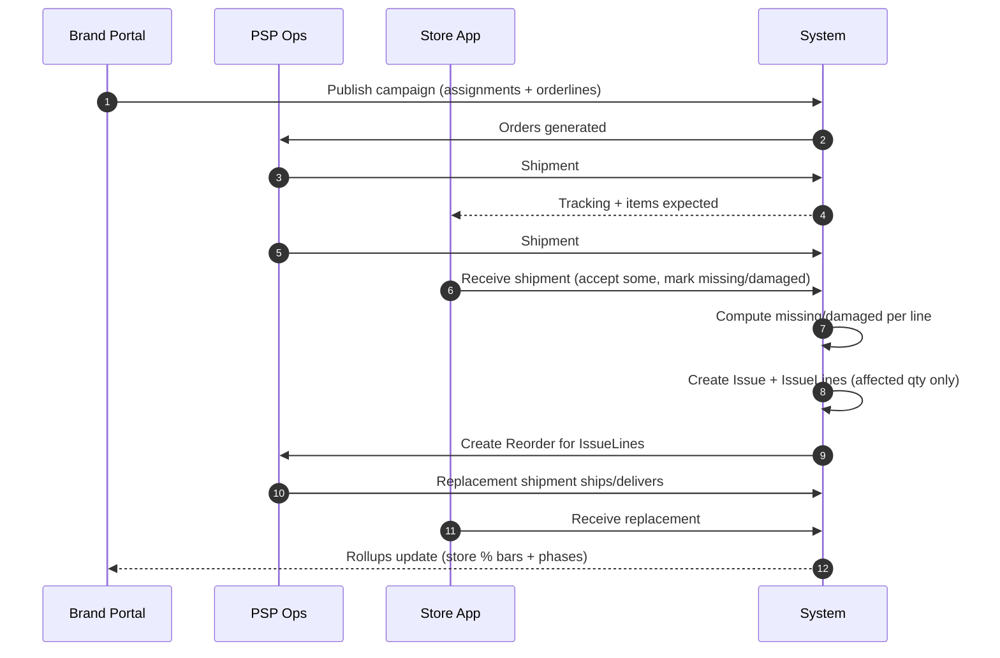

# Partial Shipment & Receipt Exception

Sequence diagram showing exception handling for partial shipments and damaged items.

## Flow Summary

1. Brand publishes campaign → orders auto-generated
2. PSP ships partial order
3. Store receives and reports issues
4. System creates issue + reorder automatically
5. PSP ships replacement
6. Rollups update for brand visibility
