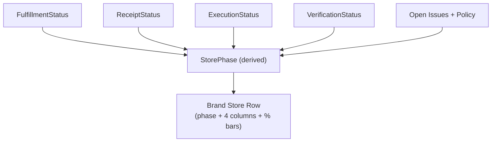

# StorePhase Derivation

Shows how the StorePhase is computed from multiple parallel status lanes.

## Input Statuses

| Status | Owner | Description |
|--------|-------|-------------|
| FulfillmentStatus | PSP | Shipment/delivery progress |
| ReceiptStatus | Store | Items received/verified |
| ExecutionStatus | Store | Installation progress |
| VerificationStatus | Brand | Photo approval status |
| Open Issues | System | Pending issue count + policy |

## Output

**StorePhase** - Single derived value shown in Brand dashboard:
- Determines which column the store appears in
- Drives the progress bar visualization
- Considers all input statuses + issue policies
