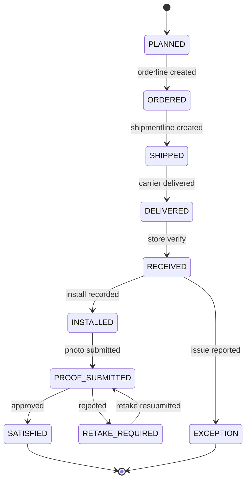

# AssignmentItemStatus State Diagram

Shows the complete lifecycle of an item at a store from planning through satisfaction.

## States

| State | Description |
|-------|-------------|
| PLANNED | Item assigned, not yet ordered |
| ORDERED | Order line created for PSP |
| SHIPPED | Item in transit |
| DELIVERED | Carrier confirmed delivery |
| RECEIVED | Store verified receipt |
| INSTALLED | Installation recorded |
| PROOF_SUBMITTED | Photo uploaded for review |
| SATISFIED | Photo approved, item complete |
| RETAKE_REQUIRED | Photo rejected, needs retry |
| EXCEPTION | Issue reported (missing/damaged) |
