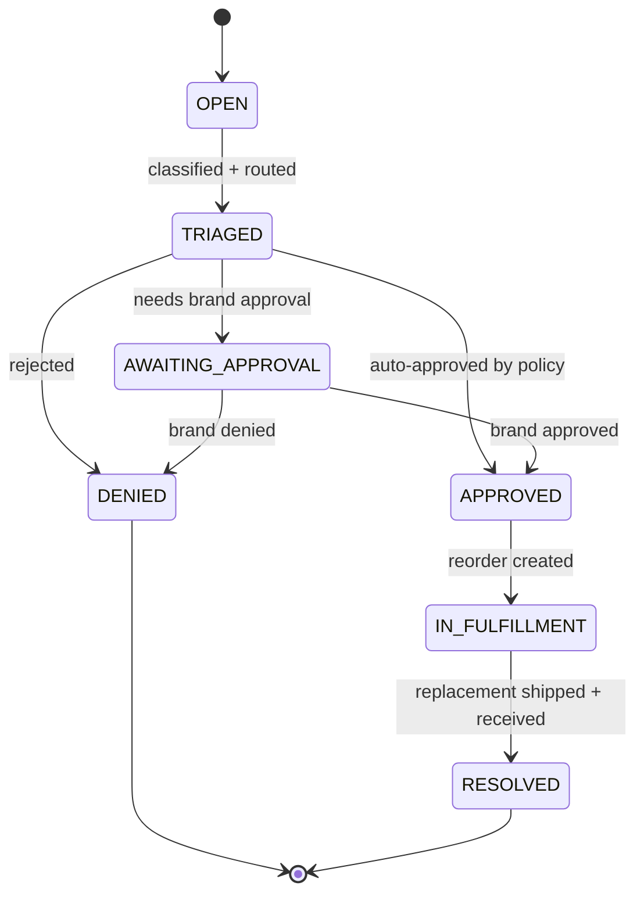

# IssueRequestStatus State Diagram

Shows the workflow for issue reporting, triage, and resolution.

## States

| State | Description |
|-------|-------------|
| OPEN | Issue reported by store |
| TRIAGED | Classified and routed for approval |
| AWAITING_APPROVAL | Requires brand approval |
| APPROVED | Approved for reorder |
| DENIED | Issue rejected |
| IN_FULFILLMENT | Replacement being produced/shipped |
| RESOLVED | Replacement received |

## Approval Policies

- **Auto-approve**: Below threshold (qty/value)
- **Manual**: Above threshold → brand review
