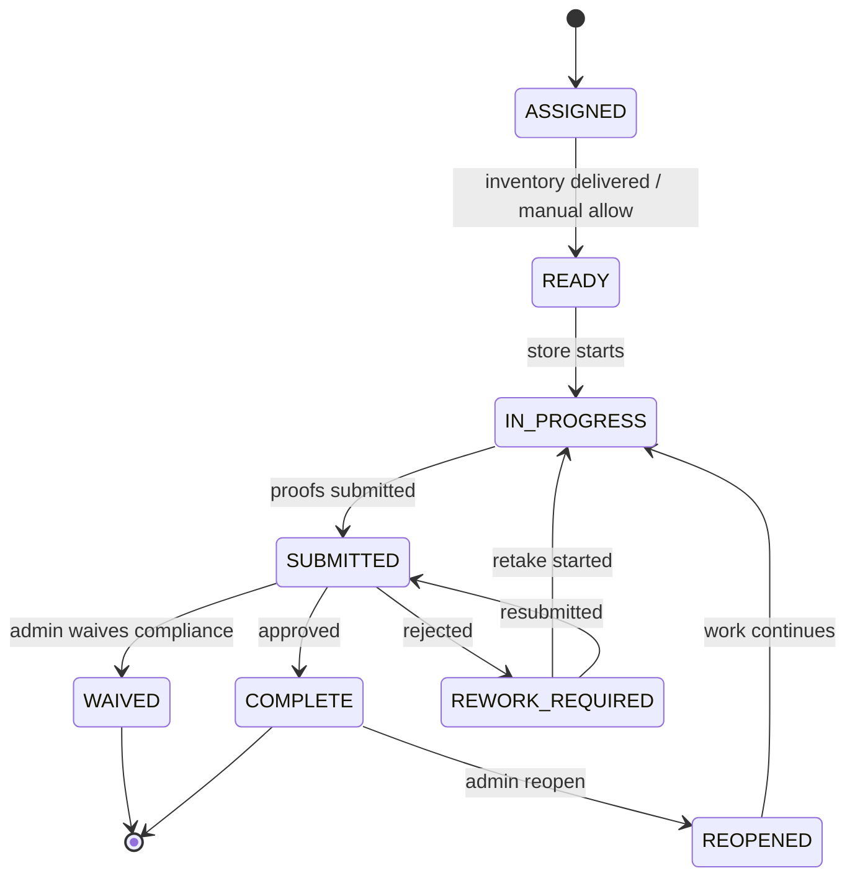

# StoreAssignmentStatus State Diagram

Shows store execution states from assignment through completion.

## States

| State | Description |
|-------|-------------|
| ASSIGNED | Store selected for campaign |
| READY | Materials delivered, can start |
| IN_PROGRESS | Store actively executing |
| SUBMITTED | Photos submitted for review |
| COMPLETE | All items satisfied/waived |
| REWORK_REQUIRED | Photos rejected, needs retry |
| REOPENED | Admin reopened completed work |
| WAIVED | Admin waived approval review (execution completed) |
