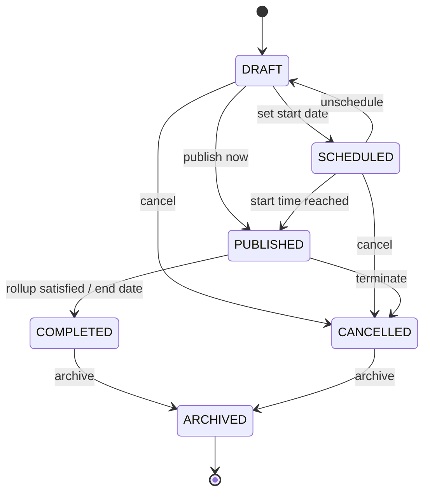

# Campaign Lifecycle State Diagram

Shows the complete lifecycle of a campaign from draft through completion.

## States

| State | Description |
|-------|-------------|
| **DRAFT** | Campaign being configured, not yet active |
| **SCHEDULED** | Campaign set to publish at future date |
| **PUBLISHED** | Active campaign, stores can execute |
| **COMPLETED** | All stores satisfied or end date reached |
| **CANCELLED** | Campaign terminated before completion |
| **ARCHIVED** | Historical record, read-only |

---

*From [Complete Diagram Collection](../../04_Reference/NewPOPSys_v1_Mermaid_Charts.md)*
