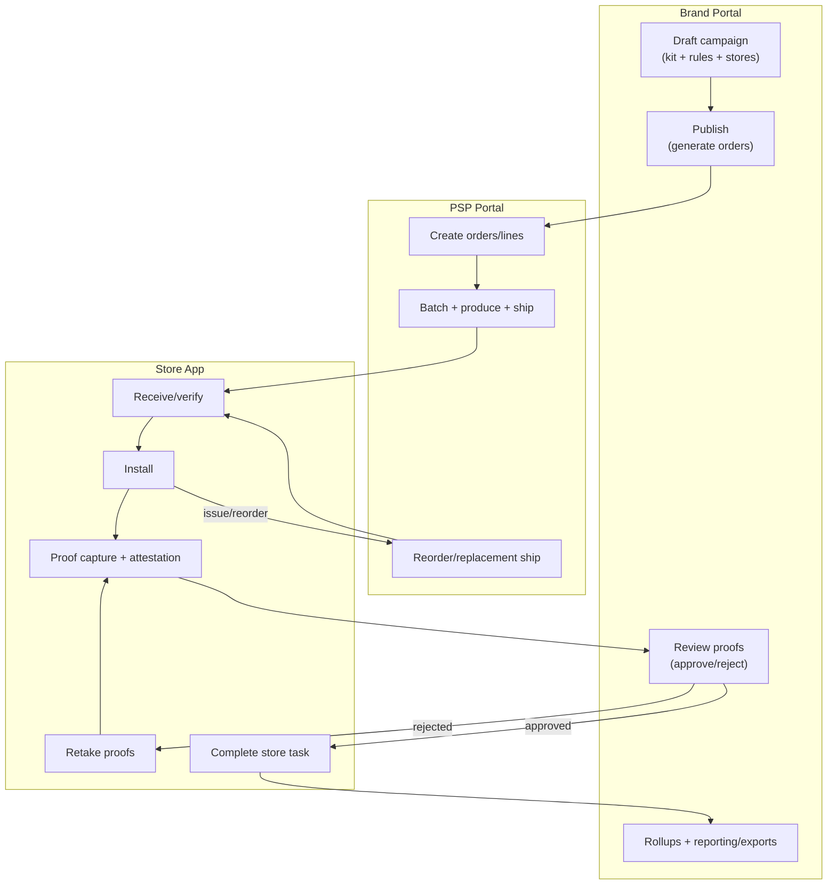

# Campaign Flow (End-to-End)

Shows the complete end-to-end campaign workflow across all three portals.

## Workflow Phases

| Phase | Portal | Actions |
|-------|--------|---------|
| **Configure** | Brand | Draft campaign, define kit, select stores |
| **Publish** | Brand | Activate campaign, generate orders |
| **Fulfill** | PSP | Batch, produce, ship materials |
| **Execute** | Store | Receive, install, capture photos |
| **Verify** | Brand | Review photos, approve/reject |
| **Complete** | All | Rollups, reporting, exports |
