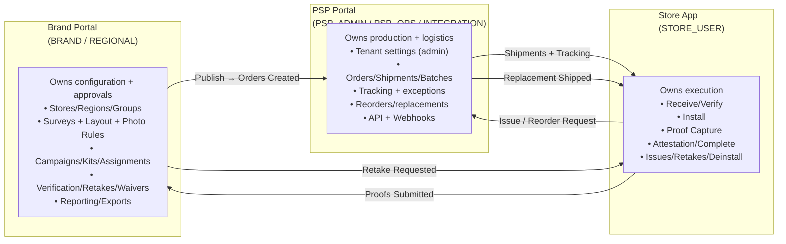

# Module Responsibility & Hand-offs

Shows portal ownership and data hand-offs between the three main modules.

## Hand-off Summary

| From | To | Trigger |
|------|-----|---------|
| Brand → PSP | Campaign published | Orders auto-generated |
| PSP → Store | Shipment created | Tracking info sent |
| Store → PSP | Issue reported | Reorder request created |
| Store → Brand | Photos submitted | Verification queue updated |
| Brand → Store | Photo rejected | Retake notification sent |

---

*From [Complete Diagram Collection](../../04_Reference/NewPOPSys_v1_Mermaid_Charts.md)*
