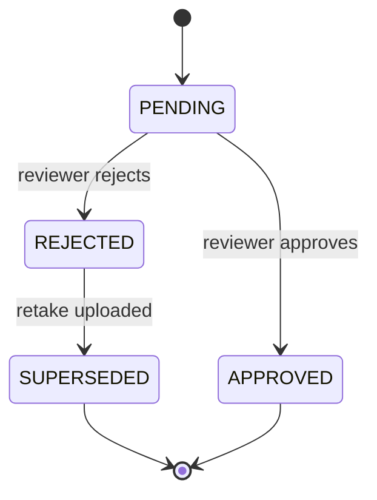

# PhotoReviewStatus State Diagram

Shows the states for individual photo review items.

## States

| State | Description |
|-------|-------------|
| PENDING | Photo submitted, awaiting review |
| APPROVED | Photo accepted |
| REJECTED | Photo rejected with reason |
| SUPERSEDED | Original replaced by retake |

## Review Actions

- **Approve**: Photo meets requirements
- **Reject**: Photo fails requirements (with reason code)
- **Supersede**: Automatically when retake uploaded
