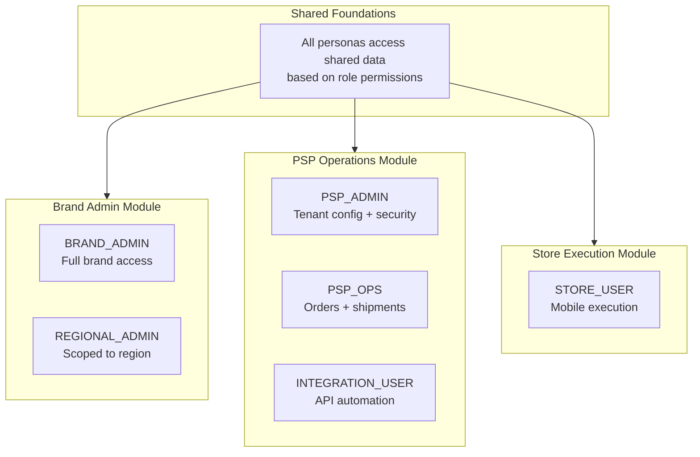

# Personas by Module

Shows which user roles interact with which platform modules.

## Role Summary

| Module | Roles | Responsibilities |
|--------|-------|------------------|
| **Brand Admin** | Brand Admin, Regional Admin | Campaign config, verification, reporting |
| **PSP Operations** | PSP Admin, PSP Ops, Integration | Tenant config, fulfillment, API |
| **Store Execution** | Store User | Receive, install, proof capture |

---

*From [Complete Diagram Collection](../../04_Reference/NewPOPSys_v1_Mermaid_Charts.md)*
