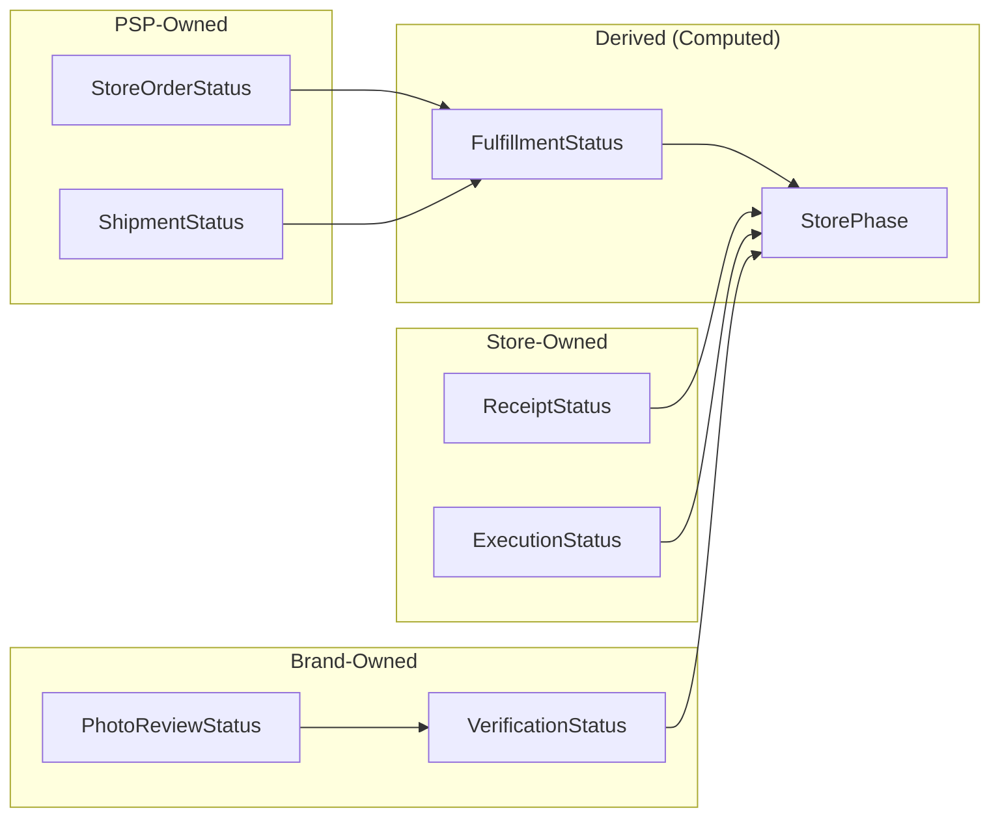

# Status Interrelation Across Modules

Shows how statuses owned by different modules relate to each other and derive computed statuses.

## Status Ownership

| Owner | Statuses | Purpose |
|-------|----------|---------|
| **PSP** | StoreOrderStatus, ShipmentStatus | Track fulfillment progress |
| **Store** | ReceiptStatus, ExecutionStatus | Track store execution |
| **Brand** | VerificationStatus, PhotoReviewStatus | Track compliance verification |
| **System** | FulfillmentStatus, StorePhase | Computed rollup for dashboards |

## Derived Status Logic

- **FulfillmentStatus**: Computed from order + shipment statuses
- **StorePhase**: Computed from all statuses to show overall store progress

---

*From [Complete Diagram Collection](../../04_Reference/NewPOPSys_v1_Mermaid_Charts.md)*
