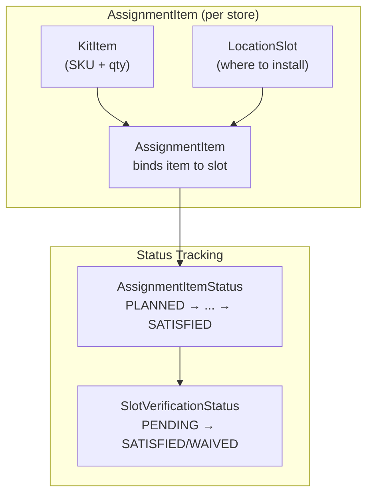

# Promo Item - Slot Status Interrelation

Shows how kit items bind to location slots and track status.

## Relationships

| Entity | Purpose |
|--------|---------|
| **KitItem** | What to install (SKU, quantity) |
| **LocationSlot** | Where to install (position in store) |
| **AssignmentItem** | Links item to slot for specific store |
| **AssignmentItemStatus** | Tracks execution progress |
| **SlotVerificationStatus** | Tracks verification completion |

## Status Flow

1. KitItem + LocationSlot → AssignmentItem created
2. AssignmentItem progresses through states
3. SlotVerificationStatus updated when photo approved/waived
