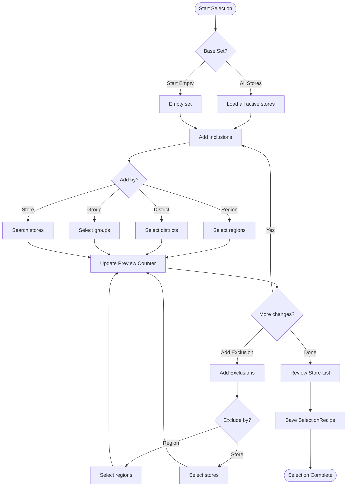

# Store Selection Flow

Shows the campaign store targeting UX workflow.

## Selection Methods

| Method | Description |
|--------|-------------|
| **All Stores** | Start with entire active store list |
| **Start Empty** | Build selection from scratch |
| **By Region** | Add/remove entire regions |
| **By District** | Add/remove districts |
| **By Group** | Add/remove store groups |
| **By Store** | Add/remove individual stores |

## UX Features

- Live preview counter updates as selections change
- Inclusions and exclusions can be combined
- Selection saved as "recipe" for reuse
