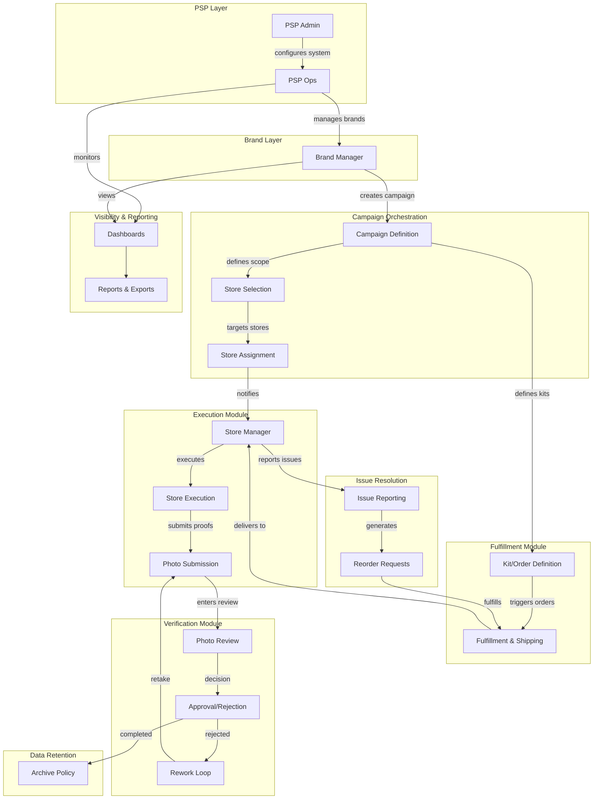

# NewPOPSys v1 Flow (PSP-Led)

End-to-end campaign orchestration flow showing persona handoffs and module responsibilities.

## Flow Description

### 1. PSP Setup
- **PSP Admin** configures system settings, users, and permissions
- **PSP Ops** manages day-to-day brand relationships

### 2. Campaign Creation
- **Brand Manager** creates campaigns with scope and timeline
- **Store Selection** targets specific stores by criteria
- **Store Assignment** links stores to campaign

### 3. Fulfillment
- **Kit Definition** specifies materials per store tier
- **Fulfillment** processes orders and ships to stores
- Tracking updates flow back to dashboard

### 4. Execution
- **Store Manager** receives materials and notifications
- **Store Execution** installs POP materials
- **Photo Submission** captures proof of execution

### 5. Verification
- **Photo Review** validates submissions
- **Approval/Rejection** determines compliance
- **Rework Loop** handles rejected submissions

### 6. Issue Resolution
- **Issue Reporting** captures problems (missing, damaged)
- **Reorder Requests** trigger replacement fulfillment

### 7. Visibility
- All personas access relevant dashboards
- Reports enable analysis and exports

### 8. Retention
- Completed campaigns follow archive policy
