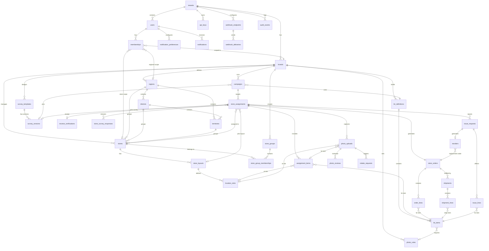
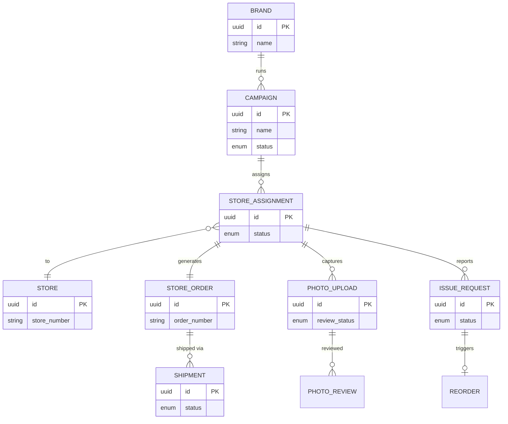
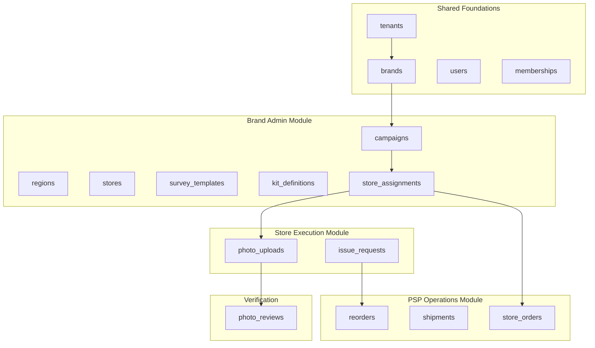

# Core Data Model (ERD)

Entity Relationship Diagrams showing the complete NewPOPSys v1 data model.

> **Source**: SUPP-002 (Domain Model), SUPP-035 (Field-Level Data Model)

---

## Full ERD (All Entities)

---

## Simplified Core Loop ERD

---

## Module Ownership

---

## Legend

| Symbol | Meaning |
|--------|---------|
| \`\|\|--o{\` | One-to-Many |
| \`}o--\|\|\` | Many-to-One |
| \`\|\|--\|\|\` | One-to-One |
| \`PK\` | Primary Key |
| \`FK\` | Foreign Key |

---

*See SUPP-035 for complete field definitions.*
