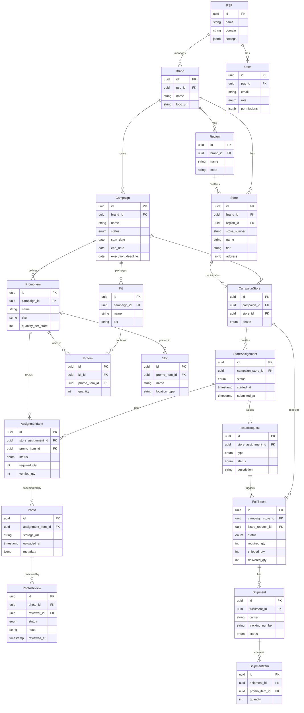

# Core Data Object Model (v1, PSP-Led)

Entity relationships for the NewPOPSys v1 data architecture.

## Entity Groups

### Organization
| Entity | Purpose |
|--------|---------|
| PSP | Print service provider tenant |
| Brand | Client organization under PSP |
| Region | Geographic grouping of stores |
| Store | Physical retail location |

### Campaign
| Entity | Purpose |
|--------|---------|
| Campaign | Marketing initiative with timeline |
| CampaignStore | Store participation in campaign |
| PromoItem | Promotional material to install |
| Kit | Packaged set of items by tier |
| Slot | Installation location for item |

### Execution
| Entity | Purpose |
|--------|---------|
| StoreAssignment | Store's work for campaign |
| AssignmentItem | Single item to install |
| Photo | Proof of installation |
| PhotoReview | Verification decision |

### Fulfillment
| Entity | Purpose |
|--------|---------|
| Fulfillment | Order for store materials |
| Shipment | Carrier tracking record |
| ShipmentItem | Items in shipment |
| IssueRequest | Problem report from store |

### Users
| Entity | Purpose |
|--------|---------|
| User | System user with role/permissions |
