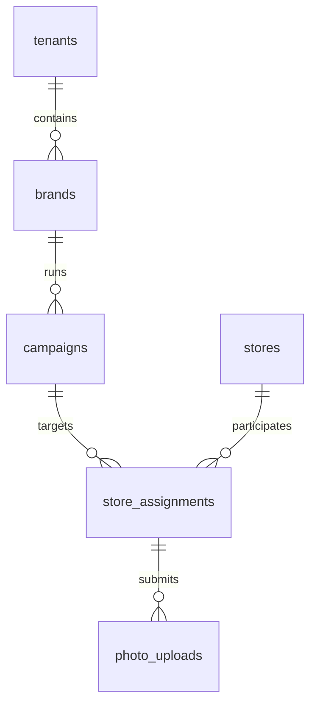

# Relationship Definitions (Foreign Keys)

This directory contains all foreign key constraints and Entity Relationship Diagrams (ERDs).

## Purpose

Foreign keys enforce referential integrity and document the relationships between tables. They are separated from schema DDL to:
1. Allow schema creation without circular dependencies
2. Make relationship changes easier to review
3. Enable selective FK enforcement in development vs production

## Files Structure

| File | Module | Relationships | Status |
|------|--------|--------------|--------|
| `01_fk_tenancy_identity.sql` | Tenancy & Identity | Users, memberships, API keys | Pending |
| `02_fk_stores_grouping.sql` | Stores & Grouping | Store hierarchy, groups | Pending |
| `03_fk_surveys_layouts.sql` | Surveys & Layouts | Templates, versions, slots | Pending |
| `04_fk_campaigns_kits.sql` | Campaigns & Kits | Campaigns, assignments, items | Pending |
| `05_fk_fulfillment.sql` | Fulfillment | Orders, shipments, lines | Pending |
| `06_fk_execution_verification.sql` | Execution & Verification | Photos, reviews, retakes | Pending |
| `07_fk_issues_reorders.sql` | Issues & Reorders | Issues, reorders | Pending |
| `08_fk_notifications.sql` | Notifications | Preferences, notifications | Pending |
| `09_fk_webhooks_integration.sql` | Webhooks | Endpoints, deliveries | Pending |
| `10_fk_exports_jobs.sql` | Exports | Export jobs | Pending |
| `11_fk_audit_observability.sql` | Audit | Audit events | Pending |
| `ERD_specification.md` | All Modules | Mermaid ERD diagrams | Pending |

## Foreign Key Template

```sql
-- ============================================================================
-- Module: [MODULE_NAME]
-- Foreign Key Constraints
-- ============================================================================

-- Table: [child_table]
-- Relationship: [child_table] → [parent_table]

ALTER TABLE [child_table]
  ADD CONSTRAINT fk_[child_table]_[parent_table]
  FOREIGN KEY ([parent_table]_id)
  REFERENCES [parent_table](id)
  ON DELETE [CASCADE|RESTRICT|SET NULL]
  ON UPDATE CASCADE;

COMMENT ON CONSTRAINT fk_[child_table]_[parent_table] ON [child_table]
  IS '[Description of the relationship and why this FK exists]';
```

## ON DELETE Behavior Guidelines

Choose the appropriate ON DELETE action based on the relationship semantics:

### CASCADE
Use when child records have no meaning without the parent (strong ownership).

**Examples:**
- `order_lines.store_order_id` → If order is deleted, lines must go too
- `shipment_lines.shipment_id` → If shipment is deleted, lines must go too
- `assignment_items.store_assignment_id` → If assignment deleted, items go too

```sql
ALTER TABLE order_lines
  ADD CONSTRAINT fk_order_lines_store_order
  FOREIGN KEY (store_order_id) REFERENCES store_orders(id)
  ON DELETE CASCADE;  -- Delete lines when order is deleted
```

### RESTRICT
Use when deletion should be prevented if children exist (strong dependency).

**Examples:**
- `campaigns.brand_id` → Cannot delete brand if campaigns exist
- `stores.region_id` → Cannot delete region if stores exist
- `store_assignments.campaign_id` → Cannot delete campaign if assignments exist

```sql
ALTER TABLE campaigns
  ADD CONSTRAINT fk_campaigns_brand
  FOREIGN KEY (brand_id) REFERENCES brands(id)
  ON DELETE RESTRICT;  -- Prevent brand deletion if campaigns exist
```

### SET NULL
Use when child can exist independently after parent deletion (weak dependency).

**Examples:**
- `stores.district_id` → District is optional; store can exist without it
- `campaigns.published_by_user_id` → User deletion shouldn't delete campaign
- `photo_reviews.reviewer_user_id` → Review survives reviewer deletion

```sql
ALTER TABLE campaigns
  ADD CONSTRAINT fk_campaigns_published_by_user
  FOREIGN KEY (published_by_user_id) REFERENCES users(id)
  ON DELETE SET NULL;  -- Keep campaign, but lose publisher reference
```

### NO ACTION (PostgreSQL default)
Similar to RESTRICT but checked at end of transaction. Rarely used explicitly.

## Nullable vs NOT NULL Foreign Keys

### NOT NULL Foreign Keys (Required Relationship)
```sql
-- Brand is required for a campaign
ALTER TABLE campaigns
  ADD CONSTRAINT fk_campaigns_brand
  FOREIGN KEY (brand_id) REFERENCES brands(id)
  ON DELETE RESTRICT;
-- Column must be: brand_id UUID NOT NULL
```

### NULLABLE Foreign Keys (Optional Relationship)
```sql
-- District is optional for a store
ALTER TABLE stores
  ADD CONSTRAINT fk_stores_district
  FOREIGN KEY (district_id) REFERENCES districts(id)
  ON DELETE SET NULL;
-- Column must be: district_id UUID (nullable)
```

## Self-Referential Foreign Keys

For hierarchical data (trees):

```sql
-- Regions can have parent regions
ALTER TABLE regions
  ADD CONSTRAINT fk_regions_parent
  FOREIGN KEY (parent_region_id) REFERENCES regions(id)
  ON DELETE RESTRICT;  -- Cannot delete parent if children exist

-- Ensure no cycles (application-level check or trigger)
```

## Soft Delete Considerations

**Important**: With soft deletes (deleted_at column), foreign keys still reference deleted records.

Options:
1. **Keep FKs simple** (recommended for v1) - Allow references to soft-deleted records
2. **Add CHECK constraints** - Prevent insertion of FKs to deleted parents
3. **Use triggers** - Auto-cascade soft deletes

For v1, we use Option 1:
```sql
-- Allow FK to reference soft-deleted parent
-- Application enforces: WHERE deleted_at IS NULL in queries
ALTER TABLE store_assignments
  ADD CONSTRAINT fk_store_assignments_campaign
  FOREIGN KEY (campaign_id) REFERENCES campaigns(id)
  ON DELETE RESTRICT;
-- No check for campaigns.deleted_at
```

## Deferred Constraints

For complex transaction scenarios (rare in v1):

```sql
ALTER TABLE [child_table]
  ADD CONSTRAINT fk_[child_table]_[parent_table]
  FOREIGN KEY ([parent_table]_id) REFERENCES [parent_table](id)
  DEFERRABLE INITIALLY DEFERRED;
-- Checked at COMMIT, not at statement execution
```

## Naming Conventions

| Element | Pattern | Example |
|---------|---------|---------|
| FK Constraint | `fk_[child]_[parent]` | `fk_campaigns_brand` |
| Self-Reference | `fk_[table]_parent` | `fk_regions_parent` |
| Junction Table | `fk_[junction]_[side1]` | `fk_store_group_memberships_store` |
| Multiple FKs to Same Table | `fk_[child]_[role]_[parent]` | `fk_campaigns_published_by_user` |

## Expected Foreign Keys by Module

### 1. Tenancy & Identity
- brands.tenant_id → tenants.id
- memberships.user_id → users.id
- memberships.tenant_id → tenants.id
- memberships.brand_id → brands.id (nullable)
- memberships.region_scope_id → regions.id (nullable)
- memberships.store_scope_id → stores.id (nullable)
- api_keys.tenant_id → tenants.id

### 2. Stores & Grouping
- regions.brand_id → brands.id
- regions.parent_region_id → regions.id (self-ref)
- districts.brand_id → brands.id
- districts.region_id → regions.id
- territories.brand_id → brands.id
- territories.district_id → districts.id (nullable)
- territories.region_id → regions.id
- stores.brand_id → brands.id
- stores.region_id → regions.id
- stores.district_id → districts.id (nullable)
- stores.territory_id → territories.id (nullable)
- store_groups.brand_id → brands.id
- store_group_memberships.store_id → stores.id
- store_group_memberships.store_group_id → store_groups.id
- store_layouts.store_id → stores.id
- location_slots.store_layout_id → store_layouts.id

### 3. Surveys & Layouts
- survey_templates.brand_id → brands.id
- survey_versions.survey_template_id → survey_templates.id
- photo_rules.brand_id → brands.id

### 4. Campaigns & Kits
- campaigns.brand_id → brands.id
- campaigns.kit_definition_id → kit_definitions.id
- campaigns.survey_version_id → survey_versions.id
- campaigns.published_by_user_id → users.id (nullable)
- kit_definitions.brand_id → brands.id
- kit_items.kit_definition_id → kit_definitions.id
- kit_items.photo_rule_id → photo_rules.id (nullable)
- store_assignments.campaign_id → campaigns.id
- store_assignments.store_id → stores.id
- store_assignments.layout_version_id → store_layouts.id
- store_assignments.survey_version_id → survey_versions.id
- assignment_items.store_assignment_id → store_assignments.id
- assignment_items.kit_item_id → kit_items.id
- assignment_items.location_slot_id → location_slots.id (nullable)

### 5. Fulfillment
- store_orders.campaign_id → campaigns.id
- store_orders.store_id → stores.id
- store_orders.store_assignment_id → store_assignments.id
- order_lines.store_order_id → store_orders.id
- order_lines.kit_item_id → kit_items.id
- shipments.store_order_id → store_orders.id
- shipment_lines.shipment_id → shipments.id
- shipment_lines.kit_item_id → kit_items.id

### 6. Execution & Verification
- receive_verifications.store_assignment_id → store_assignments.id
- receive_verifications.verified_by_user_id → users.id
- store_survey_responses.store_assignment_id → store_assignments.id
- store_survey_responses.survey_version_id → survey_versions.id
- photo_uploads.store_assignment_id → store_assignments.id
- photo_uploads.assignment_item_id → assignment_items.id (nullable)
- photo_uploads.location_slot_id → location_slots.id (nullable)
- photo_uploads.uploaded_by_user_id → users.id
- photo_reviews.photo_upload_id → photo_uploads.id
- photo_reviews.reviewer_user_id → users.id
- retake_requests.photo_upload_id → photo_uploads.id
- retake_requests.store_assignment_id → store_assignments.id
- retake_requests.new_photo_upload_id → photo_uploads.id (nullable)

### 7. Issues & Reorders
- issue_requests.store_assignment_id → store_assignments.id
- issue_requests.evidence_photo_id → photo_uploads.id (nullable)
- issue_requests.submitted_by_user_id → users.id
- issue_requests.reviewed_by_user_id → users.id (nullable)
- issue_lines.issue_request_id → issue_requests.id
- issue_lines.kit_item_id → kit_items.id
- reorders.issue_request_id → issue_requests.id
- reorders.store_order_id → store_orders.id

### 8. Notifications
- notification_preferences.user_id → users.id
- notifications.user_id → users.id

### 9. Webhooks
- webhook_endpoints.tenant_id → tenants.id
- webhook_deliveries.webhook_endpoint_id → webhook_endpoints.id

### 10. Exports
- export_jobs.brand_id → brands.id (nullable)
- export_jobs.campaign_id → campaigns.id (nullable)
- export_jobs.requested_by_user_id → users.id

### 11. Audit
- audit_events.tenant_id → tenants.id
- audit_events.brand_id → brands.id (nullable)
- audit_events.actor_user_id → users.id (nullable)
- audit_events.actor_api_key_id → api_keys.id (nullable)

## Checklist for Each File

- [ ] All foreign keys for the module are defined
- [ ] All FK constraints are named using standard convention
- [ ] All ON DELETE behaviors are appropriate for relationship semantics
- [ ] All nullable FKs are documented with reason
- [ ] All self-referential FKs are handled correctly
- [ ] All constraints have descriptive comments
- [ ] File is valid PostgreSQL SQL (can be executed after schema creation)
- [ ] Execution order dependencies are documented

## ERD Documentation

The `ERD_specification.md` file should contain:
- High-level architecture diagram (all modules)
- Per-module detailed ERDs (tables + relationships)
- Mermaid syntax for version control and rendering
- Cardinality notation (1:1, 1:N, N:M)
- Explanation of key relationship patterns

Example Mermaid ERD:


---

**Next Steps**: Create FK SQL files for each module and ERD documentation.
