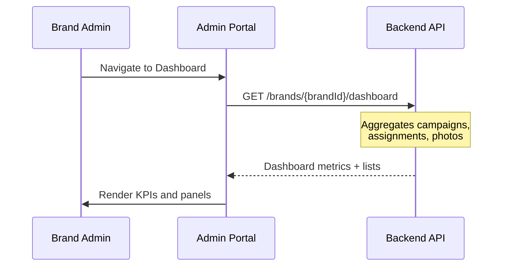
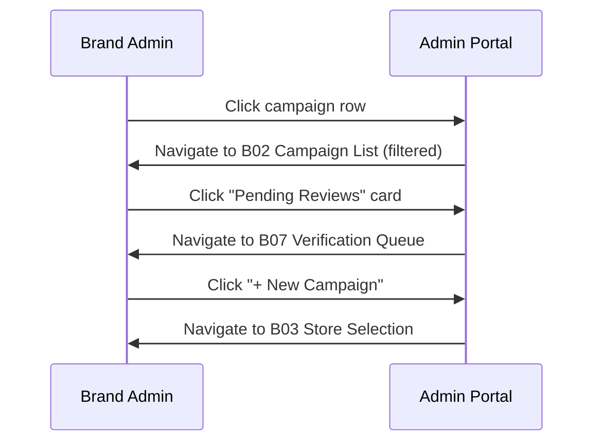

# B01 — Brand Admin Dashboard

> **App**: Brand Admin Portal
> **Route**: `/admin/dashboard`
> **SUPP Reference**: SUPP-001 (Personas)

---

## Wireframe Reference

**Interactive**: [admin_portal.html](../05_Wireframes/admin_portal.html) → Dashboard View

---

## Screen Glossary

| Term | Definition |
|------|------------|
| **Brand Admin** | User managing campaigns and reviewing store execution for a brand |
| **Campaign** | A branded promotional program with defined scope and timeline |
| **StoreAssignment** | Linkage between campaign and store, tracking execution progress |
| **StorePhase** | Derived headline status showing store's current execution stage |
| **Compliance Rate** | Percentage of stores at COMPLETE status |
| **Pending Review** | Photos awaiting brand admin approval/rejection |

---

## Data Model Map

### Entities Displayed

| Entity | Fields | Access |
|--------|--------|--------|
| `Campaign` | id, name, campaign_status, install_start_date, install_end_date | Read |
| `StoreAssignment` | status, store_phase (aggregated counts) | Read |
| `PhotoUpload` | review_status = PENDING (count) | Read |
| `Brand` | name, logo_url | Read |

### Aggregations

```sql
-- Active campaigns
SELECT COUNT(*) FROM campaigns
WHERE brand_id = ? AND campaign_status = 'PUBLISHED'

-- Stores by phase
SELECT store_phase, COUNT(*) FROM store_assignments sa
JOIN campaigns c ON sa.campaign_id = c.id
WHERE c.brand_id = ? AND c.campaign_status = 'PUBLISHED'
GROUP BY store_phase

-- Pending reviews
SELECT COUNT(*) FROM photo_uploads pu
JOIN assignment_items ai ON pu.assignment_item_id = ai.id
JOIN store_assignments sa ON ai.store_assignment_id = sa.id
JOIN campaigns c ON sa.campaign_id = c.id
WHERE c.brand_id = ? AND pu.review_status = 'PENDING'
```

---

## UI Components

| Component | Type | Description |
|-----------|------|-------------|
| **Header** | App bar | Brand logo, user menu, notifications |
| **KPI Cards** | Stat cards | Key metrics with trends |
| **Campaign Summary** | Table/cards | Active campaigns with status |
| **Phase Distribution** | Chart | Stores by StorePhase |
| **Alerts Panel** | List | Items requiring attention |
| **Quick Actions** | Button group | Common workflows |

### Dashboard Layout

```
┌─────────────────────────────────────────────────────────────┐
│ [Logo]  NewPOPSys                      [🔔 3]  [John ▼]    │
├─────────────────────────────────────────────────────────────┤
│                                                             │
│  ┌──────────┐  ┌──────────┐  ┌──────────┐  ┌──────────┐   │
│  │ Active   │  │ Total    │  │ Pending  │  │ Compliance│   │
│  │ Campaigns│  │ Stores   │  │ Reviews  │  │ Rate      │   │
│  │    5     │  │   847    │  │   23     │  │   78%     │   │
│  │  +2 MTD  │  │  +12 MTD │  │  ↓ 15    │  │  ↑ 5%     │   │
│  └──────────┘  └──────────┘  └──────────┘  └──────────┘   │
│                                                             │
│  Active Campaigns                                           │
│  ┌─────────────────────────────────────────────────────┐   │
│  │ Campaign          Status    Stores   Progress   Due │   │
│  ├─────────────────────────────────────────────────────┤   │
│  │ Summer Promo      PUBLISHED  245    ████░░ 78%  5d │   │
│  │ Holiday Display   PUBLISHED  602    ██░░░░ 35%  12d│   │
│  │ Back to School    SCHEDULED  ---    Not started  21d│   │
│  └─────────────────────────────────────────────────────┘   │
│                                                             │
│  Store Phase Distribution          Attention Required       │
│  ┌─────────────────────┐          ┌─────────────────────┐  │
│  │ ████ Complete (512) │          │ ⚠ 23 photos pending │  │
│  │ ███░ Installing (89)│          │ ⚠ 8 issues open     │  │
│  │ ██░░ Receiving (45) │          │ ⚠ 12 stores overdue │  │
│  │ █░░░ Awaiting (201) │          │                     │  │
│  └─────────────────────┘          └─────────────────────┘  │
│                                                             │
│  [+ New Campaign]  [Review Photos]  [View All Stores]       │
└─────────────────────────────────────────────────────────────┘
```

---

## Process Flows

### Load Dashboard



### Navigate to Detail



---

## KPI Definitions

| KPI | Calculation | Trend |
|-----|-------------|-------|
| Active Campaigns | COUNT(campaigns WHERE status = PUBLISHED) | vs. previous month |
| Total Stores | COUNT(DISTINCT stores in active campaigns) | vs. previous month |
| Pending Reviews | COUNT(photos WHERE review_status = PENDING) | vs. yesterday |
| Compliance Rate | stores at COMPLETE / total assigned × 100 | vs. previous week |

---

## Alert Types

| Alert | Condition | Action |
|-------|-----------|--------|
| Pending Reviews | photos.review_status = PENDING | → B07 Verification |
| Open Issues | issues.status = OPEN | → P03 Issues |
| Overdue Stores | store_phase != COMPLETE AND past due_date | → B02 Campaign |
| Campaign Starting | install_start_date = tomorrow | Informational |

---

## Quick Actions

| Action | Destination | Description |
|--------|-------------|-------------|
| New Campaign | B03 Store Selection | Start campaign wizard |
| Review Photos | B07 Verification | Photo approval queue |
| View All Stores | B06 Store List | Store management |
| Export Report | Download | Campaign summary CSV |

---

## Refresh Behavior

| Trigger | Action |
|---------|--------|
| Page load | Full data refresh |
| 5-minute interval | Background refresh |
| Manual refresh | Button in header |
| WebSocket event | Real-time KPI update |

---

## Acceptance Criteria

1. ✅ Dashboard shows 4 KPI cards with current values
2. ✅ KPI trends compare to appropriate baseline
3. ✅ Active campaigns table shows status and progress
4. ✅ Phase distribution visualizes store pipeline
5. ✅ Alerts panel highlights items needing attention
6. ✅ Clicking any metric navigates to detail view
7. ✅ Data refreshes automatically every 5 minutes
8. ✅ Quick actions provide common workflow shortcuts

---

## Related Screens

| Screen | Relationship |
|--------|--------------|
| [B02 Campaign List](B02_Campaign_List.md) | Full campaign management |
| [B06 Store List](B06_Store_List.md) | Store network view |
| [B07 Verification](B07_Verification.md) | Photo review queue |
| [B03 Store Selection](B03_Store_Selection.md) | New campaign wizard |

---

*End of B01 Dashboard Screen Spec*
