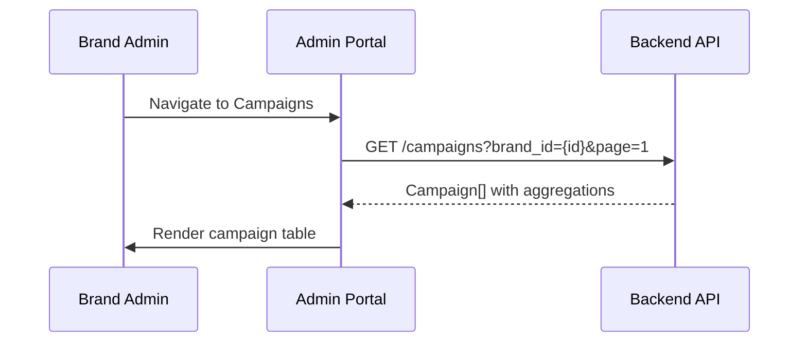
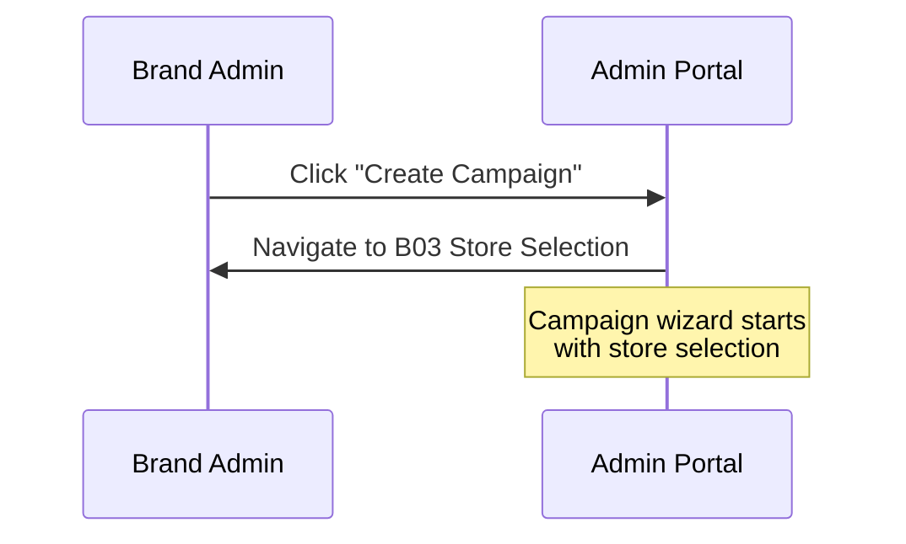
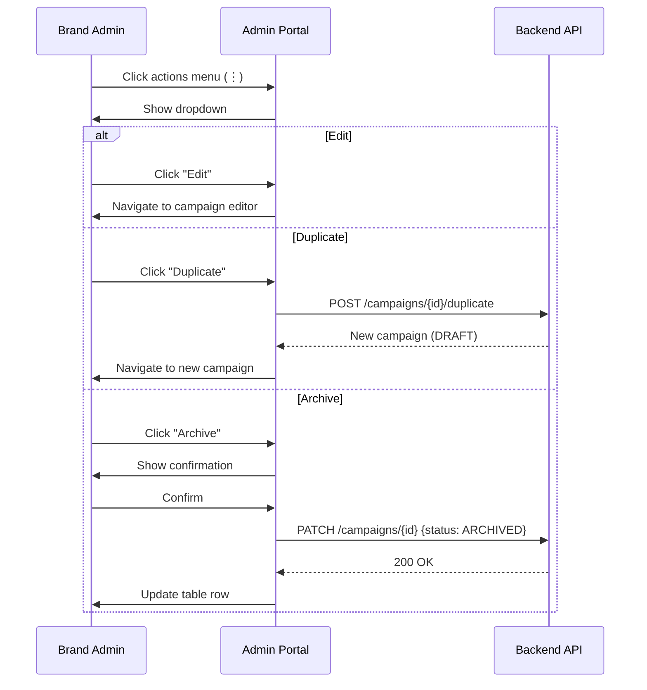

# B02 — Campaign List

> **App**: Brand Admin Portal
> **Route**: `/admin/campaigns`
> **SUPP Reference**: SUPP-015 (Campaigns, Kits, Assignment)

---

## Wireframe Reference

**Interactive**: [admin_portal.html](../05_Wireframes/admin_portal.html) → Campaigns View

---

## Screen Glossary

| Term | Definition |
|------|------------|
| **Campaign** | A branded promotional program with defined scope and timeline |
| **CampaignStatus** | Lifecycle state: DRAFT, SCHEDULED, PUBLISHED, COMPLETED, ARCHIVED |
| **Kit** | Collection of promotional items assigned to a campaign |
| **Wave** | Optional sub-grouping of stores within a campaign |
| **Compliance Rate** | Percentage of assigned stores at COMPLETE status |

---

## Data Model Map

### Entities Displayed

| Entity | Fields | Access |
|--------|--------|--------|
| `Campaign` | id, name, campaign_status, install_start_date, install_end_date, created_at | Read |
| `StoreAssignment` | (count by status) | Read (aggregated) |
| `Kit` | name, item_count | Read |
| `Brand` | id | Filter |

### List Query

```sql
SELECT
  c.*,
  COUNT(sa.id) as total_stores,
  COUNT(CASE WHEN sa.status = 'COMPLETE' THEN 1 END) as completed_stores
FROM campaigns c
LEFT JOIN store_assignments sa ON sa.campaign_id = c.id
WHERE c.brand_id = ?
GROUP BY c.id
ORDER BY c.created_at DESC
```

---

## UI Components

| Component | Type | Description |
|-----------|------|-------------|
| **Header** | Page header | "Campaigns", Create button |
| **Search Bar** | Text input | Search by campaign name |
| **Filter Tabs** | Tab bar | All, Active, Completed, Draft |
| **Campaign Table** | Data table | Sortable columns |
| **Status Badge** | Chip | Color-coded CampaignStatus |
| **Progress Bar** | Linear progress | Completion percentage |
| **Actions Menu** | Dropdown | Per-campaign actions |
| **Pagination** | Controls | Page navigation |

### Campaign List Layout

```
┌─────────────────────────────────────────────────────────────┐
│ Campaigns                              [+ Create Campaign]  │
├─────────────────────────────────────────────────────────────┤
│ [🔍 Search campaigns...]                                    │
│                                                             │
│ [All] [Active] [Completed] [Draft] [Archived]              │
│                                                             │
│ ┌─────────────────────────────────────────────────────────┐ │
│ │ Name           Status     Stores  Progress    Dates   ⋮ │ │
│ ├─────────────────────────────────────────────────────────┤ │
│ │ Summer Promo   PUBLISHED   245   ████░░ 78%  Jun-Jul  ⋮ │ │
│ │ Holiday 2024   SCHEDULED   602   ░░░░░░  0%  Nov-Dec  ⋮ │ │
│ │ Back to School DRAFT       ---   ░░░░░░  0%  Aug-Sep  ⋮ │ │
│ │ Spring Sale    COMPLETED   189   ██████ 95%  Mar-Apr  ✓ │ │
│ │ Winter Promo   ARCHIVED    220   ██████ 92%  Dec-Jan  ✓ │ │
│ └─────────────────────────────────────────────────────────┘ │
│                                                             │
│                               [← Prev] Page 1 of 3 [Next →] │
└─────────────────────────────────────────────────────────────┘
```

---

## Process Flows

### Load Campaign List



### Create Campaign



### Campaign Actions



---

## Campaign Status Badges

| Status | Color | Description |
|--------|-------|-------------|
| DRAFT | Gray | Not yet configured |
| SCHEDULED | Blue | Configured, awaiting start |
| PUBLISHED | Green | Active, stores executing |
| COMPLETED | Purple | Past end date, finalized |
| CANCELLED | Red | Cancelled before completion |
| ARCHIVED | Gray (muted) | Moved to archive |

---

## Filter Tabs

| Tab | Filter | Sort |
|-----|--------|------|
| All | No status filter | created_at DESC |
| Active | status = PUBLISHED | install_end_date ASC |
| Completed | status = COMPLETED | completed_at DESC |
| Draft | status = DRAFT | updated_at DESC |
| Archived | status = ARCHIVED | archived_at DESC |

---

## Table Columns

| Column | Field | Sortable | Notes |
|--------|-------|----------|-------|
| Name | name | Yes | Links to detail |
| Status | campaign_status | Yes | Badge display |
| Stores | count(store_assignments) | Yes | Total assigned |
| Progress | completed/total | Yes | Visual + percentage |
| Dates | install_start - install_end | Yes | Date range |
| Actions | - | No | Dropdown menu |

---

## Actions Menu Options

| Action | Available When | Effect |
|--------|----------------|--------|
| View | Always | Open detail view |
| Edit | DRAFT, SCHEDULED | Open editor |
| Duplicate | Always | Create copy as DRAFT |
| Publish | DRAFT, SCHEDULED | Set to PUBLISHED |
| Complete | PUBLISHED | Set to COMPLETED |
| Archive | COMPLETED | Set to ARCHIVED |
| Export | Always | Download CSV report |

---

## Search Behavior

| Search | Matches |
|--------|---------|
| Campaign name | Partial match, case-insensitive |
| Campaign ID | Exact match on internal ID |
| Kit name | Items within campaign kit |

---

## Acceptance Criteria

1. ✅ List displays all brand campaigns with pagination
2. ✅ Filter tabs switch between status groups
3. ✅ Search filters by campaign name
4. ✅ Table columns are sortable
5. ✅ Status badges show correct colors
6. ✅ Progress bar reflects completion percentage
7. ✅ Actions menu shows context-appropriate options
8. ✅ Duplicate creates new DRAFT campaign
9. ✅ Archive moves campaign out of active view

---

## Related Screens

| Screen | Relationship |
|--------|--------------|
| [B01 Dashboard](B01_Dashboard.md) | Summary view |
| [B03 Store Selection](B03_Store_Selection.md) | Create campaign step 1 |
| [B04 Kit Definition](B04_Kit_Definition.md) | Create campaign step 2 |
| [B05 Campaign Review](B05_Campaign_Review.md) | Create campaign step 3 |

---

*End of B02 Campaign List Screen Spec*
