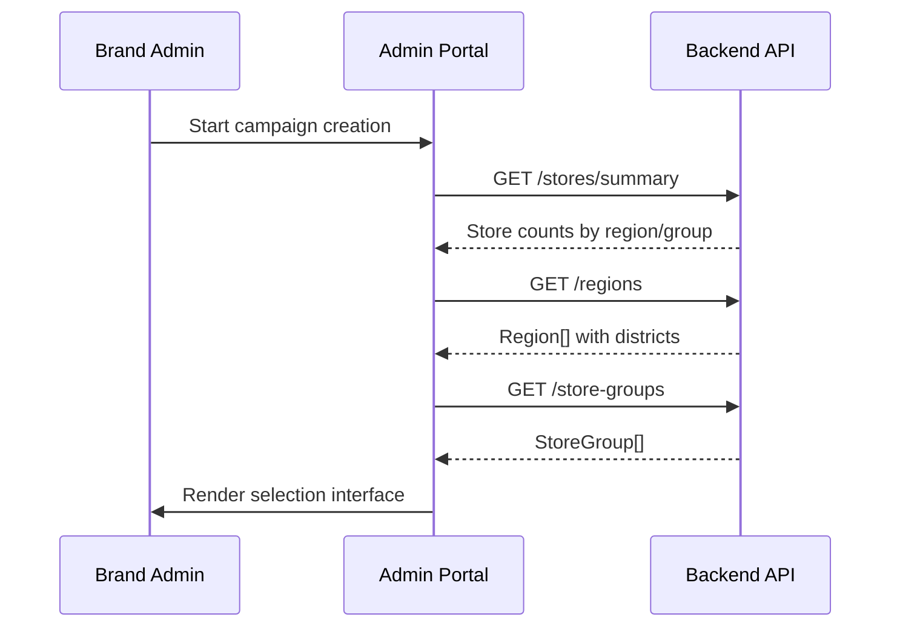
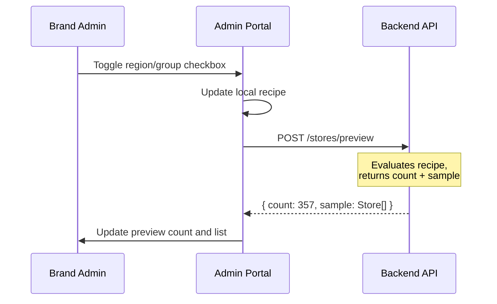
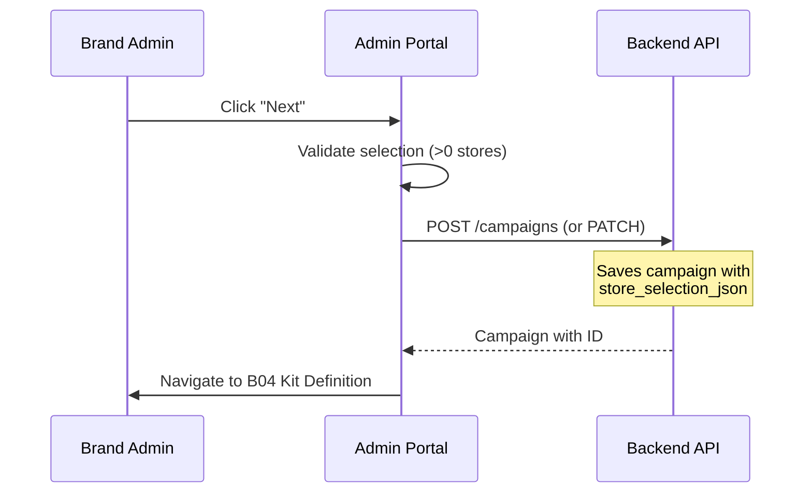

# B03 — Campaign Create: Store Selection

> **App**: Brand Admin Portal
> **Route**: `/admin/campaigns/create/stores` or `/admin/campaigns/:id/edit/stores`
> **SUPP Reference**: SUPP-015 (Campaigns, Kits, Assignment)

---

## Wireframe Reference

**Interactive**: [admin_portal.html](../05_Wireframes/admin_portal.html) → Create Campaign → Store Selection

---

## Screen Glossary

| Term | Definition |
|------|------------|
| **Store Selection Recipe** | Saved criteria for selecting stores (include/exclude rules) |
| **Region** | Geographic grouping of stores (e.g., "Northeast") |
| **District** | Sub-grouping within a region |
| **Store Group** | Custom collection of stores (e.g., "Flagship Stores") |
| **Preview** | Real-time count of stores matching current selection |

---

## Data Model Map

### Entities Involved

| Entity | Fields | Access |
|--------|--------|--------|
| `Campaign` | id, name, store_selection_json | Read/Write |
| `Store` | id, store_number, name, region_id, status | Read |
| `Region` | id, name, code | Read |
| `District` | id, name, region_id | Read |
| `StoreGroup` | id, name, store_ids[] | Read |

### Selection Recipe JSON

```typescript
interface StoreSelectionRecipe {
  base_set: 'ALL' | 'NONE';
  include: {
    regions: string[];      // region IDs
    districts: string[];    // district IDs
    groups: string[];       // store group IDs
    stores: string[];       // individual store IDs
  };
  exclude: {
    regions: string[];
    districts: string[];
    stores: string[];
  };
}
```

### Selection Logic

```
finalStores =
  (base_set === 'ALL' ? allActiveStores : emptySet)
  ∪ include.regions ∪ include.districts ∪ include.groups ∪ include.stores
  − exclude.regions − exclude.districts − exclude.stores
```

---

## UI Components

| Component | Type | Description |
|-----------|------|-------------|
| **Wizard Header** | Stepper | Step 1 of 3: Store Selection |
| **Base Set Toggle** | Radio group | "All Stores" or "Select Specific" |
| **Include Panel** | Multi-select | Regions, Districts, Groups to add |
| **Exclude Panel** | Multi-select | Regions, Stores to remove |
| **Preview Count** | Live counter | "245 stores selected" |
| **Store Preview** | Expandable list | Sample of selected stores |
| **Map View** | Optional | Geographic visualization |
| **Next Button** | Primary button | Proceed to Kit Definition |

### Store Selection Layout

```
┌─────────────────────────────────────────────────────────────┐
│ Create Campaign                                             │
│ ● Store Selection → ○ Kit Definition → ○ Review & Launch   │
├─────────────────────────────────────────────────────────────┤
│                                                             │
│  Campaign Name: [Summer Promo 2025________________]         │
│                                                             │
│  Base Selection                                             │
│  ○ All Active Stores (847)                                 │
│  ● Select Specific Stores                                  │
│                                                             │
│  ┌─────────────────────────┬─────────────────────────┐     │
│  │ INCLUDE                 │ EXCLUDE                 │     │
│  ├─────────────────────────┼─────────────────────────┤     │
│  │ Regions:                │ Regions:                │     │
│  │ [✓] Northeast (156)     │ [ ] Northeast           │     │
│  │ [✓] Southeast (203)     │ [ ] Southeast           │     │
│  │ [ ] Midwest (189)       │ [ ] Midwest             │     │
│  │ [ ] West (299)          │ [ ] West                │     │
│  │                         │                         │     │
│  │ Groups:                 │ Stores:                 │     │
│  │ [✓] Flagship (12)       │ [Search to exclude...]  │     │
│  │ [ ] New Stores (34)     │ STR-045 ✕               │     │
│  │                         │ STR-089 ✕               │     │
│  └─────────────────────────┴─────────────────────────┘     │
│                                                             │
│  ┌─────────────────────────────────────────────────────┐   │
│  │ Preview: 357 stores selected           [View List ▼] │   │
│  │                                                       │   │
│  │ STR-001  Acme Downtown     Northeast  New York      │   │
│  │ STR-002  Acme Midtown      Northeast  New York      │   │
│  │ STR-015  Acme Mall         Southeast  Atlanta       │   │
│  │ ... showing 3 of 357                                │   │
│  └─────────────────────────────────────────────────────┘   │
│                                                             │
│  [Cancel]                                        [Next →]   │
└─────────────────────────────────────────────────────────────┘
```

---

## Process Flows

### Initialize Selection



### Update Selection



### Save and Continue



---

## Selection Behavior

### Include Logic

| Selection | Effect |
|-----------|--------|
| Check region | Adds all stores in region |
| Check district | Adds all stores in district |
| Check group | Adds all stores in group |
| Add individual store | Adds single store |

### Exclude Logic

| Selection | Effect |
|-----------|--------|
| Check region in exclude | Removes all stores in region |
| Add store to exclude | Removes single store |

### Conflict Resolution

```
Exclude always wins over Include
If store in both include.regions and exclude.stores → excluded
```

---

## Preview Panel

| Feature | Behavior |
|---------|----------|
| Count | Updates on every selection change |
| Sample | Shows first 10 stores alphabetically |
| Expand | Full scrollable list available |
| Search | Filter preview by store name/number |

---

## Validation Rules

| Rule | Error Message |
|------|---------------|
| Campaign name required | "Please enter a campaign name" |
| At least 1 store | "Select at least one store" |
| Name uniqueness | "Campaign name already exists" |

---

## Map View (Optional)

```
┌─────────────────────────────────────┐
│        [Map Visualization]          │
│                                     │
│    Selected: 🟢                     │
│    Excluded: 🔴                     │
│    Not Selected: ⚪                 │
│                                     │
│  Regions highlighted on hover       │
│  Click region to toggle selection   │
└─────────────────────────────────────┘
```

---

## Acceptance Criteria

1. ✅ Campaign name field is required
2. ✅ Base set toggle switches between all/specific
3. ✅ Region/district/group checkboxes update preview
4. ✅ Individual stores can be excluded by search
5. ✅ Preview count updates in real-time
6. ✅ Preview list shows sample of selected stores
7. ✅ Next button disabled until ≥1 store selected
8. ✅ Selection recipe saved to campaign on proceed

---

## Related Screens

| Screen | Relationship |
|--------|--------------|
| [B02 Campaign List](B02_Campaign_List.md) | Entry point |
| [B04 Kit Definition](B04_Kit_Definition.md) | Next step in wizard |
| [B06 Store List](B06_Store_List.md) | Store management |

---

*End of B03 Store Selection Screen Spec*
