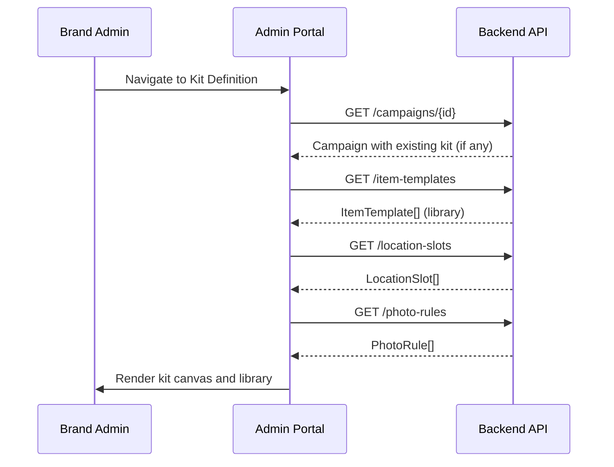
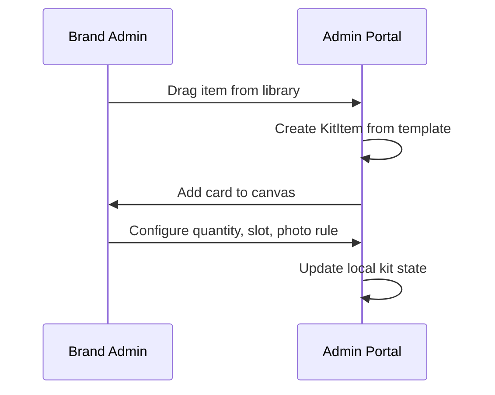
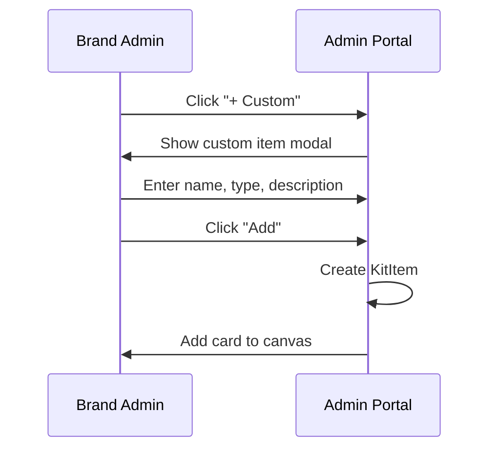
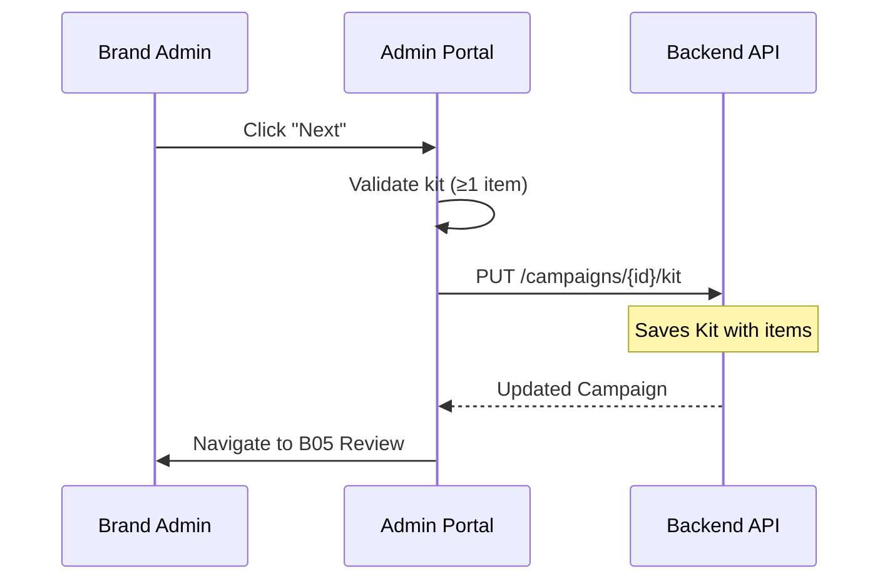

# B04 — Campaign Create: Kit Definition

> **App**: Brand Admin Portal
> **Route**: `/admin/campaigns/:id/edit/kit`
> **SUPP Reference**: SUPP-015 (Campaigns, Kits, Assignment)

---

## Wireframe Reference

**Interactive**: [admin_portal.html](../05_Wireframes/admin_portal.html) → Create Campaign → Kit Definition

---

## Screen Glossary

| Term | Definition |
|------|------------|
| **Kit** | Collection of promotional items assigned to a campaign |
| **KitItem** | Individual item within a kit (poster, standee, etc.) |
| **LocationSlot** | Designated placement area in store for item installation |
| **PhotoRule** | Configuration for photo capture requirements |
| **Item Type** | Category: POSTER, STANDEE, BANNER, SHELF_TALKER, WINDOW_CLING |

---

## Data Model Map

### Entities Involved

| Entity | Fields | Access |
|--------|--------|--------|
| `Campaign` | id, kit_id | Read/Write |
| `Kit` | id, name, items[] | Read/Write |
| `KitItem` | id, name, item_type, quantity, location_slot_id, photo_rule_id | Write |
| `LocationSlot` | id, name, slot_code | Read |
| `PhotoRule` | id, name, min_photos, ghost_image_url | Read |
| `ItemTemplate` | id, name, item_type, default_photo_rule_id | Read (library) |

### Kit Structure

```typescript
interface Kit {
  id: string;
  name: string;
  items: KitItem[];
}

interface KitItem {
  id: string;
  name: string;
  description?: string;
  item_type: ItemType;
  quantity: number;
  location_slot_id?: string;
  photo_rule_id?: string;
  survey_template_id?: string;
}
```

---

## UI Components

| Component | Type | Description |
|-----------|------|-------------|
| **Wizard Header** | Stepper | Step 2 of 3: Kit Definition |
| **Item Library** | Sidebar | Drag-from item templates |
| **Kit Canvas** | Drop zone | Current kit items |
| **Item Card** | Draggable card | Item with config options |
| **Location Selector** | Dropdown | Assign to slot |
| **Photo Rule Selector** | Dropdown | Choose capture requirements |
| **Quantity Input** | Number input | Items per store |
| **Add Custom Item** | Button | Create new item |
| **Navigation** | Buttons | Back / Next |

### Kit Definition Layout

```
┌─────────────────────────────────────────────────────────────┐
│ Create Campaign                                             │
│ ✓ Store Selection → ● Kit Definition → ○ Review & Launch   │
├─────────────────────────────────────────────────────────────┤
│                                                             │
│ ┌──────────────┬────────────────────────────────────────┐  │
│ │ Item Library │  Kit: Summer Promo                     │  │
│ │              │                                        │  │
│ │ [🔍 Search]  │  ┌────────────────────────────────┐   │  │
│ │              │  │ 📋 Window Poster (24x36)    ✕  │   │  │
│ │ Posters      │  │ Qty: [2]  Slot: [Front Window▼]│   │  │
│ │ ┌──────────┐ │  │ Photo: [Standard Photo Rule ▼] │   │  │
│ │ │ 24x36    │ │  └────────────────────────────────┘   │  │
│ │ │ Poster   │ │                                        │  │
│ │ └──────────┘ │  ┌────────────────────────────────┐   │  │
│ │ ┌──────────┐ │  │ 📋 End Cap Header           ✕  │   │  │
│ │ │ 18x24    │ │  │ Qty: [1]  Slot: [End Cap A  ▼] │   │  │
│ │ │ Poster   │ │  │ Photo: [End Cap Rule      ▼]  │   │  │
│ │ └──────────┘ │  └────────────────────────────────┘   │  │
│ │              │                                        │  │
│ │ Standees     │  ┌────────────────────────────────┐   │  │
│ │ ┌──────────┐ │  │ 📋 Counter Display          ✕  │   │  │
│ │ │ Floor    │ │  │ Qty: [1]  Slot: [Checkout  ▼]  │   │  │
│ │ │ Standee  │ │  │ Photo: [Counter Rule      ▼]  │   │  │
│ │ └──────────┘ │  └────────────────────────────────┘   │  │
│ │              │                                        │  │
│ │ [+ Custom]   │  [+ Add Item]                         │  │
│ └──────────────┴────────────────────────────────────────┘  │
│                                                             │
│  Total Items: 4 per store × 357 stores = 1,428 total       │
│                                                             │
│  [← Back]                                        [Next →]   │
└─────────────────────────────────────────────────────────────┘
```

---

## Process Flows

### Load Kit Editor



### Add Item from Library



### Add Custom Item



### Save and Continue



---

## Item Card Configuration

### Item Properties

| Field | Type | Required | Default |
|-------|------|----------|---------|
| Name | Text | Yes | From template |
| Item Type | Select | Yes | From template |
| Quantity | Number | Yes | 1 |
| Location Slot | Select | No | None |
| Photo Rule | Select | No | Default for type |
| Survey Template | Select | No | None |

### Item Types

| Type | Icon | Default Photo Rule |
|------|------|-------------------|
| POSTER | 🖼️ | Standard Photo |
| STANDEE | 🧍 | Floor Display |
| BANNER | 🏳️ | Wide Angle |
| SHELF_TALKER | 📌 | Close-up |
| WINDOW_CLING | 🪟 | Window Photo |
| COUNTER_DISPLAY | 🏪 | Counter Photo |

---

## Location Slot Options

| Slot | Code | Description |
|------|------|-------------|
| Front Window | FRONT_WINDOW | Main entrance display |
| End Cap A | END_CAP_A | Aisle end display |
| End Cap B | END_CAP_B | Secondary aisle end |
| Checkout Counter | CHECKOUT | Register area |
| Entry Door | ENTRY_DOOR | Door-mounted |
| Back Wall | BACK_WALL | Rear store display |

---

## Photo Rule Options

| Rule | Min | Max | Ghost | Flash |
|------|-----|-----|-------|-------|
| Standard Photo | 1 | 3 | No | Auto |
| Window Photo | 1 | 2 | Yes | Off |
| Floor Display | 2 | 5 | Yes | Auto |
| Close-up | 1 | 2 | No | On |
| Wide Angle | 1 | 3 | Yes | Auto |

---

## Custom Item Modal

```
┌─────────────────────────────────────┐
│ Add Custom Item                 [X] │
├─────────────────────────────────────┤
│                                     │
│ Item Name *                         │
│ ┌─────────────────────────────────┐ │
│ │ Promotional Standee             │ │
│ └─────────────────────────────────┘ │
│                                     │
│ Item Type *                         │
│ [STANDEE                        ▼]  │
│                                     │
│ Description                         │
│ ┌─────────────────────────────────┐ │
│ │ 6ft floor standee with brand   │ │
│ │ mascot                         │ │
│ └─────────────────────────────────┘ │
│                                     │
│ [Cancel]              [Add Item]    │
└─────────────────────────────────────┘
```

---

## Validation Rules

| Rule | Error Message |
|------|---------------|
| At least 1 item | "Add at least one item to the kit" |
| Quantity > 0 | "Quantity must be at least 1" |
| Name required | "Item name is required" |
| Unique slots | "Multiple items assigned to same slot" (warning) |

---

## Acceptance Criteria

1. ✅ Item library displays available templates
2. ✅ Drag-drop adds item to kit canvas
3. ✅ Item cards show configuration options
4. ✅ Quantity, slot, photo rule are configurable
5. ✅ Custom items can be created
6. ✅ Items can be removed from kit
7. ✅ Total item count displays per store and total
8. ✅ Next button disabled until ≥1 item added
9. ✅ Kit saves on proceed to review

---

## Related Screens

| Screen | Relationship |
|--------|--------------|
| [B03 Store Selection](B03_Store_Selection.md) | Previous step |
| [B05 Campaign Review](B05_Campaign_Review.md) | Next step |

---

*End of B04 Kit Definition Screen Spec*
