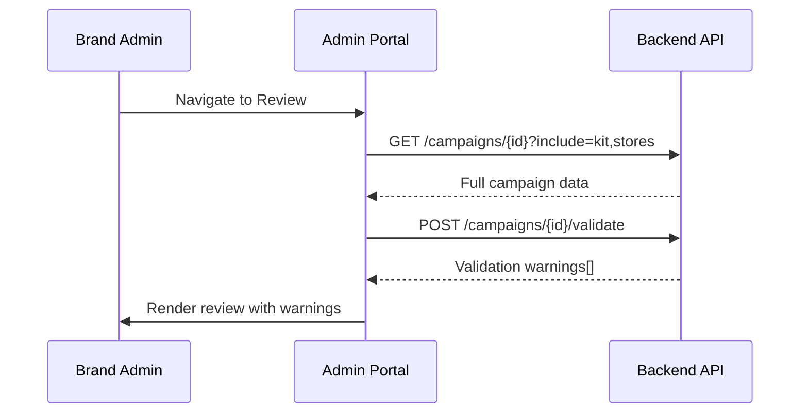
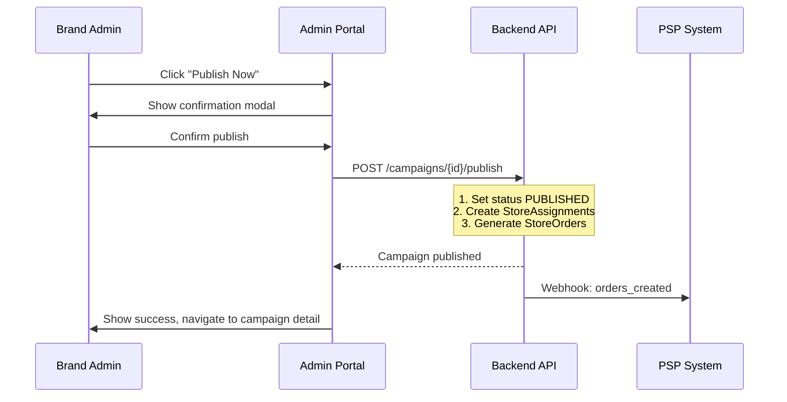
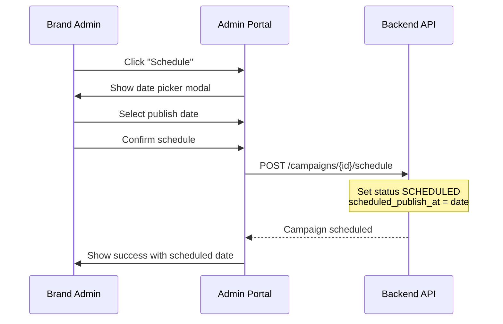

# B05 — Campaign Create: Review & Launch

> **App**: Brand Admin Portal
> **Route**: `/admin/campaigns/:id/edit/review`
> **SUPP Reference**: SUPP-015 (Campaigns, Kits, Assignment)

---

## Wireframe Reference

**Interactive**: [admin_portal.html](../05_Wireframes/admin_portal.html) → Create Campaign → Review

---

## Screen Glossary

| Term | Definition |
|------|------------|
| **Campaign Review** | Final verification step before publishing campaign |
| **Publish** | Action that activates campaign and generates store orders |
| **Schedule** | Action that sets campaign to activate on future date |
| **StoreOrder** | Purchase order generated for PSP fulfillment |
| **Install Window** | Date range when stores should complete installation |

---

## Data Model Map

### Entities Displayed

| Entity | Fields | Access |
|--------|--------|--------|
| `Campaign` | name, install_start_date, install_end_date, store_selection_json | Read |
| `Kit` | name, items[] | Read |
| `KitItem` | name, quantity, item_type | Read |
| `Store` | (preview from selection) | Read |
| `StoreOrder` | (generated on publish) | Write |
| `StoreAssignment` | (generated on publish) | Write |

### Publish Effects

```sql
-- On publish:
1. UPDATE campaigns SET campaign_status = 'PUBLISHED' WHERE id = ?

2. INSERT INTO store_assignments (campaign_id, store_id, status)
   SELECT ?, store_id, 'ASSIGNED' FROM evaluated_store_selection

3. INSERT INTO store_orders (store_assignment_id, status)
   SELECT sa.id, 'GENERATED' FROM store_assignments sa
   WHERE sa.campaign_id = ?

4. For each store_order:
   INSERT INTO order_lines (store_order_id, kit_item_id, qty_ordered)
   SELECT ?, ki.id, ki.quantity FROM kit_items ki
   WHERE ki.kit_id = ?
```

---

## UI Components

| Component | Type | Description |
|-----------|------|-------------|
| **Wizard Header** | Stepper | Step 3 of 3: Review & Launch |
| **Summary Cards** | Card group | Campaign, stores, kit overview |
| **Timeline** | Visual | Install window display |
| **Warnings Panel** | Alert list | Validation warnings |
| **Date Pickers** | Calendar inputs | Start/end date adjustment |
| **Publish Button** | Primary button | Activate immediately |
| **Schedule Button** | Secondary button | Set future activation |
| **Save Draft** | Tertiary button | Save without publishing |

### Review Layout

```
┌─────────────────────────────────────────────────────────────┐
│ Create Campaign                                             │
│ ✓ Store Selection → ✓ Kit Definition → ● Review & Launch   │
├─────────────────────────────────────────────────────────────┤
│                                                             │
│  Campaign Summary                                           │
│  ┌─────────────────────────────────────────────────────┐   │
│  │ Name: Summer Promo 2025                              │   │
│  │                                            [Edit ✏️] │   │
│  └─────────────────────────────────────────────────────┘   │
│                                                             │
│  ┌──────────────────────┐  ┌──────────────────────┐        │
│  │ Stores               │  │ Kit Items            │        │
│  │ ────────────────     │  │ ────────────────     │        │
│  │ 357 stores selected  │  │ 4 items per store    │        │
│  │                      │  │                      │        │
│  │ Northeast: 156       │  │ • Window Poster (2)  │        │
│  │ Southeast: 189       │  │ • End Cap Header (1) │        │
│  │ Flagship: 12         │  │ • Counter Display (1)│        │
│  │                      │  │                      │        │
│  │ [View All Stores]    │  │ [View Kit Details]   │        │
│  └──────────────────────┘  └──────────────────────┘        │
│                                                             │
│  Install Window                                             │
│  ┌─────────────────────────────────────────────────────┐   │
│  │ Start Date: [📅 Jun 15, 2025]                       │   │
│  │ End Date:   [📅 Jul 15, 2025]                       │   │
│  │                                                       │   │
│  │ Jun 15 ─────────[Install Window]───────── Jul 15    │   │
│  │         ↑                                    ↑       │   │
│  │    Orders ship                      Deadline        │   │
│  └─────────────────────────────────────────────────────┘   │
│                                                             │
│  Order Summary                                              │
│  ┌─────────────────────────────────────────────────────┐   │
│  │ Total Orders: 357 store orders                       │   │
│  │ Total Items:  1,428 items (4 × 357 stores)          │   │
│  │ PSP Partner:  Acme Print Co.                        │   │
│  └─────────────────────────────────────────────────────┘   │
│                                                             │
│  ⚠️ Warnings                                                │
│  ┌─────────────────────────────────────────────────────┐   │
│  │ • 3 stores have no assigned location slots          │   │
│  │ • Install window is less than 14 days               │   │
│  └─────────────────────────────────────────────────────┘   │
│                                                             │
│  [← Back]   [Save Draft]   [Schedule]   [Publish Now]      │
└─────────────────────────────────────────────────────────────┘
```

---

## Process Flows

### Load Review



### Publish Campaign



### Schedule Campaign



---

## Confirmation Modal

```
┌─────────────────────────────────────┐
│ Confirm Publish                 [X] │
├─────────────────────────────────────┤
│                                     │
│ You are about to publish:           │
│                                     │
│ Summer Promo 2025                   │
│                                     │
│ This will:                          │
│ ✓ Create 357 store assignments      │
│ ✓ Generate 357 orders for PSP       │
│ ✓ Enable store execution            │
│                                     │
│ ⚠️ This action cannot be undone     │
│                                     │
│ [Cancel]              [Publish]     │
└─────────────────────────────────────┘
```

---

## Validation Warnings

| Warning | Severity | Blocks Publish |
|---------|----------|----------------|
| No stores selected | Error | Yes |
| No kit items | Error | Yes |
| Install window < 7 days | Warning | No |
| Start date in past | Error | Yes |
| Stores without slots | Warning | No |
| Missing photo rules | Warning | No |
| Duplicate campaign name | Warning | No |

---

## Date Constraints

| Field | Constraint |
|-------|------------|
| Start Date | ≥ today + 1 day (for PSP lead time) |
| End Date | ≥ start_date + 7 days |
| Window | Recommended 14-30 days |

---

## Edit Actions

| Action | Effect |
|--------|--------|
| Edit campaign name | Inline edit |
| View All Stores | Expand store list modal |
| View Kit Details | Navigate back to B04 |
| Change dates | Update install window |

---

## Acceptance Criteria

1. ✅ Review shows campaign name, store count, kit summary
2. ✅ Install window displayed with timeline visualization
3. ✅ Order summary shows total orders and items
4. ✅ Validation warnings displayed prominently
5. ✅ Blocking errors prevent publish
6. ✅ Publish creates assignments and orders
7. ✅ Schedule sets future publish date
8. ✅ Save Draft preserves progress without publishing
9. ✅ Confirmation modal shown before publish

---

## Related Screens

| Screen | Relationship |
|--------|--------------|
| [B03 Store Selection](B03_Store_Selection.md) | Step 1 (back navigation) |
| [B04 Kit Definition](B04_Kit_Definition.md) | Step 2 (back navigation) |
| [B02 Campaign List](B02_Campaign_List.md) | After successful publish |
| [P01 Order Queue](P01_Order_Queue.md) | PSP receives generated orders |

---

*End of B05 Campaign Review Screen Spec*
