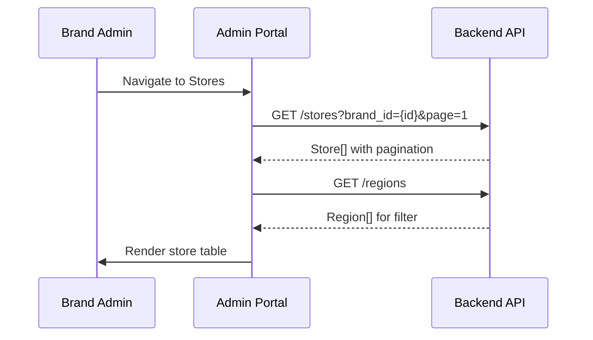
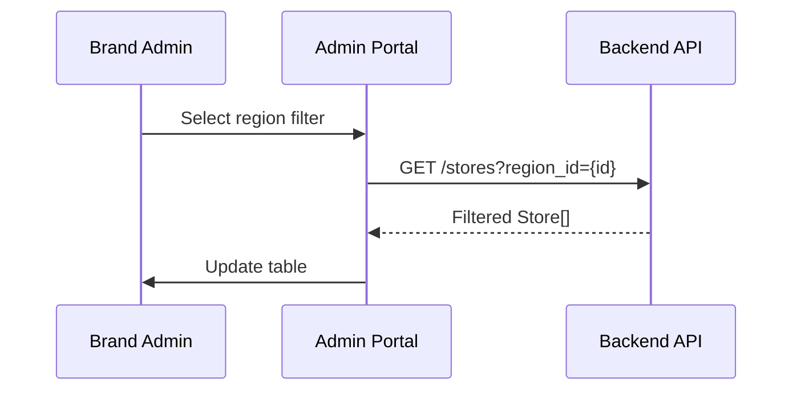
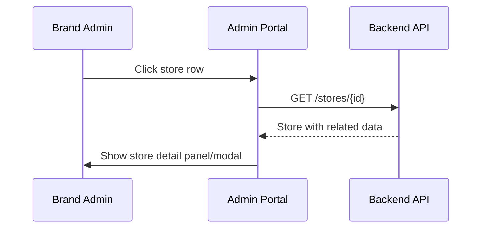
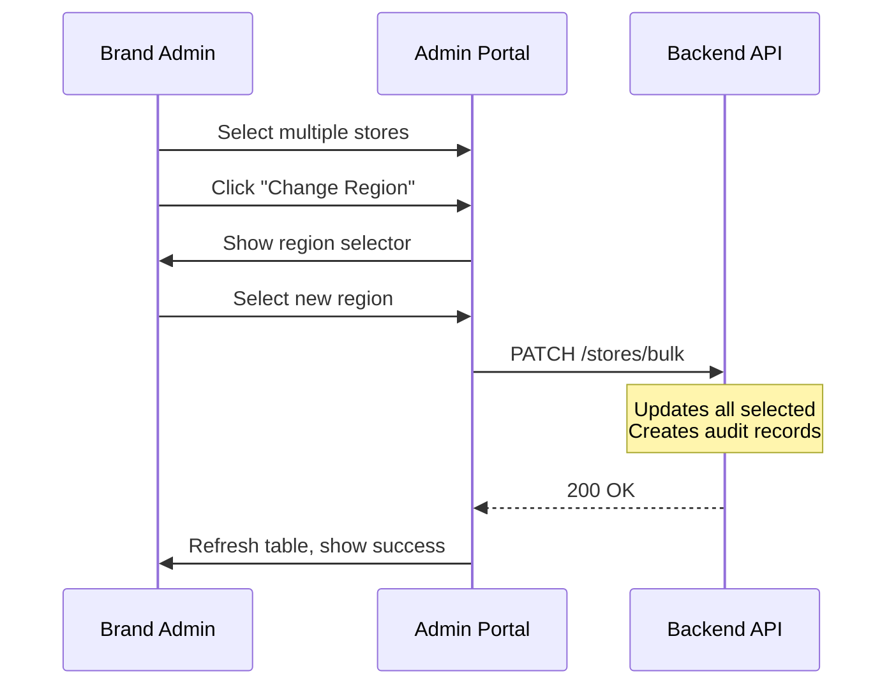

# B06 — Store List

> **App**: Brand Admin Portal
> **Route**: `/admin/stores`
> **SUPP Reference**: SUPP-013 (Stores), SUPP-036 (Store Foundation)

---

## Wireframe Reference

**Interactive**: [admin_portal.html](../05_Wireframes/admin_portal.html) → Stores View

---

## Screen Glossary

| Term | Definition |
|------|------------|
| **Store** | A retail location in the brand's network |
| **Store Number** | Unique identifier (e.g., "STR-001") |
| **Region** | Top-level geographic grouping |
| **District** | Sub-grouping within a region |
| **Store Group** | Custom collection of stores for targeting |
| **Store Status** | ACTIVE, INACTIVE, PENDING |

---

## Data Model Map

### Entities Displayed

| Entity | Fields | Access |
|--------|--------|--------|
| `Store` | id, store_number, name, status, address, city, state, zip | Read/Write |
| `Region` | id, name, code | Read |
| `District` | id, name, region_id | Read |
| `StoreGroup` | id, name | Read (membership) |
| `Membership` | store_id, user_id, role | Read (contact info) |

### List Query

```sql
SELECT
  s.*,
  r.name as region_name,
  d.name as district_name,
  COUNT(sa.id) as active_campaigns
FROM stores s
LEFT JOIN regions r ON s.region_id = r.id
LEFT JOIN districts d ON s.district_id = d.id
LEFT JOIN store_assignments sa ON sa.store_id = s.id
  AND sa.status NOT IN ('COMPLETE', 'WAIVED')
WHERE s.brand_id = ?
GROUP BY s.id
ORDER BY s.store_number
```

---

## UI Components

| Component | Type | Description |
|-----------|------|-------------|
| **Header** | Page header | "Stores", Import/Export buttons |
| **Search Bar** | Text input | Search by number, name, city |
| **Filter Panel** | Sidebar | Region, district, status, group filters |
| **Store Table** | Data table | Sortable, paginated |
| **Status Badge** | Chip | ACTIVE (green), INACTIVE (gray) |
| **Bulk Actions** | Toolbar | Actions for selected rows |
| **Pagination** | Controls | Page navigation |

### Store List Layout

```
┌─────────────────────────────────────────────────────────────┐
│ Stores                          [Import CSV] [Export]       │
├─────────────────────────────────────────────────────────────┤
│ [🔍 Search stores...]                                       │
│                                                             │
│ ┌──────────────┬────────────────────────────────────────┐  │
│ │ Filters      │ Store #   Name         Region    Status│  │
│ │              │ ─────────────────────────────────────── │  │
│ │ Region       │ [ ] STR-001  Acme Downtown  NE    🟢  │  │
│ │ [Select...▼] │ [ ] STR-002  Acme Midtown   NE    🟢  │  │
│ │              │ [ ] STR-015  Acme Mall      SE    🟢  │  │
│ │ District     │ [ ] STR-023  Acme Plaza     MW    ⚫  │  │
│ │ [Select...▼] │ [ ] STR-045  Acme Center    W     🟢  │  │
│ │              │ [ ] STR-089  Acme Square    NE    🟢  │  │
│ │ Status       │                                        │  │
│ │ ○ All        │                                        │  │
│ │ ● Active     │                                        │  │
│ │ ○ Inactive   │                                        │  │
│ │              │                                        │  │
│ │ Group        │                                        │  │
│ │ [Select...▼] │                                        │  │
│ │              │                                        │  │
│ │ [Clear All]  │                                        │  │
│ └──────────────┴────────────────────────────────────────┘  │
│                                                             │
│ Showing 1-25 of 847 stores    [← Prev] Page 1 of 34 [Next →]│
│                                                             │
│ With 2 selected: [Change Region ▼] [Add to Group ▼] [Export]│
└─────────────────────────────────────────────────────────────┘
```

---

## Process Flows

### Load Store List



### Filter Stores



### View Store Detail



### Bulk Update



---

## Store Detail Panel

```
┌─────────────────────────────────────┐
│ STR-001 - Acme Downtown         [X] │
├─────────────────────────────────────┤
│ Status: 🟢 ACTIVE          [Edit]   │
│                                     │
│ Location                            │
│ ────────                            │
│ 123 Main Street                     │
│ New York, NY 10001                  │
│                                     │
│ Region: Northeast                   │
│ District: NY Metro                  │
│                                     │
│ Contacts                            │
│ ────────                            │
│ Store Manager: Jane Smith           │
│ Email: jane@store.com               │
│ Phone: (555) 123-4567               │
│                                     │
│ Groups                              │
│ ──────                              │
│ [Flagship] [High Volume] [+ Add]    │
│                                     │
│ Active Campaigns (2)                │
│ ────────────────────                │
│ • Summer Promo - In Progress        │
│ • Holiday Display - Assigned        │
│                                     │
│ Recent Activity                     │
│ ───────────────                     │
│ Dec 15 - Region changed (audit)     │
│ Dec 10 - Photo approved             │
│ Dec 5 - Assigned to campaign        │
└─────────────────────────────────────┘
```

---

## Table Columns

| Column | Field | Sortable | Notes |
|--------|-------|----------|-------|
| Checkbox | - | No | Bulk selection |
| Store # | store_number | Yes | Links to detail |
| Name | name | Yes | - |
| City | city | Yes | - |
| Region | region.name | Yes | - |
| District | district.name | Yes | - |
| Status | status | Yes | Badge |
| Campaigns | count(assignments) | Yes | Active count |

---

## Filter Options

| Filter | Type | Options |
|--------|------|---------|
| Region | Multi-select | All regions |
| District | Multi-select | Filtered by region |
| Status | Radio | All, Active, Inactive |
| Group | Multi-select | All store groups |

---

## Bulk Actions

| Action | Effect |
|--------|--------|
| Change Region | Update region_id for selected |
| Change District | Update district_id for selected |
| Add to Group | Add selected to store group |
| Remove from Group | Remove from store group |
| Set Active | Update status = ACTIVE |
| Set Inactive | Update status = INACTIVE |
| Export | Download CSV of selected |

---

## Search Behavior

| Query | Matches |
|-------|---------|
| Store number | Exact or partial match |
| Store name | Partial match, case-insensitive |
| City | Partial match |
| Address | Partial match |

---

## Acceptance Criteria

1. ✅ Store list displays with pagination
2. ✅ Search filters by number, name, city
3. ✅ Filter panel filters by region, district, status, group
4. ✅ Columns are sortable
5. ✅ Clicking row opens store detail
6. ✅ Bulk selection enables bulk actions
7. ✅ Bulk actions update multiple stores
8. ✅ Export downloads filtered results
9. ✅ Import navigates to import flow

---

## Related Screens

| Screen | Relationship |
|--------|--------------|
| [B01 Dashboard](B01_Dashboard.md) | Summary metrics |
| [B03 Store Selection](B03_Store_Selection.md) | Campaign store targeting |
| Import Flow | [SUPP-036](../02_SUPPs/Screens_Interfaces/SUPP-036%20-%20Screens%20-%20Interfaces%20-%20Screens%20Onboarding%20and%20Store%20Foundation%20-%20v0.6.md) §3 |

---

*End of B06 Store List Screen Spec*
