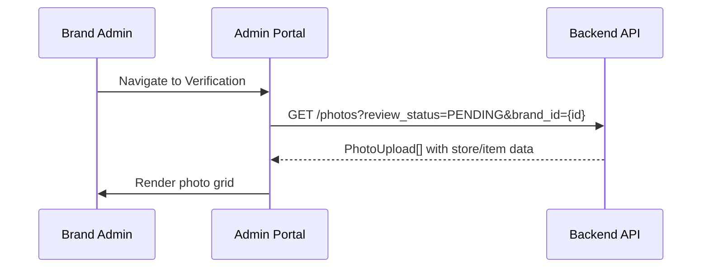
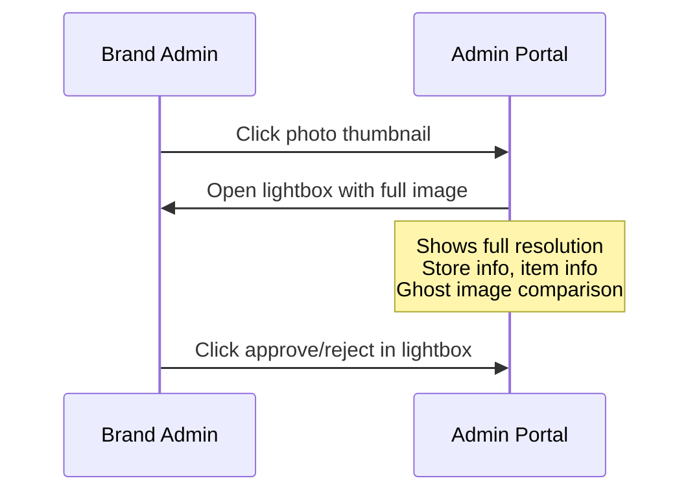
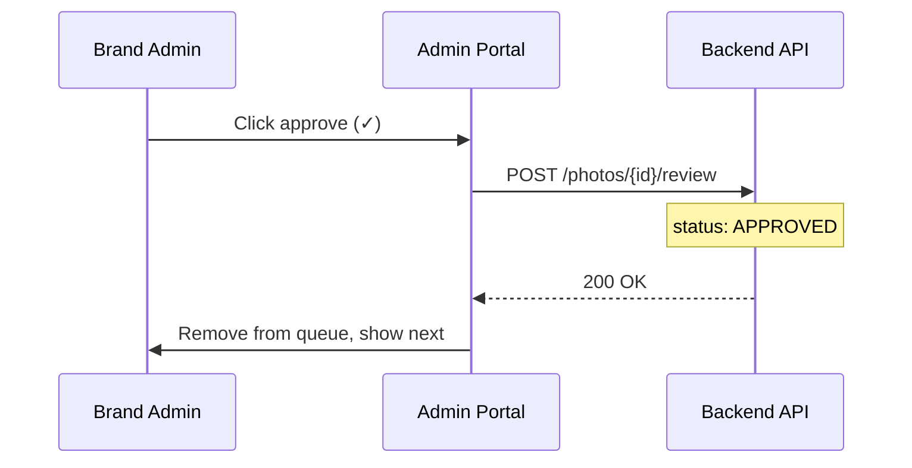
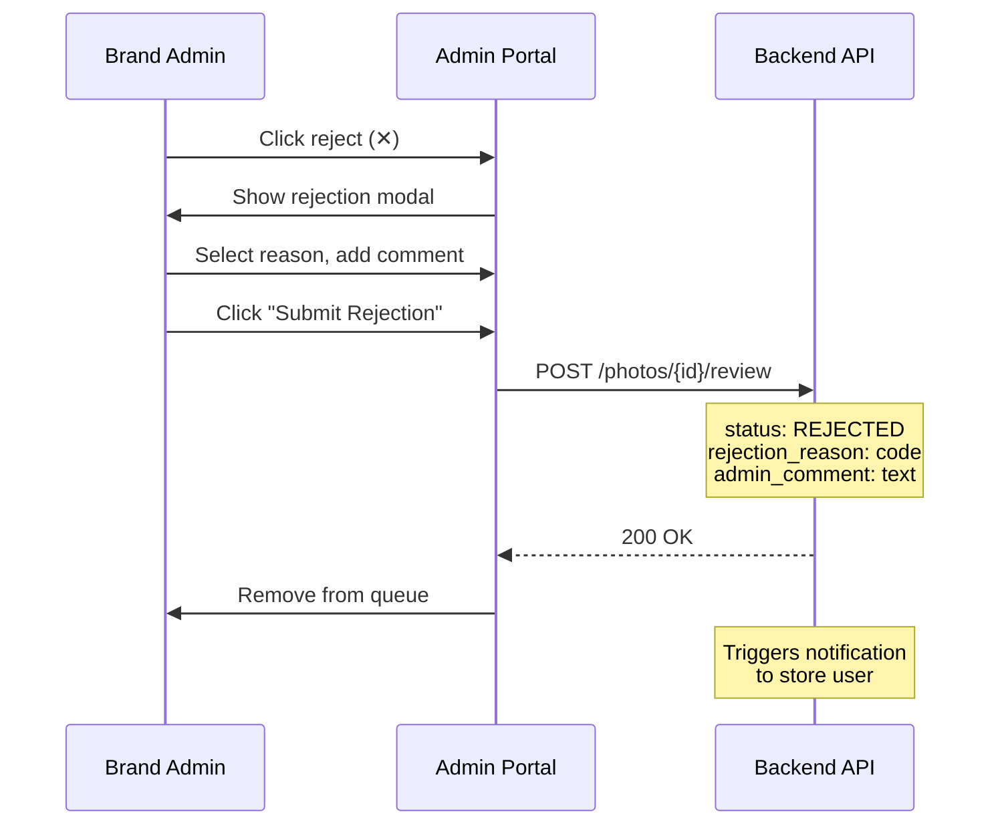
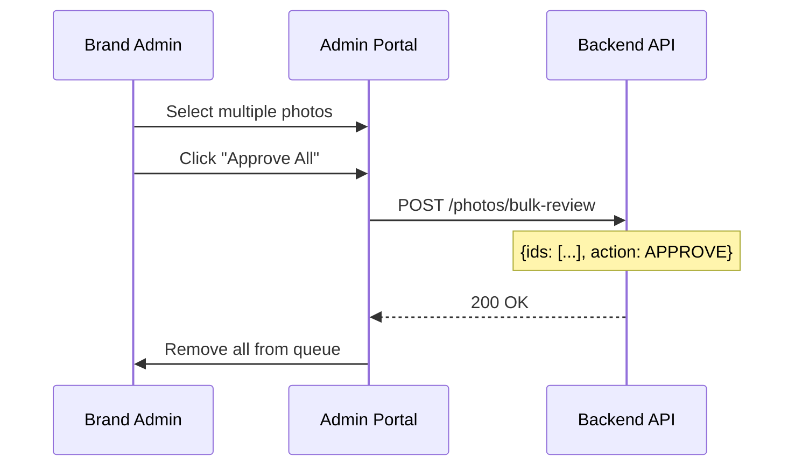

# B07 — Photo Verification Queue

> **App**: Brand Admin Portal
> **Route**: `/admin/verification`
> **SUPP Reference**: SUPP-018 (Photo Review)

---

## Wireframe Reference

**Interactive**: [admin_portal.html](../05_Wireframes/admin_portal.html) → Verification View

---

## Screen Glossary

| Term | Definition |
|------|------------|
| **PhotoUpload** | Image submitted by store as proof of installation |
| **PhotoReview** | Brand admin evaluation record (approve/reject) |
| **PhotoReviewStatus** | PENDING, APPROVED, REJECTED, SUPERSEDED |
| **Rejection Reason** | Standardized code explaining rejection |
| **Admin Comment** | Free-text feedback for store on rejection |
| **Bulk Review** | Approving/rejecting multiple photos at once |

---

## Data Model Map

### Entities Displayed

| Entity | Fields | Access |
|--------|--------|--------|
| `PhotoUpload` | id, file_url, thumbnail_url, review_status, created_at | Read |
| `PhotoReview` | id, status, rejection_reason, admin_comment, reviewed_by, reviewed_at | Write |
| `AssignmentItem` | id, kit_item_id, location_slot_id | Read |
| `KitItem` | name, item_type | Read |
| `StoreAssignment` | id, store_id, campaign_id | Read |
| `Store` | store_number, name | Read |
| `Campaign` | name | Read |

### Review Effects

```sql
-- On APPROVE:
UPDATE photo_uploads SET review_status = 'APPROVED' WHERE id = ?
INSERT INTO photo_reviews (photo_upload_id, status, reviewed_by, reviewed_at)
VALUES (?, 'APPROVED', ?, NOW())

-- On REJECT:
UPDATE photo_uploads SET review_status = 'REJECTED' WHERE id = ?
INSERT INTO photo_reviews (photo_upload_id, status, rejection_reason, admin_comment, ...)
VALUES (?, 'REJECTED', ?, ?, ...)

-- Update assignment item status:
UPDATE assignment_items SET item_status = 'RETAKE_REQUIRED' WHERE id = ?
```

---

## UI Components

| Component | Type | Description |
|-----------|------|-------------|
| **Header** | Page header | "Photo Verification", queue count |
| **Filter Bar** | Chip group | Campaign, date range, item type |
| **Photo Grid** | Card grid | Pending photos in grid layout |
| **Photo Card** | Card | Thumbnail, store info, actions |
| **Lightbox** | Modal | Full-size image viewer |
| **Bulk Actions** | Toolbar | Approve/reject selected |
| **Rejection Modal** | Dialog | Reason selection, comment input |

### Verification Queue Layout

```
┌─────────────────────────────────────────────────────────────┐
│ Photo Verification                        23 photos pending │
├─────────────────────────────────────────────────────────────┤
│ Campaign: [All Campaigns    ▼]  Item: [All Types ▼]         │
│                                                             │
│ ┌─────────────┐ ┌─────────────┐ ┌─────────────┐            │
│ │ [  Photo  ] │ │ [  Photo  ] │ │ [  Photo  ] │            │
│ │             │ │             │ │             │            │
│ │ STR-001     │ │ STR-015     │ │ STR-023     │            │
│ │ Window Post │ │ End Cap     │ │ Window Post │            │
│ │ Summer Promo│ │ Summer Promo│ │ Holiday     │            │
│ │             │ │             │ │             │            │
│ │ [✓] [✕]     │ │ [✓] [✕]     │ │ [✓] [✕]     │            │
│ └─────────────┘ └─────────────┘ └─────────────┘            │
│                                                             │
│ ┌─────────────┐ ┌─────────────┐ ┌─────────────┐            │
│ │ [  Photo  ] │ │ [  Photo  ] │ │ [  Photo  ] │            │
│ │             │ │             │ │             │            │
│ │ STR-045     │ │ STR-089     │ │ STR-102     │            │
│ │ Counter     │ │ Window Post │ │ End Cap     │            │
│ │ Summer Promo│ │ Holiday     │ │ Holiday     │            │
│ │             │ │             │ │             │            │
│ │ [✓] [✕]     │ │ [✓] [✕]     │ │ [✓] [✕]     │            │
│ └─────────────┘ └─────────────┘ └─────────────┘            │
│                                                             │
│ With 3 selected: [Approve All]  [Reject All]                │
│                                                             │
│ Showing 1-12 of 23                    [Load More]           │
└─────────────────────────────────────────────────────────────┘
```

---

## Process Flows

### Load Queue



### View Full Photo



### Approve Photo



### Reject Photo



### Bulk Review



---

## Photo Card Details

| Element | Description |
|---------|-------------|
| Thumbnail | 200x200 preview, click to expand |
| Store Number | e.g., "STR-001" |
| Item Type | e.g., "Window Poster" |
| Campaign | Campaign name |
| Submitted | Time ago (e.g., "2 hours ago") |
| Approve Button | Green checkmark |
| Reject Button | Red X |
| Select Checkbox | For bulk actions |

---

## Lightbox View

```
┌─────────────────────────────────────────────────────────────┐
│                                              [X]            │
│  ┌─────────────────────────────────────────────────────┐   │
│  │                                                       │   │
│  │                                                       │   │
│  │              [Full Resolution Photo]                 │   │
│  │                                                       │   │
│  │                                                       │   │
│  └─────────────────────────────────────────────────────┘   │
│                                                             │
│  STR-001 - Acme Downtown                                   │
│  Window Poster (24x36) - Front Window                      │
│  Summer Promo Campaign                                     │
│  Submitted: Dec 15, 2025 at 2:30 PM                       │
│                                                             │
│  [Show Ghost Overlay]                                      │
│                                                             │
│  [← Prev]        [✓ Approve]  [✕ Reject]        [Next →]   │
└─────────────────────────────────────────────────────────────┘
```

---

## Rejection Modal

```
┌─────────────────────────────────────┐
│ Reject Photo                    [X] │
├─────────────────────────────────────┤
│                                     │
│ Rejection Reason *                  │
│ ○ Wrong Angle                       │
│ ○ Too Dark                          │
│ ○ Blurry                            │
│ ○ Wrong Item                        │
│ ○ Incomplete                        │
│ ○ Obstructed                        │
│ ● Other                             │
│                                     │
│ Comment for Store *                 │
│ ┌─────────────────────────────────┐ │
│ │ Please recapture with the      │ │
│ │ entire poster visible in frame │ │
│ └─────────────────────────────────┘ │
│                                     │
│ [Cancel]         [Submit Rejection] │
└─────────────────────────────────────┘
```

---

## Rejection Reasons

| Code | Display | Default Comment |
|------|---------|-----------------|
| WRONG_ANGLE | "Wrong Angle" | "Please capture straight-on" |
| TOO_DARK | "Too Dark" | "Use flash or better lighting" |
| BLURRY | "Blurry" | "Hold device steady" |
| WRONG_ITEM | "Wrong Item" | "Photo shows incorrect item" |
| INCOMPLETE | "Incomplete" | "Full item must be visible" |
| OBSTRUCTED | "Obstructed" | "Remove objects blocking view" |
| OTHER | "Other" | (Requires custom comment) |

---

## Filter Options

| Filter | Type | Options |
|--------|------|---------|
| Campaign | Dropdown | Active campaigns |
| Item Type | Multi-select | POSTER, STANDEE, etc. |
| Store | Search | Store number/name |
| Date Range | Date picker | Submitted date range |

---

## Acceptance Criteria

1. ✅ Queue shows all pending photos for brand
2. ✅ Photo cards display thumbnail, store, item info
3. ✅ Click thumbnail opens full-size lightbox
4. ✅ Ghost overlay comparison available
5. ✅ Approve removes from queue, marks APPROVED
6. ✅ Reject opens modal for reason/comment
7. ✅ Rejection triggers store notification
8. ✅ Bulk selection enables bulk approve/reject
9. ✅ Filters narrow queue by campaign, type, etc.
10. ✅ Keyboard navigation (arrow keys, enter/esc)

---

## Related Screens

| Screen | Relationship |
|--------|--------------|
| [B01 Dashboard](B01_Dashboard.md) | Shows pending count |
| [M05 Photo Capture](M05_Photo_Capture.md) | Store captures photos |
| [M08 Retake](M08_Retake.md) | Store handles rejections |

---

*End of B07 Verification Screen Spec*
