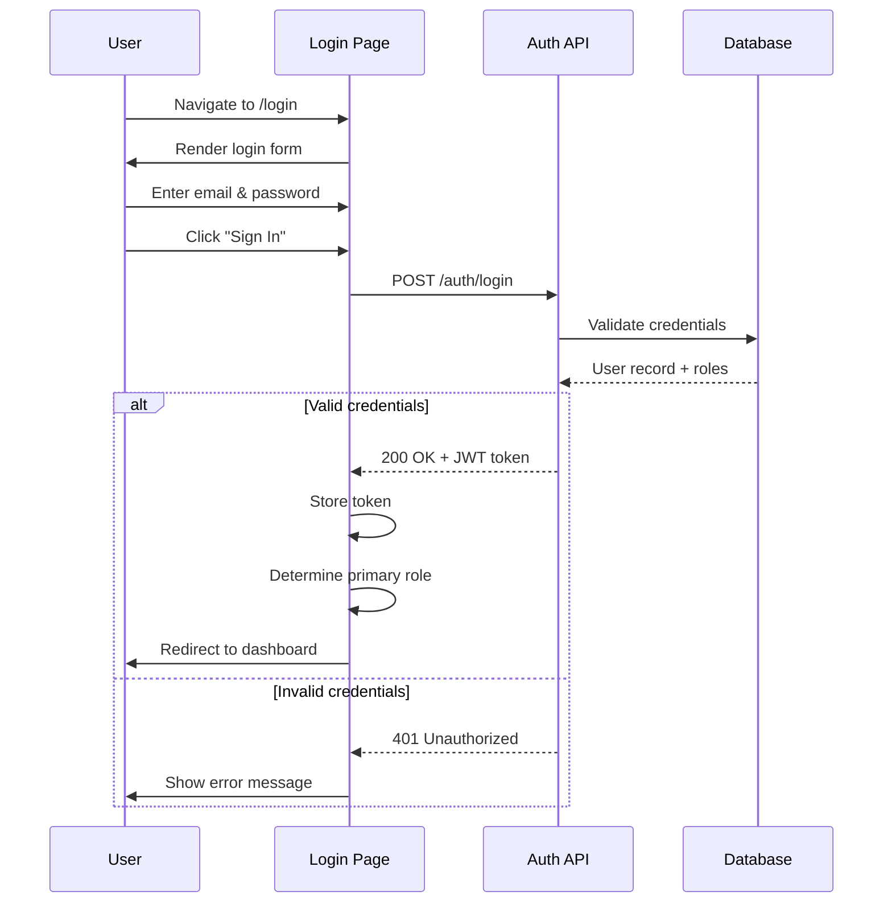
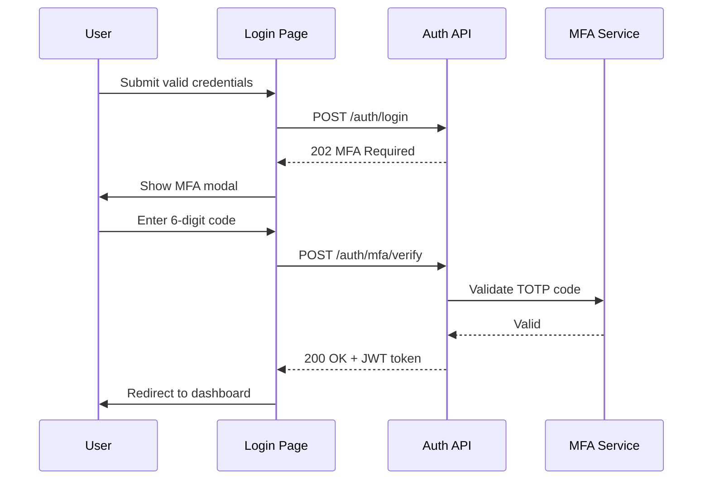
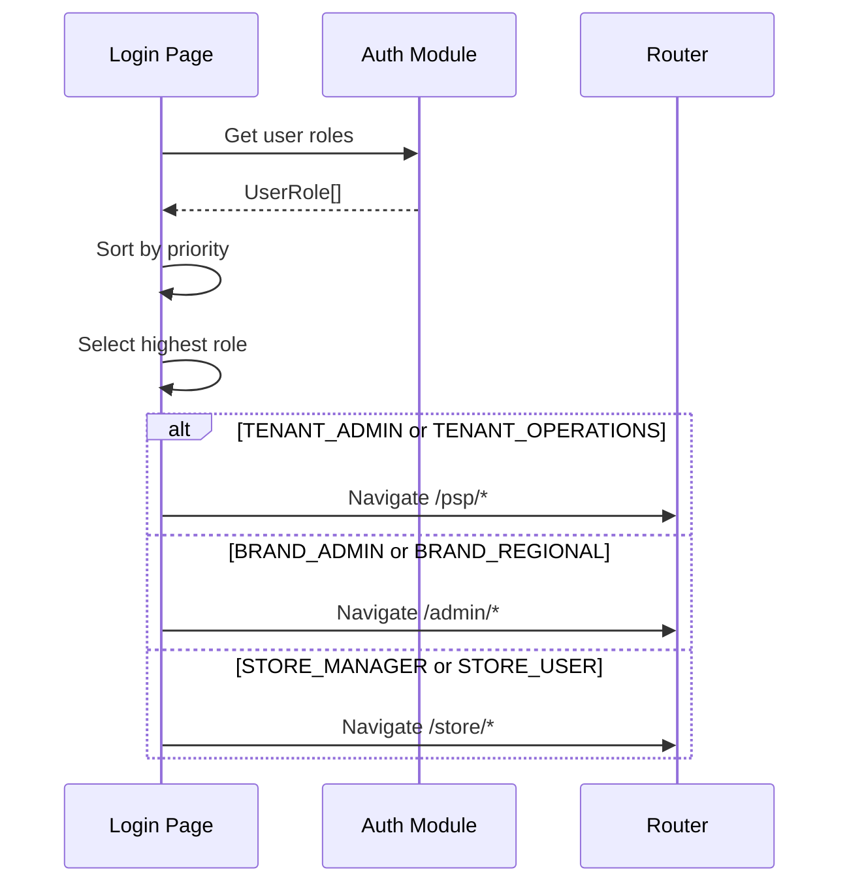
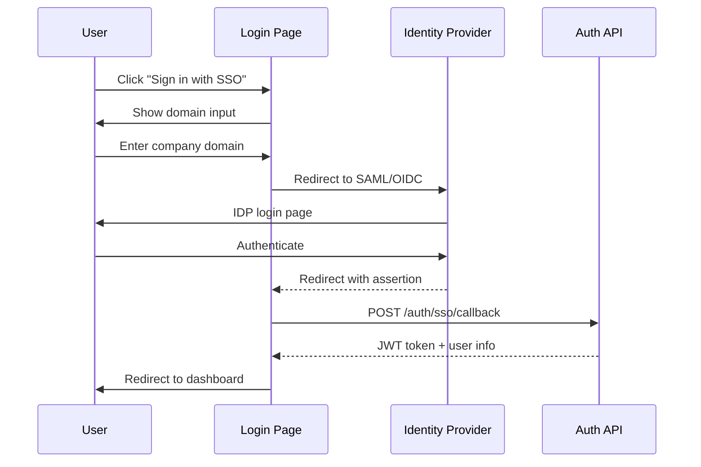
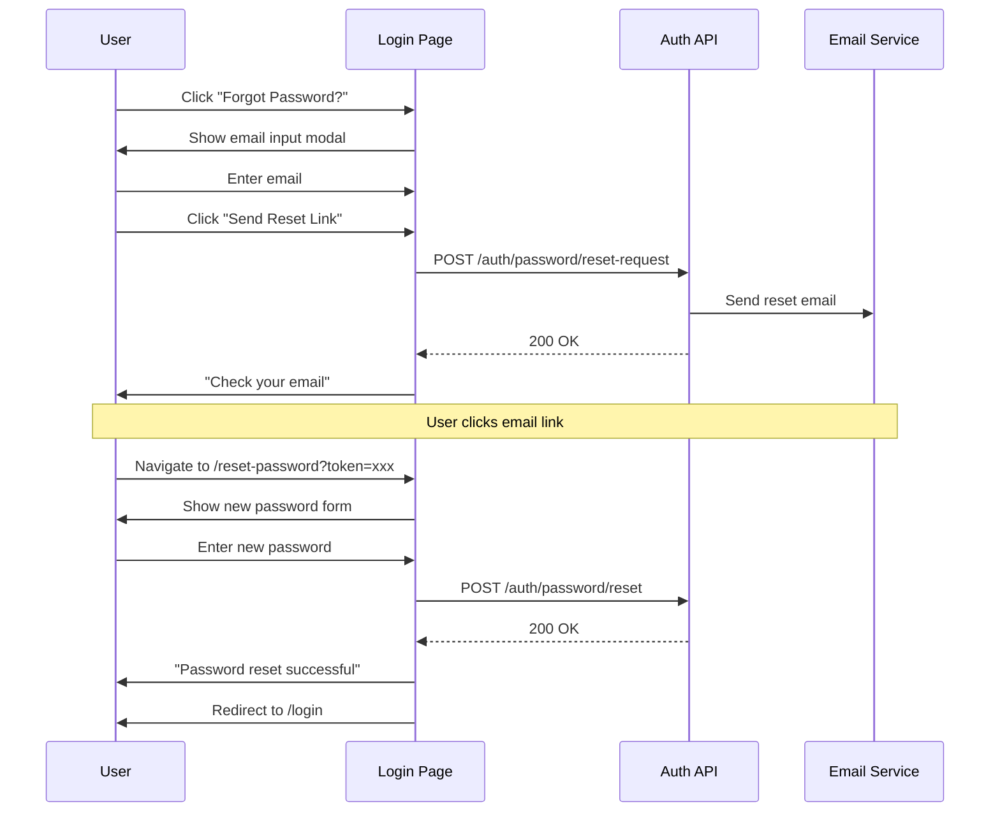

# L01 — Universal Login Screen

> **App**: All Web Portals (Brand Admin, Store Portal, PSP Operations, Regional Dashboard)
> **Route**: `/login`
> **SUPP Reference**: SUPP-003 (RBAC), SUPP-001 (Personas)

---

## Wireframe Reference

**Interactive**: [login.html](../05_Wireframes/login.html)

---

## Screen Glossary

| Term | Definition |
|------|------------|
| **Universal Login** | Single authentication entry point for all web portal users |
| **Role-Based Routing** | Automatic redirection to appropriate dashboard based on user role |
| **SSO** | Single Sign-On integration for enterprise customers |
| **MFA** | Multi-Factor Authentication for enhanced security |
| **Session** | Authenticated user session with JWT token |

---

## Data Model Map

### Entities Involved

| Entity | Fields | Access |
|--------|--------|--------|
| `User` | id, email, password_hash, status, mfa_enabled | Read |
| `Membership` | user_id, store_id, role, tenant_id | Read |
| `BrandUser` | user_id, brand_id, role | Read |
| `TenantUser` | user_id, tenant_id, role | Read |
| `Session` | user_id, token, expires_at, device_info | Write |

### Role Priority for Routing

```typescript
enum UserRole {
  // Tenant Level (PSP)
  TENANT_ADMIN = 'TENANT_ADMIN',
  TENANT_OPERATIONS = 'TENANT_OPERATIONS',

  // Brand Level
  BRAND_ADMIN = 'BRAND_ADMIN',
  BRAND_REGIONAL = 'BRAND_REGIONAL',

  // Store Level
  STORE_MANAGER = 'STORE_MANAGER',
  STORE_USER = 'STORE_USER'
}

// Routing Priority (highest first)
const routingPriority = [
  { role: 'TENANT_ADMIN', route: '/psp/dashboard' },
  { role: 'TENANT_OPERATIONS', route: '/psp/orders' },
  { role: 'BRAND_ADMIN', route: '/admin/dashboard' },
  { role: 'BRAND_REGIONAL', route: '/admin/regional' },
  { role: 'STORE_MANAGER', route: '/store/dashboard' },
  { role: 'STORE_USER', route: '/store/campaigns' }
];
```

---

## UI Components

| Component | Type | Description |
|-----------|------|-------------|
| **Logo** | Image | NewPOPSys brand logo |
| **Email Input** | Text field | User email address |
| **Password Input** | Password field | User password with visibility toggle |
| **Remember Me** | Checkbox | Persist session across browser sessions |
| **Login Button** | Primary button | Submit credentials |
| **Forgot Password** | Link | Navigate to password reset |
| **SSO Section** | Button group | Enterprise SSO options |
| **MFA Modal** | Dialog | Two-factor authentication entry |
| **Error Alert** | Alert banner | Authentication errors |

### Login Screen Layout

```
┌─────────────────────────────────────────────────────────────┐
│                                                             │
│                    ┌─────────────────┐                      │
│                    │   [NewPOPSys]   │                      │
│                    │      LOGO       │                      │
│                    └─────────────────┘                      │
│                                                             │
│                    Welcome Back                             │
│                    Sign in to your account                  │
│                                                             │
│            ┌─────────────────────────────────┐              │
│            │ Email Address                   │              │
│            │ ┌─────────────────────────────┐ │              │
│            │ │ user@company.com            │ │              │
│            │ └─────────────────────────────┘ │              │
│            │                                 │              │
│            │ Password                        │              │
│            │ ┌─────────────────────────────┐ │              │
│            │ │ ••••••••••           [👁]   │ │              │
│            │ └─────────────────────────────┘ │              │
│            │                                 │              │
│            │ [✓] Remember me    Forgot pass? │              │
│            │                                 │              │
│            │ ┌─────────────────────────────┐ │              │
│            │ │         Sign In             │ │              │
│            │ └─────────────────────────────┘ │              │
│            │                                 │              │
│            │ ─────────── or ───────────      │              │
│            │                                 │              │
│            │ ┌─────────────────────────────┐ │              │
│            │ │ 🔐 Sign in with SSO         │ │              │
│            │ └─────────────────────────────┘ │              │
│            └─────────────────────────────────┘              │
│                                                             │
│            Need help? Contact your administrator            │
│                                                             │
└─────────────────────────────────────────────────────────────┘
```

---

## Process Flows

### Standard Login Flow



### MFA Flow



### Role-Based Routing Flow



### SSO Login Flow



### Password Reset Flow



---

## MFA Modal

```
┌─────────────────────────────────────┐
│ Two-Factor Authentication       [X] │
├─────────────────────────────────────┤
│                                     │
│ Enter the 6-digit code from your    │
│ authenticator app                   │
│                                     │
│       ┌───┬───┬───┬───┬───┬───┐     │
│       │ 1 │ 2 │ 3 │ 4 │ 5 │ 6 │     │
│       └───┴───┴───┴───┴───┴───┘     │
│                                     │
│ [  ] Trust this device for 30 days  │
│                                     │
│ [Cancel]               [Verify]     │
│                                     │
│ Lost access? Use backup code        │
└─────────────────────────────────────┘
```

---

## Forgot Password Modal

```
┌─────────────────────────────────────┐
│ Reset Password                  [X] │
├─────────────────────────────────────┤
│                                     │
│ Enter your email address and we'll  │
│ send you a link to reset your       │
│ password.                           │
│                                     │
│ Email Address                       │
│ ┌─────────────────────────────────┐ │
│ │ user@company.com                │ │
│ └─────────────────────────────────┘ │
│                                     │
│ [Cancel]         [Send Reset Link]  │
└─────────────────────────────────────┘
```

---

## SSO Domain Entry

```
┌─────────────────────────────────────┐
│ Enterprise Sign In              [X] │
├─────────────────────────────────────┤
│                                     │
│ Enter your company domain to be     │
│ redirected to your identity         │
│ provider.                           │
│                                     │
│ Company Domain                      │
│ ┌─────────────────────────────────┐ │
│ │ acmecorp.com                    │ │
│ └─────────────────────────────────┘ │
│                                     │
│ [Cancel]                [Continue]  │
└─────────────────────────────────────┘
```

---

## Role-to-Dashboard Mapping

| User Role | Primary Dashboard | Route |
|-----------|------------------|-------|
| TENANT_ADMIN | PSP Admin Dashboard | `/psp/dashboard` |
| TENANT_OPERATIONS | PSP Order Queue | `/psp/orders` |
| BRAND_ADMIN | Brand Admin Dashboard | `/admin/dashboard` |
| BRAND_REGIONAL | Regional Dashboard | `/admin/regional` |
| STORE_MANAGER | Store Dashboard | `/store/dashboard` |
| STORE_USER | Campaign List | `/store/campaigns` |

---

## Multi-Role Handling

When a user has multiple roles across different levels:

| Scenario | Behavior |
|----------|----------|
| Multiple roles same level | Use highest permission role |
| Roles across levels | Use highest level (Tenant > Brand > Store) |
| Role switcher | Show role selector if >1 significant role |

### Role Switcher (Optional Component)

```
┌─────────────────────────────────────┐
│ Select Account                  [X] │
├─────────────────────────────────────┤
│                                     │
│ You have access to multiple         │
│ accounts. Select one to continue:   │
│                                     │
│ ┌─────────────────────────────────┐ │
│ │ 🏢 Acme Print Services          │ │
│ │    PSP Administrator            │ │
│ └─────────────────────────────────┘ │
│                                     │
│ ┌─────────────────────────────────┐ │
│ │ 🏷️ Brand Corp                   │ │
│ │    Brand Admin                  │ │
│ └─────────────────────────────────┘ │
│                                     │
│ ┌─────────────────────────────────┐ │
│ │ 🏪 Downtown Store #123          │ │
│ │    Store Manager                │ │
│ └─────────────────────────────────┘ │
│                                     │
└─────────────────────────────────────┘
```

---

## Validation Rules

| Field | Rule | Error Message |
|-------|------|---------------|
| Email | Required, valid format | "Please enter a valid email address" |
| Password | Required, min 8 chars | "Password is required" |
| MFA Code | 6 digits | "Please enter a 6-digit code" |
| SSO Domain | Valid domain format | "Please enter a valid domain" |

---

## Error States

| Error | Code | Message |
|-------|------|---------|
| Invalid credentials | 401 | "Invalid email or password" |
| Account locked | 403 | "Account locked. Contact administrator." |
| Account disabled | 403 | "Account has been deactivated" |
| MFA required | 202 | Triggers MFA modal |
| MFA invalid | 401 | "Invalid verification code" |
| SSO error | 400 | "SSO authentication failed" |
| Rate limited | 429 | "Too many attempts. Try again in X minutes." |

---

## Security Features

| Feature | Implementation |
|---------|---------------|
| **Rate Limiting** | 5 failed attempts → 15 min lockout |
| **CSRF Protection** | Token in form + header |
| **Secure Cookies** | HttpOnly, Secure, SameSite=Strict |
| **Password Hashing** | bcrypt with salt |
| **Session Expiry** | 24 hours (configurable) |
| **Remember Me** | 30 days extended session |
| **MFA** | TOTP via authenticator app |
| **Audit Logging** | All auth events logged |

---

## Responsive Design

| Breakpoint | Layout |
|------------|--------|
| Desktop (>1024px) | Centered card with background |
| Tablet (768-1024px) | Centered card, reduced padding |
| Mobile (<768px) | Full-width, stacked layout |

---

## Acceptance Criteria

1. ✅ Single login page serves all web portals
2. ✅ Email and password validation with error messages
3. ✅ Successful login redirects to role-appropriate dashboard
4. ✅ MFA prompt when enabled on account
5. ✅ SSO option for enterprise customers
6. ✅ Forgot password flow sends reset email
7. ✅ Remember me extends session duration
8. ✅ Rate limiting prevents brute force attacks
9. ✅ Multi-role users see role selector
10. ✅ Session persists across page refreshes
11. ✅ Logout clears session and redirects to login

---

## API Endpoints

| Endpoint | Method | Description |
|----------|--------|-------------|
| `/auth/login` | POST | Authenticate with email/password |
| `/auth/logout` | POST | Terminate session |
| `/auth/mfa/verify` | POST | Verify MFA code |
| `/auth/password/reset-request` | POST | Request password reset |
| `/auth/password/reset` | POST | Set new password |
| `/auth/sso/init` | POST | Initiate SSO flow |
| `/auth/sso/callback` | POST | Handle SSO response |
| `/auth/session` | GET | Get current session info |
| `/auth/refresh` | POST | Refresh JWT token |

---

## Related Screens

| Screen | Relationship |
|--------|--------------|
| [B01 Dashboard](B01_Dashboard.md) | Brand Admin landing after login |
| [S01 Dashboard](S01_Dashboard.md) | Store Portal landing after login |
| [P01 Order Queue](P01_Order_Queue.md) | PSP Ops landing after login |
| All portals | Entry point for authenticated access |

---

*End of L01 Universal Login Screen Spec*
