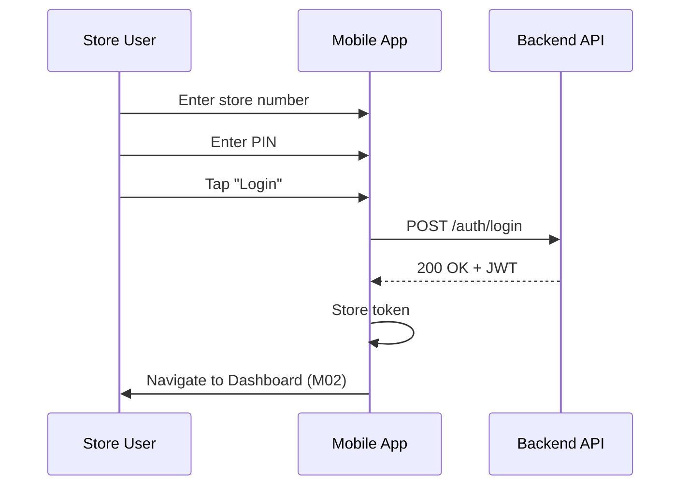
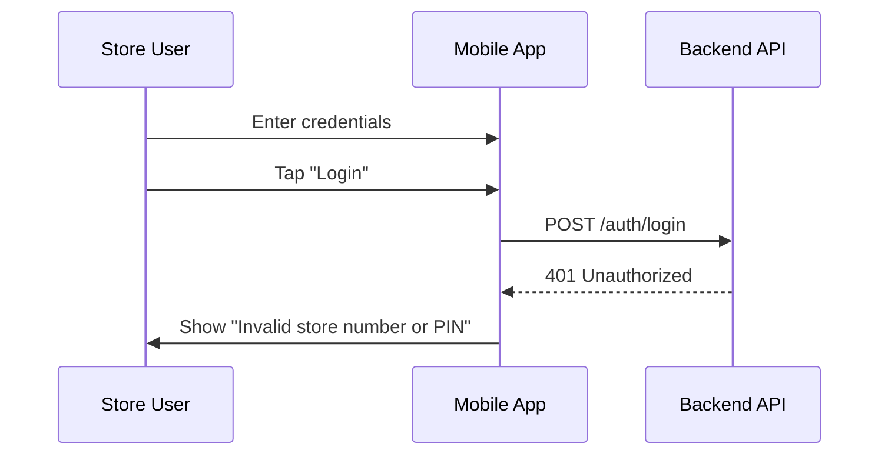

# M01 — Login Screen

> **App**: Mobile App (Store Execution)
> **Route**: `/app/login`
> **SUPP Reference**: SUPP-036 (Onboarding and Store Foundation)

---

## Wireframe Reference

**Interactive**: [mobile_app.html](../05_Wireframes/mobile_app.html) → Login Screen

---

## Screen Glossary

| Term | Definition |
|------|------------|
| **Store Number** | Unique identifier for a retail location (e.g., "STR-001") |
| **PIN** | 4-6 digit personal identification number for store user authentication |
| **Store User** | Retail employee responsible for receiving shipments and installing POP materials |

---

## Data Model Map

### Entities Accessed

| Entity | Fields | Access |
|--------|--------|--------|
| `Store` | store_number, name, status | Read |
| `User` | email, pin_hash, role | Read |
| `Membership` | user_id, store_id, role | Read |

### Authentication Flow

```
Input: store_number, pin
    ↓
Lookup: Store by store_number
    ↓
Lookup: User memberships for store
    ↓
Verify: PIN against user.pin_hash
    ↓
Output: JWT token with store_id, user_id, role
```

---

## UI Components

| Component | Type | Description |
|-----------|------|-------------|
| **Logo** | Image | Brand/app logo at top |
| **Store Number Input** | Text field | Accepts store identifier |
| **PIN Input** | Numeric field | 4-6 digit masked input |
| **Login Button** | Primary button | Submits credentials |
| **Error Message** | Alert | Displays authentication failures |

---

## Process Flows

### Happy Path: Successful Login



### Error Path: Invalid Credentials



---

## Validation Rules

| Field | Rule | Error Message |
|-------|------|---------------|
| Store Number | Required, matches pattern `STR-\d{3,6}` | "Please enter a valid store number" |
| PIN | Required, 4-6 digits | "PIN must be 4-6 digits" |

---

## Security Considerations

- PIN attempts limited to 5 per 15 minutes
- Failed attempts logged to `audit_event`
- Session expires after 8 hours of inactivity
- Token refresh available within 24 hours

---

## Acceptance Criteria

1. ✅ User can enter store number and PIN
2. ✅ Successful login navigates to Dashboard
3. ✅ Invalid credentials show error message
4. ✅ PIN input is masked (dots/asterisks)
5. ✅ Login button disabled until both fields populated
6. ✅ Rate limiting prevents brute force attacks

---

## Related Screens

| Screen | Relationship |
|--------|--------------|
| [M02 Dashboard](M02_Dashboard.md) | Next screen after successful login |
| [M07 Profile](M07_Profile.md) | User can change PIN from profile |

---

*End of M01 Login Screen Spec*
