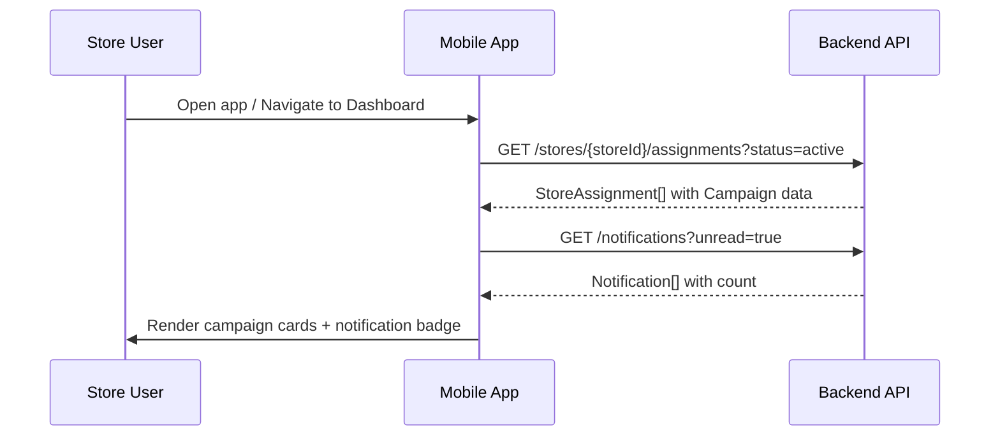
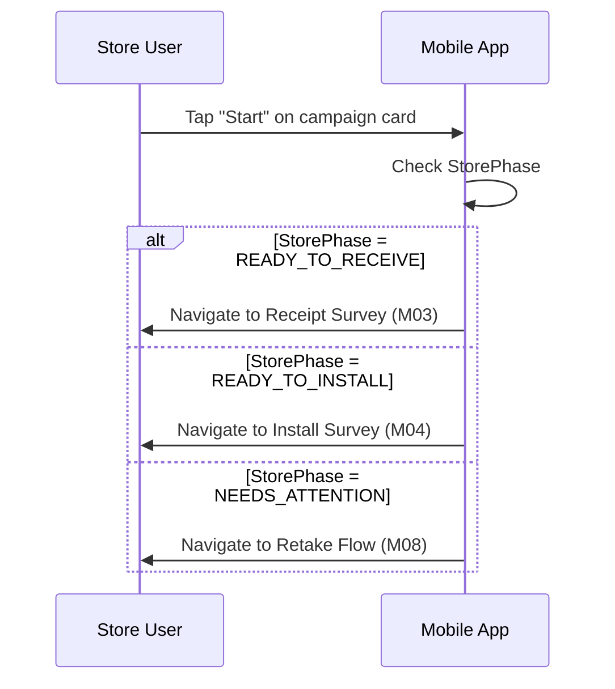

# M02 — Dashboard Screen

> **App**: Mobile App (Store Execution)
> **Route**: `/app/dashboard`
> **SUPP Reference**: SUPP-017 (Store Execution)

---

## Wireframe Reference

**Interactive**: [mobile_app.html](../05_Wireframes/mobile_app.html) → Dashboard Screen

---

## Screen Glossary

| Term | Definition |
|------|------------|
| **Campaign** | A branded promotional program with defined start/end dates and assigned stores |
| **StoreAssignment** | The linkage between a Campaign and a specific Store, tracking execution status |
| **StoreAssignmentStatus** | Current state: ASSIGNED, READY, IN_PROGRESS, SUBMITTED, COMPLETE |
| **StorePhase** | Derived headline status computed from fulfillment, receipt, execution, and verification statuses |
| **Due Date** | Campaign install_end_date; deadline for store to complete installation |

---

## Data Model Map

### Entities Displayed

| Entity | Fields | Access |
|--------|--------|--------|
| `Campaign` | name, campaign_status, install_start_date, install_end_date | Read |
| `StoreAssignment` | status, store_phase, fulfillment_status, receipt_status, execution_status | Read |
| `Store` | store_number, name | Read |
| `Notification` | type, message, read_at, created_at | Read/Write |

### Status Derivation

```
StorePhase = f(fulfillment_status, receipt_status, execution_status, verification_status)

AWAITING_SHIPMENT  ← fulfillment_status = NOT_SHIPPED
SHIPMENT_IN_TRANSIT ← fulfillment_status = SHIPPED
READY_TO_RECEIVE   ← fulfillment_status = DELIVERED
RECEIVING          ← receipt_status = IN_PROGRESS
READY_TO_INSTALL   ← receipt_status = COMPLETE, execution = NOT_STARTED
INSTALLING         ← execution_status = IN_PROGRESS
PENDING_REVIEW     ← verification_status = PENDING
COMPLETE           ← verification_status = APPROVED
NEEDS_ATTENTION    ← any EXCEPTION or REJECTED status
```

---

## UI Components

| Component | Type | Description |
|-----------|------|-------------|
| **Header** | App bar | Store name, notification bell with badge |
| **Campaign Cards** | Card list | One card per active StoreAssignment |
| **Status Badge** | Chip | Color-coded StorePhase indicator |
| **Progress Indicator** | Progress bar | Visual completion percentage |
| **Action Button** | Primary button | "Start", "Continue", or "View" based on status |
| **Due Date** | Text | Days remaining or overdue indicator |
| **Empty State** | Placeholder | "No active campaigns" message |

### Campaign Card Structure

```
┌─────────────────────────────────────┐
│ [STATUS BADGE]           Due: 5 days│
│                                     │
│ Campaign Name                       │
│ 3 of 5 items installed              │
│ ████████░░░░░░░░ 60%               │
│                                     │
│              [Continue →]           │
└─────────────────────────────────────┘
```

---

## Process Flows

### Load Dashboard



### Start Campaign



---

## Status Badge Colors

| StorePhase | Color | Icon |
|------------|-------|------|
| AWAITING_SHIPMENT | Gray | 📦 |
| SHIPMENT_IN_TRANSIT | Blue | 🚚 |
| READY_TO_RECEIVE | Green | ✓ |
| RECEIVING | Yellow | 📋 |
| READY_TO_INSTALL | Green | 🔧 |
| INSTALLING | Yellow | ⏳ |
| PENDING_REVIEW | Blue | 👁 |
| COMPLETE | Green | ✅ |
| NEEDS_ATTENTION | Red | ⚠️ |

---

## Notification Types

| Type | Message Example | Action |
|------|-----------------|--------|
| SHIPMENT_DELIVERED | "Your shipment has arrived" | Open Receipt Survey |
| PHOTO_REJECTED | "2 photos need to be retaken" | Open Retake Flow |
| CAMPAIGN_REMINDER | "Installation due in 2 days" | Open Install Survey |
| ISSUE_RESOLVED | "Your replacement items shipped" | Open Receipt Survey |

---

## Offline Behavior

| Scenario | Behavior |
|----------|----------|
| No connection on load | Show cached data with "Last updated" timestamp |
| Stale data (>1 hour) | Show warning banner, attempt refresh |
| Background sync | Pull latest when connection restored |

---

## Acceptance Criteria

1. ✅ Dashboard shows all active campaigns for logged-in store
2. ✅ Campaign cards display name, status badge, progress, due date
3. ✅ Notification bell shows unread count
4. ✅ Tapping card navigates to appropriate survey based on StorePhase
5. ✅ Completed campaigns move to "History" section
6. ✅ Empty state shown when no active campaigns
7. ✅ Pull-to-refresh updates campaign list
8. ✅ Overdue campaigns highlighted with red indicator

---

## Related Screens

| Screen | Relationship |
|--------|--------------|
| [M01 Login](M01_Login.md) | Previous screen (authentication) |
| [M03 Receipt Survey](M03_Receipt_Survey.md) | Accessed when StorePhase = READY_TO_RECEIVE |
| [M04 Install Survey](M04_Install_Survey.md) | Accessed when StorePhase = READY_TO_INSTALL |
| [M06 Tasks](M06_Tasks.md) | Alternative view of pending work |
| [M08 Retake](M08_Retake.md) | Accessed when photos rejected |

---

*End of M02 Dashboard Screen Spec*
