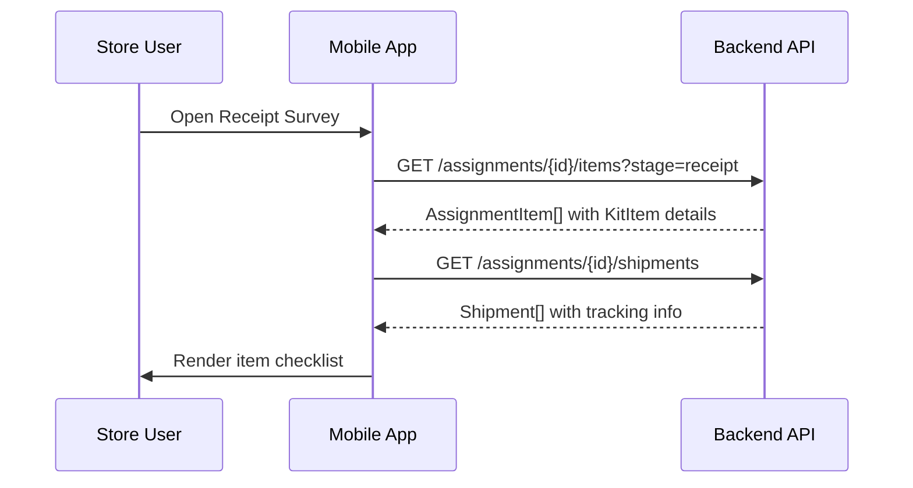
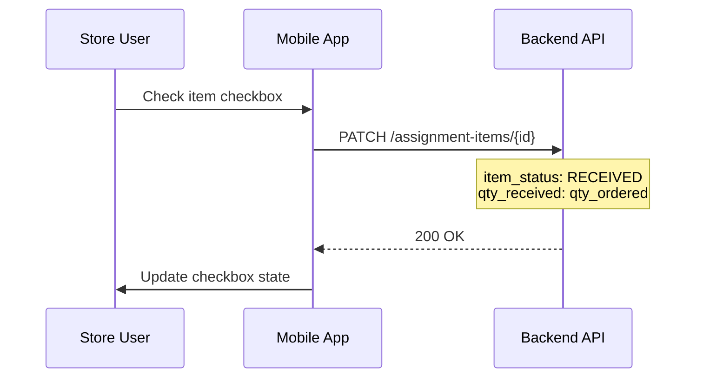
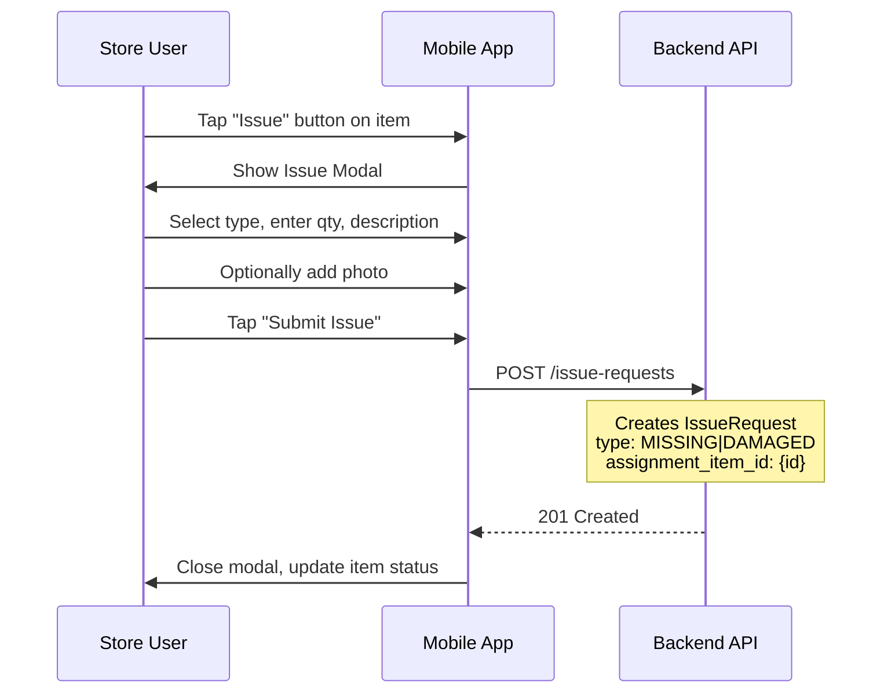
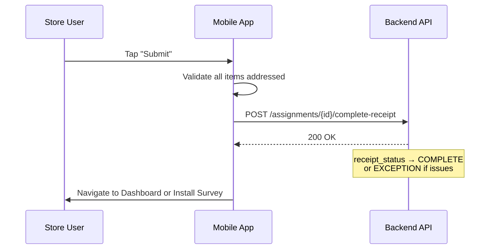

# M03 — Receipt Survey Screen

> **App**: Mobile App (Store Execution)
> **Route**: `/app/campaign/:id/receipt`
> **SUPP Reference**: SUPP-015 (Campaigns), SUPP-017 (Store Execution)

---

## Wireframe Reference

**Interactive**: [store_execution.html](../05_Wireframes/store_execution.html) → Receipt Survey Screen

---

## Screen Glossary

| Term | Definition |
|------|------------|
| **Receipt Survey** | Stage 1 verification where store confirms receipt of shipped items |
| **Shipment** | A physical package containing one or more KitItems sent to a store |
| **KitItem** | A specific promotional item (poster, standee, etc.) included in a campaign kit |
| **AssignmentItem** | Instance of a KitItem assigned to a specific store for a campaign |
| **IssueRequest** | A reported problem (missing, damaged) with a received item |
| **ReceiptStatus** | Derived status: NOT_STARTED, IN_PROGRESS, COMPLETE, EXCEPTION |

---

## Data Model Map

### Entities Displayed

| Entity | Fields | Access |
|--------|--------|--------|
| `StoreAssignment` | id, receipt_status | Read/Write |
| `Shipment` | tracking_number, carrier, shipment_status, delivered_at | Read |
| `AssignmentItem` | id, item_status, qty_ordered, qty_received | Read/Write |
| `KitItem` | name, description, item_type | Read |
| `IssueRequest` | type, description, photo_url | Write |

### Status Transitions

```
AssignmentItem.item_status:
  DELIVERED → RECEIVED (when confirmed)
  DELIVERED → EXCEPTION (when issue reported)

StoreAssignment.receipt_status (derived):
  NOT_STARTED → IN_PROGRESS (first item confirmed)
  IN_PROGRESS → COMPLETE (all items received or excepted)
  IN_PROGRESS → EXCEPTION (any item has issue)
```

---

## UI Components

| Component | Type | Description |
|-----------|------|-------------|
| **Header** | App bar | Campaign name, "Receipt Verification" |
| **Shipment Info** | Card | Tracking #, carrier, delivered date |
| **Item Checklist** | List | All shipped items with checkboxes |
| **Select All** | Button | Quick action to confirm all items |
| **Item Row** | List item | Item name, qty, checkbox, issue button |
| **Issue Button** | Icon button | Per-item "Report Issue" action |
| **Issue Modal** | Bottom sheet | Issue type, description, photo upload |
| **Submit Button** | Primary button | "All Items Received" or "Submit with Issues" |

### Item Row Structure

```
┌─────────────────────────────────────┐
│ [✓] Window Poster (24x36)      x2   │
│     Received: 2 of 2                │
│                          [⚠ Issue]  │
└─────────────────────────────────────┘
```

### Issue Modal Structure

```
┌─────────────────────────────────────┐
│ Report Issue                    [X] │
├─────────────────────────────────────┤
│ Issue Type:                         │
│ ○ Missing    ○ Damaged              │
│                                     │
│ Quantity Affected: [___]            │
│                                     │
│ Description:                        │
│ ┌─────────────────────────────────┐ │
│ │                                 │ │
│ └─────────────────────────────────┘ │
│                                     │
│ Photo (optional for damaged):       │
│ [📷 Add Photo]                      │
│                                     │
│ [Cancel]           [Submit Issue]   │
└─────────────────────────────────────┘
```

---

## Process Flows

### Load Receipt Survey



### Confirm Item Receipt



### Report Issue



### Complete Receipt Survey



---

## Issue Types

| Type | Description | Requires Photo | Creates Reorder |
|------|-------------|----------------|-----------------|
| MISSING | Item not in shipment | No | Yes (auto) |
| DAMAGED | Item received but unusable | Yes (recommended) | Yes (after triage) |
| WRONG_ITEM | Different item received | Yes | Yes (after triage) |
| QUANTITY_SHORT | Fewer items than expected | No | Yes (auto) |

---

## Validation Rules

| Field | Rule | Error Message |
|-------|------|---------------|
| All Items | Must be confirmed or have issue | "Please confirm or report issue for all items" |
| Issue Qty | Must be ≤ qty_ordered | "Cannot report more than ordered quantity" |
| Damaged Photo | Recommended but not required | "Photo helps with faster resolution" |

---

## Offline Behavior

| Action | Behavior |
|--------|----------|
| Check item | Queued locally, synced when online |
| Report issue | Saved to local storage, submitted when online |
| View items | Cached from last sync |
| Submit survey | Blocked until online (shows warning) |

---

## Acceptance Criteria

1. ✅ Shows all items from delivered shipments
2. ✅ User can confirm receipt via checkbox
3. ✅ User can report missing/damaged items
4. ✅ Issue modal captures type, qty, description, optional photo
5. ✅ "Select All" confirms all items at once
6. ✅ Submit blocked until all items addressed
7. ✅ Issues create IssueRequest records
8. ✅ Successful submit transitions to Install Survey

---

## Related Screens

| Screen | Relationship |
|--------|--------------|
| [M02 Dashboard](M02_Dashboard.md) | Entry point when StorePhase = READY_TO_RECEIVE |
| [M04 Install Survey](M04_Install_Survey.md) | Next screen after receipt complete |
| [M05 Photo Capture](M05_Photo_Capture.md) | Used for damage photo evidence |
| [P03 Issues](P03_Issues.md) | PSP view of reported issues |

---

*End of M03 Receipt Survey Screen Spec*
