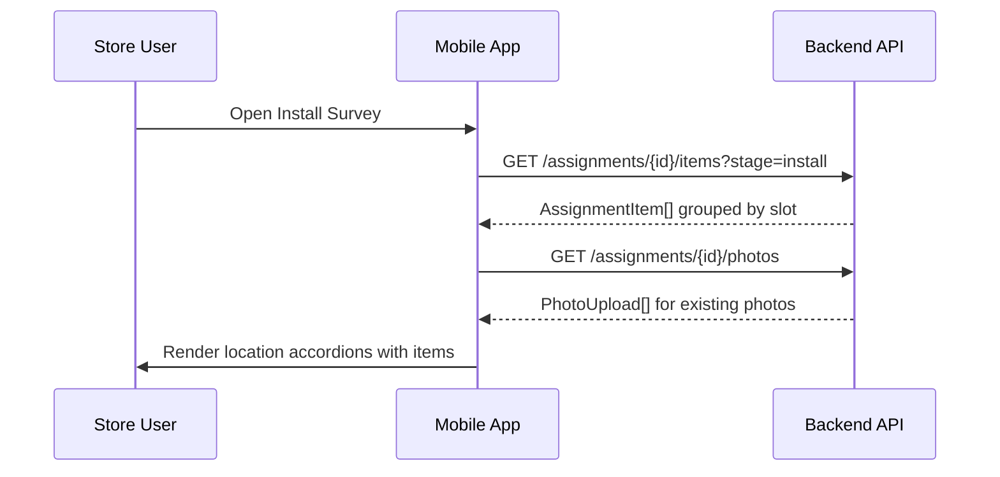
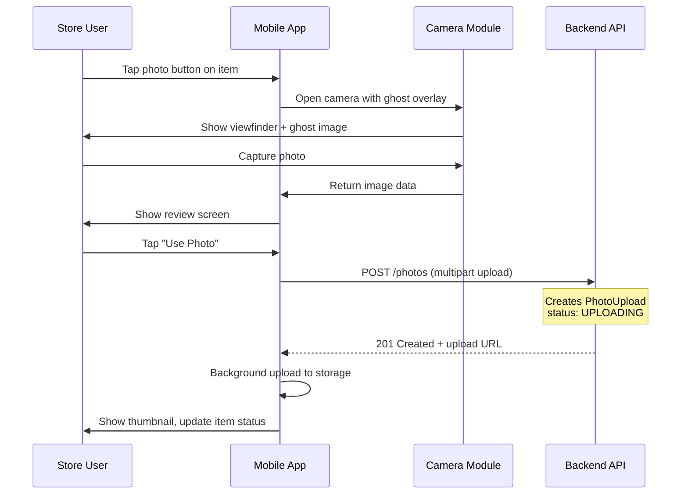
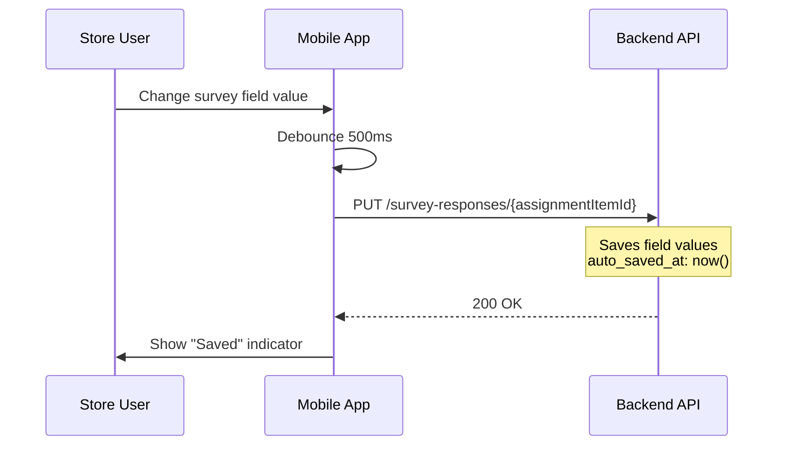
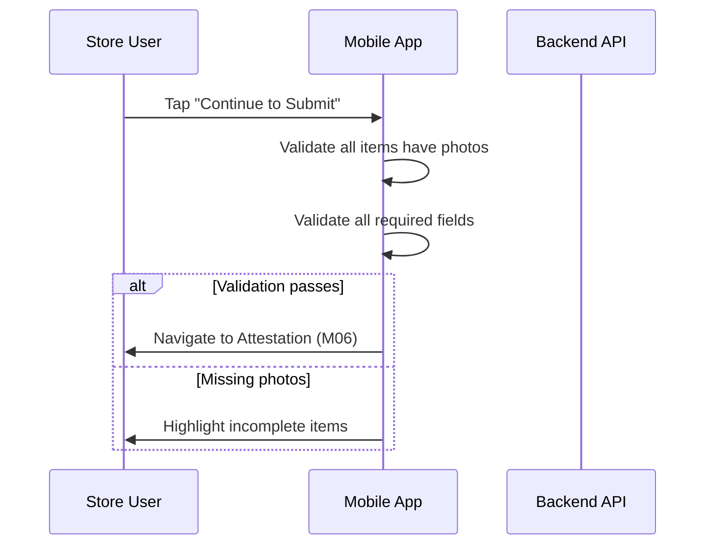

# M04 — Install Survey Screen

> **App**: Mobile App (Store Execution)
> **Route**: `/app/campaign/:id/install`
> **SUPP Reference**: SUPP-015 (Campaigns), SUPP-017 (Store Execution)

---

## Wireframe Reference

**Interactive**: [store_execution.html](../05_Wireframes/store_execution.html) → Install Survey Screen

---

## Screen Glossary

| Term | Definition |
|------|------------|
| **Install Survey** | Stage 2 workflow where store documents installation of POP materials |
| **LocationSlot** | A designated placement area in store (e.g., "Front Window", "End Cap A") |
| **AssignmentItem** | Instance of a KitItem assigned to a specific slot at a store |
| **PhotoUpload** | Image captured as proof of installation |
| **PhotoRule** | Configuration defining photo requirements (min/max, ghost image, flash) |
| **ExecutionStatus** | Derived status: NOT_STARTED, IN_PROGRESS, COMPLETE |
| **Ghost Image** | Semi-transparent overlay showing expected installation position |

---

## Data Model Map

### Entities Displayed

| Entity | Fields | Access |
|--------|--------|--------|
| `StoreAssignment` | id, execution_status | Read/Write |
| `AssignmentItem` | id, item_status, location_slot_id | Read/Write |
| `LocationSlot` | name, slot_code, store_id | Read |
| `KitItem` | name, description, item_type, photo_rule_id | Read |
| `PhotoRule` | min_photos, max_photos, ghost_image_url, instructions | Read |
| `PhotoUpload` | id, file_url, upload_status, assignment_item_id | Write |
| `SurveyResponse` | field_id, value, override_value | Write |

### Status Transitions

```
AssignmentItem.item_status:
  RECEIVED → INSTALLED (when photo captured)
  INSTALLED → PROOF_SUBMITTED (when survey submitted)

StoreAssignment.execution_status (derived):
  NOT_STARTED → IN_PROGRESS (first item installed)
  IN_PROGRESS → COMPLETE (all items installed + submitted)
```

---

## UI Components

| Component | Type | Description |
|-----------|------|-------------|
| **Header** | App bar | Campaign name, "Installation" |
| **Progress Bar** | Linear progress | "3 of 5 locations complete" |
| **Location Accordion** | Expandable list | Grouped by LocationSlot |
| **Item Card** | Card | Item name, photo indicator, status |
| **Photo Capture Button** | FAB | Opens camera for item |
| **Photo Thumbnail Grid** | Image grid | Shows captured photos with retake option |
| **Survey Fields** | Form inputs | Per-item questions from SurveyTemplate |
| **Save Draft** | Auto-save | Saves on field change |
| **Submit Button** | Primary button | Proceeds to attestation (M06) |

### Location Accordion Structure

```
┌─────────────────────────────────────┐
│ ▼ Front Window                  2/2 │
├─────────────────────────────────────┤
│ ┌─────────────────────────────────┐ │
│ │ Window Poster (24x36)      [✓] │ │
│ │ [📷][📷]              [+ Photo] │ │
│ │                                 │ │
│ │ Position: ○ Left ○ Center ○ Rgt│ │
│ │ Visibility: [████████░░] 80%   │ │
│ └─────────────────────────────────┘ │
│ ┌─────────────────────────────────┐ │
│ │ Window Cling                [✓] │ │
│ │ [📷]                  [+ Photo] │ │
│ └─────────────────────────────────┘ │
└─────────────────────────────────────┘

┌─────────────────────────────────────┐
│ ► End Cap A                     0/1 │
└─────────────────────────────────────┘
```

---

## Process Flows

### Load Install Survey



### Capture Installation Photo



### Save Survey Response



### Complete Installation



---

## Photo Capture UX

| Step | Screen | Components |
|------|--------|------------|
| 1 | Camera | Viewfinder, ghost image overlay (50% opacity) |
| 2 | Capture | Shutter button, flash toggle, gallery access |
| 3 | Review | Full image, "Retake" or "Use Photo" buttons |
| 4 | Upload | Progress indicator, background upload |

### Ghost Image Overlay

```
┌─────────────────────────────────────┐
│                                     │
│    ┌─────────────────────────┐     │
│    │                         │     │
│    │    [Ghost Poster        │     │
│    │     50% opacity]        │     │
│    │                         │     │
│    └─────────────────────────┘     │
│                                     │
│              [📸]                   │
└─────────────────────────────────────┘
```

---

## Survey Field Types

| Type | UI Component | Validation |
|------|--------------|------------|
| Text | Text input | Max length |
| Number | Numeric input | Min/max range |
| Select | Radio buttons or dropdown | Required selection |
| Multi-select | Checkboxes | Min/max selections |
| Computed | Read-only display | Formula evaluated |

### Computed Field Override

```
┌─────────────────────────────────────┐
│ Total Signage Visible: 4           │
│ (computed from position fields)     │
│                       [Override →] │
└─────────────────────────────────────┘

Override Modal:
┌─────────────────────────────────────┐
│ Override Computed Value             │
│                                     │
│ Computed: 4                         │
│ Your Value: [___]                   │
│                                     │
│ Reason (optional):                  │
│ ┌─────────────────────────────────┐ │
│ │                                 │ │
│ └─────────────────────────────────┘ │
│                                     │
│ [Cancel]              [Apply]       │
└─────────────────────────────────────┘
```

---

## Validation Rules

| Requirement | Rule | Error Message |
|-------------|------|---------------|
| Photos | Min photos per PhotoRule | "This item requires at least 1 photo" |
| Required Fields | Must have value | "Please complete all required fields" |
| All Items | Must be addressed | "Please complete all installation items" |

---

## Offline Behavior

| Action | Behavior |
|--------|----------|
| View items | Cached from last sync |
| Capture photo | Saved locally, queued for upload |
| Change field | Saved to local storage |
| Photo upload | Queued, uploads when online |
| Submit survey | Blocked until photos uploaded |

### Sync Status Indicators

| Status | Icon | Description |
|--------|------|-------------|
| Synced | ✓ | All data uploaded |
| Pending | ↻ | Upload in progress |
| Queued | ⏳ | Waiting for connection |
| Error | ⚠ | Upload failed, retry available |

---

## Acceptance Criteria

1. ✅ Items grouped by LocationSlot in accordion view
2. ✅ Progress bar shows completion status
3. ✅ Photo capture shows ghost image overlay when configured
4. ✅ Multiple photos supported per PhotoRule settings
5. ✅ Survey fields render based on SurveyTemplate
6. ✅ Computed fields display with optional override
7. ✅ Auto-save on field changes
8. ✅ Submit blocked until all items complete
9. ✅ Photos upload in background
10. ✅ Offline mode queues photos for later upload

---

## Related Screens

| Screen | Relationship |
|--------|--------------|
| [M03 Receipt Survey](M03_Receipt_Survey.md) | Previous stage (receipt verification) |
| [M05 Photo Capture](M05_Photo_Capture.md) | Camera interface detail |
| [M06 Tasks](M06_Tasks.md) | Attestation and final submit |
| [M08 Retake](M08_Retake.md) | Accessed if photos rejected |
| [B07 Verification](B07_Verification.md) | Brand reviews submitted photos |

---

*End of M04 Install Survey Screen Spec*
