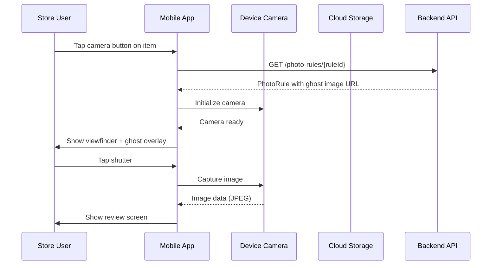
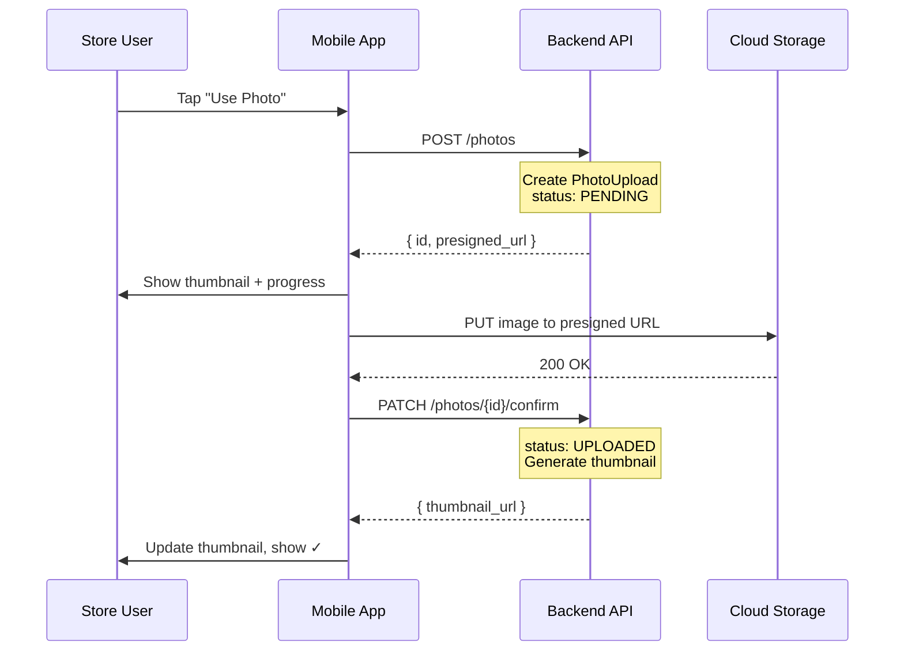
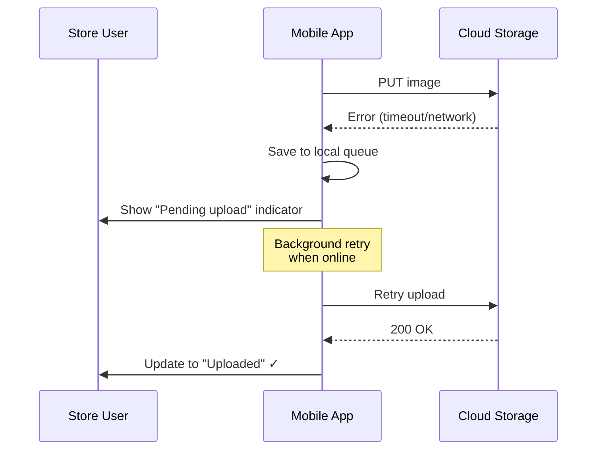

# M05 — Photo Capture Screen

> **App**: Mobile App (Store Execution)
> **Route**: `/app/camera` (modal overlay)
> **SUPP Reference**: SUPP-037 (Survey Builder and Store Surveys)

---

## Wireframe Reference

**Interactive**: [mobile_app.html](../05_Wireframes/mobile_app.html) → Photo Capture (via Install Survey)

---

## Screen Glossary

| Term | Definition |
|------|------------|
| **PhotoUpload** | Database record tracking an uploaded image with metadata |
| **PhotoRule** | Configuration defining photo requirements (count, quality, overlay) |
| **Ghost Image** | Semi-transparent reference overlay showing expected framing |
| **Photo Review** | Brand admin evaluation of submitted installation photos |
| **Upload Status** | PENDING, UPLOADING, UPLOADED, FAILED |

---

## Data Model Map

### Entities Involved

| Entity | Fields | Access |
|--------|--------|--------|
| `PhotoUpload` | id, file_url, thumbnail_url, upload_status, assignment_item_id, created_at | Write |
| `PhotoRule` | min_photos, max_photos, ghost_image_url, instructions, required_flash, min_resolution | Read |
| `AssignmentItem` | id, item_status | Read/Write |

### Photo Lifecycle

```
PhotoUpload.upload_status:
  PENDING → UPLOADING → UPLOADED
                     → FAILED (retry available)

Storage flow:
  1. Create PhotoUpload record (status: PENDING)
  2. Get presigned upload URL
  3. Upload to cloud storage (status: UPLOADING)
  4. Confirm upload (status: UPLOADED)
  5. Generate thumbnail
```

---

## UI Components

### Camera View

| Component | Type | Description |
|-----------|------|-------------|
| **Viewfinder** | Camera preview | Full-screen camera feed |
| **Ghost Overlay** | Image layer | Semi-transparent positioning guide |
| **Instructions** | Text banner | PhotoRule.instructions text |
| **Flash Toggle** | Icon button | On/Off/Auto flash modes |
| **Shutter Button** | FAB | Capture photo |
| **Gallery Button** | Icon button | Access existing photos |
| **Close Button** | Icon button | Cancel and return |

### Camera Layout

```
┌─────────────────────────────────────┐
│ [X]                          [⚡]   │
│                                     │
│  ┌─────────────────────────────┐   │
│  │                             │   │
│  │     Camera Viewfinder       │   │
│  │                             │   │
│  │  ┌───────────────────┐     │   │
│  │  │   Ghost Image     │     │   │
│  │  │   (50% opacity)   │     │   │
│  │  └───────────────────┘     │   │
│  │                             │   │
│  └─────────────────────────────┘   │
│                                     │
│  "Align poster with outline"        │
│                                     │
│  [🖼]         [📸]         [↺]     │
└─────────────────────────────────────┘
```

### Review View

| Component | Type | Description |
|-----------|------|-------------|
| **Full Image** | Image display | Captured photo at full resolution |
| **Retake Button** | Secondary button | Discard and recapture |
| **Use Photo Button** | Primary button | Confirm and upload |
| **Quality Warnings** | Alert banners | Blur, darkness, orientation issues |

### Review Layout

```
┌─────────────────────────────────────┐
│ Review Photo                    [X] │
├─────────────────────────────────────┤
│                                     │
│  ┌─────────────────────────────┐   │
│  │                             │   │
│  │     Captured Image          │   │
│  │     (full resolution)       │   │
│  │                             │   │
│  └─────────────────────────────┘   │
│                                     │
│  ⚠️ Image may be too dark           │
│                                     │
│  [Retake]           [Use Photo]     │
└─────────────────────────────────────┘
```

---

## Process Flows

### Capture Photo



### Upload Photo



### Handle Upload Failure



---

## Quality Validation (v1 Placeholders)

| Check | Status | User Feedback |
|-------|--------|---------------|
| Resolution | v1: Check only | "Photo resolution too low" |
| Brightness | v2: Future | "Image may be too dark" |
| Blur Detection | v2: Future | "Image appears blurry" |
| Orientation | v2: Future | "Please rotate device" |

### Resolution Check

```javascript
// v1 Implementation
if (image.width < photoRule.min_resolution ||
    image.height < photoRule.min_resolution) {
  showWarning("Photo resolution too low. Minimum: " +
              photoRule.min_resolution + "px");
}
```

---

## Flash Modes

| Mode | Behavior | Icon |
|------|----------|------|
| Auto | Device decides | ⚡A |
| On | Always flash | ⚡ |
| Off | Never flash | ⚡̸ |

**Note**: If `PhotoRule.required_flash = true`, flash is locked to "On" mode.

---

## Photo Metadata Captured

| Field | Source | Purpose |
|-------|--------|---------|
| `captured_at` | Device timestamp | Audit trail |
| `device_model` | Device info | Troubleshooting |
| `gps_latitude` | Device GPS (if permitted) | Location verification |
| `gps_longitude` | Device GPS (if permitted) | Location verification |
| `file_size_bytes` | Image data | Storage metrics |
| `resolution` | Image dimensions | Quality tracking |

---

## Offline Behavior

| Scenario | Behavior |
|----------|----------|
| Capture while offline | Photo saved locally |
| Review while offline | Works normally |
| Upload while offline | Queued for background upload |
| Queue limit | Max 50 photos queued |
| Queue full | Warning shown, oldest synced first |

### Local Storage Structure

```javascript
{
  "photoQueue": [
    {
      "localId": "uuid-123",
      "assignmentItemId": 456,
      "imagePath": "/local/photos/uuid-123.jpg",
      "capturedAt": "2025-01-15T10:30:00Z",
      "status": "queued", // queued | uploading | failed
      "retryCount": 0
    }
  ]
}
```

---

## Acceptance Criteria

1. ✅ Camera opens with full-screen viewfinder
2. ✅ Ghost image overlay displays when configured
3. ✅ Instructions banner shows PhotoRule.instructions
4. ✅ Flash toggle respects required_flash setting
5. ✅ Review screen shows captured image full-size
6. ✅ Quality warnings display for low resolution (v1)
7. ✅ "Use Photo" initiates background upload
8. ✅ Upload progress visible in parent screen
9. ✅ Failed uploads retry automatically
10. ✅ Offline photos queue for later upload

---

## Related Screens

| Screen | Relationship |
|--------|--------------|
| [M04 Install Survey](M04_Install_Survey.md) | Parent screen, invokes camera |
| [M08 Retake](M08_Retake.md) | Retake flow uses same camera UX |
| [B07 Verification](B07_Verification.md) | Brand reviews captured photos |

---

*End of M05 Photo Capture Screen Spec*
