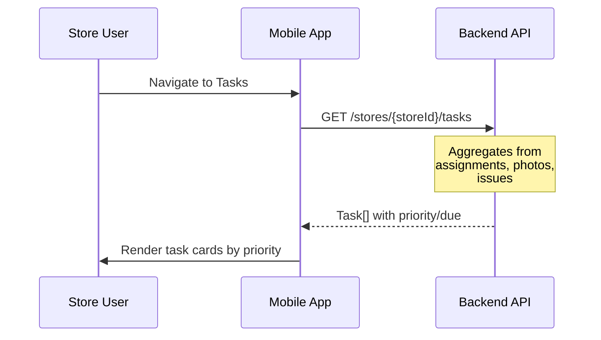
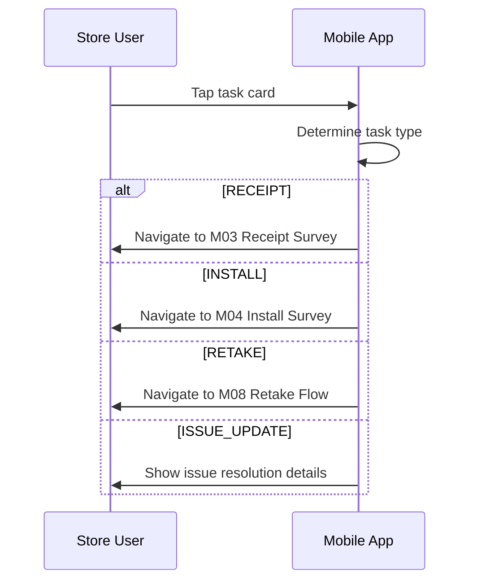
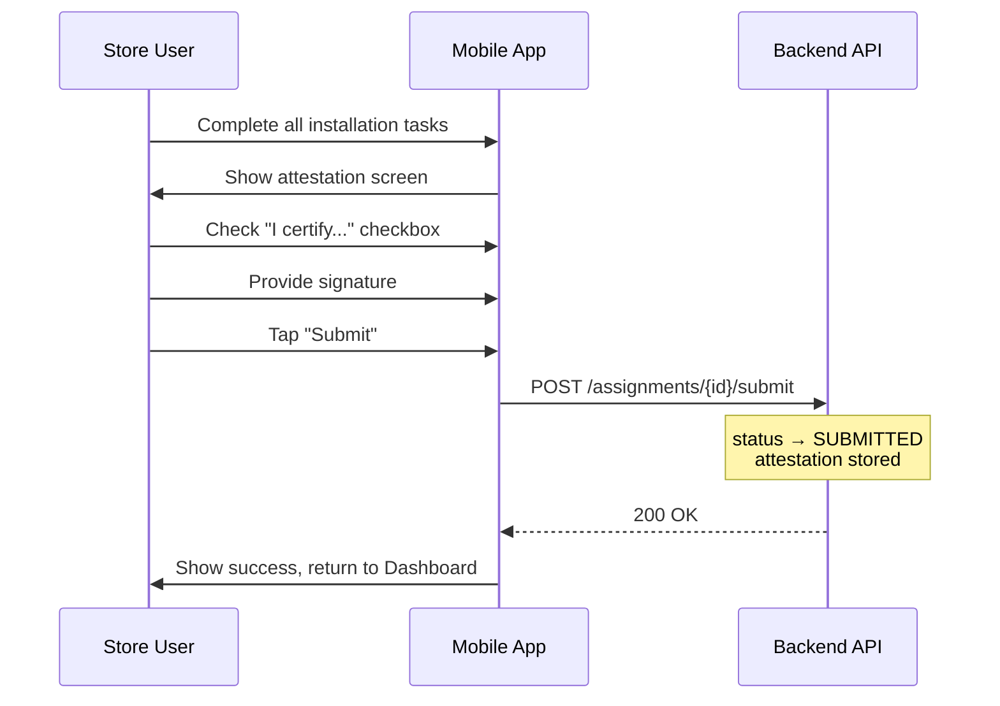

# M06 — Tasks List Screen

> **App**: Mobile App (Store Execution)
> **Route**: `/app/tasks`
> **SUPP Reference**: SUPP-017 (Store Execution)

---

## Wireframe Reference

**Interactive**: [store_execution.html](../05_Wireframes/store_execution.html) → Tasks Screen

---

## Screen Glossary

| Term | Definition |
|------|------------|
| **Task** | A discrete action item for the store user to complete |
| **Task Type** | Category: RECEIPT, INSTALL, RETAKE, ISSUE_UPDATE |
| **Priority** | Task urgency: HIGH, MEDIUM, LOW |
| **Due Date** | Deadline for task completion |
| **Attestation** | Final confirmation step before survey submission |

---

## Data Model Map

### Entities Displayed

| Entity | Fields | Access |
|--------|--------|--------|
| `StoreAssignment` | id, status, store_phase | Read |
| `AssignmentItem` | id, item_status | Read |
| `Campaign` | name, install_end_date | Read |
| `PhotoReview` | status, rejection_reason | Read |
| `IssueRequest` | status, resolution_notes | Read |

### Task Derivation

Tasks are dynamically generated from entity states, not stored separately:

```
Task Generation Rules:

RECEIPT tasks:
  - StoreAssignment where store_phase = READY_TO_RECEIVE

INSTALL tasks:
  - AssignmentItem where item_status = RECEIVED
  - Grouped by LocationSlot

RETAKE tasks:
  - PhotoUpload where review_status = REJECTED

ISSUE_UPDATE tasks:
  - IssueRequest where status changed (RESOLVED, etc.)
```

---

## UI Components

| Component | Type | Description |
|-----------|------|-------------|
| **Header** | App bar | "My Tasks", filter button |
| **Filter Chips** | Chip group | All, Receipts, Installs, Retakes |
| **Task List** | Card list | Grouped by priority/due date |
| **Task Card** | Card | Type icon, title, campaign, due date |
| **Badge** | Count indicator | Total pending tasks |
| **Empty State** | Placeholder | "All caught up!" message |

### Task Card Structure

```
┌─────────────────────────────────────┐
│ 📷 HIGH                    Due: Today│
│                                     │
│ Retake Required                     │
│ Summer Promo - Front Window Poster  │
│                                     │
│ "Wrong angle - please recapture"    │
│                                     │
│                      [View Details] │
└─────────────────────────────────────┘

┌─────────────────────────────────────┐
│ 📦 MEDIUM                Due: 3 days│
│                                     │
│ Verify Shipment Receipt             │
│ Holiday Campaign                    │
│                                     │
│ 5 items delivered                   │
│                                     │
│                      [Start →]      │
└─────────────────────────────────────┘
```

---

## Process Flows

### Load Tasks



### Start Task



### Submit Attestation



---

## Attestation Screen

**Route**: `/app/campaign/:id/submit`

### UI Layout

```
┌─────────────────────────────────────┐
│ Submit Installation             [X] │
├─────────────────────────────────────┤
│                                     │
│ Summary                             │
│ ┌─────────────────────────────────┐ │
│ │ ✓ Front Window (2 items)       │ │
│ │ ✓ End Cap A (1 item)           │ │
│ │ ✓ Checkout Counter (2 items)   │ │
│ └─────────────────────────────────┘ │
│                                     │
│ Photos: 8 uploaded                  │
│                                     │
│ ┌─────────────────────────────────┐ │
│ │ [✓] I certify that all items   │ │
│ │     shown above are installed  │ │
│ │     correctly at this store.   │ │
│ └─────────────────────────────────┘ │
│                                     │
│ Signature:                          │
│ ┌─────────────────────────────────┐ │
│ │     [Signature Canvas]          │ │
│ └─────────────────────────────────┘ │
│                                     │
│ [Cancel]              [Submit]      │
└─────────────────────────────────────┘
```

### Attestation Data

| Field | Type | Description |
|-------|------|-------------|
| `attestation_text` | String | Certification statement |
| `attested_at` | Timestamp | When user attested |
| `attested_by` | User ID | Who attested |
| `signature_url` | URL | Signature image storage |

---

## Task Types

| Type | Icon | Description | Navigation |
|------|------|-------------|------------|
| RECEIPT | 📦 | Verify shipment delivery | M03 Receipt Survey |
| INSTALL | 🔧 | Install items at locations | M04 Install Survey |
| RETAKE | 📷 | Recapture rejected photos | M08 Retake Flow |
| ISSUE_UPDATE | ℹ️ | View issue resolution | Modal with details |

---

## Priority Calculation

| Priority | Criteria |
|----------|----------|
| HIGH | Due today or overdue |
| HIGH | Retake required (blocking completion) |
| MEDIUM | Due within 3 days |
| MEDIUM | Issue resolved (acknowledgment needed) |
| LOW | Due in 4+ days |

---

## Filter Options

| Filter | Shows |
|--------|-------|
| All | All pending tasks |
| Receipts | RECEIPT type only |
| Installs | INSTALL type only |
| Retakes | RETAKE type only |
| Overdue | Past due date |

---

## Acceptance Criteria

1. ✅ Tasks list shows all pending work for store
2. ✅ Tasks grouped/sorted by priority and due date
3. ✅ Task cards show type, campaign, due date
4. ✅ Tapping task navigates to appropriate screen
5. ✅ Filter chips filter task list by type
6. ✅ Badge shows total pending count
7. ✅ Attestation required before final submit
8. ✅ Signature capture works on touch devices
9. ✅ Empty state shown when no tasks

---

## Related Screens

| Screen | Relationship |
|--------|--------------|
| [M02 Dashboard](M02_Dashboard.md) | Alternative view of active work |
| [M03 Receipt Survey](M03_Receipt_Survey.md) | RECEIPT task destination |
| [M04 Install Survey](M04_Install_Survey.md) | INSTALL task destination |
| [M08 Retake](M08_Retake.md) | RETAKE task destination |

---

*End of M06 Tasks Screen Spec*
