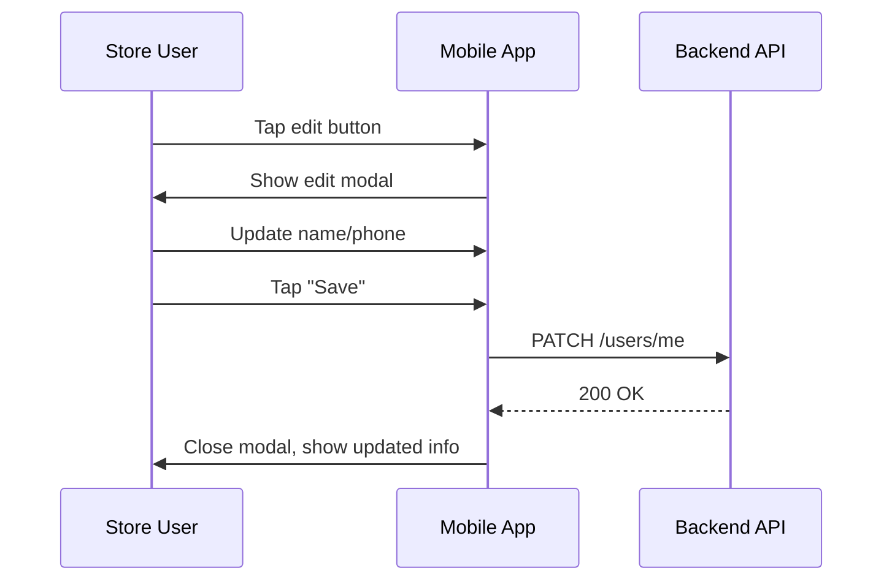
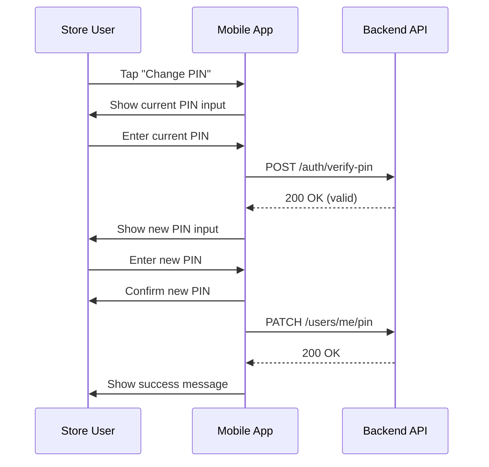
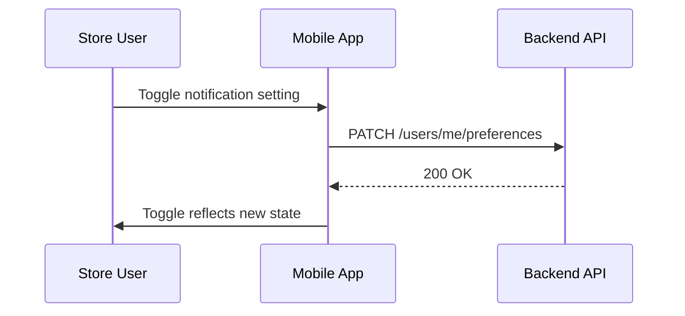
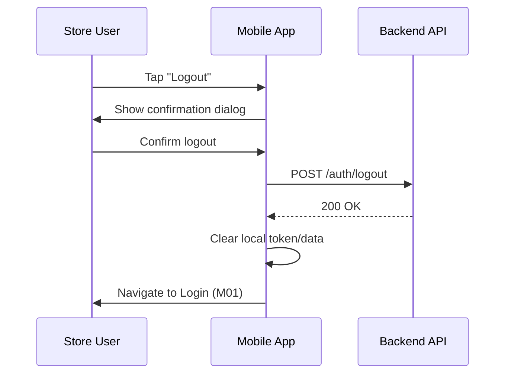

# M07 — Profile Screen

> **App**: Mobile App (Store Execution)
> **Route**: `/app/profile`
> **SUPP Reference**: SUPP-036 (Onboarding and Store Foundation)

---

## Wireframe Reference

**Interactive**: [mobile_app.html](../05_Wireframes/mobile_app.html) → Profile Screen

---

## Screen Glossary

| Term | Definition |
|------|------------|
| **Store User** | Retail employee using mobile app for POP execution |
| **Membership** | Association between a User and a Store with assigned role |
| **Notification Preferences** | User settings for email/push notification types |
| **PIN** | Personal identification number for app authentication |

---

## Data Model Map

### Entities Displayed

| Entity | Fields | Access |
|--------|--------|--------|
| `User` | name, email, phone, avatar_url | Read/Write |
| `Membership` | store_id, role | Read |
| `Store` | store_number, name | Read |
| `NotificationPreference` | type, email_enabled, push_enabled | Read/Write |

### User Settings Structure

```typescript
interface UserSettings {
  notifications: {
    shipment_updates: { email: boolean, push: boolean },
    photo_reviews: { email: boolean, push: boolean },
    campaign_reminders: { email: boolean, push: boolean },
    issue_updates: { email: boolean, push: boolean }
  },
  display: {
    theme: 'light' | 'dark' | 'system'
  }
}
```

---

## UI Components

| Component | Type | Description |
|-----------|------|-------------|
| **Header** | App bar | "Profile", back button |
| **Avatar** | Image/Initials | User photo or initials circle |
| **User Info** | Card | Name, email, phone, store |
| **Edit Button** | Icon button | Opens edit modal |
| **Notification Settings** | Toggle list | Per-type email/push toggles |
| **Change PIN** | List item | Opens PIN change flow |
| **App Version** | Text | Version number for support |
| **Logout Button** | Destructive button | Signs out user |

### Profile Layout

```
┌─────────────────────────────────────┐
│ ← Profile                           │
├─────────────────────────────────────┤
│                                     │
│            ┌─────┐                  │
│            │ JD  │                  │
│            └─────┘                  │
│          John Doe              [✏️] │
│       john@store.com                │
│       (555) 123-4567                │
│                                     │
│       Store: STR-001                │
│       Acme Retail - Downtown        │
│                                     │
├─────────────────────────────────────┤
│ Notifications                       │
│                                     │
│ Shipment Updates                    │
│   Email [ON]  Push [ON]             │
│                                     │
│ Photo Reviews                       │
│   Email [OFF] Push [ON]             │
│                                     │
│ Campaign Reminders                  │
│   Email [ON]  Push [ON]             │
│                                     │
│ Issue Updates                       │
│   Email [ON]  Push [OFF]            │
│                                     │
├─────────────────────────────────────┤
│ Security                            │
│                                     │
│ Change PIN                      [→] │
│                                     │
├─────────────────────────────────────┤
│                                     │
│          [Logout]                   │
│                                     │
│       Version 1.0.0 (build 42)      │
└─────────────────────────────────────┘
```

---

## Process Flows

### Edit Profile



### Change PIN



### Update Notification Preferences



### Logout



---

## Edit Modal

```
┌─────────────────────────────────────┐
│ Edit Profile                    [X] │
├─────────────────────────────────────┤
│                                     │
│ Name                                │
│ ┌─────────────────────────────────┐ │
│ │ John Doe                        │ │
│ └─────────────────────────────────┘ │
│                                     │
│ Phone                               │
│ ┌─────────────────────────────────┐ │
│ │ (555) 123-4567                  │ │
│ └─────────────────────────────────┘ │
│                                     │
│ Email (read-only)                   │
│ john@store.com                      │
│                                     │
│ [Cancel]              [Save]        │
└─────────────────────────────────────┘
```

---

## Notification Types

| Type | Description | Default |
|------|-------------|---------|
| Shipment Updates | Tracking status changes | Email + Push |
| Photo Reviews | Approval/rejection notifications | Push only |
| Campaign Reminders | Due date reminders | Email + Push |
| Issue Updates | Issue resolution status | Email only |

---

## PIN Change Rules

| Rule | Validation |
|------|------------|
| Length | 4-6 digits |
| Current PIN | Must match existing |
| New PIN | Cannot match current |
| Confirmation | Must match new PIN |
| History | Cannot reuse last 3 PINs |

---

## Security Features

| Feature | Implementation |
|---------|----------------|
| Session timeout | 8 hours inactivity |
| Token storage | Secure keychain/keystore |
| PIN attempts | 5 max, then 15-min lockout |
| Logout | Clears all local data |

---

## Acceptance Criteria

1. ✅ Profile displays user name, email, phone
2. ✅ Store information shown (number and name)
3. ✅ Edit modal allows name/phone updates
4. ✅ Email is read-only (cannot be changed)
5. ✅ Notification toggles save immediately
6. ✅ PIN change requires current PIN verification
7. ✅ Logout clears session and navigates to login
8. ✅ App version displayed for support reference

---

## Related Screens

| Screen | Relationship |
|--------|--------------|
| [M01 Login](M01_Login.md) | Logout redirects here |
| [M02 Dashboard](M02_Dashboard.md) | Main app navigation |

---

*End of M07 Profile Screen Spec*
