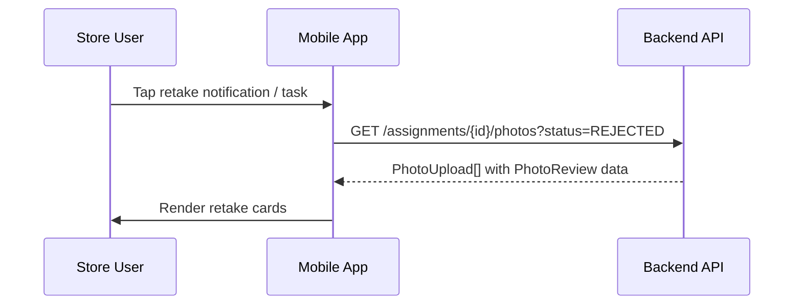
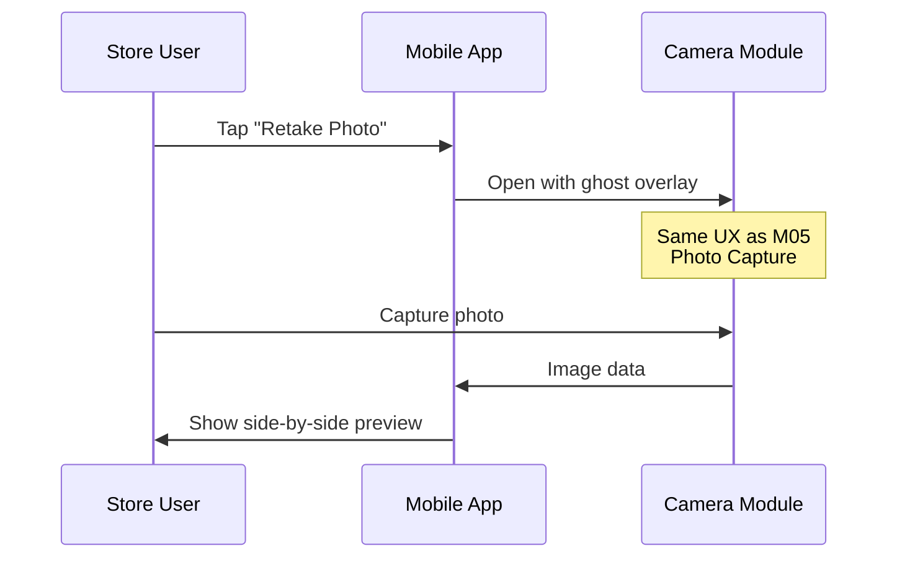
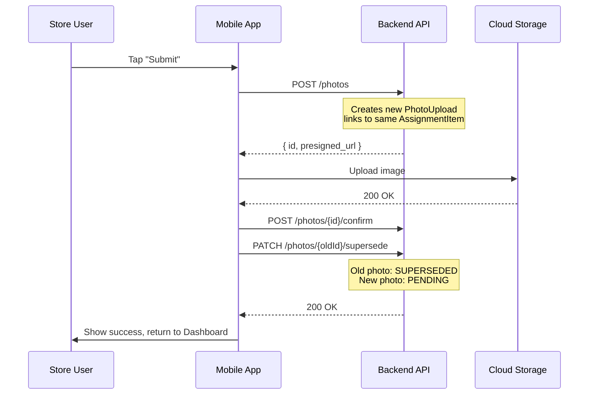

# M08 — Retake Flow Screen

> **App**: Mobile App (Store Execution)
> **Route**: `/app/campaign/:id/retake`
> **SUPP Reference**: SUPP-018 (Photo Review), SUPP-037 (Store Surveys)

---

## Wireframe Reference

**Interactive**: [store_execution.html](../05_Wireframes/store_execution.html) → Retake Flow (via Dashboard notification)

---

## Screen Glossary

| Term | Definition |
|------|------------|
| **PhotoReview** | Brand admin evaluation record for a submitted photo |
| **Rejection Reason** | Standardized code explaining why photo was rejected |
| **Admin Comment** | Free-text feedback from reviewer with retake guidance |
| **Superseded** | Status of old photo after replacement is submitted |
| **Retake** | Process of capturing a new photo to replace a rejected one |

---

## Data Model Map

### Entities Displayed

| Entity | Fields | Access |
|--------|--------|--------|
| `PhotoUpload` | id, file_url, review_status, assignment_item_id | Read |
| `PhotoReview` | status, rejection_reason, admin_comment, reviewed_at | Read |
| `AssignmentItem` | id, item_status, location_slot_id | Read/Write |
| `KitItem` | name, description, photo_rule_id | Read |
| `PhotoRule` | ghost_image_url, instructions | Read |

### Status Transitions

```
PhotoUpload (old):
  review_status: REJECTED → SUPERSEDED (after retake submitted)

PhotoUpload (new):
  Created with review_status: PENDING

AssignmentItem:
  item_status: RETAKE_REQUIRED → PROOF_SUBMITTED (after retake)
```

---

## UI Components

| Component | Type | Description |
|-----------|------|-------------|
| **Header** | App bar | "Retake Required", campaign name |
| **Rejected Photo Card** | Card | Original photo with rejection overlay |
| **Rejection Badge** | Chip | Reason code (e.g., "Wrong Angle") |
| **Admin Comment** | Text block | Reviewer's instructions |
| **Original Image** | Thumbnail | Rejected photo (dimmed) |
| **Retake Button** | Primary button | Opens camera |
| **New Photo Preview** | Image | Replacement photo after capture |
| **Submit Button** | Primary button | Submits retake for review |

### Retake Card Layout

```
┌─────────────────────────────────────┐
│ Retake Required                     │
│ Front Window Poster                 │
├─────────────────────────────────────┤
│                                     │
│  ┌─────────────────────────────┐   │
│  │                             │   │
│  │   [Rejected Photo]         │   │
│  │   (dimmed, X overlay)      │   │
│  │                             │   │
│  └─────────────────────────────┘   │
│                                     │
│  ⚠️ WRONG_ANGLE                     │
│                                     │
│  "Please capture the poster         │
│   straight-on, not at an angle.     │
│   Ensure all corners are visible."  │
│                                     │
│          [📷 Retake Photo]          │
│                                     │
└─────────────────────────────────────┘
```

### After Retake Capture

```
┌─────────────────────────────────────┐
│ Retake Required                     │
│ Front Window Poster                 │
├─────────────────────────────────────┤
│                                     │
│  Before          After              │
│  ┌─────────┐    ┌─────────┐        │
│  │ [Old]   │    │ [New]   │        │
│  │  ❌     │    │  ✓      │        │
│  └─────────┘    └─────────┘        │
│                                     │
│  [Retake Again]    [Submit]         │
│                                     │
└─────────────────────────────────────┘
```

---

## Process Flows

### View Rejected Photos



### Capture Retake



### Submit Retake



---

## Rejection Reasons

| Code | Display Text | Guidance |
|------|--------------|----------|
| WRONG_ANGLE | "Wrong Angle" | Capture straight-on |
| TOO_DARK | "Too Dark" | Use flash or better lighting |
| BLURRY | "Blurry" | Hold device steady |
| WRONG_ITEM | "Wrong Item" | Photo shows incorrect item |
| INCOMPLETE | "Incomplete" | Full item must be visible |
| OBSTRUCTED | "Obstructed" | Remove objects blocking view |
| OTHER | "Other" | See admin comment |

---

## Notification Trigger

When photos are rejected, the system sends:

| Channel | Content |
|---------|---------|
| Push | "Action Required: 2 photos rejected for Summer Promo" |
| Email | "Photo Retake Required" with rejection details |
| In-App | Badge on Dashboard, entry in Tasks list |

### Deep Link

```
newpopsys://app/campaign/{campaignId}/retake?items={assignmentItemIds}
```

---

## Multiple Retakes

When multiple photos are rejected:

```
┌─────────────────────────────────────┐
│ ← Retakes Required (3)              │
├─────────────────────────────────────┤
│                                     │
│ ┌─────────────────────────────────┐ │
│ │ Front Window Poster        [→] │ │
│ │ ⚠️ WRONG_ANGLE                  │ │
│ └─────────────────────────────────┘ │
│                                     │
│ ┌─────────────────────────────────┐ │
│ │ End Cap Display            [→] │ │
│ │ ⚠️ TOO_DARK                     │ │
│ └─────────────────────────────────┘ │
│                                     │
│ ┌─────────────────────────────────┐ │
│ │ Checkout Counter           [→] │ │
│ │ ⚠️ BLURRY                       │ │
│ └─────────────────────────────────┘ │
│                                     │
│        [Submit All Retakes]         │
└─────────────────────────────────────┘
```

---

## Offline Behavior

| Action | Behavior |
|--------|----------|
| View rejections | Cached from last sync |
| Capture retake | Saved locally |
| Submit | Queued for upload when online |

---

## Acceptance Criteria

1. ✅ Screen shows all rejected photos for assignment
2. ✅ Each rejection displays reason code and admin comment
3. ✅ Original photo shown with rejection overlay
4. ✅ Retake button opens camera with ghost image
5. ✅ Side-by-side comparison after capture
6. ✅ Submit supersedes old photo, creates new PENDING
7. ✅ Multiple retakes can be submitted together
8. ✅ Push notification links directly to retake screen
9. ✅ Success returns user to Dashboard

---

## Related Screens

| Screen | Relationship |
|--------|--------------|
| [M02 Dashboard](M02_Dashboard.md) | Shows "Retake Required" badge |
| [M05 Photo Capture](M05_Photo_Capture.md) | Camera UX for retake |
| [M06 Tasks](M06_Tasks.md) | Lists retake as task |
| [B07 Verification](B07_Verification.md) | Brand admin rejects photos |

---

*End of M08 Retake Flow Screen Spec*
