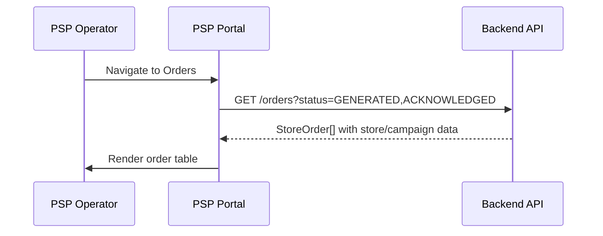
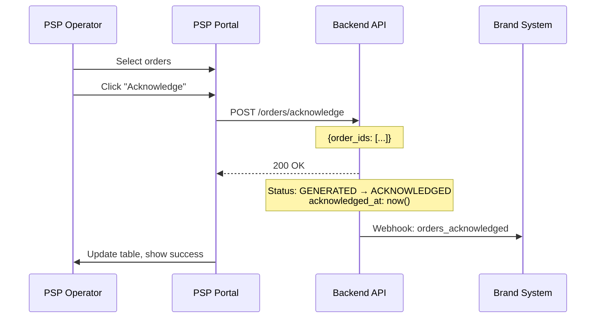
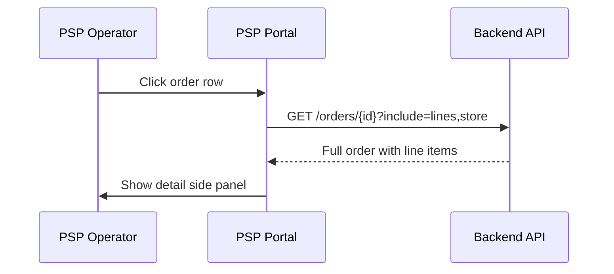
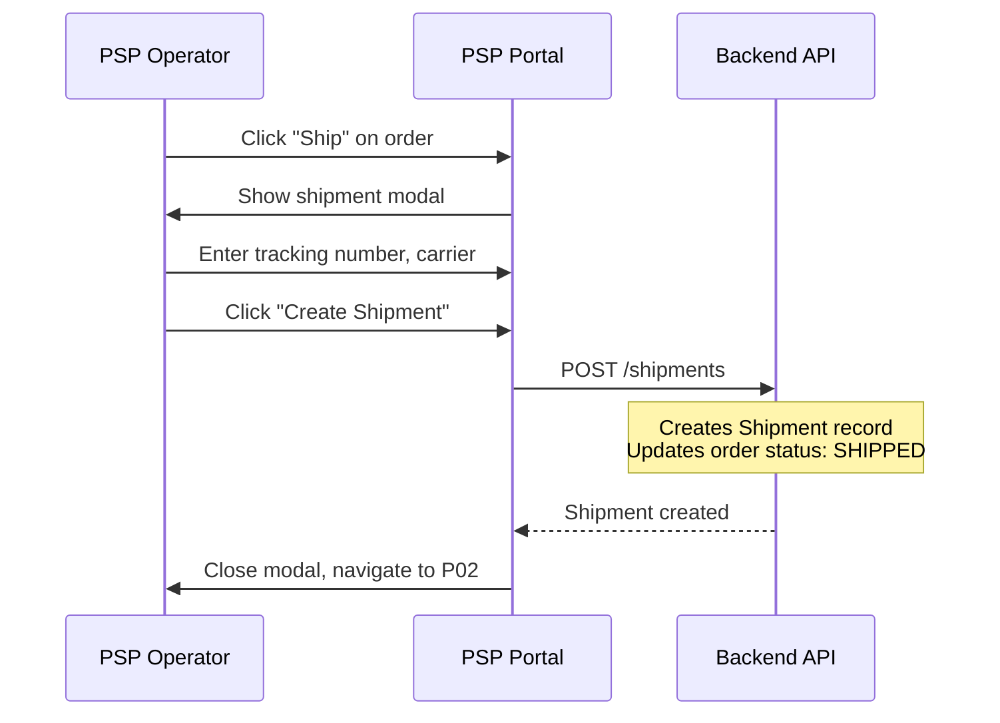

# P01 — Order Queue

> **App**: PSP Operations Portal
> **Route**: `/psp/orders`
> **SUPP Reference**: SUPP-016 (PSP Fulfillment)

---

## Wireframe Reference

**Interactive**: [psp_ops.html](../05_Wireframes/psp_ops.html) → Orders View

---

## Screen Glossary

| Term | Definition |
|------|------------|
| **StoreOrder** | A fulfillment request for a specific store within a campaign |
| **OrderLine** | Individual item line within a store order |
| **StoreOrderStatus** | GENERATED, ACKNOWLEDGED, SHIPPED, DELIVERED |
| **PSP** | Print Service Provider responsible for fulfillment |
| **Batch** | Grouping of orders for production efficiency |
| **Acknowledge** | PSP confirmation of order receipt and intent to fulfill |

---

## Data Model Map

### Entities Displayed

| Entity | Fields | Access |
|--------|--------|--------|
| `StoreOrder` | id, order_number, status, created_at, acknowledged_at | Read/Write |
| `OrderLine` | id, kit_item_id, qty_ordered, qty_shipped | Read |
| `Store` | store_number, name, address, city, state, zip | Read |
| `Campaign` | name, brand_id | Read |
| `Brand` | name | Read |
| `KitItem` | name, item_type | Read |

### Queue Query

```sql
SELECT
  so.*,
  s.store_number, s.name, s.address, s.city, s.state, s.zip,
  c.name as campaign_name,
  b.name as brand_name,
  COUNT(ol.id) as line_count,
  SUM(ol.qty_ordered) as total_qty
FROM store_orders so
JOIN store_assignments sa ON so.store_assignment_id = sa.id
JOIN stores s ON sa.store_id = s.id
JOIN campaigns c ON sa.campaign_id = c.id
JOIN brands b ON c.brand_id = b.id
JOIN order_lines ol ON ol.store_order_id = so.id
WHERE so.status IN ('GENERATED', 'ACKNOWLEDGED')
GROUP BY so.id
ORDER BY so.created_at ASC
```

---

## UI Components

| Component | Type | Description |
|-----------|------|-------------|
| **Header** | Page header | "Order Queue", counts by status |
| **Status Tabs** | Tab bar | New, Acknowledged, All |
| **Search Bar** | Text input | Search by order #, store, campaign |
| **Order Table** | Data table | Sortable, selectable rows |
| **Status Badge** | Chip | Color-coded order status |
| **Bulk Actions** | Toolbar | Acknowledge, batch operations |
| **Order Detail** | Side panel | Full order information |

### Order Queue Layout

```
┌─────────────────────────────────────────────────────────────┐
│ Order Queue                                                 │
│ New: 47 | Acknowledged: 89 | Shipped Today: 23             │
├─────────────────────────────────────────────────────────────┤
│ [🔍 Search orders...]                                       │
│                                                             │
│ [New (47)] [Acknowledged (89)] [All]                       │
│                                                             │
│ ┌─────────────────────────────────────────────────────────┐ │
│ │ [ ] Order #      Store        Campaign      Items  Stat│ │
│ ├─────────────────────────────────────────────────────────┤ │
│ │ [✓] ORD-10234   STR-001      Summer Promo    4    🟡   │ │
│ │ [✓] ORD-10235   STR-002      Summer Promo    4    🟡   │ │
│ │ [ ] ORD-10236   STR-015      Holiday         6    🟡   │ │
│ │ [ ] ORD-10237   STR-023      Summer Promo    4    🟢   │ │
│ │ [ ] ORD-10238   STR-045      Holiday         6    🟢   │ │
│ └─────────────────────────────────────────────────────────┘ │
│                                                             │
│ With 2 selected: [Acknowledge] [Create Batch] [Export]     │
│                                                             │
│ Showing 1-25 of 136               [← Prev] Page 1 [Next →] │
└─────────────────────────────────────────────────────────────┘
```

---

## Process Flows

### Load Order Queue



### Acknowledge Orders



### View Order Detail



### Create Shipment



---

## Order Detail Panel

```
┌─────────────────────────────────────┐
│ Order ORD-10234                 [X] │
├─────────────────────────────────────┤
│ Status: 🟡 GENERATED                │
│ Created: Dec 15, 2025 at 9:00 AM    │
│                                     │
│ Campaign: Summer Promo              │
│ Brand: Acme Corp                    │
│                                     │
│ Ship To                             │
│ ────────                            │
│ STR-001 - Acme Downtown             │
│ 123 Main Street                     │
│ New York, NY 10001                  │
│                                     │
│ Line Items (4)                      │
│ ──────────────                      │
│ ┌─────────────────────────────────┐ │
│ │ Item              Qty   Status  │ │
│ │ Window Poster      2    Pending │ │
│ │ End Cap Header     1    Pending │ │
│ │ Counter Display    1    Pending │ │
│ └─────────────────────────────────┘ │
│                                     │
│ [Acknowledge]  [Ship Order]         │
└─────────────────────────────────────┘
```

---

## Status Badges

| Status | Color | Description |
|--------|-------|-------------|
| GENERATED | Yellow 🟡 | New order, not yet acknowledged |
| ACKNOWLEDGED | Green 🟢 | PSP confirmed receipt |
| SHIPPED | Blue 🔵 | In transit |
| DELIVERED | Gray ✓ | Confirmed delivery |

---

## Status Tabs

| Tab | Filter | Sort |
|-----|--------|------|
| New | status = GENERATED | created_at ASC (oldest first) |
| Acknowledged | status = ACKNOWLEDGED | acknowledged_at ASC |
| All | All active statuses | created_at DESC |

---

## Table Columns

| Column | Field | Sortable | Notes |
|--------|-------|----------|-------|
| Checkbox | - | No | Bulk selection |
| Order # | order_number | Yes | Links to detail |
| Store | store_number + name | Yes | - |
| Campaign | campaign.name | Yes | - |
| Brand | brand.name | Yes | - |
| Items | count(order_lines) | Yes | Total line count |
| Qty | sum(qty_ordered) | Yes | Total units |
| Status | status | Yes | Badge |
| Created | created_at | Yes | Date/time |

---

## Bulk Actions

| Action | Available When | Effect |
|--------|----------------|--------|
| Acknowledge | Status = GENERATED | Mark as acknowledged |
| Create Batch | Any selected | Group for production |
| Export | Any selected | Download CSV/PDF |
| Print Pick List | Any selected | Generate picking document |

---

## Search Behavior

| Query | Matches |
|-------|---------|
| Order number | Exact or partial |
| Store number | Partial match |
| Campaign name | Partial match |
| Brand name | Partial match |

---

## Acceptance Criteria

1. ✅ Queue shows all pending orders
2. ✅ Status tabs filter by order status
3. ✅ Search filters by order, store, campaign
4. ✅ Click row opens detail panel
5. ✅ Acknowledge updates status to ACKNOWLEDGED
6. ✅ Bulk acknowledge processes multiple orders
7. ✅ Ship Order navigates to shipment creation
8. ✅ Export generates CSV of selected orders
9. ✅ New orders sorted oldest first (FIFO)

---

## Related Screens

| Screen | Relationship |
|--------|--------------|
| [P02 Shipments](P02_Shipments.md) | Track shipped orders |
| [P03 Issues](P03_Issues.md) | Handle order problems |
| [B05 Campaign Review](B05_Campaign_Review.md) | Orders generated on publish |

---

*End of P01 Order Queue Screen Spec*
