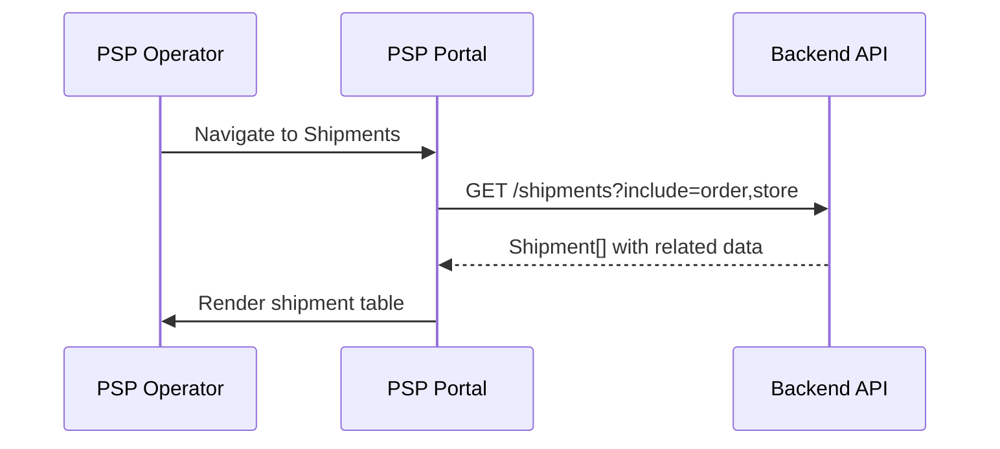
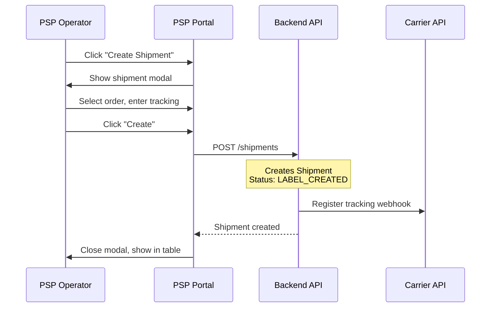
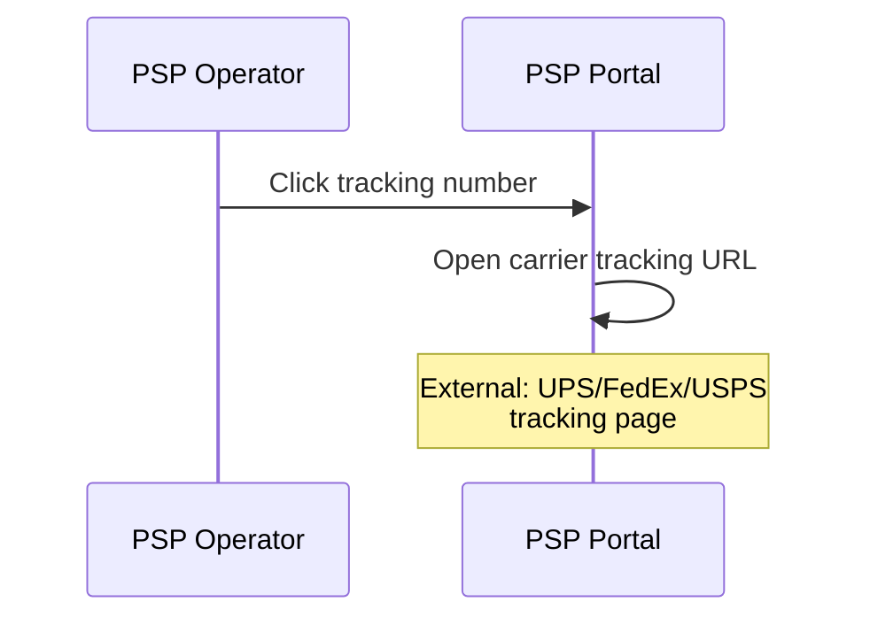
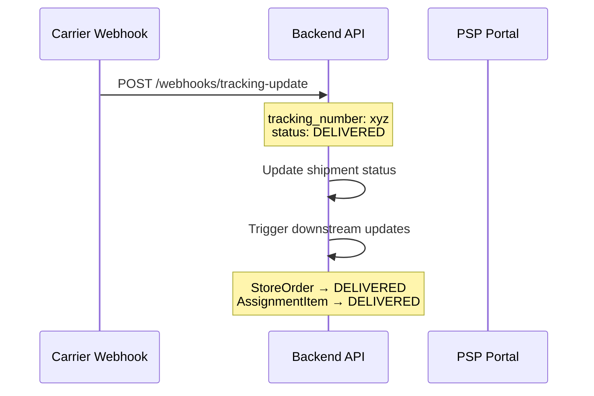

# P02 — Shipments

> **App**: PSP Operations Portal
> **Route**: `/psp/shipments`
> **SUPP Reference**: SUPP-016 (PSP Fulfillment)

---

## Wireframe Reference

**Interactive**: [psp_ops.html](../05_Wireframes/psp_ops.html) → Shipments View

---

## Screen Glossary

| Term | Definition |
|------|------------|
| **Shipment** | A physical package containing fulfilled order items |
| **ShipmentStatus** | LABEL_CREATED, IN_TRANSIT, DELIVERED, EXCEPTION |
| **Tracking Number** | Carrier-provided identifier for package tracking |
| **Carrier** | Shipping provider (UPS, FedEx, USPS) |
| **Partial Shipment** | When order splits across multiple packages |
| **Delivery Exception** | Problem with delivery (failed attempt, damage) |

---

## Data Model Map

### Entities Displayed

| Entity | Fields | Access |
|--------|--------|--------|
| `Shipment` | id, tracking_number, carrier, shipment_status, shipped_at, delivered_at | Read/Write |
| `ShipmentLine` | order_line_id, qty_shipped | Read |
| `StoreOrder` | order_number, status | Read |
| `Store` | store_number, name, address | Read |
| `Campaign` | name | Read |

### Shipment Query

```sql
SELECT
  sh.*,
  so.order_number,
  s.store_number, s.name as store_name,
  c.name as campaign_name,
  COUNT(sl.id) as line_count
FROM shipments sh
JOIN store_orders so ON sh.store_order_id = so.id
JOIN store_assignments sa ON so.store_assignment_id = sa.id
JOIN stores s ON sa.store_id = s.id
JOIN campaigns c ON sa.campaign_id = c.id
JOIN shipment_lines sl ON sl.shipment_id = sh.id
GROUP BY sh.id
ORDER BY sh.shipped_at DESC
```

---

## UI Components

| Component | Type | Description |
|-----------|------|-------------|
| **Header** | Page header | "Shipments", status counts |
| **Status Tabs** | Tab bar | All, In Transit, Delivered, Exceptions |
| **Search Bar** | Text input | Search by tracking #, order #, store |
| **Shipment Table** | Data table | Sortable rows |
| **Status Badge** | Chip | Color-coded shipment status |
| **Tracking Link** | External link | Opens carrier tracking page |
| **Shipment Detail** | Side panel | Full shipment information |
| **Create Shipment** | Button | Opens shipment creation modal |

### Shipments Layout

```
┌─────────────────────────────────────────────────────────────┐
│ Shipments                              [+ Create Shipment]  │
│ In Transit: 156 | Delivered: 892 | Exceptions: 3           │
├─────────────────────────────────────────────────────────────┤
│ [🔍 Search tracking #, order, store...]                    │
│                                                             │
│ [All] [In Transit (156)] [Delivered] [Exceptions (3)]      │
│                                                             │
│ ┌─────────────────────────────────────────────────────────┐ │
│ │ Tracking #       Order      Store       Status   Date   │ │
│ ├─────────────────────────────────────────────────────────┤ │
│ │ 1Z999AA10...    ORD-10234   STR-001    🔵 Transit Dec 15│ │
│ │ 1Z999AA10...    ORD-10235   STR-002    🔵 Transit Dec 15│ │
│ │ 782345678...    ORD-10220   STR-089    ✅ Delivered Dec 14│ │
│ │ 1Z999AA10...    ORD-10218   STR-045    ⚠️ Exception Dec 13│ │
│ │ 782345678...    ORD-10215   STR-023    ✅ Delivered Dec 13│ │
│ └─────────────────────────────────────────────────────────┘ │
│                                                             │
│ Showing 1-25 of 1,051             [← Prev] Page 1 [Next →] │
└─────────────────────────────────────────────────────────────┘
```

---

## Process Flows

### Load Shipments



### Create Shipment



### Track Shipment



### Update Status (Webhook)



---

## Create Shipment Modal

```
┌─────────────────────────────────────┐
│ Create Shipment                 [X] │
├─────────────────────────────────────┤
│                                     │
│ Order *                             │
│ [Search order number...        ▼]   │
│                                     │
│ Carrier *                           │
│ ○ UPS  ○ FedEx  ○ USPS  ○ Other    │
│                                     │
│ Tracking Number *                   │
│ ┌─────────────────────────────────┐ │
│ │ 1Z999AA10123456784              │ │
│ └─────────────────────────────────┘ │
│                                     │
│ Items to Ship                       │
│ ┌─────────────────────────────────┐ │
│ │ [✓] Window Poster    2 of 2    │ │
│ │ [✓] End Cap Header   1 of 1    │ │
│ │ [✓] Counter Display  1 of 1    │ │
│ └─────────────────────────────────┘ │
│                                     │
│ Ship Date: [📅 Dec 15, 2025]        │
│                                     │
│ [Cancel]         [Create Shipment]  │
└─────────────────────────────────────┘
```

---

## Shipment Detail Panel

```
┌─────────────────────────────────────┐
│ Shipment Details                [X] │
├─────────────────────────────────────┤
│ Tracking: 1Z999AA10123456784        │
│ Carrier: UPS                  [🔗]  │
│                                     │
│ Status: 🔵 IN_TRANSIT               │
│ Shipped: Dec 15, 2025 at 2:30 PM    │
│ Est. Delivery: Dec 18, 2025         │
│                                     │
│ Order: ORD-10234                    │
│ Campaign: Summer Promo              │
│                                     │
│ Ship To                             │
│ ────────                            │
│ STR-001 - Acme Downtown             │
│ 123 Main Street                     │
│ New York, NY 10001                  │
│                                     │
│ Items Shipped                       │
│ ──────────────                      │
│ Window Poster (24x36)          x2   │
│ End Cap Header                 x1   │
│ Counter Display                x1   │
│                                     │
│ Tracking History                    │
│ ────────────────                    │
│ Dec 15 2:30 PM - Label created      │
│ Dec 15 5:45 PM - Picked up          │
│ Dec 16 8:00 AM - In transit         │
└─────────────────────────────────────┘
```

---

## Status Badges

| Status | Color | Icon | Description |
|--------|-------|------|-------------|
| LABEL_CREATED | Gray | 📋 | Label generated, not yet picked up |
| IN_TRANSIT | Blue | 🔵 | With carrier, en route |
| OUT_FOR_DELIVERY | Green | 🚚 | Final delivery attempt |
| DELIVERED | Green | ✅ | Successfully delivered |
| EXCEPTION | Red | ⚠️ | Delivery problem |

---

## Exception Types

| Exception | Description | Action |
|-----------|-------------|--------|
| FAILED_ATTEMPT | Delivery attempted, no one available | Retry scheduled |
| WRONG_ADDRESS | Address invalid or changed | Contact store |
| DAMAGED | Package damaged in transit | File claim |
| LOST | Package cannot be located | Reship order |
| REFUSED | Recipient refused delivery | Investigate |

---

## Status Tabs

| Tab | Filter | Count |
|-----|--------|-------|
| All | No filter | Total shipments |
| In Transit | LABEL_CREATED, IN_TRANSIT | Active shipments |
| Delivered | DELIVERED | Completed |
| Exceptions | EXCEPTION | Needs attention |

---

## Table Columns

| Column | Field | Sortable | Notes |
|--------|-------|----------|-------|
| Tracking # | tracking_number | Yes | Links to carrier |
| Order | order_number | Yes | Links to order detail |
| Store | store_number + name | Yes | - |
| Campaign | campaign.name | Yes | - |
| Status | shipment_status | Yes | Badge |
| Shipped | shipped_at | Yes | Date |
| Delivered | delivered_at | Yes | Date or "-" |

---

## Carrier Integration

| Carrier | Tracking URL Pattern |
|---------|---------------------|
| UPS | `https://www.ups.com/track?tracknum={tracking}` |
| FedEx | `https://www.fedex.com/apps/fedextrack/?tracknumber={tracking}` |
| USPS | `https://tools.usps.com/go/TrackConfirmAction?tLabels={tracking}` |

---

## Acceptance Criteria

1. ✅ Shipments list shows all shipments with status
2. ✅ Status tabs filter by shipment state
3. ✅ Search filters by tracking, order, store
4. ✅ Tracking number links to carrier site
5. ✅ Create shipment modal captures all required fields
6. ✅ Partial shipment allows selecting subset of items
7. ✅ Detail panel shows tracking history
8. ✅ Exceptions highlighted for attention
9. ✅ Webhook updates status automatically

---

## Related Screens

| Screen | Relationship |
|--------|--------------|
| [P01 Order Queue](P01_Order_Queue.md) | Orders become shipments |
| [P03 Issues](P03_Issues.md) | Handle delivery exceptions |
| [M03 Receipt Survey](M03_Receipt_Survey.md) | Store confirms delivery |

---

*End of P02 Shipments Screen Spec*
