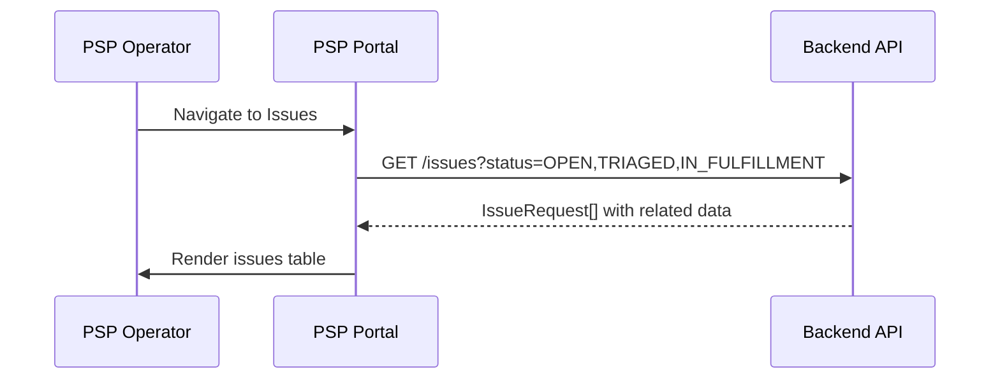
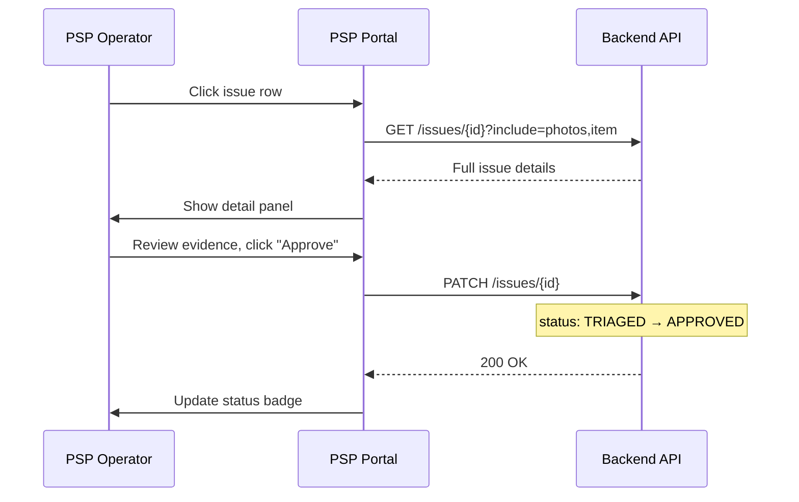
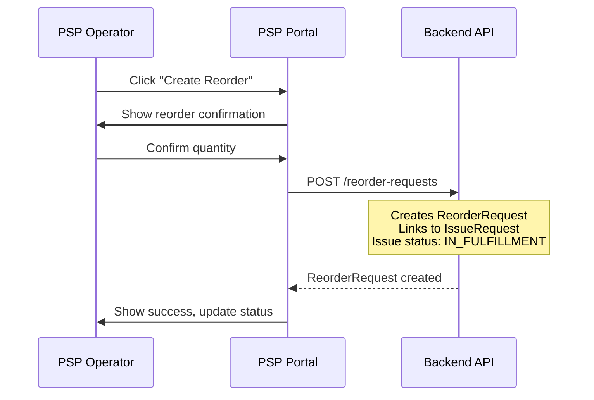
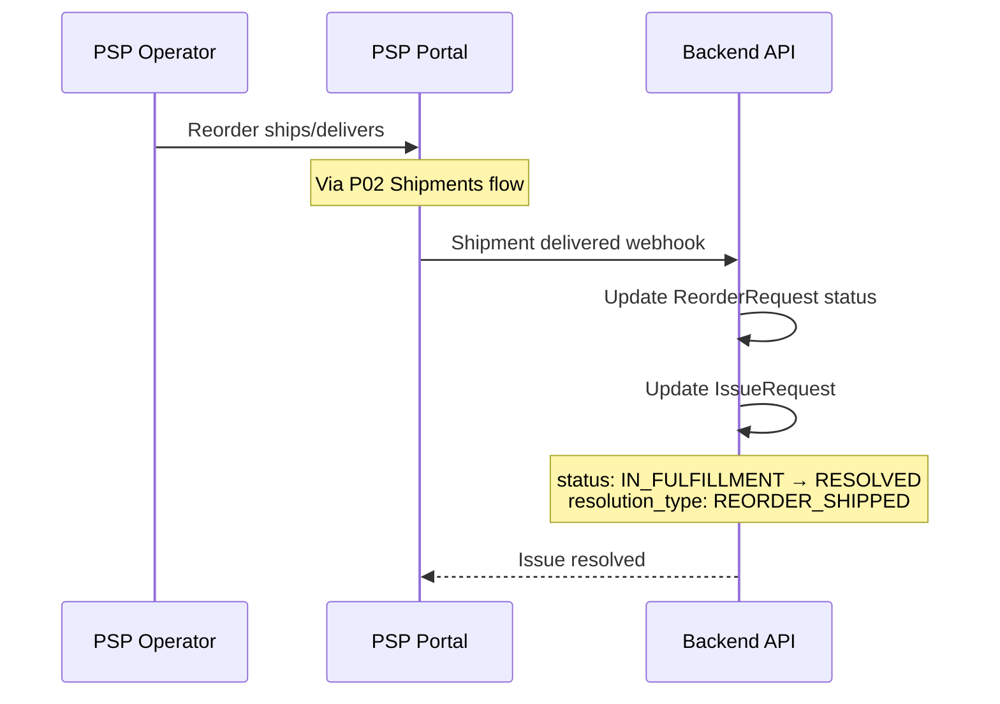
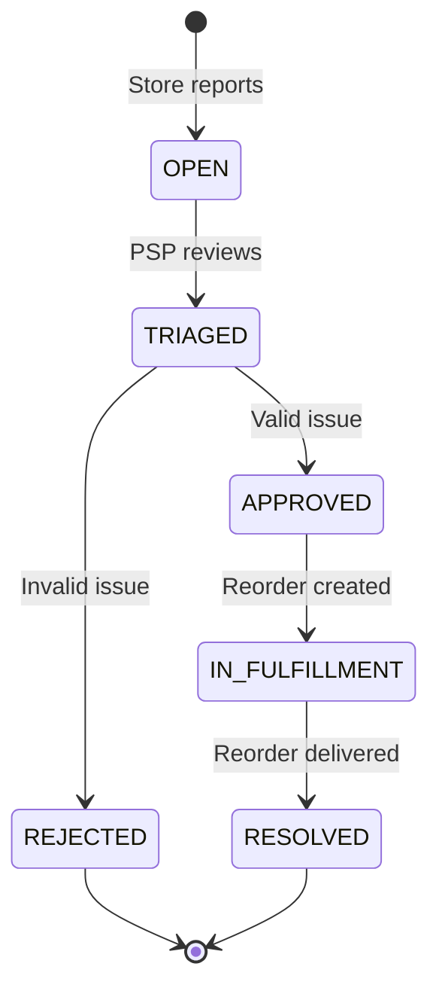

# P03 — Issues Queue

> **App**: PSP Operations Portal
> **Route**: `/psp/issues`
> **SUPP Reference**: SUPP-019 (Exception Management)

---

## Wireframe Reference

**Interactive**: [psp_ops.html](../05_Wireframes/psp_ops.html) → Issues View

---

## Screen Glossary

| Term | Definition |
|------|------------|
| **IssueRequest** | A reported problem requiring PSP action (missing, damaged items) |
| **IssueRequestStatus** | OPEN, TRIAGED, APPROVED, IN_FULFILLMENT, RESOLVED, REJECTED |
| **Issue Type** | MISSING, DAMAGED, WRONG_ITEM, QUANTITY_SHORT |
| **Triage** | Initial assessment and categorization of issue |
| **Reorder** | Replacement order generated from approved issue |
| **Resolution** | Final outcome of issue handling |

---

## Data Model Map

### Entities Displayed

| Entity | Fields | Access |
|--------|--------|--------|
| `IssueRequest` | id, issue_type, status, description, created_at, resolved_at | Read/Write |
| `AssignmentItem` | id, kit_item_id, qty_ordered | Read |
| `KitItem` | name, item_type | Read |
| `StoreAssignment` | id, store_id, campaign_id | Read |
| `Store` | store_number, name | Read |
| `Campaign` | name | Read |
| `PhotoUpload` | file_url (evidence photos) | Read |
| `ReorderRequest` | id, status (linked reorder) | Read/Write |

### Issue Queue Query

```sql
SELECT
  ir.*,
  ki.name as item_name,
  s.store_number, s.name as store_name,
  c.name as campaign_name
FROM issue_requests ir
JOIN assignment_items ai ON ir.assignment_item_id = ai.id
JOIN kit_items ki ON ai.kit_item_id = ki.id
JOIN store_assignments sa ON ai.store_assignment_id = sa.id
JOIN stores s ON sa.store_id = s.id
JOIN campaigns c ON sa.campaign_id = c.id
WHERE ir.status IN ('OPEN', 'TRIAGED', 'APPROVED', 'IN_FULFILLMENT')
ORDER BY ir.created_at ASC
```

---

## UI Components

| Component | Type | Description |
|-----------|------|-------------|
| **Header** | Page header | "Issues Queue", status counts |
| **Status Tabs** | Tab bar | Open, Triaged, In Fulfillment, Resolved |
| **Issue Table** | Data table | Sortable issue list |
| **Status Badge** | Chip | Color-coded issue status |
| **Type Badge** | Chip | Issue type indicator |
| **Issue Detail** | Side panel | Full issue information |
| **Triage Actions** | Buttons | Approve, Reject, Request Info |
| **Evidence Photos** | Gallery | Store-submitted photos |

### Issues Queue Layout

```
┌─────────────────────────────────────────────────────────────┐
│ Issues Queue                                                │
│ Open: 8 | Triaged: 3 | In Fulfillment: 5 | Resolved: 127   │
├─────────────────────────────────────────────────────────────┤
│ [🔍 Search issues...]                                       │
│                                                             │
│ [Open (8)] [Triaged (3)] [In Fulfillment (5)] [Resolved]   │
│                                                             │
│ ┌─────────────────────────────────────────────────────────┐ │
│ │ Issue #    Type      Store      Item         Status Age │ │
│ ├─────────────────────────────────────────────────────────┤ │
│ │ ISS-1042   DAMAGED   STR-001   Window Poster  🟡 Open 2h│ │
│ │ ISS-1041   MISSING   STR-015   End Cap        🟡 Open 4h│ │
│ │ ISS-1040   DAMAGED   STR-023   Counter Disp   🟢 Triag 1d│ │
│ │ ISS-1038   MISSING   STR-089   Window Poster  🔵 Fulfill│ │
│ │ ISS-1035   QTY_SHORT STR-045   Shelf Talker   🔵 Fulfill│ │
│ └─────────────────────────────────────────────────────────┘ │
│                                                             │
│ Showing 1-25 of 143               [← Prev] Page 1 [Next →] │
└─────────────────────────────────────────────────────────────┘
```

---

## Process Flows

### Load Issues Queue



### Triage Issue



### Create Reorder



### Resolve Issue



---

## Issue Detail Panel

```
┌─────────────────────────────────────┐
│ Issue ISS-1042                  [X] │
├─────────────────────────────────────┤
│ Type: 🔴 DAMAGED                    │
│ Status: 🟡 OPEN                     │
│ Reported: Dec 15, 2025 at 10:30 AM  │
│ Age: 2 hours                        │
│                                     │
│ Store: STR-001 - Acme Downtown      │
│ Campaign: Summer Promo              │
│                                     │
│ Item Details                        │
│ ────────────                        │
│ Window Poster (24x36)               │
│ Qty Ordered: 2                      │
│ Qty Affected: 1                     │
│                                     │
│ Description                         │
│ ───────────                         │
│ "Poster arrived with large tear     │
│ across the middle. Cannot be        │
│ used for display."                  │
│                                     │
│ Evidence Photos (2)                 │
│ ───────────────────                 │
│ [📷 Photo 1]  [📷 Photo 2]          │
│                                     │
│ ─────────────────────────────────   │
│ Triage Notes                        │
│ ┌─────────────────────────────────┐ │
│ │ Damage confirmed. Reorder       │ │
│ │ approved.                       │ │
│ └─────────────────────────────────┘ │
│                                     │
│ [Reject] [Request Info] [Approve]   │
│                                     │
│ After Approval:                     │
│ [Create Reorder (1 unit)]           │
└─────────────────────────────────────┘
```

---

## Status Flow



---

## Status Badges

| Status | Color | Description |
|--------|-------|-------------|
| OPEN | Yellow 🟡 | New, awaiting triage |
| TRIAGED | Green 🟢 | Reviewed, pending decision |
| APPROVED | Green ✓ | Confirmed, ready for reorder |
| IN_FULFILLMENT | Blue 🔵 | Reorder in progress |
| RESOLVED | Gray ✓ | Completed |
| REJECTED | Red ✗ | Denied (invalid claim) |

---

## Issue Types

| Type | Icon | Auto-Approve | Description |
|------|------|--------------|-------------|
| MISSING | ❌ | Yes (if tracking shows delivered) | Item not in package |
| DAMAGED | 🔨 | No (requires photo review) | Item unusable |
| WRONG_ITEM | ❓ | No (requires photo review) | Different item received |
| QUANTITY_SHORT | 📉 | Yes (if < ordered qty) | Fewer than expected |

---

## Triage Actions

| Action | Effect | Next Status |
|--------|--------|-------------|
| Approve | Confirms issue validity | APPROVED |
| Reject | Denies claim | REJECTED |
| Request Info | Ask store for more details | OPEN (with flag) |
| Create Reorder | Generate replacement order | IN_FULFILLMENT |

---

## Reject Modal

```
┌─────────────────────────────────────┐
│ Reject Issue                    [X] │
├─────────────────────────────────────┤
│                                     │
│ Rejection Reason *                  │
│ ○ Insufficient evidence             │
│ ○ Item appears usable               │
│ ○ Outside return window             │
│ ○ Duplicate request                 │
│ ● Other                             │
│                                     │
│ Explanation for Store *             │
│ ┌─────────────────────────────────┐ │
│ │ Based on the photo provided,   │ │
│ │ the damage does not affect     │ │
│ │ display quality.               │ │
│ └─────────────────────────────────┘ │
│                                     │
│ [Cancel]              [Reject]      │
└─────────────────────────────────────┘
```

---

## Table Columns

| Column | Field | Sortable | Notes |
|--------|-------|----------|-------|
| Issue # | id | Yes | Links to detail |
| Type | issue_type | Yes | Badge |
| Store | store_number | Yes | - |
| Item | kit_item.name | Yes | - |
| Campaign | campaign.name | Yes | - |
| Status | status | Yes | Badge |
| Age | created_at | Yes | Time since created |

---

## Acceptance Criteria

1. ✅ Issues queue shows all active issues
2. ✅ Status tabs filter by issue state
3. ✅ Click row opens detail panel
4. ✅ Evidence photos viewable in panel
5. ✅ Approve/Reject updates status appropriately
6. ✅ Create Reorder generates ReorderRequest
7. ✅ Rejection requires reason and explanation
8. ✅ Resolved issues move to history
9. ✅ Age column shows time since reported
10. ✅ FIFO ordering (oldest first)

---

## Related Screens

| Screen | Relationship |
|--------|--------------|
| [P01 Order Queue](P01_Order_Queue.md) | Reorders appear in queue |
| [P02 Shipments](P02_Shipments.md) | Reorder shipments tracked |
| [M03 Receipt Survey](M03_Receipt_Survey.md) | Store reports issues |

---

*End of P03 Issues Screen Spec*
