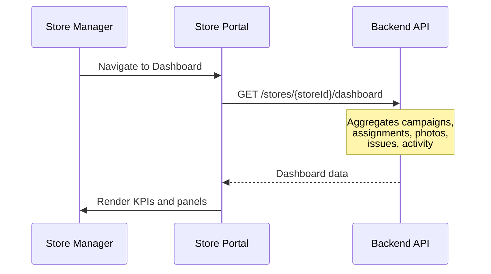
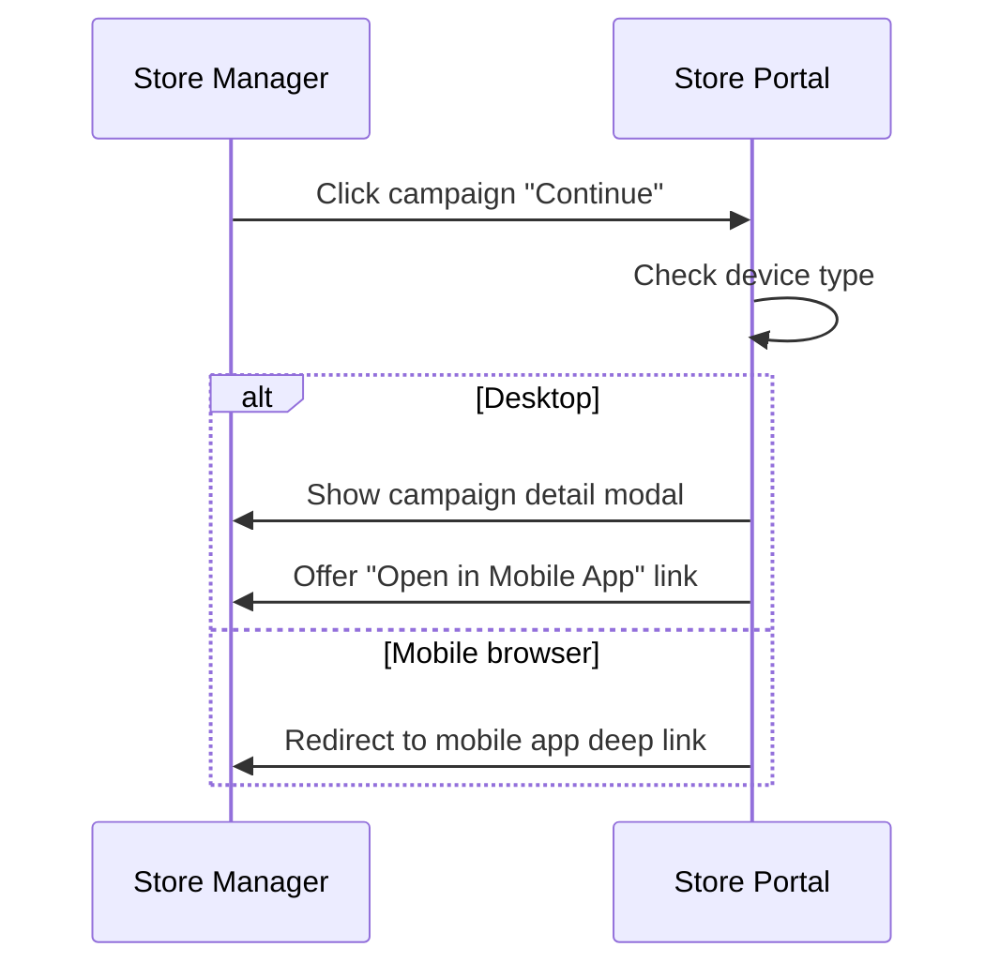

# S01 — Store Manager Dashboard

> **App**: Store Manager Portal (Web)
> **Route**: `/store/dashboard`
> **SUPP Reference**: SUPP-017 (Store Execution), SUPP-001 (Personas)

---

## Wireframe Reference

**Interactive**: [store_portal.html](../05_Wireframes/store_portal.html) → Dashboard View

---

## Screen Glossary

| Term | Definition |
|------|------------|
| **Store Manager** | User with elevated permissions to view reports and manage store team |
| **Store User** | Retail employee who executes campaigns (subset of manager view) |
| **Compliance Rate** | Percentage of campaigns completed on time |
| **Active Campaigns** | Campaigns currently in execution phase |
| **Pending Actions** | Items requiring store attention (retakes, receipts, installs) |
| **Store Performance** | Aggregated metrics across all campaigns |

---

## Data Model Map

### Entities Displayed

| Entity | Fields | Access |
|--------|--------|--------|
| `Store` | store_number, name, region, district | Read |
| `StoreAssignment` | status, store_phase, due_date (aggregated) | Read |
| `Campaign` | name, campaign_status, install_start_date, install_end_date | Read |
| `PhotoUpload` | review_status (counts) | Read |
| `IssueRequest` | status (counts) | Read |
| `User` | name (team members) | Read |

### Dashboard Aggregations

```sql
-- Active campaigns for this store
SELECT c.*, sa.status, sa.store_phase
FROM campaigns c
JOIN store_assignments sa ON sa.campaign_id = c.id
WHERE sa.store_id = ? AND c.campaign_status = 'PUBLISHED'

-- Performance metrics
SELECT
  COUNT(CASE WHEN sa.status = 'COMPLETE' THEN 1 END) as completed,
  COUNT(CASE WHEN sa.status = 'COMPLETE' AND sa.completed_at <= c.install_end_date THEN 1 END) as on_time,
  COUNT(*) as total
FROM store_assignments sa
JOIN campaigns c ON sa.campaign_id = c.id
WHERE sa.store_id = ? AND c.campaign_status IN ('PUBLISHED', 'COMPLETED')
```

---

## UI Components

| Component | Type | Description |
|-----------|------|-------------|
| **Header** | App bar | Store name, user menu, notifications |
| **KPI Cards** | Stat cards | Active campaigns, pending actions, compliance rate |
| **Active Campaigns** | Card list | Current campaigns with status |
| **Pending Actions** | Alert list | Items needing attention |
| **Recent Activity** | Timeline | Latest submissions and updates |
| **Quick Actions** | Button group | Launch mobile app, view reports |
| **Team Status** | Mini-table | Team members and their activity |

### Dashboard Layout

```
┌─────────────────────────────────────────────────────────────┐
│ [Logo]  STR-001 - Acme Downtown          [🔔 2]  [Jane ▼]  │
├─────────────────────────────────────────────────────────────┤
│                                                             │
│  ┌──────────┐  ┌──────────┐  ┌──────────┐  ┌──────────┐   │
│  │ Active   │  │ Pending  │  │ Completed│  │ Compliance│   │
│  │ Campaigns│  │ Actions  │  │ This Mo. │  │ Rate      │   │
│  │    3     │  │    5     │  │    12    │  │   94%     │   │
│  └──────────┘  └──────────┘  └──────────┘  └──────────┘   │
│                                                             │
│  Active Campaigns                                           │
│  ┌─────────────────────────────────────────────────────┐   │
│  │ Summer Promo          ████████░░ 80%     Due: 5 days │   │
│  │ → 1 photo needs retake                   [Continue] │   │
│  ├─────────────────────────────────────────────────────┤   │
│  │ Holiday Display        ██░░░░░░░░ 20%    Due: 12 days│   │
│  │ → Ready to receive shipment              [Start]    │   │
│  ├─────────────────────────────────────────────────────┤   │
│  │ Back to School         ░░░░░░░░░░ 0%     Due: 21 days│   │
│  │ → Awaiting shipment                      [View]     │   │
│  └─────────────────────────────────────────────────────┘   │
│                                                             │
│  ┌─────────────────────────┐  ┌─────────────────────────┐  │
│  │ Pending Actions (5)     │  │ Recent Activity         │  │
│  │                         │  │                         │  │
│  │ ⚠️ 1 photo retake needed│  │ Today 2:30 PM          │  │
│  │ 📦 1 shipment to verify │  │ Photo approved ✓       │  │
│  │ 📷 3 photos to capture  │  │                         │  │
│  │                         │  │ Yesterday              │  │
│  │ [View All Tasks]        │  │ 4 photos submitted     │  │
│  └─────────────────────────┘  │ Shipment received ✓    │  │
│                               └─────────────────────────┘  │
│                                                             │
│  [📱 Open Mobile App]  [📊 View Reports]  [📸 Photo Gallery]│
└─────────────────────────────────────────────────────────────┘
```

---

## Process Flows

### Load Dashboard



### Navigate to Campaign



---

## KPI Definitions

| KPI | Calculation | Display |
|-----|-------------|---------|
| Active Campaigns | COUNT(campaigns WHERE store_phase NOT IN (COMPLETE, WAIVED)) | Number |
| Pending Actions | COUNT(retakes + unverified receipts + pending installs) | Number with breakdown |
| Completed This Month | COUNT(completed in current month) | Number |
| Compliance Rate | on_time_completions / total_completions × 100 | Percentage |

---

## Pending Actions

| Action Type | Source | Priority |
|-------------|--------|----------|
| Photo Retake | PhotoUpload.review_status = REJECTED | High |
| Verify Receipt | StoreAssignment.store_phase = READY_TO_RECEIVE | High |
| Install Items | AssignmentItem.item_status = RECEIVED | Medium |
| Acknowledge Issue | IssueRequest.status = RESOLVED | Low |

---

## Recent Activity Types

| Event | Display |
|-------|---------|
| Photo Approved | "Photo approved ✓" |
| Photo Rejected | "Photo rejected - retake needed" |
| Shipment Delivered | "Shipment delivered" |
| Campaign Completed | "Summer Promo completed ✓" |
| Issue Resolved | "Replacement shipped" |

---

## Role-Based Display

| Element | Store User | Store Manager |
|---------|------------|---------------|
| KPI Cards | ✓ | ✓ |
| Active Campaigns | ✓ | ✓ |
| Pending Actions | ✓ | ✓ |
| Recent Activity | Own only | All team |
| Team Status | Hidden | ✓ |
| Reports Link | Hidden | ✓ |
| Team Management | Hidden | ✓ |

---

## Acceptance Criteria

1. ✅ Dashboard shows 4 KPI cards for store metrics
2. ✅ Active campaigns display with progress and due dates
3. ✅ Pending actions summarized with counts
4. ✅ Recent activity shows timeline of events
5. ✅ Click campaign navigates to detail or mobile app
6. ✅ Notification bell shows unread count
7. ✅ Store Manager sees team activity; Store User sees own only
8. ✅ Quick actions provide navigation shortcuts

---

## Related Screens

| Screen | Relationship |
|--------|--------------|
| [S02 Campaign History](S02_Campaign_History.md) | Full campaign list |
| [S03 Photo Gallery](S03_Photo_Gallery.md) | All submitted photos |
| [S04 Team Management](S04_Team_Management.md) | Manage store users |
| [S05 Reports](S05_Reports.md) | Performance analytics |
| [M02 Dashboard](M02_Dashboard.md) | Mobile equivalent |

---

*End of S01 Store Manager Dashboard Screen Spec*
