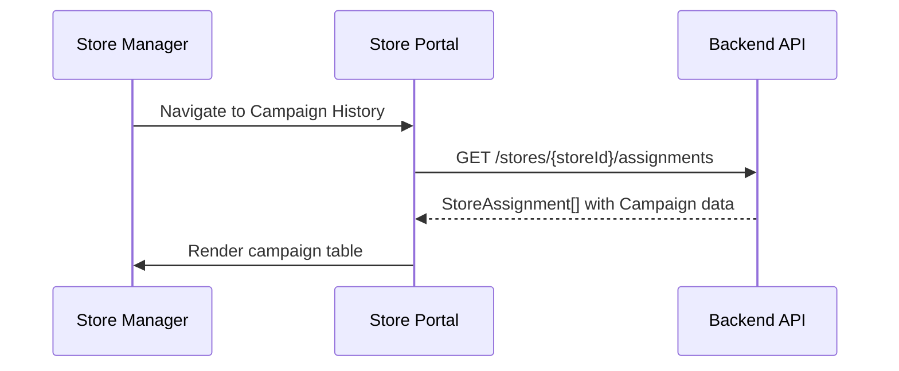
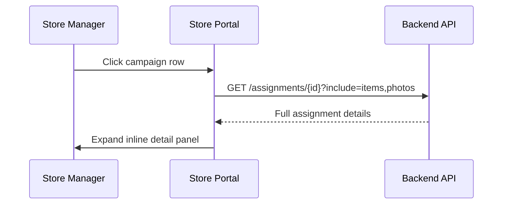
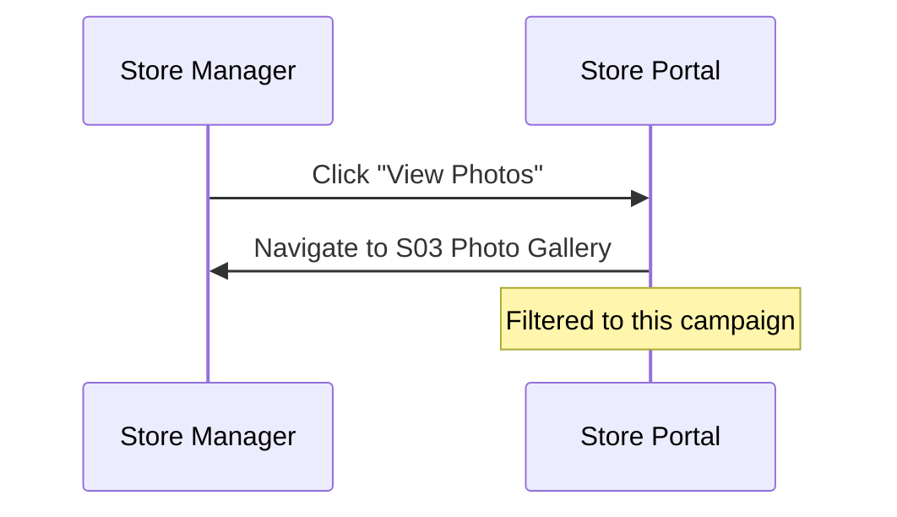

# S02 — Campaign History

> **App**: Store Manager Portal (Web)
> **Route**: `/store/campaigns`
> **SUPP Reference**: SUPP-017 (Store Execution), SUPP-015 (Campaigns)

---

## Wireframe Reference

**Interactive**: [store_portal.html](../05_Wireframes/store_portal.html) → Campaigns View

---

## Screen Glossary

| Term | Definition |
|------|------------|
| **Campaign History** | Complete list of all campaigns assigned to this store |
| **StoreAssignment** | Record linking a campaign to this specific store |
| **StorePhase** | Current execution stage (derived from multiple statuses) |
| **Completion Date** | When store finished all requirements |
| **On-Time** | Completed before campaign install_end_date |

---

## Data Model Map

### Entities Displayed

| Entity | Fields | Access |
|--------|--------|--------|
| `Campaign` | name, install_start_date, install_end_date, campaign_status | Read |
| `StoreAssignment` | status, store_phase, completed_at, created_at | Read |
| `AssignmentItem` | (counts by status) | Read |
| `PhotoUpload` | (counts by review_status) | Read |
| `Kit` | name, item_count | Read |

### List Query

```sql
SELECT
  c.*,
  sa.status, sa.store_phase, sa.completed_at,
  COUNT(ai.id) as total_items,
  COUNT(CASE WHEN ai.item_status = 'SATISFIED' THEN 1 END) as completed_items,
  COUNT(pu.id) as photo_count
FROM campaigns c
JOIN store_assignments sa ON sa.campaign_id = c.id
LEFT JOIN assignment_items ai ON ai.store_assignment_id = sa.id
LEFT JOIN photo_uploads pu ON pu.assignment_item_id = ai.id
WHERE sa.store_id = ?
GROUP BY c.id, sa.id
ORDER BY c.install_start_date DESC
```

---

## UI Components

| Component | Type | Description |
|-----------|------|-------------|
| **Header** | Page header | "Campaign History", filter controls |
| **Status Tabs** | Tab bar | Active, Completed, All |
| **Search Bar** | Text input | Search by campaign name |
| **Campaign Table** | Data table | Sortable campaign list |
| **Status Badge** | Chip | StorePhase indicator |
| **Progress Bar** | Linear progress | Item completion |
| **Campaign Detail** | Expandable | In-line detail view |
| **Export** | Button | Download history |

### Campaign History Layout

```
┌─────────────────────────────────────────────────────────────┐
│ Campaign History                              [Export CSV]  │
├─────────────────────────────────────────────────────────────┤
│ [🔍 Search campaigns...]                                    │
│                                                             │
│ [Active (3)] [Completed (47)] [All]                        │
│                                                             │
│ ┌─────────────────────────────────────────────────────────┐ │
│ │ Campaign         Status        Progress   Dates      ▼  │ │
│ ├─────────────────────────────────────────────────────────┤ │
│ │ ▶ Summer Promo   🟡 Installing  ████░░ 80%  Jun-Jul     │ │
│ │ ▶ Holiday 2024   🟢 Receiving   ██░░░░ 20%  Nov-Dec     │ │
│ │ ▶ Back to School ⏳ Awaiting    ░░░░░░  0%  Aug-Sep     │ │
│ │ ▼ Spring Sale    ✅ Complete    ██████ 100% Mar-Apr     │ │
│ │   ├─────────────────────────────────────────────────────┤ │
│ │   │ Completed: Apr 5, 2025 (On Time ✓)                 │ │
│ │   │ Items: 4 installed | Photos: 8 approved            │ │
│ │   │ [View Photos] [View Details]                       │ │
│ │   └─────────────────────────────────────────────────────┤ │
│ │ ▶ Winter Promo   ✅ Complete    ██████ 100% Dec-Jan     │ │
│ └─────────────────────────────────────────────────────────┘ │
│                                                             │
│ Showing 1-10 of 50              [← Prev] Page 1 [Next →]   │
└─────────────────────────────────────────────────────────────┘
```

---

## Process Flows

### Load Campaign History



### Expand Campaign Detail



### View Photos



---

## Status Badges

| StorePhase | Badge | Color |
|------------|-------|-------|
| AWAITING_SHIPMENT | ⏳ Awaiting | Gray |
| SHIPMENT_IN_TRANSIT | 🚚 In Transit | Blue |
| READY_TO_RECEIVE | 📦 Receiving | Green |
| RECEIVING | 📦 Receiving | Yellow |
| READY_TO_INSTALL | 🔧 Ready | Green |
| INSTALLING | 🟡 Installing | Yellow |
| PENDING_REVIEW | 👁 Pending | Blue |
| COMPLETE | ✅ Complete | Green |
| NEEDS_ATTENTION | ⚠️ Attention | Red |
| WAIVED | ⏭ Waived | Gray |

---

## Expanded Detail Panel

| Section | Content |
|---------|---------|
| Completion Info | Date, on-time status |
| Items Summary | X installed of Y total |
| Photos Summary | X approved, Y rejected |
| Issues | Any reported issues |
| Timeline | Key events with dates |
| Actions | View Photos, View Details, Download Report |

---

## Status Tabs

| Tab | Filter | Description |
|-----|--------|-------------|
| Active | store_phase NOT IN (COMPLETE, WAIVED) | Currently executing |
| Completed | store_phase = COMPLETE | Successfully finished |
| All | No filter | Full history |

---

## Table Columns

| Column | Field | Sortable | Notes |
|--------|-------|----------|-------|
| Expand | - | No | Toggle detail |
| Campaign | campaign.name | Yes | - |
| Status | store_phase | Yes | Badge |
| Progress | completed_items / total_items | Yes | Visual bar |
| Dates | install_start - install_end | Yes | Range |
| Completed | completed_at | Yes | Date or "-" |

---

## Export Options

| Format | Content |
|--------|---------|
| CSV | All campaigns with metrics |
| PDF | Formatted report with photos |

---

## Acceptance Criteria

1. ✅ Campaign list shows all assignments for store
2. ✅ Status tabs filter by completion state
3. ✅ Search filters by campaign name
4. ✅ Click row expands inline detail panel
5. ✅ Progress bar shows item completion
6. ✅ Completed campaigns show on-time indicator
7. ✅ View Photos navigates to filtered gallery
8. ✅ Export generates CSV of history

---

## Related Screens

| Screen | Relationship |
|--------|--------------|
| [S01 Dashboard](S01_Dashboard.md) | Summary view |
| [S03 Photo Gallery](S03_Photo_Gallery.md) | Photos from campaigns |
| [M02 Dashboard](M02_Dashboard.md) | Mobile campaign view |

---

*End of S02 Campaign History Screen Spec*
