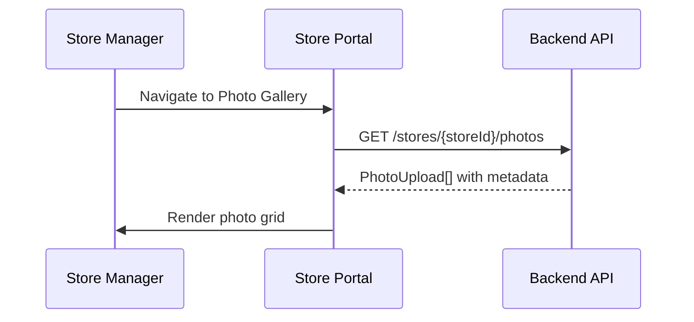
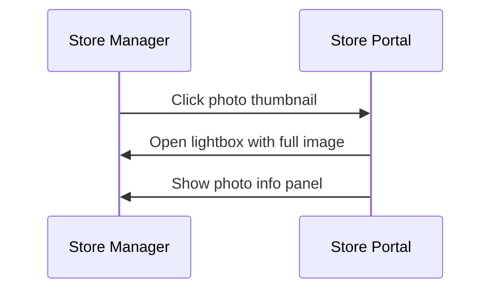
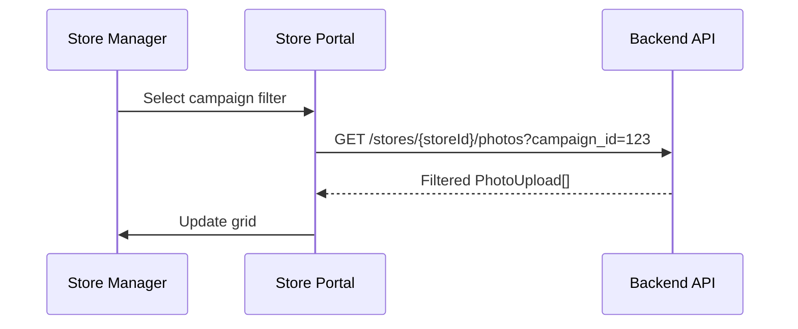

# S03 — Photo Gallery

> **App**: Store Manager Portal (Web)
> **Route**: `/store/photos`
> **SUPP Reference**: SUPP-018 (Photo Review), SUPP-037 (Store Surveys)

---

## Wireframe Reference

**Interactive**: [store_portal.html](../05_Wireframes/store_portal.html) → Photos View

---

## Screen Glossary

| Term | Definition |
|------|------------|
| **Photo Gallery** | Collection of all photos submitted by this store |
| **PhotoUpload** | Individual photo with metadata and review status |
| **PhotoReviewStatus** | PENDING, APPROVED, REJECTED, SUPERSEDED |
| **Superseded** | Replaced by a newer photo (retake) |
| **Lightbox** | Full-screen photo viewer |

---

## Data Model Map

### Entities Displayed

| Entity | Fields | Access |
|--------|--------|--------|
| `PhotoUpload` | id, file_url, thumbnail_url, review_status, created_at | Read |
| `PhotoReview` | rejection_reason, admin_comment | Read |
| `AssignmentItem` | location_slot_id | Read |
| `KitItem` | name, item_type | Read |
| `Campaign` | name | Read |
| `User` | name (who uploaded) | Read |

### Gallery Query

```sql
SELECT
  pu.*,
  ki.name as item_name,
  ls.name as slot_name,
  c.name as campaign_name,
  u.name as uploaded_by,
  pr.rejection_reason, pr.admin_comment
FROM photo_uploads pu
JOIN assignment_items ai ON pu.assignment_item_id = ai.id
JOIN kit_items ki ON ai.kit_item_id = ki.id
LEFT JOIN location_slots ls ON ai.location_slot_id = ls.id
JOIN store_assignments sa ON ai.store_assignment_id = sa.id
JOIN campaigns c ON sa.campaign_id = c.id
JOIN users u ON pu.uploaded_by = u.id
LEFT JOIN photo_reviews pr ON pr.photo_upload_id = pu.id
WHERE sa.store_id = ?
ORDER BY pu.created_at DESC
```

---

## UI Components

| Component | Type | Description |
|-----------|------|-------------|
| **Header** | Page header | "Photo Gallery", counts by status |
| **Filter Bar** | Controls | Campaign, status, date, item type |
| **View Toggle** | Button group | Grid / List view |
| **Photo Grid** | Card grid | Thumbnail gallery |
| **Status Badge** | Overlay | Review status indicator |
| **Lightbox** | Modal | Full-size viewer |
| **Photo Info** | Panel | Metadata and review details |
| **Download** | Button | Export selected photos |

### Photo Gallery Layout

```
┌─────────────────────────────────────────────────────────────┐
│ Photo Gallery                        Approved: 45 | Pending: 3│
├─────────────────────────────────────────────────────────────┤
│ Campaign: [All Campaigns    ▼]  Status: [All      ▼]        │
│ Date: [Last 30 days      ▼]     Item: [All Types ▼]         │
│                                                             │
│ [Grid View] [List View]                      [Download All] │
│                                                             │
│ ┌─────────┐ ┌─────────┐ ┌─────────┐ ┌─────────┐            │
│ │ [Photo] │ │ [Photo] │ │ [Photo] │ │ [Photo] │            │
│ │    ✓    │ │    ✓    │ │    ⏳   │ │    ✓    │            │
│ │ Window  │ │ End Cap │ │ Counter │ │ Window  │            │
│ │ Jun 15  │ │ Jun 15  │ │ Jun 16  │ │ Jun 14  │            │
│ └─────────┘ └─────────┘ └─────────┘ └─────────┘            │
│                                                             │
│ ┌─────────┐ ┌─────────┐ ┌─────────┐ ┌─────────┐            │
│ │ [Photo] │ │ [Photo] │ │ [Photo] │ │ [Photo] │            │
│ │    ✓    │ │    ❌   │ │    ✓    │ │    ✓    │            │
│ │ Standee │ │ Window  │ │ End Cap │ │ Checkout│            │
│ │ Jun 12  │ │ Jun 10  │ │ Jun 10  │ │ Jun 8   │            │
│ └─────────┘ └─────────┘ └─────────┘ └─────────┘            │
│                                                             │
│ Showing 1-24 of 48                [Load More]               │
└─────────────────────────────────────────────────────────────┘
```

---

## Process Flows

### Load Gallery



### View Photo Detail



### Filter Photos



---

## Photo Card

```
┌─────────────────┐
│                 │
│    [Thumbnail]  │
│                 │
│       ✓         │  ← Status overlay
├─────────────────┤
│ Window Poster   │  ← Item name
│ Summer Promo    │  ← Campaign
│ Jun 15, 2025    │  ← Date
│ by John D.      │  ← Uploaded by
└─────────────────┘
```

---

## Lightbox View

```
┌─────────────────────────────────────────────────────────────┐
│                                                         [X] │
│  ┌───────────────────────────────────┐  ┌───────────────┐  │
│  │                                   │  │ Photo Info    │  │
│  │                                   │  │               │  │
│  │                                   │  │ Status: ✓     │  │
│  │        [Full Resolution           │  │ Approved      │  │
│  │              Photo]               │  │               │  │
│  │                                   │  │ Item:         │  │
│  │                                   │  │ Window Poster │  │
│  │                                   │  │               │  │
│  │                                   │  │ Location:     │  │
│  │                                   │  │ Front Window  │  │
│  │                                   │  │               │  │
│  └───────────────────────────────────┘  │ Campaign:     │  │
│                                         │ Summer Promo  │  │
│                                         │               │  │
│                                         │ Uploaded:     │  │
│                                         │ Jun 15, 2:30p │  │
│                                         │ by John Doe   │  │
│                                         │               │  │
│                                         │ [Download]    │  │
│  [← Prev]                    [Next →]   └───────────────┘  │
└─────────────────────────────────────────────────────────────┘
```

---

## Rejected Photo Lightbox

```
┌─────────────────────────────────────────────────────────────┐
│                                                         [X] │
│  ┌───────────────────────────────────┐  ┌───────────────┐  │
│  │                                   │  │ Photo Info    │  │
│  │                                   │  │               │  │
│  │        [Full Resolution           │  │ Status: ❌    │  │
│  │              Photo]               │  │ Rejected      │  │
│  │                                   │  │               │  │
│  │                                   │  │ Reason:       │  │
│  │                                   │  │ WRONG_ANGLE   │  │
│  │                                   │  │               │  │
│  └───────────────────────────────────┘  │ Admin Note:   │  │
│                                         │ "Please       │  │
│  ⚠️ This photo was rejected             │ capture       │  │
│                                         │ straight-on"  │  │
│  Replacement Photo:                     │               │  │
│  ┌──────────┐                           │ Retake:       │  │
│  │ [New     │ ✓ Approved               │ [View]        │  │
│  │  Photo]  │                           │               │  │
│  └──────────┘                           └───────────────┘  │
└─────────────────────────────────────────────────────────────┘
```

---

## Status Overlays

| Status | Overlay | Color |
|--------|---------|-------|
| PENDING | ⏳ | Yellow |
| APPROVED | ✓ | Green |
| REJECTED | ❌ | Red |
| SUPERSEDED | 🔄 | Gray |

---

## Filter Options

| Filter | Type | Options |
|--------|------|---------|
| Campaign | Dropdown | All campaigns for store |
| Status | Dropdown | All, Approved, Pending, Rejected |
| Date | Date range | Last 7/30/90 days, Custom |
| Item Type | Multi-select | POSTER, STANDEE, etc. |
| Uploaded By | Dropdown | Team members |

---

## List View Columns

| Column | Description |
|--------|-------------|
| Thumbnail | Small preview |
| Item | KitItem name |
| Location | LocationSlot name |
| Campaign | Campaign name |
| Status | Review status badge |
| Uploaded | Date and user |
| Actions | View, Download |

---

## Acceptance Criteria

1. ✅ Gallery shows all photos for store
2. ✅ Grid view displays thumbnails with status
3. ✅ List view shows tabular data
4. ✅ Filters narrow by campaign, status, date
5. ✅ Click photo opens lightbox
6. ✅ Lightbox shows full image and metadata
7. ✅ Rejected photos show reason and admin comment
8. ✅ Superseded photos link to replacement
9. ✅ Download button exports selected photos
10. ✅ Keyboard navigation in lightbox (arrows, escape)

---

## Related Screens

| Screen | Relationship |
|--------|--------------|
| [S01 Dashboard](S01_Dashboard.md) | Quick link |
| [S02 Campaign History](S02_Campaign_History.md) | Campaign-filtered view |
| [M05 Photo Capture](M05_Photo_Capture.md) | Where photos are taken |
| [B07 Verification](B07_Verification.md) | Brand reviews photos |

---

*End of S03 Photo Gallery Screen Spec*
