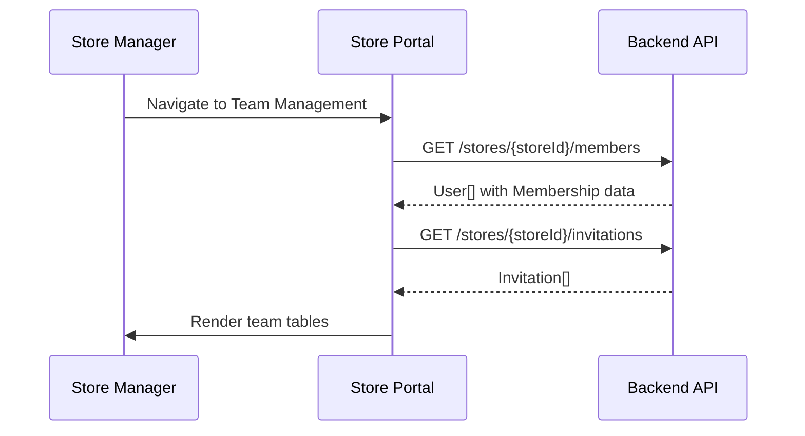
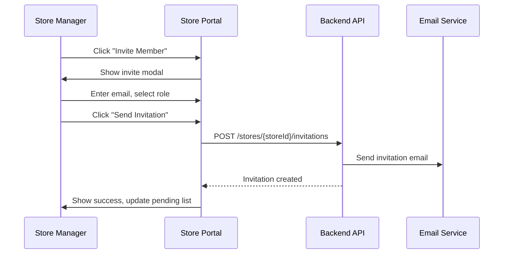
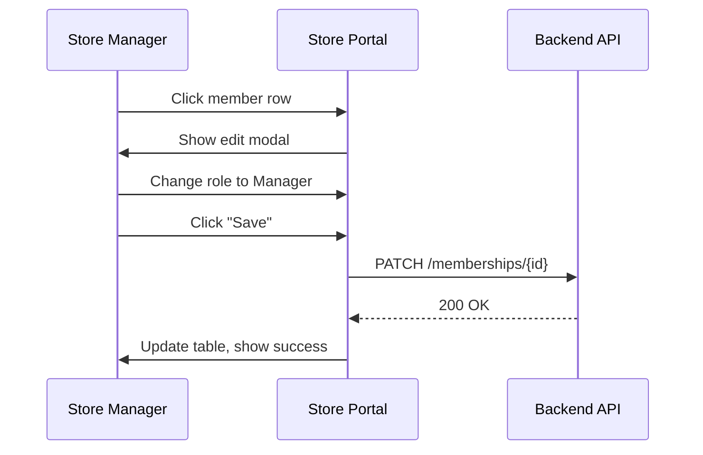
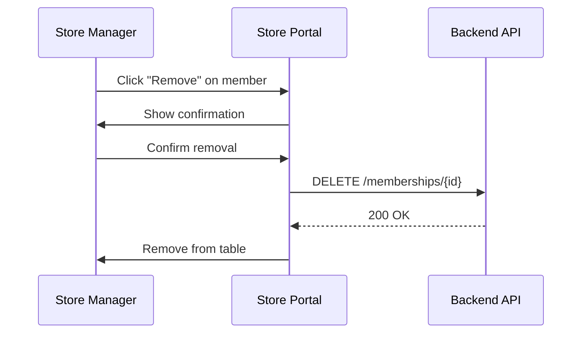

# S04 — Team Management

> **App**: Store Manager Portal (Web)
> **Route**: `/store/team`
> **SUPP Reference**: SUPP-001 (Personas), SUPP-003 (RBAC)

---

## Wireframe Reference

**Interactive**: [store_portal.html](../05_Wireframes/store_portal.html) → Team View

---

## Screen Glossary

| Term | Definition |
|------|------------|
| **Store Manager** | User with authority to manage team members at their store |
| **Store User** | Team member who executes campaigns |
| **Membership** | Association between a User and Store with assigned role |
| **Invitation** | Pending user who hasn't completed registration |
| **Activity** | Recent actions by team member (photos, submissions) |

---

## Data Model Map

### Entities Displayed

| Entity | Fields | Access |
|--------|--------|--------|
| `User` | id, name, email, phone, status, last_active_at | Read/Write |
| `Membership` | store_id, user_id, role, created_at | Read/Write |
| `Invitation` | email, role, invited_at, expires_at, status | Read/Write |
| `PhotoUpload` | (count per user) | Read |
| `StoreAssignment` | (activity per user) | Read |

### Team Query

```sql
SELECT
  u.*,
  m.role,
  m.created_at as joined_at,
  COUNT(pu.id) as photo_count,
  MAX(pu.created_at) as last_photo
FROM users u
JOIN memberships m ON m.user_id = u.id
LEFT JOIN photo_uploads pu ON pu.uploaded_by = u.id
WHERE m.store_id = ?
GROUP BY u.id, m.id
ORDER BY u.name
```

---

## UI Components

| Component | Type | Description |
|-----------|------|-------------|
| **Header** | Page header | "Team Management", Invite button |
| **Team Table** | Data table | Current team members |
| **Status Badge** | Chip | Active, Invited, Inactive |
| **Role Badge** | Chip | Manager, User |
| **Invite Modal** | Dialog | Add new team member |
| **Edit Modal** | Dialog | Modify member details |
| **Activity Summary** | Mini stats | Photos uploaded, last active |

### Team Management Layout

```
┌─────────────────────────────────────────────────────────────┐
│ Team Management                           [+ Invite Member] │
├─────────────────────────────────────────────────────────────┤
│                                                             │
│ Active Members (4)                                          │
│ ┌─────────────────────────────────────────────────────────┐ │
│ │ Name           Email              Role      Last Active │ │
│ ├─────────────────────────────────────────────────────────┤ │
│ │ Jane Smith     jane@store.com     Manager   Today       │ │
│ │ John Doe       john@store.com     User      Yesterday   │ │
│ │ Mike Johnson   mike@store.com     User      Dec 12      │ │
│ │ Sarah Wilson   sarah@store.com    User      Dec 10      │ │
│ └─────────────────────────────────────────────────────────┘ │
│                                                             │
│ Pending Invitations (1)                                     │
│ ┌─────────────────────────────────────────────────────────┐ │
│ │ Email              Role    Invited     Expires    Action│ │
│ ├─────────────────────────────────────────────────────────┤ │
│ │ new@store.com      User    Dec 15      Dec 22   [Resend]│ │
│ └─────────────────────────────────────────────────────────┘ │
│                                                             │
│ Team Activity (Last 30 Days)                                │
│ ┌─────────────────────────────────────────────────────────┐ │
│ │ Member        Photos    Receipts    Installs    Issues  │ │
│ ├─────────────────────────────────────────────────────────┤ │
│ │ Jane Smith       12         3           2          0    │ │
│ │ John Doe         24         5           4          1    │ │
│ │ Mike Johnson      8         2           1          0    │ │
│ │ Sarah Wilson     15         4           3          0    │ │
│ └─────────────────────────────────────────────────────────┘ │
└─────────────────────────────────────────────────────────────┘
```

---

## Process Flows

### Load Team



### Invite Member



### Change Role



### Remove Member



---

## Invite Modal

```
┌─────────────────────────────────────┐
│ Invite Team Member              [X] │
├─────────────────────────────────────┤
│                                     │
│ Email Address *                     │
│ ┌─────────────────────────────────┐ │
│ │ newmember@store.com             │ │
│ └─────────────────────────────────┘ │
│                                     │
│ Role *                              │
│ ○ Store User                        │
│   Can execute campaigns, upload     │
│   photos, report issues             │
│                                     │
│ ○ Store Manager                     │
│   All user permissions plus team    │
│   management and reports            │
│                                     │
│ Personal Message (optional)         │
│ ┌─────────────────────────────────┐ │
│ │ Welcome to the team!            │ │
│ └─────────────────────────────────┘ │
│                                     │
│ [Cancel]         [Send Invitation]  │
└─────────────────────────────────────┘
```

---

## Edit Member Modal

```
┌─────────────────────────────────────┐
│ Edit Team Member                [X] │
├─────────────────────────────────────┤
│                                     │
│ John Doe                            │
│ john@store.com                      │
│ Member since: Jun 1, 2024           │
│                                     │
│ Role                                │
│ [Store User                     ▼]  │
│                                     │
│ Status                              │
│ ○ Active                            │
│ ○ Inactive                          │
│                                     │
│ Activity Summary                    │
│ ────────────────                    │
│ Photos: 24 | Last active: Yesterday │
│                                     │
│ [Remove from Store]                 │
│                                     │
│ [Cancel]                   [Save]   │
└─────────────────────────────────────┘
```

---

## Roles

| Role | Permissions |
|------|-------------|
| **Store User** | Execute campaigns, upload photos, report issues, view own activity |
| **Store Manager** | All user permissions + team management, reports, all team activity |

---

## Status Types

| Status | Description | Actions |
|--------|-------------|---------|
| Active | Registered and active | Edit, Remove |
| Invited | Pending registration | Resend, Cancel |
| Inactive | Deactivated by manager | Reactivate, Remove |

---

## Team Table Columns

| Column | Description |
|--------|-------------|
| Name | Full name (avatar if available) |
| Email | Email address |
| Role | Manager or User badge |
| Status | Active/Inactive badge |
| Last Active | Relative date |
| Actions | Edit, Remove |

---

## Activity Summary Columns

| Column | Description |
|--------|-------------|
| Member | User name |
| Photos | Count uploaded (last 30 days) |
| Receipts | Receipt surveys completed |
| Installs | Install surveys completed |
| Issues | Issues reported |

---

## Acceptance Criteria

1. ✅ Team list shows all current members
2. ✅ Pending invitations displayed separately
3. ✅ Invite modal captures email and role
4. ✅ Invitation email sent on invite
5. ✅ Manager can change member role
6. ✅ Manager can deactivate/remove member
7. ✅ Cannot remove last manager
8. ✅ Activity summary shows 30-day metrics
9. ✅ Resend option for pending invitations

---

## Related Screens

| Screen | Relationship |
|--------|--------------|
| [S01 Dashboard](S01_Dashboard.md) | Team status summary |
| [S05 Reports](S05_Reports.md) | Detailed team analytics |
| [M07 Profile](M07_Profile.md) | User self-service |

---

*End of S04 Team Management Screen Spec*
