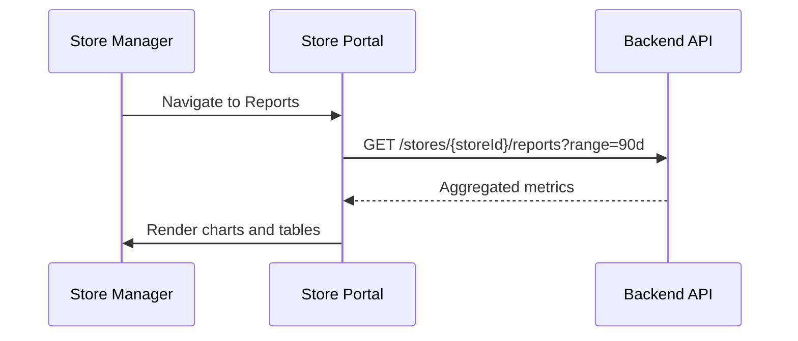
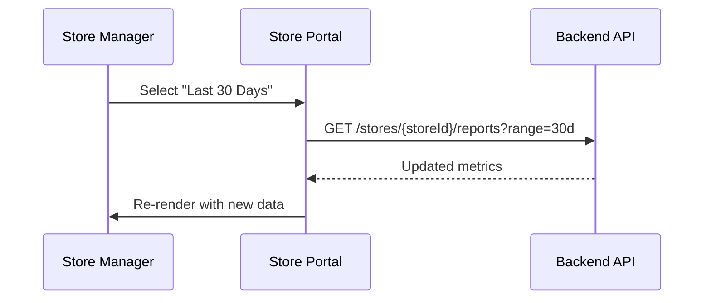
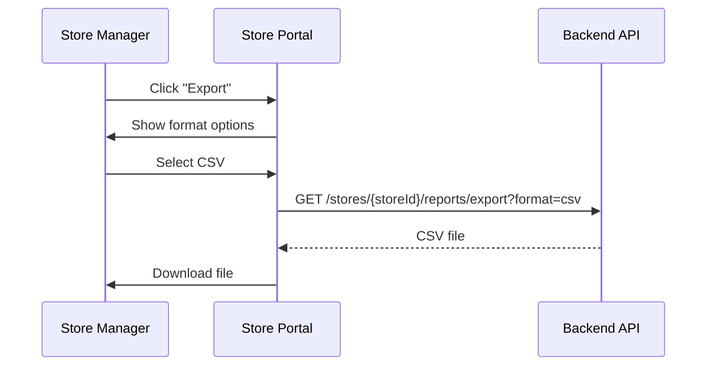

# S05 — Store Reports

> **App**: Store Manager Portal (Web)
> **Route**: `/store/reports`
> **SUPP Reference**: SUPP-001 (Personas)

---

## Wireframe Reference

**Interactive**: [store_portal.html](../05_Wireframes/store_portal.html) → Reports View

---

## Screen Glossary

| Term | Definition |
|------|------------|
| **Compliance Report** | Analysis of on-time campaign completion |
| **Team Performance** | Individual contribution metrics |
| **Photo Analytics** | Approval rates and rejection patterns |
| **Issue Summary** | Reported issues and resolution times |
| **Trend Analysis** | Performance over time |

---

## Data Model Map

### Entities Aggregated

| Entity | Metrics | Access |
|--------|---------|--------|
| `StoreAssignment` | Completion rate, on-time %, avg duration | Read |
| `PhotoUpload` | Count, approval rate, rejection reasons | Read |
| `IssueRequest` | Count by type, resolution time | Read |
| `User` | Activity by team member | Read |
| `Campaign` | Historical performance | Read |

### Report Queries

```sql
-- Compliance metrics
SELECT
  COUNT(*) as total_campaigns,
  COUNT(CASE WHEN status = 'COMPLETE' THEN 1 END) as completed,
  COUNT(CASE WHEN completed_at <= c.install_end_date THEN 1 END) as on_time,
  AVG(DATEDIFF(completed_at, c.install_start_date)) as avg_duration
FROM store_assignments sa
JOIN campaigns c ON sa.campaign_id = c.id
WHERE sa.store_id = ? AND sa.status = 'COMPLETE'

-- Photo metrics
SELECT
  COUNT(*) as total_photos,
  COUNT(CASE WHEN review_status = 'APPROVED' THEN 1 END) as approved,
  COUNT(CASE WHEN review_status = 'REJECTED' THEN 1 END) as rejected
FROM photo_uploads pu
JOIN assignment_items ai ON pu.assignment_item_id = ai.id
JOIN store_assignments sa ON ai.store_assignment_id = sa.id
WHERE sa.store_id = ?
```

---

## UI Components

| Component | Type | Description |
|-----------|------|-------------|
| **Header** | Page header | "Reports", date range selector |
| **Date Range** | Picker | Time period for reports |
| **Report Tabs** | Tab bar | Overview, Campaigns, Photos, Team |
| **KPI Cards** | Stat cards | Key metrics with trends |
| **Charts** | Visualizations | Line, bar, pie charts |
| **Data Table** | Table | Detailed breakdowns |
| **Export** | Button | Download report data |

### Reports Layout

```
┌─────────────────────────────────────────────────────────────┐
│ Store Reports                   [Last 90 Days ▼] [Export]   │
├─────────────────────────────────────────────────────────────┤
│                                                             │
│ [Overview] [Campaigns] [Photos] [Team] [Issues]            │
│                                                             │
│  ┌──────────┐  ┌──────────┐  ┌──────────┐  ┌──────────┐   │
│  │ Compliance│  │ On-Time  │  │ Photo    │  │ Avg Time │   │
│  │ Rate     │  │ Rate     │  │ Approval │  │ to Comp. │   │
│  │   94%    │  │   88%    │  │   97%    │  │  4.2 days│   │
│  │  ↑ 3%    │  │  ↑ 5%    │  │  ↓ 1%    │  │  ↓ 0.5d  │   │
│  └──────────┘  └──────────┘  └──────────┘  └──────────┘   │
│                                                             │
│  Campaign Performance Trend                                 │
│  ┌─────────────────────────────────────────────────────┐   │
│  │     100% ─┬────────────────────────────────────────  │   │
│  │           │    ●───●───●───●                         │   │
│  │      80% ─┼──●─────────────────●───●                │   │
│  │           │                                          │   │
│  │      60% ─┼──────────────────────────────────────── │   │
│  │           │                                          │   │
│  │      40% ─┼──────────────────────────────────────── │   │
│  │           └────┬────┬────┬────┬────┬────┬────┬────  │   │
│  │               Jul  Aug  Sep  Oct  Nov  Dec  Jan      │   │
│  └─────────────────────────────────────────────────────┘   │
│                                                             │
│  ┌─────────────────────────┐  ┌─────────────────────────┐  │
│  │ Photo Rejection Reasons │  │ Team Contribution       │  │
│  │                         │  │                         │  │
│  │  [Pie Chart]            │  │ Jane S.  ████████ 35%  │  │
│  │   ■ Wrong Angle 45%    │  │ John D.  ██████░░ 28%  │  │
│  │   ■ Too Dark    30%    │  │ Mike J.  ████░░░░ 22%  │  │
│  │   ■ Blurry      15%    │  │ Sarah W. ███░░░░░ 15%  │  │
│  │   ■ Other       10%    │  │                         │  │
│  └─────────────────────────┘  └─────────────────────────┘  │
│                                                             │
│  Recent Campaigns                                           │
│  ┌─────────────────────────────────────────────────────┐   │
│  │ Campaign        Completed  On-Time  Photos  Issues  │   │
│  ├─────────────────────────────────────────────────────┤   │
│  │ Summer Promo    ✓ Yes     ✓ Yes      8       0     │   │
│  │ Spring Sale     ✓ Yes     ✓ Yes      6       1     │   │
│  │ Winter Display  ✓ Yes     ✗ Late     7       0     │   │
│  │ Fall Campaign   ✓ Yes     ✓ Yes      5       0     │   │
│  └─────────────────────────────────────────────────────┘   │
└─────────────────────────────────────────────────────────────┘
```

---

## Report Tabs

### Overview Tab
- KPI summary cards
- Performance trend chart
- Rejection reason breakdown
- Team contribution

### Campaigns Tab
- Campaign completion table
- On-time vs late breakdown
- Duration analysis
- Comparison to network average

### Photos Tab
- Photo volume over time
- Approval/rejection rates
- Rejection reasons by item type
- First-time approval rate

### Team Tab
- Per-member activity metrics
- Contribution percentages
- Activity trends
- Top performers

### Issues Tab
- Issues by type
- Resolution time analysis
- Pending issues
- Trend over time

---

## Process Flows

### Load Reports



### Change Date Range



### Export Report



---

## KPI Definitions

| KPI | Calculation | Good/Bad Indicator |
|-----|-------------|-------------------|
| Compliance Rate | completed / total campaigns × 100 | Green ≥90%, Yellow ≥75%, Red <75% |
| On-Time Rate | on_time / completed × 100 | Green ≥85%, Yellow ≥70%, Red <70% |
| Photo Approval | approved / total photos × 100 | Green ≥95%, Yellow ≥85%, Red <85% |
| Avg Completion Time | avg(completed_at - start_date) | Lower is better |

---

## Date Range Options

| Option | Description |
|--------|-------------|
| Last 7 Days | Current week |
| Last 30 Days | Current month |
| Last 90 Days | Current quarter |
| Last 365 Days | Current year |
| Custom | Date picker |

---

## Export Formats

| Format | Content |
|--------|---------|
| CSV | Raw data tables |
| PDF | Formatted report with charts |
| Excel | Multi-sheet workbook |

---

## Comparison Metrics

| Metric | Comparison |
|--------|------------|
| Store vs Network | Performance relative to all stores |
| Store vs Region | Performance relative to region |
| Current vs Previous | Period-over-period change |

---

## Acceptance Criteria

1. ✅ Overview shows 4 key KPIs with trends
2. ✅ Trend chart displays performance over time
3. ✅ Rejection reasons shown as pie chart
4. ✅ Team contribution displayed as bar chart
5. ✅ Campaign table shows completion details
6. ✅ Date range selector filters all data
7. ✅ Export generates downloadable report
8. ✅ Comparison to network average shown
9. ✅ Tab navigation switches report sections

---

## Related Screens

| Screen | Relationship |
|--------|--------------|
| [S01 Dashboard](S01_Dashboard.md) | Summary metrics |
| [S02 Campaign History](S02_Campaign_History.md) | Campaign details |
| [S03 Photo Gallery](S03_Photo_Gallery.md) | Photo details |
| [S04 Team Management](S04_Team_Management.md) | Team details |

---

*End of S05 Store Reports Screen Spec*
