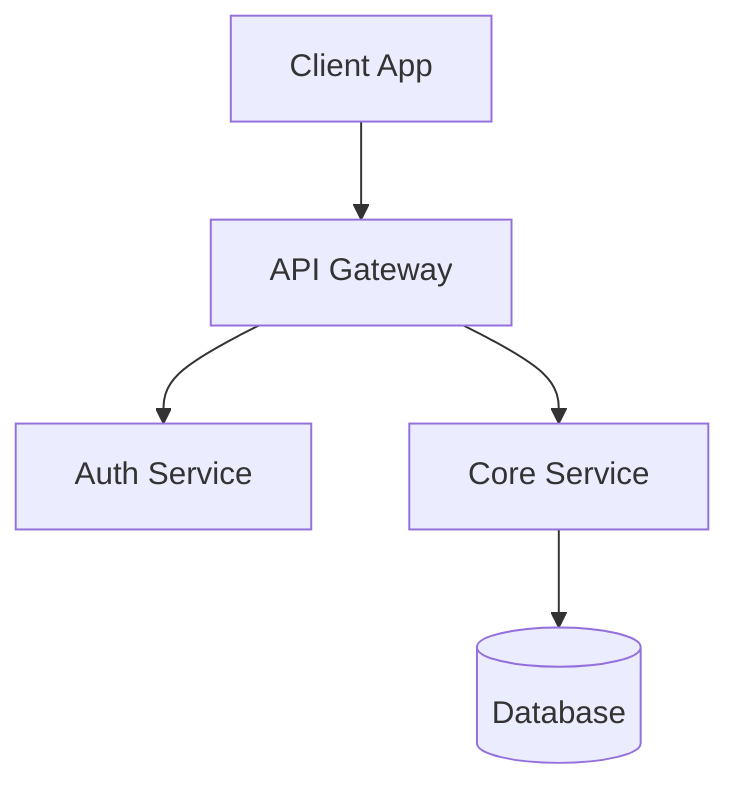
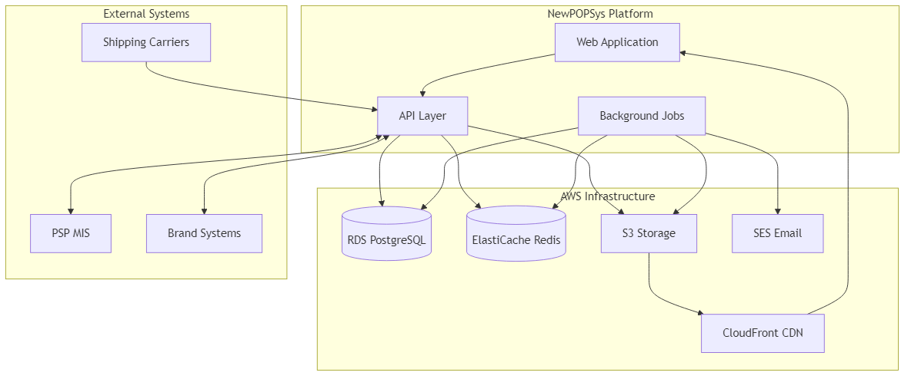
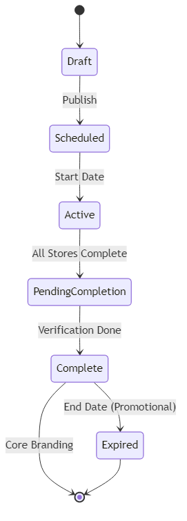
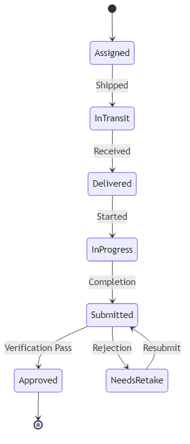
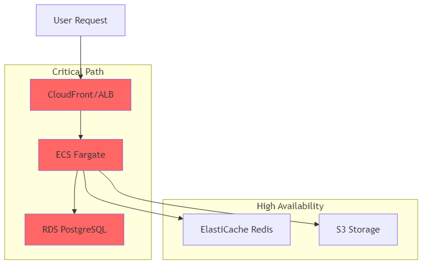



---

# 2.1 Product Perspective

## System Context

NewPOPSys v1.38 is a standalone multi-tenant SaaS platform designed to replace spreadsheet-and-email workflows for POP (Point-of-Purchase) campaign management. The system positions Print Service Providers (PSPs) as the orchestrating authority for campaign lifecycle management across multiple Brands and their retail Stores.

### Market Position



### System Boundaries

NewPOPSys operates as the coordination layer between:

| External System | Integration Direction | Interface Type |
|-----------------|----------------------|----------------|
| PSP MIS/ERP Systems | Bidirectional | Webhooks + API |
| Brand Client Systems | Inbound | API + CSV Import |
| Shipping Carriers | Outbound | Tracking Data Import |
| Cloud Storage (S3) | Bidirectional | Direct Upload/Download |
| Email Services | Outbound | SMTP/SES |

## External Interfaces

### User Interfaces

| Interface | Technology | Primary Users |
|-----------|------------|---------------|
| Web Application | Next.js (React) | PSP Admins, Brand Admins, Regional Managers |
| Mobile PWA | Next.js PWA | Store Managers, Store Operators |
| Admin Console | Next.js | Platform Admins |

### Hardware Interfaces

NewPOPSys is a cloud-native application with no direct hardware interfaces. However, the system interacts with:

| Device Type | Interaction | Requirements |
|-------------|-------------|--------------|
| Mobile Devices | Photo capture, offline execution | Camera, GPS (optional), modern browser |
| Barcode Scanners | Kit item verification | HID-compatible USB/Bluetooth |
| Label Printers | Shipping label generation | ZPL-compatible (via PSP MIS) |

### Software Interfaces

| External System | Protocol | Purpose |
|-----------------|----------|---------|
| PostgreSQL 15+ | SQL/TCP | Primary data store |
| Redis 7+ | Redis Protocol | Session cache, job queue |
| AWS S3 | REST/SDK | Asset storage (photos, exports) |
| AWS CloudFront | HTTPS | CDN for static assets |
| AWS SES | SMTP/API | Transactional email |
| OpenTelemetry | OTLP | Observability |
| Sentry | HTTPS | Error tracking |

### Communication Interfaces

| Protocol | Usage | Security |
|----------|-------|----------|
| HTTPS/TLS 1.3 | All external traffic | Required |
| WebSocket | Real-time notifications | WSS only |
| REST API | System integration | JWT + API Key |
| Webhooks | Event dispatch | HMAC-SHA256 signing |

## Product Position Statement

**For** Print Service Providers managing POP campaigns for retail brands,

**Who** need to coordinate campaign execution across hundreds of store locations,

**NewPOPSys** is a campaign orchestration platform

**That** provides deterministic lifecycle management with complete audit visibility,

**Unlike** spreadsheet-and-email coordination or generic project management tools,

**Our product** enforces structured workflows, captures proof of execution, and maintains compliance traceability.

## Relationship to Other Systems

### What NewPOPSys IS NOT

| Category | Explicit Exclusion | Rationale |
|----------|-------------------|-----------|
| MIS/ERP | No job costing, production scheduling, or accounting | Integration point, not replacement |
| Marketplace | No installer bidding, vendor matching, or ratings | Single PSP model only |
| Analytics Platform | No predictive analytics or AI insights | Data readiness for future phases |
| Data Warehouse | No archival storage beyond 90 days | Export pathways provided |
| Store Customization | Limited store UX flexibility | PSP adoption prioritized |

### System Dependencies



## Operating Model

### Multi-Tenant Architecture


### Data Isolation

| Level | Isolation Mechanism | Scope |
|-------|---------------------|-------|
| Tenant | `psp_tenant_id` column | All data tables |
| Brand | `brand_id` column | Brand-scoped tables |
| Store | `store_id` column | Store-scoped tables |
| User | RBAC + Row-level policies | All access |

## Constraints from External Systems

| System | Constraint | Impact |
|--------|------------|--------|
| PSP MIS | Async integration only | Eventual consistency for order status |
| Shipping Carriers | Tracking data format varies | Normalization layer required |
| Mobile Devices | Offline-capable requirement | Sync-on-open architecture |
| Browser Support | Modern browsers only | No IE11 support |

---

*Document Version: 1.0*
*Last Updated: 2026-01-01*
*Source: MASTER_SOW_COMPILED.md v1.38, Sections 2, 7*


---

# 2.2 Product Functions

## Core Platform Loop

NewPOPSys v1.38 implements a deterministic campaign lifecycle with complete audit visibility:

```
Campaign → Store Assignment → PSP Fulfillment → Store Execution → Verification → Visibility
```

This loop replaces ad-hoc spreadsheet coordination with structured, traceable workflows.

## Functional Modules Summary

### Module 1: Identity & RBAC

| Function | Description |
|----------|-------------|
| F-1.1 Multi-Tenant Management | PSP as root tenant with Brand hierarchy |
| F-1.2 User Authentication | Email/password login with secure sessions |
| F-1.3 Role-Based Access Control | 9 personas with scoped permissions |
| F-1.4 User Invitations | Email-based onboarding workflow |
| F-1.5 API Key Management | Service account credentials for integrations |
| F-1.6 Session Security | JWT tokens with refresh mechanism |

**SUPP Reference:** SUPP-003 (RBAC and Permissions Matrix)

### Module 2: Stores, Regions & Groups

| Function | Description |
|----------|-------------|
| F-2.1 Store Profile Management | CRUD for store locations (1,000+ per brand) |
| F-2.2 Geographic Hierarchy | Region > District > Territory structure |
| F-2.3 Custom Store Grouping | Include/exclude logic for targeting |
| F-2.4 Store Layout Definition | Physical location slots for POP placement |
| F-2.5 External ID Aliasing | Brand system ID mapping |

**SUPP Reference:** SUPP-013 (Stores, Regions, Groups)

### Module 3: Survey Builder & Photo Rules

| Function | Description |
|----------|-------------|
| F-3.1 Survey Template Creation | Dynamic field configuration |
| F-3.2 Survey Versioning | Immutable snapshots for campaign pinning |
| F-3.3 Photo Rule Configuration | Min/max photos, resolution, instructions |
| F-3.4 Reference Image Management | Example photos for guidance |
| F-3.5 Conditional Logic | Show/hide based on responses |
| F-3.6 Repeatable Sections | Per-item or per-slot repetition |

**SUPP Reference:** SUPP-014 (Survey Builder, Layout, Photo Rules), SUPP-037 (Survey Builder)

### Module 4: Campaigns, Kits & Assignment

| Function | Description |
|----------|-------------|
| F-4.1 Campaign Creation | Promotional (expiring) and Core Branding types |
| F-4.2 Kit Definition | Item specifications with SKUs |
| F-4.3 Store Selection Recipes | Rule-based store targeting |
| F-4.4 Assignment Pinning | Lock survey/layout versions per store |
| F-4.5 Campaign Publishing | Transition to active, generate orders |
| F-4.6 Lifecycle Management | Draft → Active → Complete → Expired |

**SUPP Reference:** SUPP-015 (Campaigns, Kits, Assignment)

### Module 5: Orders, Shipments & PSP Operations

| Function | Description |
|----------|-------------|
| F-5.1 Order Generation | Deterministic creation on campaign publish |
| F-5.2 Partial Shipment Support | Multiple shipments per order |
| F-5.3 Batch Tracking | PRODUCTION, PICK_PACK, SHIP_WAVE, CUSTOM |
| F-5.4 Multi-Tracking Numbers | Multiple carriers per shipment |
| F-5.5 PSP Dashboard | Production queue and status overview |
| F-5.6 MIS Integration Points | Webhook dispatch for external systems |

**SUPP Reference:** SUPP-016 (Orders, Shipments, Batches)

### Module 6: Store Execution & Proof Capture

| Function | Description |
|----------|-------------|
| F-6.1 Mobile PWA Interface | Touch-optimized store execution |
| F-6.2 Offline Draft Storage | Best-effort offline with sync-on-open |
| F-6.3 Receive/Verify Workflow | Shipment receipt confirmation |
| F-6.4 Pre-Install Checklist | Site preparation verification |
| F-6.5 Item Installation Tracking | Per-item completion status |
| F-6.6 Proof Photo Capture | Camera integration per item/slot |
| F-6.7 Completion Attestation | User acknowledgment checkbox |

**SUPP Reference:** SUPP-017 (Store Execution, Proof Capture), SUPP-011 (Offline and Sync)

### Module 7: Verification & Retake Loop

| Function | Description |
|----------|-------------|
| F-7.1 Photo Review Queue | Brand/Regional manager interface |
| F-7.2 Approval/Rejection | Decision with reason codes |
| F-7.3 Retake Request Workflow | Notification and re-submission |
| F-7.4 Verification Modes | STRICT (explicit) vs FAST (auto-approve) |
| F-7.5 Slot-Level Tracking | Granular verification status |

**SUPP Reference:** SUPP-018 (Verification, Photo Review, Retake)

### Module 8: Issues, Reorders & Deinstall

| Function | Description |
|----------|-------------|
| F-8.1 Issue Reporting | Missing, Damaged, Incorrect, Packaging |
| F-8.2 Issue Triage | Admin review and approval |
| F-8.3 Reorder Generation | Replacement item ordering |
| F-8.4 Reorder Tracking | Separate fulfillment lifecycle |
| F-8.5 Campaign Expiration | End-date handling for promotional |
| F-8.6 Deinstall Tasks | Removal workflow for expired materials |

**SUPP Reference:** SUPP-019 (Issues, Reorders, Expiration, Deinstall)

### Module 9: Exports & Reports

| Function | Description |
|----------|-------------|
| F-9.1 CSV/XLSX Export | Tabular data export |
| F-9.2 PDF Report Generation | Formatted compliance reports |
| F-9.3 JSON/XML Data Export | Structured data interchange |
| F-9.4 Async Processing | BullMQ-based job queue |
| F-9.5 Export Artifact Storage | S3-based file management |
| F-9.6 Export History | Download tracking and expiration |

**SUPP Reference:** SUPP-005 (Exports, Reports, Output Contracts)

### Module 10: Integrations & Webhooks

| Function | Description |
|----------|-------------|
| F-10.1 Webhook Dispatch | Signed event notifications |
| F-10.2 Inbound API | Idempotent request handling |
| F-10.3 Event Outbox Pattern | Reliable event delivery |
| F-10.4 Retry Scheduling | Exponential backoff with dead-letter |
| F-10.5 PSP MIS Scaffolding | Integration templates |

**SUPP Reference:** SUPP-006 (Webhooks and Inbound API)

### Module 11: Data Retention

| Function | Description |
|----------|-------------|
| F-11.1 90-Day Retention | Post campaign completion window |
| F-11.2 Export-Before-Delete | Warning and export workflow |
| F-11.3 Automated Purge Jobs | Scheduled cleanup processing |
| F-11.4 Asset Registry | Permanent definition preservation |
| F-11.5 Audit Event Preservation | Compliance trail retention |

**SUPP Reference:** SUPP-008 (Data Retention Classification)

### Module 12: Offline & Sync Strategy

| Function | Description |
|----------|-------------|
| F-12.1 PWA Service Worker | Background sync capability |
| F-12.2 Offline Draft Storage | Local persistence for in-progress work |
| F-12.3 Sync-on-Open Queue | Automatic submission on reconnect |
| F-12.4 Conflict Resolution | Last-write-wins with user notification |

**SUPP Reference:** SUPP-011 (Offline and Sync Strategy)

## Function Priority Matrix

| Priority | Functions | Rationale |
|----------|-----------|-----------|
| P0 - Critical Path | F-1.x, F-4.1-4.5, F-5.1-5.2, F-6.1-6.7, F-7.1-7.3 | Core campaign loop |
| P1 - Essential | F-2.x, F-3.x, F-8.1-8.4, F-10.1-10.4 | Complete workflow |
| P2 - Important | F-9.x, F-11.x, F-8.5-8.6 | Operational completeness |
| P3 - Scaffold Only | F-12.x, Advanced F-10.5 | Future enhancement readiness |

## Cross-Functional Workflows

### Campaign Lifecycle



### Store Assignment Lifecycle



---

*Document Version: 1.0*
*Last Updated: 2026-01-01*
*Source: MASTER_SOW_COMPILED.md v1.38, Section 5, Section 9*


---

# 2.3 User Classes and Characteristics

## User Class Hierarchy

NewPOPSys v1.38 implements a three-tier user hierarchy aligned with the multi-tenant architecture:


## User Class Summary

| Persona | Level | Access Scope | Primary Interface | Frequency |
|---------|-------|--------------|-------------------|-----------|
| Platform Admin | Platform | All tenants, all data | Admin Console | Daily |
| PSP Admin | PSP | Tenant-wide | Web Application | Daily |
| Production Operator | PSP | Orders, Shipments, Batches | Web Application | Hourly |
| Brand Admin | Brand | Assigned brands | Web Application | Daily |
| Campaign Manager | Brand | Assigned campaigns | Web Application | Daily |
| Regional Manager | Brand | Assigned regions | Web Application | Daily |
| Store Manager | Store | Assigned stores | Mobile PWA | Per campaign |
| Store Operator | Store | Assigned stores | Mobile PWA | Per campaign |
| Integration User | System | API access only | REST API | Automated |

## Detailed User Classes

### Platform Admin

| Attribute | Description |
|-----------|-------------|
| **Description** | Highest privilege system administrator with full access |
| **Population** | 1-3 per deployment |
| **Technical Expertise** | High - understands system architecture |
| **Primary Tasks** | Tenant management, user impersonation, system configuration |
| **Access Pattern** | Web browser, secure workstation |
| **Availability Need** | Business hours with on-call for incidents |

**Key Permissions:**
- Create/manage PSP tenants
- Impersonate any user
- Access all audit logs
- Configure system-wide settings
- Manage feature flags

### PSP Admin

| Attribute | Description |
|-----------|-------------|
| **Description** | PSP organization administrator managing brands and operations |
| **Population** | 2-5 per PSP tenant |
| **Technical Expertise** | Medium - power user level |
| **Primary Tasks** | Brand onboarding, user management, reporting |
| **Access Pattern** | Desktop web browser |
| **Availability Need** | Business hours |

**Key Permissions:**
- Create/manage brands
- Manage all PSP-level users
- Access all brands within tenant
- Generate reports and exports
- Configure PSP settings

### Production Operator

| Attribute | Description |
|-----------|-------------|
| **Description** | PSP staff managing fulfillment operations |
| **Population** | 5-20 per PSP tenant |
| **Technical Expertise** | Low-Medium - task-focused |
| **Primary Tasks** | Order processing, shipment creation, batch management |
| **Access Pattern** | Desktop web browser, possibly warehouse terminal |
| **Availability Need** | Business hours, shift-based |

**Key Permissions:**
- View/update order status
- Create shipments and tracking
- Manage production batches
- Process reorders
- Read-only campaign access

### Brand Admin

| Attribute | Description |
|-----------|-------------|
| **Description** | Brand's primary system administrator |
| **Population** | 1-3 per brand |
| **Technical Expertise** | Medium - marketing/operations background |
| **Primary Tasks** | Store management, campaign creation, user permissions |
| **Access Pattern** | Desktop web browser |
| **Availability Need** | Business hours |

**Key Permissions:**
- Full brand configuration
- Create/manage campaigns
- Manage brand users
- Access all stores
- Review and approve photos

### Campaign Manager

| Attribute | Description |
|-----------|-------------|
| **Description** | Brand staff focused on campaign execution |
| **Population** | 2-10 per brand |
| **Technical Expertise** | Low-Medium - marketing background |
| **Primary Tasks** | Campaign setup, store assignment, progress monitoring |
| **Access Pattern** | Desktop web browser |
| **Availability Need** | Business hours |

**Key Permissions:**
- Create/edit assigned campaigns
- Manage store assignments
- View campaign analytics
- Cannot manage brand settings
- Scoped to assigned campaigns only

### Regional Manager

| Attribute | Description |
|-----------|-------------|
| **Description** | Field manager overseeing store compliance |
| **Population** | 5-20 per brand (varies by brand size) |
| **Technical Expertise** | Low - field operations background |
| **Primary Tasks** | Photo review, exception handling, store support |
| **Access Pattern** | Tablet or laptop, mobile-friendly web |
| **Availability Need** | Business hours, field schedule |

**Key Permissions:**
- Review photos for assigned regions
- Approve/reject submissions
- Handle escalations
- Read-only store data
- Scoped to assigned regions

### Store Manager

| Attribute | Description |
|-----------|-------------|
| **Description** | Store-level authority for campaign execution |
| **Population** | 1 per store (1,000+ per brand) |
| **Technical Expertise** | Low - retail operations background |
| **Primary Tasks** | Team coordination, approval authority, issue escalation |
| **Access Pattern** | Mobile device (phone/tablet), PWA |
| **Availability Need** | Store hours |

**Key Permissions:**
- Full store execution access
- Approve replacement requests
- Manage store team
- Complete all surveys
- Report issues

### Store Operator

| Attribute | Description |
|-----------|-------------|
| **Description** | Store staff performing installation tasks |
| **Population** | 1-5 per store |
| **Technical Expertise** | Low - basic smartphone proficiency |
| **Primary Tasks** | Receive shipments, install materials, capture photos |
| **Access Pattern** | Mobile device (phone), PWA |
| **Availability Need** | Store hours |

**Key Permissions:**
- Execute surveys
- Upload photos
- Update task status
- Request replacements
- Cannot manage other users

### Integration User

| Attribute | Description |
|-----------|-------------|
| **Description** | Service account for system-to-system communication |
| **Population** | 1-5 per PSP tenant |
| **Technical Expertise** | N/A - automated |
| **Primary Tasks** | API operations, webhook receipt, data sync |
| **Access Pattern** | REST API only |
| **Availability Need** | 24/7 automated |

**Key Permissions:**
- API access per granted scopes
- No UI access
- Webhook endpoint access
- Rate-limited operations
- Audit-logged actions

## User Class Interaction Matrix

| From \ To | Platform | PSP | Brand | Regional | Store |
|-----------|----------|-----|-------|----------|-------|
| Platform Admin | Manage | Manage | View | View | View |
| PSP Admin | - | Manage | Manage | View | View |
| Brand Admin | - | - | Manage | Manage | View |
| Regional Manager | - | - | - | Self | View |
| Store Manager | - | - | - | - | Manage |

## Accessibility Considerations

| User Class | Accessibility Needs |
|------------|---------------------|
| Store Operators | Large touch targets, simple navigation, outdoor visibility |
| Regional Managers | Tablet-optimized, minimal typing |
| All Web Users | WCAG 2.1 AA compliance, keyboard navigation |
| All Users | Screen reader compatibility for core functions |

## Training Requirements

| User Class | Training Level | Delivery Method |
|------------|----------------|-----------------|
| Platform Admin | Comprehensive | Technical documentation, hands-on |
| PSP Admin | Full | Online training, documentation |
| Production Operator | Role-specific | Workflow guides, quick reference |
| Brand Admin | Full | Online training, webinar |
| Campaign Manager | Role-specific | Interactive tutorials |
| Regional Manager | Task-focused | Mobile-optimized guides |
| Store Manager | Task-focused | In-app guidance, video |
| Store Operator | Minimal | In-app walkthrough |

---

*Document Version: 1.0*
*Last Updated: 2026-01-01*
*Source: MASTER_SOW_COMPILED.md v1.38, Section 2.1; SUPP-001; SUPP-003*


---

# 2.4 Operating Environment

## Infrastructure Overview

NewPOPSys v1.38 operates as a cloud-native application deployed on AWS infrastructure with a focus on reliability, scalability, and cost efficiency.


## Production Environment Specifications

### Compute Resources

| Component | Service | Configuration |
|-----------|---------|---------------|
| Web/API Servers | ECS Fargate | 2 vCPU, 4GB RAM per task |
| Background Workers | ECS Fargate | 2 vCPU, 4GB RAM per task |
| Minimum Tasks | Auto-scaling | 2 tasks per service (HA) |
| Maximum Tasks | Auto-scaling | 10 tasks per service |

### Database

| Attribute | Specification |
|-----------|---------------|
| Engine | PostgreSQL 15+ |
| Service | AWS RDS |
| Instance Class | db.r6g.large (minimum) |
| Storage | 100GB gp3 SSD (expandable) |
| Multi-AZ | Yes (production) |
| Read Replicas | 1 (optional, for reporting) |
| Backup Retention | 7 days automated |

### Cache & Queue

| Attribute | Specification |
|-----------|---------------|
| Engine | Redis 7+ |
| Service | AWS ElastiCache |
| Node Type | cache.r6g.large |
| Cluster Mode | Disabled |
| Replication | 1 replica (HA) |
| Purpose | Session cache, BullMQ jobs |

### Storage

| Type | Service | Configuration |
|------|---------|---------------|
| Photo Storage | S3 Standard | Versioning enabled |
| Export Artifacts | S3 Standard-IA | 30-day lifecycle |
| Static Assets | S3 + CloudFront | CDN distribution |
| Backup Archives | S3 Glacier | Long-term retention |

## Capacity Targets

### Pilot Scale (v1.38)

| Dimension | Target | Notes |
|-----------|--------|-------|
| PSP Tenants | 2 | Visual Graphx, Speedy CPS |
| Brands per PSP | 2-3 | Good2Go confirmed |
| Stores per Brand | Up to 1,000 | Primary scale factor |
| Concurrent Users | 50 | Peak during campaign launch |
| Photos per Campaign | 1+ per item per slot | Variable by campaign |
| Data Retention | 90 days | Post campaign completion |

### Performance Baselines

| Operation | p50 Target | p95 Target | p99 Target |
|-----------|------------|------------|------------|
| Simple Read | <50ms | <150ms | <300ms |
| Complex Read | <100ms | <300ms | <600ms |
| Write Operations | <150ms | <400ms | <800ms |
| Photo Upload | <2s | <5s | <10s |
| Report Generation | <30s | <60s | <120s |

## Client Environment Requirements

### Web Application (Desktop)

| Requirement | Specification |
|-------------|---------------|
| Browsers | Chrome 90+, Firefox 88+, Safari 14+, Edge 90+ |
| Screen Resolution | 1280x720 minimum, 1920x1080 recommended |
| Network | Broadband internet (5+ Mbps) |
| JavaScript | Required, ES2020+ support |
| Cookies | Required for session management |
| Local Storage | Required for preferences |

### Mobile PWA (Store Execution)

| Requirement | Specification |
|-------------|---------------|
| Operating System | iOS 14+, Android 10+ |
| Browser | Safari (iOS), Chrome (Android) |
| Screen Size | 5" minimum, touch-enabled |
| Camera | 8MP minimum, autofocus |
| Storage | 500MB available for offline cache |
| Network | 4G LTE or WiFi (sync-on-open) |

### Network Requirements

| Protocol | Port | Purpose |
|----------|------|---------|
| HTTPS | 443 | All application traffic |
| WSS | 443 | WebSocket notifications |

**Firewall/Proxy Requirements:**
- No SSL inspection (breaks certificate pinning)
- WebSocket upgrade support
- No request size limits <10MB

## Software Dependencies

### Server-Side Stack

| Component | Version | Purpose |
|-----------|---------|---------|
| Node.js | 20 LTS | Runtime |
| TypeScript | 5.x | Language |
| Next.js | 14.x | Web framework |
| Fastify | 4.x | API server |
| Drizzle ORM | Latest | Database ORM |
| BullMQ | 4.x | Job queue |
| Zod | 3.x | Validation |

### Client-Side Stack

| Component | Version | Purpose |
|-----------|---------|---------|
| React | 18.x | UI framework |
| TanStack Query | 5.x | Data fetching |
| Tailwind CSS | 3.x | Styling |
| Radix UI | Latest | Accessible components |

### Observability Stack

| Component | Purpose |
|-----------|---------|
| OpenTelemetry | Distributed tracing |
| Sentry | Error tracking |
| AWS CloudWatch | Metrics and logs |

## Security Environment

### Network Security

| Control | Implementation |
|---------|----------------|
| TLS Version | 1.3 only |
| Certificate | ACM-managed |
| WAF | AWS WAF with OWASP rules |
| DDoS Protection | AWS Shield Standard |

### Data Security

| Data State | Protection |
|------------|------------|
| In Transit | TLS 1.3 |
| At Rest (DB) | AES-256 (RDS encryption) |
| At Rest (S3) | AES-256 (SSE-S3) |
| At Rest (Redis) | AES-256 (ElastiCache encryption) |

### Authentication

| Attribute | Specification |
|-----------|---------------|
| Token Type | JWT (RS256) |
| Access Token TTL | 15 minutes |
| Refresh Token TTL | 7 days |
| Password Policy | 12+ chars, complexity required |
| MFA | Optional (v1), platform admin required |

## Availability Requirements

| Metric | Target | Measurement |
|--------|--------|-------------|
| Uptime | 99.5% | Monthly |
| Allowed Downtime | 3.6 hours/month | Calculated |
| RTO (Single AZ) | <5 minutes | Recovery time |
| RPO | 1 hour | Data loss tolerance |

### Maintenance Windows

| Window | Timing | Impact |
|--------|--------|--------|
| Planned Maintenance | Sunday 02:00-06:00 UTC | Potential brief outages |
| Emergency Patches | As needed | Rolling deployment |
| Database Maintenance | RDS automated | Usually zero downtime |

## Environment Tiers

| Environment | Purpose | Scale |
|-------------|---------|-------|
| Development | Local development | Single instance |
| Staging | Integration testing | 50% production |
| Production | Live operations | Full scale |

---

*Document Version: 1.0*
*Last Updated: 2026-01-01*
*Source: MASTER_SOW_COMPILED.md v1.38, Section 3; SUPP-039 v0.1*


---

# 2.5 Design and Implementation Constraints

## Architectural Constraints

### Multi-Tenancy Model

| Constraint | Rationale |
|------------|-----------|
| PSP as root tenant | Business model positions PSP as paying customer |
| Logical data isolation | Single database with tenant_id column pattern |
| No cross-tenant data access | Compliance and data privacy requirements |
| Brand scoping within tenant | Hierarchical access control |

### Technology Stack Mandates

| Component | Mandated Choice | Rationale |
|-----------|-----------------|-----------|
| Runtime | Node.js 20 LTS | Team expertise, ecosystem |
| Language | TypeScript 5.x | Type safety, maintainability |
| Web Framework | Next.js 14.x | Full-stack React, SSR support |
| API Framework | Fastify 4.x | Performance, schema validation |
| Database | PostgreSQL 15+ | JSONB, advanced features |
| ORM | Drizzle | Type-safe queries, performance |
| Queue | BullMQ/Redis | Proven reliability |
| Cloud | AWS | Existing infrastructure |

### API Design Constraints

| Constraint | Specification |
|------------|---------------|
| Protocol | REST over HTTPS |
| Authentication | JWT Bearer tokens |
| Versioning | URL path versioning (/v1/) |
| Content Type | application/json |
| Idempotency | Required for all write operations |
| Rate Limiting | Per-tenant, per-endpoint |

## Regulatory and Compliance Constraints

### Accessibility Requirements

| Standard | Requirement | Impact |
|----------|-------------|--------|
| WCAG 2.1 AA | All web interfaces | UI component selection |
| Section 508 | Federal accessibility | Government client support |
| Keyboard Navigation | Full functionality | No mouse-only features |
| Screen Reader | Core workflows | Semantic HTML required |

### Data Privacy

| Regulation | Applicability | Constraint |
|------------|---------------|------------|
| Data Retention | 90-day post-completion | Automated purge required |
| Right to Export | Before deletion | Export-before-delete workflow |
| Audit Logging | All data modifications | Immutable audit trail |
| PII Handling | User data, store contacts | Encryption at rest |

### Security Standards

| Standard | Application |
|----------|-------------|
| OWASP Top 10 | Security testing baseline |
| TLS 1.3 | All external connections |
| Password Policy | NIST 800-63B aligned |
| Session Management | Secure token handling |

## Operational Constraints

### Deployment Constraints

| Constraint | Specification |
|------------|---------------|
| Zero-Downtime Deploy | Rolling deployments required |
| Blue-Green Capability | Database migrations must be backward-compatible |
| Feature Flags | New features behind flags |
| Rollback Window | 15-minute rollback capability |

### Performance Constraints

| Constraint | Target |
|------------|--------|
| API Response (p95) | <150ms for simple reads |
| API Response (p95) | <300ms for complex reads |
| Photo Upload | <5s for 10MB image |
| Page Load | <3s initial, <1s subsequent |
| Offline Sync | <30s for typical session |

### Scalability Constraints

| Dimension | Pilot Constraint | Future Capacity |
|-----------|------------------|-----------------|
| Stores per Brand | 1,000 | 10,000 |
| Concurrent Users | 50 | 500 |
| Photos per Campaign | 10,000 | 100,000 |
| API Requests | 100 req/s | 1,000 req/s |

## Business Constraints

### Scope Boundaries (Protected Not-Now)

| Category | Constraint | Rationale |
|----------|------------|-----------|
| Not MIS/ERP | No costing, scheduling, accounting | Integration point only |
| Not Marketplace | No bidding, matching, ratings | Single PSP model |
| Not Analytics | No predictive/AI insights | Data readiness only |
| Not Archive | No storage beyond 90 days | Export pathways provided |
| Not Customizable | Limited store UX flexibility | PSP adoption priority |

### Pilot Constraints

| Constraint | Value |
|------------|-------|
| Pilot PSPs | 2 (Visual Graphx, Speedy CPS) |
| Pilot Duration | 90-day evaluation period |
| Scope Changes | Formal approval required |
| Feature Additions | Deferred to post-pilot |

## Integration Constraints

### External System Integration

| System | Constraint |
|--------|------------|
| PSP MIS | Async only (eventual consistency) |
| Shipping Carriers | Tracking data normalization required |
| Email Delivery | AWS SES limits apply |
| Webhook Endpoints | Customer-provided, HTTPS only |

### API Compatibility

| Constraint | Specification |
|------------|---------------|
| Webhook Signing | HMAC-SHA256 required |
| Retry Policy | Exponential backoff, 24h max |
| Payload Size | 1MB maximum |
| Timeout | 30-second response required |

## User Interface Constraints

### Browser Support

| Browser | Minimum Version | Support Level |
|---------|-----------------|---------------|
| Chrome | 90+ | Full |
| Firefox | 88+ | Full |
| Safari | 14+ | Full |
| Edge | 90+ | Full |
| IE11 | Not supported | None |

### Mobile Constraints

| Platform | Constraint |
|----------|------------|
| iOS | Safari only (WebKit) |
| Android | Chrome primary, WebView fallback |
| Offline | Sync-on-open, draft storage only |
| Camera | Native camera access required |

### Responsive Design

| Breakpoint | Target Devices |
|------------|----------------|
| <640px | Mobile phones |
| 640-1024px | Tablets |
| >1024px | Desktop |

## Development Constraints

### Code Quality

| Constraint | Requirement |
|------------|-------------|
| Test Coverage | 80% line coverage |
| Linting | ESLint with strict config |
| Type Safety | No implicit any |
| Code Review | Required for all PRs |

### Documentation

| Artifact | Requirement |
|----------|-------------|
| API Docs | OpenAPI 3.0 specification |
| Code Comments | JSDoc for public interfaces |
| ADRs | Architecture decisions documented |
| Runbooks | Operational procedures |

### Version Control

| Constraint | Specification |
|------------|---------------|
| SCM | Git |
| Branching | Trunk-based with feature flags |
| Commit Messages | Conventional commits |
| Release Tags | Semantic versioning |

## Resource Constraints

### Team Expertise

| Skill Area | Available | Constraint |
|------------|-----------|------------|
| TypeScript/Node.js | Strong | Primary stack |
| React/Next.js | Strong | UI framework |
| PostgreSQL | Strong | Database |
| AWS | Medium | Infrastructure |
| Mobile/PWA | Medium | Store execution |

### Timeline Constraints

| Milestone | Constraint |
|-----------|------------|
| MVP Delivery | Fixed date |
| Feature Freeze | 2 weeks before pilot |
| Bug Fix Window | Pilot duration |
| Post-Pilot Roadmap | Based on feedback |

---

*Document Version: 1.0*
*Last Updated: 2026-01-01*
*Source: MASTER_SOW_COMPILED.md v1.38, Sections 2.3, 2.4, 6; SUPP-012; SUPP-039*


---

# 2.6 Assumptions and Dependencies

## Assumptions

### Business Assumptions

| ID | Assumption | Impact if Invalid |
|----|------------|-------------------|
| BA-01 | PSP is the paying customer and orchestrating authority | Business model restructure required |
| BA-02 | Brands operate within PSP tenant context | Multi-PSP brand support needed |
| BA-03 | Stores have basic smartphone access for execution | Alternative input methods needed |
| BA-04 | Campaign cycles are predictable (seasonal, promotional) | Capacity planning adjustments |
| BA-05 | Photo proof is acceptable verification evidence | Alternative verification mechanisms |
| BA-06 | 90-day data retention is acceptable post-completion | Extended retention architecture |
| BA-07 | Pilot brands will provide timely feedback | Pilot timeline extension |

### Technical Assumptions

| ID | Assumption | Impact if Invalid |
|----|------------|-------------------|
| TA-01 | AWS services remain available in target regions | Multi-cloud architecture |
| TA-02 | PostgreSQL 15+ features are sufficient | Database migration |
| TA-03 | Node.js 20 LTS supported through pilot | Runtime upgrade |
| TA-04 | Mobile browsers support PWA adequately | Native app development |
| TA-05 | Redis provides sufficient queue reliability | Alternative queue system |
| TA-06 | S3 provides adequate photo storage performance | CDN optimization |
| TA-07 | JWT tokens are acceptable for authentication | Session-based auth |

### User Assumptions

| ID | Assumption | Impact if Invalid |
|----|------------|-------------------|
| UA-01 | Store operators have basic digital literacy | Enhanced training, simplified UX |
| UA-02 | Regional managers can perform photo review | PSP-level review workflow |
| UA-03 | Brand admins understand campaign concepts | Extensive onboarding |
| UA-04 | PSP staff can manage production workflows | Workflow simplification |
| UA-05 | Users have reliable email access | Alternative notification channels |
| UA-06 | Mobile devices have functional cameras | Barcode-only verification |

### Operational Assumptions

| ID | Assumption | Impact if Invalid |
|----|------------|-------------------|
| OA-01 | Internet connectivity available at stores | Enhanced offline capability |
| OA-02 | Stores can receive shipments reliably | Alternative delivery workflows |
| OA-03 | PSP can provide tracking information | Manual status updates |
| OA-04 | Campaigns have defined start/end dates | Indefinite campaign support |
| OA-05 | Issue reporting happens within campaign window | Extended issue window |
| OA-06 | Photo upload happens same-day as installation | Extended upload windows |

## Dependencies

### External Service Dependencies

| ID | Dependency | Provider | Criticality | Fallback |
|----|------------|----------|-------------|----------|
| ED-01 | Compute Infrastructure | AWS ECS Fargate | Critical | None (single cloud) |
| ED-02 | Database Service | AWS RDS PostgreSQL | Critical | Manual restore from backup |
| ED-03 | Cache/Queue Service | AWS ElastiCache Redis | High | Degraded mode (no cache) |
| ED-04 | Object Storage | AWS S3 | Critical | None |
| ED-05 | CDN | AWS CloudFront | Medium | Direct S3 access |
| ED-06 | Email Delivery | AWS SES | Medium | Alternative SMTP |
| ED-07 | DNS | AWS Route 53 | Critical | None |
| ED-08 | SSL Certificates | AWS ACM | Critical | None |

### Third-Party Integration Dependencies

| ID | Dependency | Purpose | Criticality | Fallback |
|----|------------|---------|-------------|----------|
| TI-01 | PSP MIS Systems | Order/status sync | Medium | Manual data entry |
| TI-02 | Shipping Carriers | Tracking information | Low | Manual tracking entry |
| TI-03 | Brand Systems | Store data sync | Low | CSV import |
| TI-04 | Sentry | Error tracking | Low | CloudWatch only |
| TI-05 | OpenTelemetry | Distributed tracing | Low | Local logging only |

### Development Dependencies

| ID | Dependency | Version | Purpose | Risk |
|----|------------|---------|---------|------|
| DD-01 | Node.js | 20 LTS | Runtime | Low (LTS) |
| DD-02 | TypeScript | 5.x | Language | Low |
| DD-03 | Next.js | 14.x | Framework | Medium (major version) |
| DD-04 | React | 18.x | UI Library | Low |
| DD-05 | Drizzle ORM | Latest | Database access | Medium (active development) |
| DD-06 | BullMQ | 4.x | Job queue | Low |
| DD-07 | Zod | 3.x | Validation | Low |
| DD-08 | Tailwind CSS | 3.x | Styling | Low |

### Infrastructure Dependencies

| ID | Dependency | Purpose | SLA Required |
|----|------------|---------|--------------|
| ID-01 | AWS Region Availability | All services | 99.99% |
| ID-02 | RDS Multi-AZ | Database HA | 99.95% |
| ID-03 | ElastiCache Replication | Cache HA | 99.9% |
| ID-04 | S3 Durability | Data storage | 99.999999999% |
| ID-05 | CloudFront Edge | Asset delivery | 99.9% |

## Dependency Risk Assessment

### Critical Path Dependencies



### Dependency Monitoring

| Dependency | Monitoring Method | Alert Threshold |
|------------|-------------------|-----------------|
| RDS | CloudWatch | CPU >80%, Connections >80% |
| ECS | CloudWatch | Task failures, Memory >85% |
| ElastiCache | CloudWatch | Memory >75%, Connections >80% |
| S3 | CloudWatch | 5xx errors >1% |
| External APIs | Health checks | Response time >5s |

## Contingency Planning

### Dependency Failure Scenarios

| Scenario | Impact | Mitigation |
|----------|--------|------------|
| RDS Primary Failure | Service outage | Multi-AZ automatic failover |
| ElastiCache Failure | Degraded performance | Cache bypass, direct DB |
| S3 Unavailable | Photo upload fails | Queue uploads, retry |
| SES Throttling | Email delays | Queue emails, batch send |
| Single AZ Failure | Potential outage | Multi-AZ deployment |

### Recovery Procedures

| Scenario | RTO | RPO | Procedure |
|----------|-----|-----|-----------|
| Database Failure | <5 min | 0 (sync replica) | Automatic failover |
| Application Failure | <2 min | N/A | ECS task restart |
| Region Failure | <4 hours | 1 hour | Cross-region restore |
| Data Corruption | <1 hour | Point-in-time | PITR restore |

## Pilot-Specific Dependencies

### Pilot Partner Dependencies

| Partner | Dependency | Requirement |
|---------|------------|-------------|
| Visual Graphx | MIS integration specs | API documentation |
| Speedy CPS | System access | Staging credentials |
| Good2Go (Brand) | Store data | Complete store list |
| All Pilot Partners | Feedback sessions | Weekly availability |

### Pilot Success Dependencies

| ID | Dependency | Owner | Due Date |
|----|------------|-------|----------|
| PS-01 | Store list finalized | Brand Admin | Pilot -14 days |
| PS-02 | Survey templates configured | Brand Admin | Pilot -7 days |
| PS-03 | User accounts provisioned | PSP Admin | Pilot -3 days |
| PS-04 | Training completed | All users | Pilot -1 day |
| PS-05 | Integration testing complete | Dev team | Pilot -7 days |

---

*Document Version: 1.0*
*Last Updated: 2026-01-01*
*Source: MASTER_SOW_COMPILED.md v1.38, Sections 4.2, 10; SUPP-012; SUPP-039*

