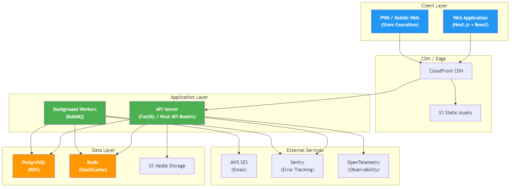
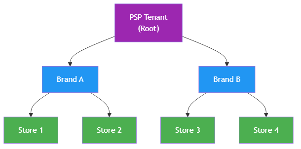
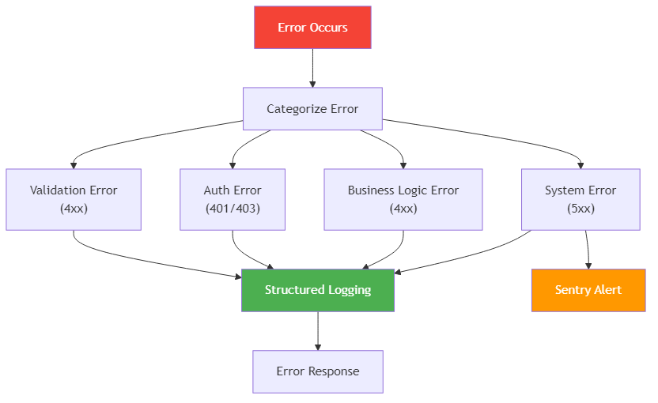
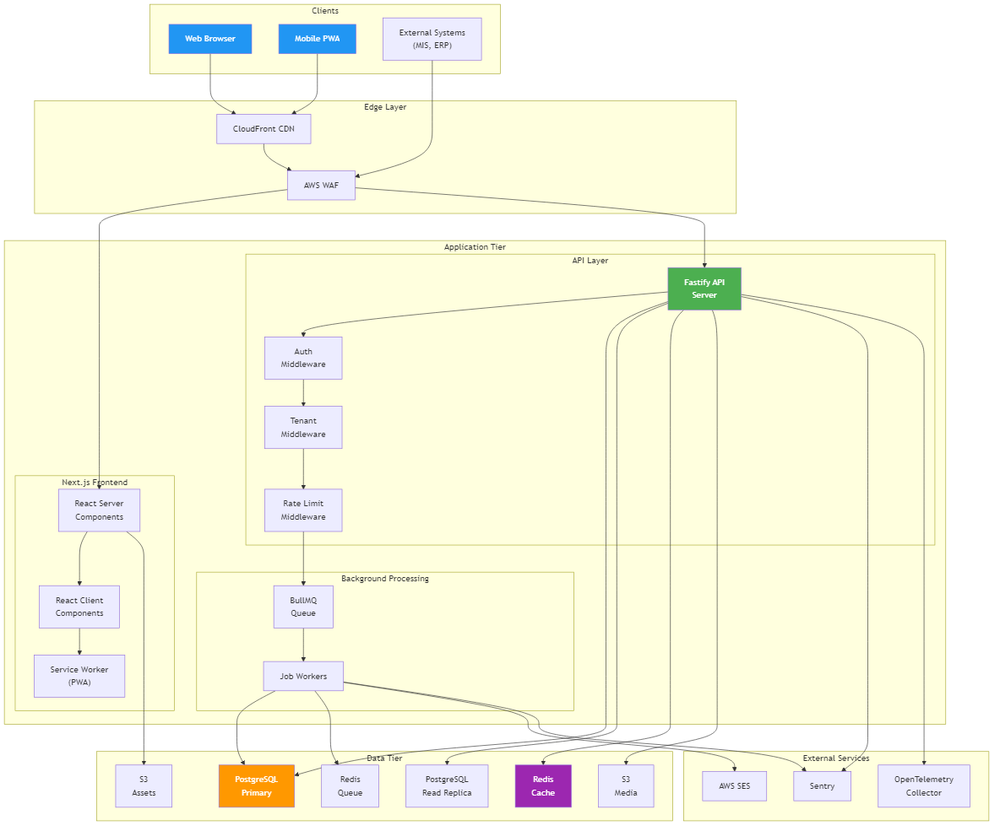
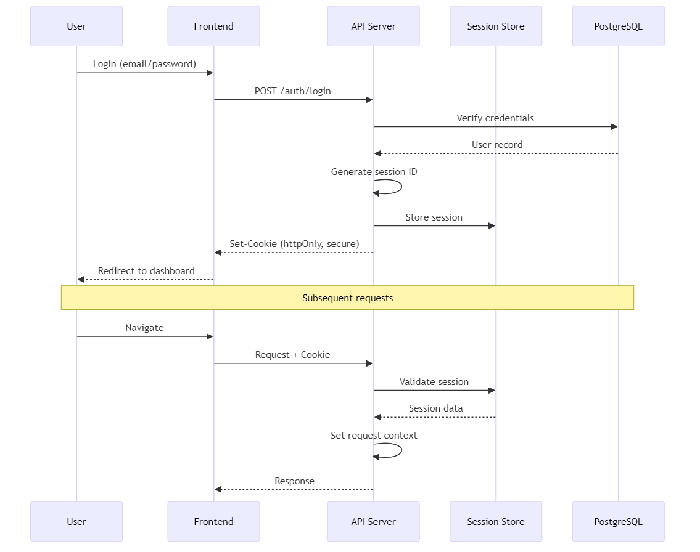
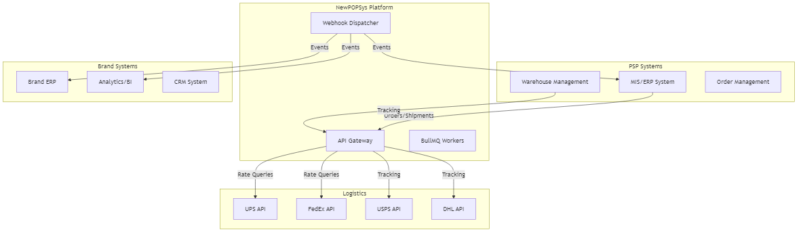
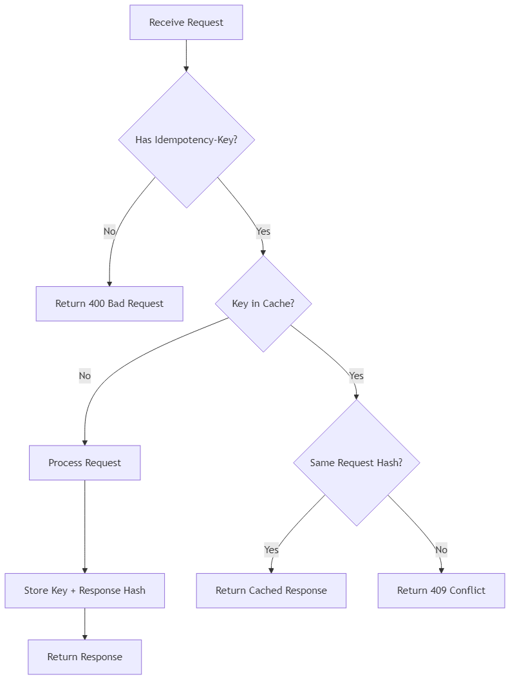
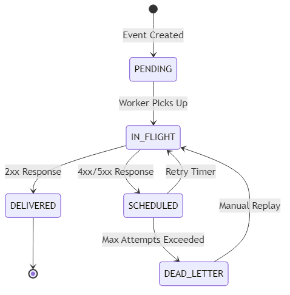



---

# 3.1 Database Model

> **IEEE 830 Reference**: Section 3.1 - System Architecture: Database Model
> **Source Documents**:
> - [Database Model Overview](../../06_Database_Model/README.md)
> - [Foundation Analysis](../../06_Database_Model/FOUNDATION_ANALYSIS.md)
> - [Entity Crosswalk](../../06_Database_Model/07_Validation/ENTITY_CROSSWALK.md)
> **Version**: 1.0
> **Last Updated**: 2026-01-01

---

## 3.1.1 Purpose

This section defines the database model for NewPOPSys v1, including table organization, core design patterns, and entity relationships. The schema supports multi-tenant operations, soft-delete data retention, and comprehensive audit trails.

---

## 3.1.2 Database Environment

### 3.1.2.1 Technology Specifications

| Component | Specification | Purpose |
|-----------|---------------|---------|
| **DBMS** | PostgreSQL 15+ | Primary relational database |
| **ORM** | Drizzle ORM (TypeScript) | Type-safe schema management and migrations |
| **Extensions** | uuid-ossp, pgcrypto | UUID generation and cryptographic functions |
| **Hosting** | AWS RDS | Managed PostgreSQL with automated backups |

### 3.1.2.2 Schema Statistics

| Metric | Count |
|--------|-------|
| Total Tables | 41 |
| Enum Types | 18 |
| Modules | 11 |
| Foreign Key Relationships | 100+ |

---

## 3.1.3 Core Design Patterns

### 3.1.3.1 Multi-Tenancy Model

All data is scoped through a two-level tenant hierarchy:

```
tenants (PSP root)
  |-- brands (customer brands)
       |-- campaigns, stores, users (via memberships)
```

**Implementation Rules**:
- Every tenant represents a PSP organization with isolated data
- Brands cannot access other brands' data within the same PSP
- All queries scoped by `tenant_id` from JWT authentication
- Row-Level Security planned for Phase 2

### 3.1.3.2 Primary Key Strategy

All tables use UUID primary keys for distributed ID generation:

```sql
id UUID PRIMARY KEY DEFAULT gen_random_uuid()
```

### 3.1.3.3 Soft Delete Pattern

All tables implement logical deletion for data recovery and audit compliance:

```sql
deleted_at TIMESTAMPTZ  -- NULL = active, timestamp = deleted
```

All indexes use `WHERE deleted_at IS NULL` for active record filtering.

### 3.1.3.4 Audit Trail

Standard timestamp columns on all tables:

| Column | Type | Purpose |
|--------|------|---------|
| `created_at` | TIMESTAMPTZ | Record creation timestamp |
| `updated_at` | TIMESTAMPTZ | Auto-updated via trigger on modification |
| `deleted_at` | TIMESTAMPTZ | Soft delete marker |

State changes logged to `audit_events` with before/after JSON snapshots.

---

## 3.1.4 Table Distribution by Module

### 3.1.4.1 Module Overview

| Module | Tables | Enums | Primary Relationships |
|--------|--------|-------|----------------------|
| 1. Tenancy & Identity | 5 | 2 | User -> Membership -> Brand |
| 2. Stores & Grouping | 7 | 1 | Brand -> Region -> Store |
| 3. Surveys & Layouts | 6 | 0 | Store -> Layout -> Slot |
| 4. Campaigns & Kits | 5 | 4 | Campaign -> Assignment -> Item |
| 5. Fulfillment | 4 | 3 | Order -> Shipment -> Tracking |
| 6. Execution & Verification | 5 | 2 | Photo -> Review -> Retake |
| 7. Issues & Reorders | 3 | 2 | Issue -> Reorder -> Order |
| 8. Notifications | 2 | 1 | User -> Notification |
| 9. Webhooks & Integration | 2 | 0 | Endpoint -> Delivery |
| 10. Exports & Jobs | 1 | 2 | Job -> S3 File |
| 11. Audit | 1 | 1 | Event -> Actor |
| **Total** | **41** | **18** | |

### 3.1.4.2 Module 1: Tenancy & Identity (5 tables)

| Table | Purpose | Key Fields |
|-------|---------|------------|
| `tenants` | PSP root entity | slug, subscription_tier, settings_json |
| `brands` | Customer brands | tenant_id, code, logo_url |
| `users` | Human users | email, password_hash, is_active |
| `memberships` | User-role-scope binding | user_id, brand_id, role, region_scope_id |
| `api_keys` | Integration credentials | key_hash, scopes[], expires_at |

### 3.1.4.3 Module 2: Stores & Grouping (7 tables)

| Table | Purpose | Key Fields |
|-------|---------|------------|
| `regions` | Geographic hierarchy (required) | brand_id, parent_region_id |
| `districts` | Sub-level grouping (optional) | region_id, name |
| `territories` | Lowest hierarchy level | district_id, region_id |
| `stores` | Physical locations | region_id, external_store_guid, status |
| `store_groups` | Custom campaign groupings | brand_id, selection_criteria_json |
| `store_group_memberships` | Store-to-group M:N | store_id, group_id |
| `store_invitations` | Store onboarding | email, token, expires_at |

### 3.1.4.4 Module 3: Surveys & Layouts (6 tables)

| Table | Purpose | Key Fields |
|-------|---------|------------|
| `survey_templates` | Reusable survey definitions | brand_id, definition_json |
| `survey_versions` | Immutable snapshots | template_id, version_number, published_at |
| `store_layouts` | Physical store layouts | store_id, is_current |
| `location_slots` | Ad placement locations | layout_id, slot_code |
| `photo_rules` | Photo requirements | min_photos, required_angles[] |
| `store_survey_responses` | Survey answers | assignment_id, submitted_at |

### 3.1.4.5 Module 4: Campaigns & Kits (5 tables)

| Table | Purpose | Key Fields |
|-------|---------|------------|
| `campaigns` | Promotional programs | status, install_start, install_end |
| `kit_definitions` | Item templates | campaign_id, is_template |
| `kit_items` | Items in kit | sku, quantity, photo_rule_id |
| `store_assignments` | Store participation | campaign_id, store_id, pinned_layout_id |
| `assignment_items` | Items per store | assignment_id, kit_item_id, slot_id |

### 3.1.4.6 Module 5: Fulfillment (4 tables)

| Table | Purpose | Key Fields |
|-------|---------|------------|
| `store_orders` | Orders to PSP | order_type, status, psp_order_ref |
| `order_lines` | Line items | order_id, sku, quantity |
| `shipments` | Physical shipments | carrier, tracking_numbers[] |
| `shipment_lines` | Items shipped | shipment_id, quantity_shipped |

### 3.1.4.7 Module 6: Execution & Verification (5 tables)

| Table | Purpose | Key Fields |
|-------|---------|------------|
| `receive_verifications` | Receipt confirmation | assignment_id, verified_at |
| `photo_uploads` | Proof photos | s3_key, review_status |
| `photo_reviews` | Admin review decisions | photo_id, decision, reviewer_id |
| `retake_requests` | Rework requests | photo_id, reason, resolved_at |
| `completion_attestations` | Final sign-off | assignment_id, attested_by |

### 3.1.4.8 Modules 7-11: Supporting Tables

| Module | Tables | Purpose |
|--------|--------|---------|
| Issues & Reorders | `issue_requests`, `issue_lines`, `reorders` | Problem reporting and replacement orders |
| Notifications | `notification_preferences`, `notifications` | User notification delivery |
| Webhooks | `webhook_endpoints`, `webhook_deliveries` | Integration event delivery |
| Exports | `export_jobs` | Report generation queue |
| Audit | `audit_events` | Immutable action log |

---

## 3.1.5 Key Enumerations

### 3.1.5.1 Role-Based Access Control

```sql
CREATE TYPE role_enum AS ENUM (
  'PLATFORM_ADMIN',    -- Full system access
  'PSP_ADMIN',         -- PSP tenant administration
  'PSP_OPS',           -- Production/fulfillment operations
  'BRAND_ADMIN',       -- Full brand configuration
  'CAMPAIGN_MANAGER',  -- Campaign-scoped access
  'REGIONAL_MANAGER',  -- Region-scoped oversight
  'STORE_MANAGER',     -- Full store privileges
  'STORE_OPERATOR'     -- Execute tasks only
);
```

### 3.1.5.2 State Machine Enums

| Enum | Values | Purpose |
|------|--------|---------|
| `campaign_status_enum` | DRAFT, SCHEDULED, PUBLISHED, COMPLETED, CANCELLED, ARCHIVED | Campaign lifecycle |
| `store_assignment_status_enum` | ASSIGNED, READY, IN_PROGRESS, SUBMITTED, REWORK_REQUIRED, COMPLETE, REOPENED, WAIVED | Store execution state |
| `store_order_status_enum` | GENERATED, ACKNOWLEDGED, IN_PRODUCTION, KITTING, READY_TO_SHIP, PARTIALLY_SHIPPED, SHIPPED, DELIVERED, CLOSED, CANCELLED | Order fulfillment state |
| `photo_review_status_enum` | PENDING, APPROVED, REJECTED, SUPERSEDED | Photo verification state |
| `issue_request_status_enum` | OPEN, TRIAGED, AWAITING_APPROVAL, APPROVED, IN_FULFILLMENT, DENIED, RESOLVED | Issue resolution state |

### 3.1.5.3 Computed Statuses (Application Layer)

The following statuses are derived from data, not stored:

- **FulfillmentStatus**: Computed from shipment quantities
- **ReceiptStatus**: Computed from delivery confirmations
- **ExecutionStatus**: Computed from installation progress
- **VerificationStatus**: Computed from photo reviews
- **StorePhase**: Rollup of all assignment statuses

---

## 3.1.6 Relationship Chains

### 3.1.6.1 Campaign Execution Flow

```
tenants -> brands -> campaigns -> store_assignments -> [orders, photos, issues]
```

### 3.1.6.2 Store Hierarchy

```
brands -> regions -> stores -> layouts -> slots
              |
          districts -> territories
```

### 3.1.6.3 Photo Verification Flow

```
store_assignments -> photo_uploads -> photo_reviews -> retake_requests
```

### 3.1.6.4 Issue Resolution Flow

```
store_assignments -> issue_requests -> reorders -> store_orders
```

---

## 3.1.7 JSONB Usage Patterns

| Column Pattern | Tables | Purpose |
|----------------|--------|---------|
| `settings_json` | tenants, brands | Extensible configuration |
| `metadata_json` | Multiple | Custom attributes |
| `definition_json` | survey_templates | Versioned survey schemas |
| `selection_recipe_json` | campaigns | Store selection criteria |
| `tracking_numbers` | shipments | Array of carrier tracking IDs |

All JSONB columns default to `'{}'` (empty object), not NULL.

---

## 3.1.8 Cross-References

| Reference | Description |
|-----------|-------------|
| Section 3.2 | Application Architecture |
| Section 3.3 | Technology Stack |
| Section 4.1 | RBAC Model Details |
| SUPP-035 | Field-level data model specification |
| SUPP-002 | Core domain model and state machines |

---

*Document Status: Complete*
*IEEE 830 Compliance: Section 3.1 - Data Design / Database Model*


---

# 3.2 Application Architecture

## Overview

| Field | Value |
|-------|-------|
| **System** | NewPOPSys v1.38 |
| **Document** | Application Architecture Specification |
| **Version** | 1.0 |
| **Last Updated** | 2026-01-01 |
| **SOW References** | SUPP-012, SUPP-021, Architecture_Principles.md |

This section defines the application layer architecture for NewPOPSys v1.38, including the frontend/backend structure, multi-tenant patterns, module organization, state management, and error handling strategies.

---

## 1. Application Layer Architecture

### 1.1 High-Level Architecture

NewPOPSys follows a **modular monolith** architecture pattern for v1, designed to evolve into selective microservices as scaling demands require. The application is structured as a Turborepo monorepo with clear separation between frontend, backend, and shared packages.



### 1.2 Monorepo Structure

The application uses Turborepo for monorepo management with the following structure:

```
/
├── apps/
│   ├── web/                    # Next.js frontend application
│   │   ├── app/               # App router pages
│   │   ├── components/        # React components
│   │   ├── hooks/             # Custom React hooks
│   │   └── styles/            # CSS/Tailwind styles
│   │
│   ├── api/                    # Fastify API server
│   │   ├── routes/            # API route handlers
│   │   ├── services/          # Business logic services
│   │   ├── middleware/        # Auth, validation, tenant context
│   │   └── plugins/           # Fastify plugins
│   │
│   └── worker/                 # BullMQ background workers
│       ├── jobs/              # Job processors
│       ├── queues/            # Queue definitions
│       └── handlers/          # Event handlers
│
├── packages/
│   ├── shared/                 # Shared types, utilities, Zod schemas
│   │   ├── types/             # TypeScript type definitions
│   │   ├── schemas/           # Zod validation schemas
│   │   └── utils/             # Common utility functions
│   │
│   ├── db/                     # Prisma schema and migrations
│   │   ├── prisma/            # Schema and migrations
│   │   └── client/            # Generated Prisma client
│   │
│   └── ui/                     # Shared UI component library
│       ├── components/        # Reusable React components
│       └── primitives/        # Base design system components
│
└── tooling/
    ├── eslint/                 # Shared ESLint configuration
    ├── typescript/             # Shared TypeScript configuration
    └── tailwind/               # Shared Tailwind configuration
```

### 1.3 Frontend Architecture (Next.js)

The frontend uses Next.js with the App Router pattern:

| Aspect | Implementation |
|--------|----------------|
| **Framework** | Next.js 14+ with App Router |
| **Rendering** | Server Components (default) + Client Components (interactive) |
| **Styling** | Tailwind CSS + shadcn/ui component library |
| **State** | React Server Components + React Query for client state |
| **Forms** | React Hook Form + Zod validation |
| **PWA** | Service Worker scaffold for offline-capable store execution |

**Route Organization by Module:**

```
app/
├── (auth)/                     # Authentication routes
│   ├── login/
│   └── forgot-password/
│
├── (psp)/                      # PSP Operations module
│   ├── dashboard/
│   ├── orders/
│   ├── shipments/
│   └── batches/
│
├── (brand)/                    # Brand Admin module
│   ├── campaigns/
│   ├── stores/
│   ├── kits/
│   └── reviews/
│
├── (store)/                    # Store Portal / Mobile PWA
│   ├── tasks/
│   ├── campaigns/
│   ├── receive/
│   └── install/
│
└── (admin)/                    # Platform Admin module
    ├── tenants/
    ├── users/
    └── settings/
```

### 1.4 Backend Architecture (Fastify API)

The API layer uses Fastify for performance and developer ergonomics:

| Aspect | Implementation |
|--------|----------------|
| **Framework** | Fastify with TypeScript |
| **Validation** | Zod schemas (shared with frontend) |
| **Documentation** | OpenAPI 3.0 auto-generated from Zod schemas |
| **Authentication** | Session cookies (web), API keys + HMAC (webhooks) |
| **Rate Limiting** | Per-tenant rate limits via Redis |

**API Route Organization:**

```
routes/
├── v1/
│   ├── auth/                   # Authentication endpoints
│   ├── campaigns/              # Campaign CRUD + publish
│   ├── stores/                 # Store management
│   ├── orders/                 # Order/fulfillment operations
│   ├── shipments/              # Shipment tracking
│   ├── issues/                 # Issue/reorder management
│   ├── reviews/                # Photo review queue
│   ├── exports/                # Report generation
│   └── webhooks/               # Inbound webhook handlers
│
└── internal/                   # Internal service endpoints
    ├── health/
    └── metrics/
```

---

## 2. Multi-Tenant Architecture

### 2.1 Tenancy Model (v1)

NewPOPSys implements a **Shared Database, Shared Schema** multi-tenancy model with Row-Level Security (RLS) for data isolation.


### 2.2 Tenant Context Propagation

Every request includes tenant context that flows through all layers:

```typescript
// Tenant context interface
interface RequestContext {
  tenantId: string;      // PSP tenant identifier
  userId: string;        // Authenticated user ID
  brandId?: string;      // Brand scope (if applicable)
  permissions: string[]; // Resolved RBAC permissions
  sessionId: string;     // For audit logging
}

// Middleware extracts tenant from JWT/session
async function tenantMiddleware(request, reply) {
  const session = await getSession(request);
  request.context = {
    tenantId: session.tenantId,
    userId: session.userId,
    brandId: session.brandId,
    permissions: await resolvePermissions(session),
    sessionId: session.id
  };

  // Set PostgreSQL session variable for RLS
  await db.$executeRaw`SELECT set_config('app.current_tenant', ${session.tenantId}, true)`;
}
```

### 2.3 Row-Level Security Implementation

```sql
-- Campaign table with tenant isolation
CREATE TABLE campaigns (
  id UUID PRIMARY KEY DEFAULT gen_random_uuid(),
  tenant_id UUID NOT NULL REFERENCES tenants(id),
  brand_id UUID NOT NULL REFERENCES brands(id),
  name VARCHAR(255) NOT NULL,
  status campaign_status NOT NULL DEFAULT 'DRAFT',
  created_at TIMESTAMPTZ DEFAULT NOW(),
  updated_at TIMESTAMPTZ DEFAULT NOW()
);

-- Enable RLS
ALTER TABLE campaigns ENABLE ROW LEVEL SECURITY;

-- Tenant isolation policy
CREATE POLICY tenant_isolation ON campaigns
  USING (tenant_id = current_setting('app.current_tenant')::UUID);

-- Brand-level filtering (for Brand Admin scope)
CREATE POLICY brand_scope ON campaigns
  USING (
    current_setting('app.user_role') = 'PLATFORM_ADMIN'
    OR brand_id = current_setting('app.current_brand')::UUID
  );
```

### 2.4 Tenant Hierarchy



---

## 3. Module Organization

### 3.1 Module Overview

NewPOPSys is organized into six functional modules, each serving specific persona groups:

| Module | Series | Screen Count | Primary Personas |
|--------|--------|--------------|------------------|
| **SharedFoundations** | L-series | ~10 | All users |
| **MobilePWA** | M-series | 8 | Store Manager, Store Operator |
| **BrandAdmin** | B-series | 7 | Brand Admin, Campaign Manager, Regional Manager |
| **PSPOperations** | P-series | 3 | PSP Admin, Production Operator |
| **StorePortal** | S-series | 5 | Store Manager, Store Operator |
| **PlatformAdmin** | Admin | ~5 | Platform Admin, Support Agent |

### 3.2 Module Component Diagram


### 3.3 Module Dependencies


---

## 4. State Management

### 4.1 State Management Strategy

NewPOPSys employs a layered state management approach:

| Layer | Technology | Purpose |
|-------|------------|---------|
| **Server State** | PostgreSQL + Redis | Persistent application state |
| **Session State** | Redis-backed sessions | User authentication, tenant context |
| **Server Components** | React Server Components | Data fetching, initial render |
| **Client Cache** | React Query (TanStack Query) | Client-side data caching, optimistic updates |
| **UI State** | React useState/useReducer | Component-local interactive state |
| **Form State** | React Hook Form | Form validation, submission handling |

### 4.2 Data Flow Architecture


### 4.3 Offline Support (PWA)

For store execution workflows, the PWA provides best-effort offline support:

```typescript
// Service Worker caching strategy
const cacheStrategies = {
  // Static assets: Cache-first
  static: 'CacheFirst',

  // API data: Network-first with offline fallback
  api: 'NetworkFirst',

  // Draft submissions: IndexedDB queue
  drafts: 'BackgroundSync'
};

// Offline draft sync
interface OfflineDraft {
  id: string;
  type: 'photo_upload' | 'survey_response' | 'issue_report';
  payload: unknown;
  createdAt: Date;
  syncStatus: 'pending' | 'syncing' | 'failed';
}

// Sync on reconnection
async function syncOfflineDrafts() {
  const drafts = await getDraftsFromIndexedDB();
  for (const draft of drafts) {
    await submitDraft(draft);
    await markDraftSynced(draft.id);
  }
}
```

---

## 5. Error Handling

### 5.1 Error Handling Strategy

NewPOPSys implements a comprehensive error handling strategy across all layers:



### 5.2 Error Categories

| Category | HTTP Code | Logging | Alerting | User Message |
|----------|-----------|---------|----------|--------------|
| **Validation** | 400 | INFO | None | Field-specific errors |
| **Authentication** | 401 | WARN | Rate-based | "Please log in" |
| **Authorization** | 403 | WARN | Rate-based | "Access denied" |
| **Not Found** | 404 | INFO | None | "Resource not found" |
| **Business Logic** | 422 | INFO | None | Specific business message |
| **Rate Limited** | 429 | WARN | Threshold | "Too many requests" |
| **Server Error** | 500 | ERROR | Immediate | "Something went wrong" |
| **Service Unavailable** | 503 | ERROR | Immediate | "Service temporarily unavailable" |

### 5.3 Structured Error Response

```typescript
// Standard error response format
interface ApiError {
  error: {
    code: string;           // Machine-readable error code
    message: string;        // Human-readable message
    details?: {             // Validation errors
      field: string;
      message: string;
    }[];
    requestId: string;      // For support reference
    timestamp: string;      // ISO-8601
  };
}

// Example validation error
{
  "error": {
    "code": "VALIDATION_ERROR",
    "message": "Invalid request data",
    "details": [
      { "field": "campaign.name", "message": "Name is required" },
      { "field": "campaign.startDate", "message": "Start date must be in the future" }
    ],
    "requestId": "req_abc123",
    "timestamp": "2026-01-01T10:30:00Z"
  }
}
```

### 5.4 Error Handling Implementation

```typescript
// Global error handler (Fastify)
fastify.setErrorHandler(async (error, request, reply) => {
  const requestId = request.id;
  const context = request.context;

  // Structured log
  const logEntry = {
    level: error.statusCode >= 500 ? 'error' : 'warn',
    requestId,
    tenantId: context?.tenantId,
    userId: context?.userId,
    method: request.method,
    url: request.url,
    error: {
      name: error.name,
      message: error.message,
      code: error.code,
      stack: error.stack
    }
  };

  logger.log(logEntry);

  // Sentry for 5xx errors
  if (error.statusCode >= 500) {
    Sentry.captureException(error, {
      extra: { requestId, tenantId: context?.tenantId }
    });
  }

  // Sanitized response (no internal details)
  return reply.status(error.statusCode || 500).send({
    error: {
      code: error.code || 'INTERNAL_ERROR',
      message: error.statusCode >= 500
        ? 'An unexpected error occurred'
        : error.message,
      requestId,
      timestamp: new Date().toISOString()
    }
  });
});
```

### 5.5 Observability Integration

```typescript
// OpenTelemetry tracing
import { trace, SpanStatusCode } from '@opentelemetry/api';

const tracer = trace.getTracer('popsys-api');

async function createCampaign(data: CampaignInput, context: RequestContext) {
  const span = tracer.startSpan('createCampaign');

  try {
    span.setAttributes({
      'tenant.id': context.tenantId,
      'campaign.type': data.type
    });

    const campaign = await campaignService.create(data, context);

    span.setStatus({ code: SpanStatusCode.OK });
    return campaign;

  } catch (error) {
    span.setStatus({
      code: SpanStatusCode.ERROR,
      message: error.message
    });
    span.recordException(error);
    throw error;

  } finally {
    span.end();
  }
}
```

---

## 6. Component Interaction Diagram

### 6.1 Full System Component Diagram



### 6.2 Request Flow Sequence


---

## 7. Security Architecture

### 7.1 Authentication Flow



### 7.2 API Key Authentication (Integrations)


---

## 8. Deployment Architecture

### 8.1 Environment Strategy

| Environment | Purpose | Infrastructure |
|-------------|---------|----------------|
| **Development** | Local development | Docker Compose |
| **Staging** | Integration testing, QA | AWS ECS (single instance) |
| **Production** | Live system | AWS ECS (auto-scaling) |

### 8.2 CI/CD Pipeline


### 8.3 Quality Gates

All deployments must pass:

1. **Linting** - ESLint, Prettier
2. **Type Checking** - TypeScript strict mode
3. **Unit Tests** - Jest (80% coverage minimum)
4. **Integration Tests** - API contract verification
5. **E2E Tests** - Playwright for critical paths
6. **OpenAPI Drift Check** - API spec matches implementation
7. **Security Scan** - npm audit, dependency vulnerabilities

---

## References

| Document | Description |
|----------|-------------|
| [SUPP-012](../../02_SUPPs/Platform_Ops_Agent_Harness/SUPP-012%20-%20Platform%20Ops%20-%20Agent%20Harness%20-%20Technology%20Selections%20ADR.md) | Technology stack selections |
| [SUPP-021](../../02_SUPPs/Platform_Ops_Agent_Harness/SUPP-021%20-%20Platform%20Ops%20-%20Agent%20Harness%20-%20Repo%20CI%20and%20Vertical%20Slice%20Plan.md) | Monorepo structure and CI gates |
| [SUPP-001](../../02_SUPPs/Shared_Foundations/SUPP-001%20-%20Shared%20Foundations%20-%20Persona%20Workflows%20JTBD%20Screens.md) | Persona workflows and screens |
| [SUPP-003](../../02_SUPPs/Shared_Foundations/SUPP-003%20-%20Shared%20Foundations%20-%20RBAC%20and%20Permissions%20Matrix.md) | RBAC and permission matrix |
| [Architecture Principles](../../Post_v1/13_Technical_Architecture/Architecture_Principles.md) | Core architectural principles |

---

*Document Version: 1.0*
*Last Updated: 2026-01-01*
*IEEE 830 Compliant*


---

# 3.3 Technology Stack

> **IEEE 830 Reference**: Section 3.3 - System Architecture: Technology Stack
> **Source Document**: [SUPP-012 - Technology Selections ADR](../../02_SUPPs/Platform_Ops_Agent_Harness/SUPP-012%20-%20Platform%20Ops%20-%20Agent%20Harness%20-%20Technology%20Selections%20ADR.md)
> **Version**: 1.0
> **Last Updated**: 2026-01-01

---

## 3.3.1 Purpose

This section defines the technology selections for NewPOPSys v1. All decisions documented here are **locked for v1** to ensure deterministic builds and consistent infrastructure across environments.

---

## 3.3.2 Technology Matrix

### 3.3.2.1 Infrastructure Layer

| Category | Selection | Specification | Notes |
|----------|-----------|---------------|-------|
| **Hosting** | AWS | ECS Fargate or App Runner | Containerized deployment; portable to GCP/Azure |
| **Database** | PostgreSQL 15+ | RDS | JSONB for survey schemas; relational constraints for fulfillment |
| **Cache/Queue** | Redis | ElastiCache + BullMQ | Async workers for exports, webhooks, purge jobs |
| **Object Storage** | S3 | Presigned uploads | DB stores metadata + pointers only |
| **CDN** | CloudFront | Edge caching | Media delivery optimization |
| **Environments** | 3-tier | dev + staging + prod | Staging required for pilot validation |

### 3.3.2.2 Application Layer

| Category | Selection | Specification | Notes |
|----------|-----------|---------------|-------|
| **Frontend** | Next.js (React) | App Router | PWA scaffold for store execution |
| **Backend** | TypeScript Node.js | Next API Routes or Fastify/Nest | Consistent language across stack |
| **ORM** | Drizzle ORM | SQL-level constraints | Migration tooling with enforced relationships |
| **i18n** | next-intl | English v1 | Spanish scaffold prepared; keys stable from day 1 |

### 3.3.2.3 Security & Authentication

| Category | Selection | Specification | Notes |
|----------|-----------|---------------|-------|
| **Auth (Web)** | Session Cookies | Server-side sessions | Optimal UX for web application |
| **Auth (Integration)** | API Keys | Hashed storage | Least privilege scopes |
| **Webhook Security** | HMAC Signatures | + Idempotency-Key | Auditable; replay protection |
| **File Scanning** | ClamAV | Scaffold only (optional) | Provider scan alternative accepted |

### 3.3.2.4 Communication & Notifications

| Category | Selection | Specification | Notes |
|----------|-----------|---------------|-------|
| **Email** | SES | SendGrid as swap | Provider-agnostic interface |
| **Webhooks** | Outbox Pattern | BullMQ retry worker | Dead-letter queue for failures |

### 3.3.2.5 Observability & Operations

| Category | Selection | Specification | Notes |
|----------|-----------|---------------|-------|
| **Error Tracking** | Sentry | Real-time alerts | Accelerates pilot stabilization |
| **Telemetry** | OpenTelemetry | Structured JSON logs | Vendor-portable; request ID correlation |
| **CI/CD** | GitHub Actions | Automated pipelines | Lint/typecheck gates required |
| **Testing** | Multi-layer | Unit + Contract + Playwright | Smoke tests for vertical slice |

---

## 3.3.3 Architecture Rationale

### 3.3.3.1 AWS + PostgreSQL + S3

**Decision**: AWS services as primary infrastructure platform.

**Rationale**: Lowest-friction path for a multi-tenant, media-heavy workflow application at pilot scale. RDS PostgreSQL provides:
- JSONB for flexible survey schema storage
- Strong relational constraints for fulfillment/execution workflows
- Proven scalability for anticipated growth

### 3.3.3.2 Session Cookies vs. JWT

**Decision**: Server-side session cookies for web application authentication.

**Rationale**:
- Maintains sane UX for web users
- Simplifies token management
- API keys + HMAC for integrations keeps external access simple and auditable

### 3.3.3.3 OpenTelemetry

**Decision**: OpenTelemetry for observability with structured JSON logs.

**Rationale**:
- Sentry provides immediate pilot stabilization support
- OpenTelemetry ensures vendor portability if observability vendors change
- Request ID correlation enables distributed tracing

### 3.3.3.4 Outbox Pattern for Webhooks

**Decision**: Outbox pattern with BullMQ retry workers.

**Rationale**:
- Guarantees webhook delivery even during transient failures
- Dead-letter queue captures persistent failures for investigation
- Idempotency-Key prevents duplicate processing

---

## 3.3.4 Allowed Overrides

The following substitutions are permitted without architectural changes:

| Component | Allowed Swap | Condition |
|-----------|--------------|-----------|
| Email Provider | SES <-> SendGrid | API abstraction maintained |
| Cloud Provider | AWS -> GCP/Azure | OpenTelemetry + containerized deployment preserved |
| i18n Languages | Expand list | Keep translation keys stable |

---

## 3.3.5 Implementation Constraints

Per SUPP-012, the following constraints apply to implementation:

1. **Event Envelope Format**: Adopt early per SUPP-006
2. **Stable IDs**: Exports must never depend on internal DB row order
3. **Survey Versioning**: Treat as immutable; pin to assignments; require explicit rebase
4. **Migration Tooling**: Enforce SQL-level constraints for core relationships

---

## 3.3.6 Cross-References

| Reference | Description |
|-----------|-------------|
| SUPP-012 | Authoritative technology selections ADR |
| SUPP-006 | Event envelope format specification |
| Section 3.2 | Application Architecture |
| Section 12.2 | Security Requirements |
| Section 12.4 | Scalability Requirements |

---

*Document Status: Complete*
*IEEE 830 Compliance: Section 3.3 - Design Constraints / Technology Stack*


---

# 3.4 Integration Architecture

> **Version**: 1.0
> **Status**: Draft
> **Last Updated**: 2026-01-01
> **References**: SUPP-006, SUPP-012, SUPP-027, SUPP-034, openapi.yaml

---

## 3.4.1 Overview

NewPOPSys integrates with external systems through a robust, event-driven architecture designed for reliability, security, and observability. The integration layer supports:

- **Outbound Webhooks**: At-least-once delivery of system events to PSP and Brand systems
- **Inbound APIs**: RESTful endpoints for external systems to update orders, shipments, and execution status
- **Async Processing**: BullMQ-based queue workers for reliable event delivery and retry handling

| Integration Type | Direction | Primary Consumers |
|-----------------|-----------|-------------------|
| Webhooks | Outbound | PSP MIS, Brand ERP, Logistics Systems |
| REST API | Inbound | PSP Automation, Carrier APIs |
| Email | Outbound | Users (Brand Admins, Store Staff, PSP) |

---

## 3.4.2 External System Integrations

### 3.4.2.1 Integration Partners



### 3.4.2.2 Integration Capabilities by Partner Type

| Partner Type | Receives Webhooks | Sends API Requests | Data Exchanged |
|-------------|-------------------|-------------------|----------------|
| PSP MIS | Yes | Yes | Orders, Shipments, Batches, Alerts |
| Brand ERP | Yes (optional) | No (v1) | Order status, Shipments, Compliance |
| Shipping Carriers | No | Yes (inbound tracking) | Rates, Tracking, Delivery Confirmation |
| Analytics Platforms | Yes | No | Campaign metrics, Execution data |

---

## 3.4.3 Webhook Architecture

### 3.4.3.1 Outbox Pattern Implementation

NewPOPSys uses the **Transactional Outbox Pattern** to ensure reliable webhook delivery without distributed transactions.


### 3.4.3.2 Event Envelope Structure

All webhook deliveries use a standardized envelope format:

```json
{
  "eventId": "evt_01HXYZ...",
  "eventType": "order.created",
  "occurredAt": "2025-12-17T18:00:00Z",
  "schemaVersion": "1.0",
  "pspId": "psp_...",
  "brandId": "br_...",
  "campaignId": "cmp_...",
  "storeId": "sto_...",
  "correlationId": "corr_...",
  "actor": {
    "type": "system|human|integration",
    "id": "usr_..."
  },
  "data": {
    // Event-specific payload
  }
}
```

### 3.4.3.3 Webhook Headers

| Header | Description | Example |
|--------|-------------|---------|
| `X-NewPOPSys-Event` | Event type identifier | `order.created` |
| `X-NewPOPSys-Event-Id` | Unique event ID (UUIDv7) | `evt_01HXYZ...` |
| `X-NewPOPSys-Timestamp` | Unix timestamp (milliseconds) | `1734458400000` |
| `X-NewPOPSys-Signature-256` | HMAC-SHA256 signature | `sha256=abc123...` |
| `X-NewPOPSys-Schema-Version` | Payload schema version | `1.0` |

### 3.4.3.4 Webhook Event Types (v1)

| Event Type | Trigger | Primary Recipients |
|------------|---------|-------------------|
| `order.created` | Orders generated for campaign publish | PSP |
| `order.updated` | Order status/fields updated | PSP, Brand (optional) |
| `shipment.created` | Shipment created (partial allowed) | PSP, Brand |
| `shipment.updated` | Tracking/status updated | PSP, Brand, Store (optional) |
| `batch.updated` | Batch created/updated or membership changed | PSP |
| `alert.late_shipping` | Late shipping threshold breached | PSP, Brand |
| `alert.execution_anomaly` | Receive/verify or completion anomaly | Brand |
| `proof.submitted` | Store submits completion proof | Brand/Regional |
| `photo.rejected` | Admin rejects photo(s) | Store |
| `review.overdue` | Verification SLA breached | Brand/Regional |
| `issue.submitted` | Issue/reorder submitted | PSP, Brand (policy-based) |
| `issue.approval_required` | Approval needed by brand/regional | Brand/Regional |
| `issue.decided` | Issue approved/rejected | PSP, Store (optional) |
| `reorder.shipment.updated` | Replacement shipment status updated | PSP, Brand |
| `campaign.expired.deinstall_required` | Campaign end triggers deinstall | Store, Brand, PSP |
| `deinstall.overdue` | Deinstall overdue (grace exceeded) | Brand/Regional |
| `noncompliance.case_created` | Compliance case created | Brand/Regional |

---

## 3.4.4 API Authentication

### 3.4.4.1 Authentication Methods

| Method | Use Case | Implementation |
|--------|----------|----------------|
| API Keys | Inbound API requests | `X-API-Key` header |
| HMAC-SHA256 | Webhook signature verification | `X-NewPOPSys-Signature-256` header |
| Session Cookies | Web application | Server-side session management |

### 3.4.4.2 API Key Structure

API keys follow a prefixed format for environment identification:

```
Production: vg_live_xxxxxxxxxxxxxxxxxxxxxxxx
Test/Staging: vg_test_xxxxxxxxxxxxxxxxxxxxxxxx
```

**Security Requirements:**
- Keys are hashed (bcrypt) before storage
- Each key has least-privilege scopes assigned
- Key rotation supported with grace period
- Revocation is immediate and audited

### 3.4.4.3 HMAC-SHA256 Webhook Signature Verification


**Signature Calculation:**

```
String to sign: <timestamp>.<raw_body_bytes>
Signature: HMAC_SHA256(secret, string_to_sign)
Header: X-NewPOPSys-Signature-256: sha256=<hex>
```

**Verification Code Example (Node.js):**

```javascript
const crypto = require('crypto');

function verifyWebhook(req, secret) {
  const signature = req.headers['x-newpopsys-signature-256'];
  const timestamp = req.headers['x-newpopsys-timestamp'];
  const body = JSON.stringify(req.body);

  // Check timestamp freshness (5 minute window)
  const now = Math.floor(Date.now() / 1000);
  if (Math.abs(now - parseInt(timestamp)) > 300) {
    throw new Error('Webhook timestamp too old');
  }

  // Compute expected signature
  const payload = `${timestamp}.${body}`;
  const expected = 'sha256=' + crypto
    .createHmac('sha256', secret)
    .update(payload)
    .digest('hex');

  // Constant-time comparison
  if (!crypto.timingSafeEqual(
    Buffer.from(signature),
    Buffer.from(expected)
  )) {
    throw new Error('Invalid webhook signature');
  }

  return true;
}
```

---

## 3.4.5 Idempotency Patterns

### 3.4.5.1 Inbound API Idempotency

All write operations require an `Idempotency-Key` header to ensure safe retries.



**Idempotency Key Requirements:**

| Attribute | Requirement |
|-----------|-------------|
| Header | `Idempotency-Key` |
| Format | 16-64 alphanumeric characters |
| Cache Duration | 24 hours |
| Storage | `{tenantId, key, method, path, request_hash, response_hash, created_at, expires_at}` |

**Response Codes:**

| Scenario | HTTP Code |
|----------|-----------|
| Key missing | 400 Bad Request |
| Key reused, same payload | Original response (cached) |
| Key reused, different payload | 409 Conflict |

### 3.4.5.2 Outbound Webhook Idempotency

Webhook consumers must deduplicate by `eventId`:

- Each event has a globally unique `eventId` (UUIDv7)
- Delivery is at-least-once (retries may duplicate)
- Consumers should store seen `eventId` values for deduplication window
- Recommended deduplication window: 72 hours (matches retry window)

---

## 3.4.6 Error Handling and Retry Strategies

### 3.4.6.1 Webhook Retry Schedule

Exponential backoff with jitter is used for failed webhook deliveries:

| Attempt | Delay (Approximate) |
|---------|---------------------|
| 1 | 1 minute |
| 2 | 5 minutes |
| 3 | 15 minutes |
| 4 | 1 hour |
| 5 | 3 hours |
| 6 | 6 hours |
| 7 | 12 hours |
| 8 | 24 hours |
| 9 | 48 hours |
| 10 | 72 hours |

After attempt 10, delivery enters **DEAD_LETTER** status unless manually replayed.



### 3.4.6.2 Dead Letter Queue Management

- **Automatic DLQ**: After 10 failed attempts (max 72 hours)
- **Manual Replay**: Unlimited, requires admin action with reason/comment
- **Audit Trail**: All replay actions logged with who/when/why

### 3.4.6.3 Circuit Breaker Pattern

For consistently failing endpoints:

| Setting | Default |
|---------|---------|
| Max in-flight per endpoint | 2 concurrent |
| Request timeout | 10 seconds |
| Circuit opens after | N consecutive failures |
| Cool-down period | 5 minutes |

### 3.4.6.4 Response Code Handling

| Response | Action |
|----------|--------|
| 2xx | Mark DELIVERED, no retry |
| 401 | Log signature failure, no retry (configuration error) |
| 403 | Log replay/auth failure, no retry |
| 4xx (other) | Log client error, schedule retry (may be transient) |
| 5xx | Schedule retry with backoff |
| Timeout | Schedule retry with backoff |

---

## 3.4.7 Rate Limiting

### 3.4.7.1 Inbound API Rate Limits

Rate limiting is enforced at the API gateway level with tenant-aware keys:

| Route Group | Default Limit | Enforcement |
|-------------|---------------|-------------|
| Auth/session | 20/min per IP | Protect login endpoints |
| General API | 300/min per user | Tenant + user enforced |
| Uploads presign | 60/min per user | Protect storage costs |
| Exports create | 10/min per tenant | Exports are resource-heavy |

**Rate Limit Headers:**

| Header | Description |
|--------|-------------|
| `X-RateLimit-Limit` | Maximum requests allowed |
| `X-RateLimit-Remaining` | Requests remaining in window |
| `X-RateLimit-Reset` | Unix timestamp when limit resets |

**Exceeded Response:**
- HTTP 429 Too Many Requests
- `Retry-After` header with seconds until reset

### 3.4.7.2 Webhook Concurrency Throttle

Per-endpoint concurrency controls prevent overwhelming consumer systems:

| Setting | Default |
|---------|---------|
| Max in-flight per endpoint | 2 |
| Request timeout | 10 seconds |
| Queue behavior | FIFO with retry scheduling |

---

## 3.4.8 Integration Sequence Diagrams

### 3.4.8.1 Campaign Publish Flow


### 3.4.8.2 Shipment Update Flow


### 3.4.8.3 Issue/Reorder Flow


---

## 3.4.9 Delivery Records Data Model

### 3.4.9.1 Webhook Delivery Record

```
webhook_delivery:
  - id: UUID
  - event_id: UUID (FK to event)
  - endpoint_id: UUID (FK to webhook_endpoint)
  - status: ENUM (PENDING, IN_FLIGHT, DELIVERED, FAILED, DEAD_LETTER, BLOCKED)
  - http_status: INT (nullable)
  - attempt_count: INT
  - next_attempt_at: TIMESTAMP (nullable)
  - last_attempt_at: TIMESTAMP (nullable)
  - last_error: TEXT (nullable)
  - request_id: UUID
  - correlation_id: UUID
  - created_at: TIMESTAMP
  - updated_at: TIMESTAMP
```

### 3.4.9.2 Idempotency Key Record

```
idempotency_key:
  - id: UUID
  - tenant_id: UUID
  - key: VARCHAR(64)
  - method: VARCHAR(10)
  - path: VARCHAR(255)
  - request_hash: VARCHAR(64)
  - response_status: INT
  - response_body_hash: VARCHAR(64)
  - created_at: TIMESTAMP
  - expires_at: TIMESTAMP

UNIQUE(tenant_id, key)
```

---

## 3.4.10 Security Considerations

### 3.4.10.1 Webhook Security

| Control | Implementation |
|---------|----------------|
| Signature Verification | HMAC-SHA256 with shared secret |
| Replay Protection | 5-minute timestamp window + eventId dedup |
| Secret Rotation | Support current + previous secret during rotation |
| TLS | HTTPS required for all webhook endpoints |
| IP Allowlisting | Optional per-tenant for high-security integrations |

### 3.4.10.2 Staging Environment Safety

| Control | Behavior |
|---------|----------|
| Email Allowlist | Only send to whitelisted domains/addresses |
| Webhook Allowlist | Only dispatch to allowlisted URLs |
| Non-allowlisted | Blocked and logged as `blocked_by_policy` |

### 3.4.10.3 API Key Security

- Keys hashed with bcrypt before storage
- Least-privilege scopes per key
- Immediate revocation capability
- Audit logging for all key operations

---

## 3.4.11 Correlation and Tracing

All integration events include `correlationId` for end-to-end tracing:

```
Campaign → Orders → Shipments → Execution → Exports
     ↓         ↓          ↓           ↓          ↓
   corr_xxx  corr_xxx  corr_xxx   corr_xxx   corr_xxx
```

- OpenTelemetry spans linked by correlation ID
- Structured JSON logs include `requestId` and `correlationId`
- Webhook deliveries carry correlation through the chain

---

## 3.4.12 Schema Versioning

### 3.4.12.1 Versioning Strategy

| Change Type | Version Impact |
|-------------|----------------|
| New optional field | Minor version increment |
| Rename/remove field | Major version increment |
| New event type | No version change |

### 3.4.12.2 Consumer Guidelines

- Ignore unknown fields (forward compatibility)
- Handle `eventType` + `schemaVersion` explicitly
- Prepare for schema version in headers: `X-NewPOPSys-Schema-Version`

---

## 3.4.13 Acceptance Criteria

- [ ] AC-001: Webhook deliveries use HMAC-SHA256 signatures with timestamp validation
- [ ] AC-002: Failed webhooks retry with exponential backoff (max 72 hours)
- [ ] AC-003: Dead-letter deliveries are replayable via admin UI with audit trail
- [ ] AC-004: All inbound write APIs require `Idempotency-Key` header
- [ ] AC-005: Duplicate idempotency keys return cached response (same payload) or 409 (different payload)
- [ ] AC-006: Rate limiting returns 429 with `Retry-After` header
- [ ] AC-007: Webhook concurrency per endpoint is limited to prevent overwhelming consumers
- [ ] AC-008: Staging blocks non-allowlisted webhook URLs and email recipients
- [ ] AC-009: All integration events include `correlationId` for tracing
- [ ] AC-010: API keys support rotation with grace period

---

## Changelog

| Version | Date | Description |
|---------|------|-------------|
| 1.0 | 2026-01-01 | Initial SRS section created from SUPP-006, SUPP-012, SUPP-027, SUPP-034, openapi.yaml |

