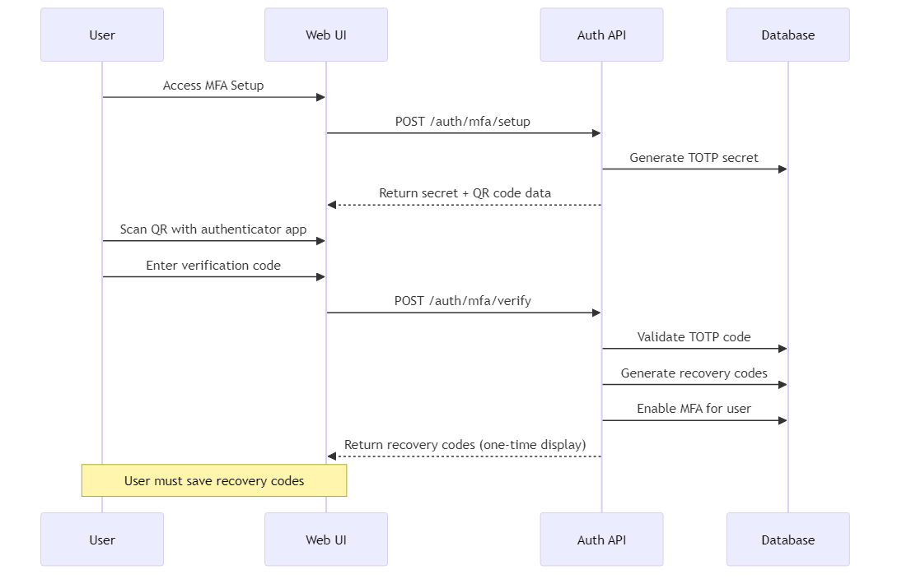
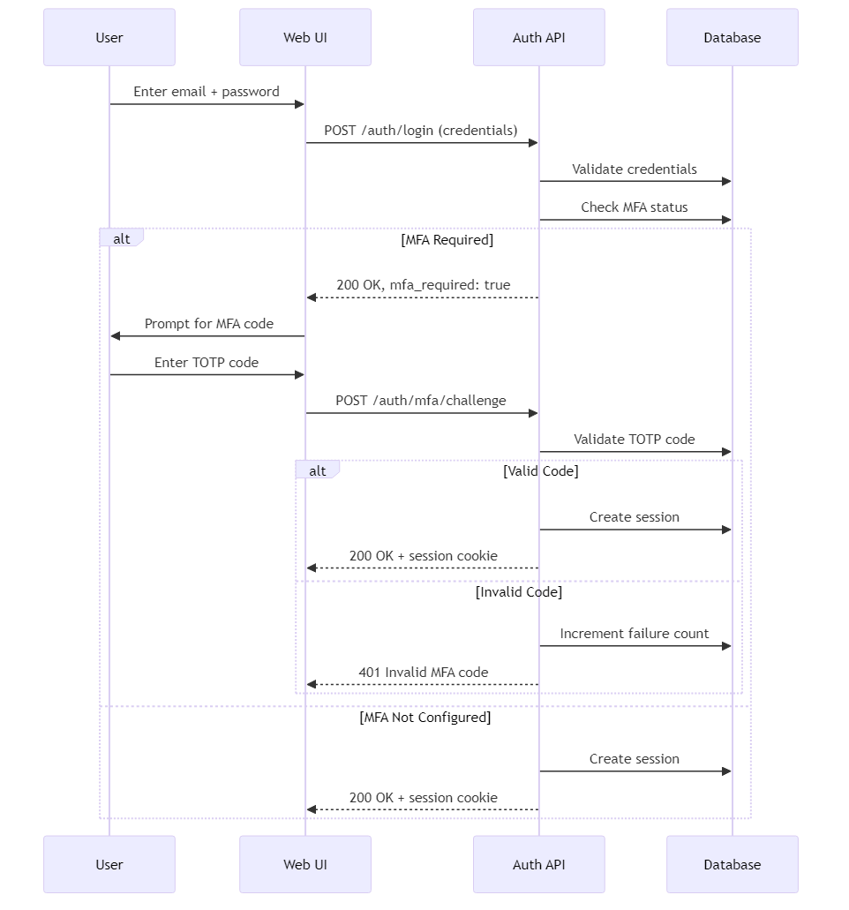
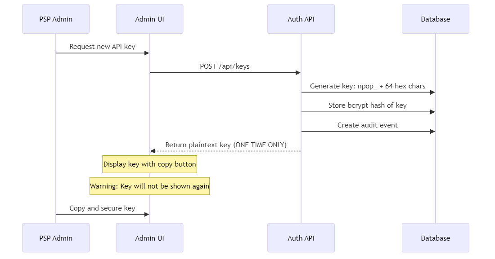
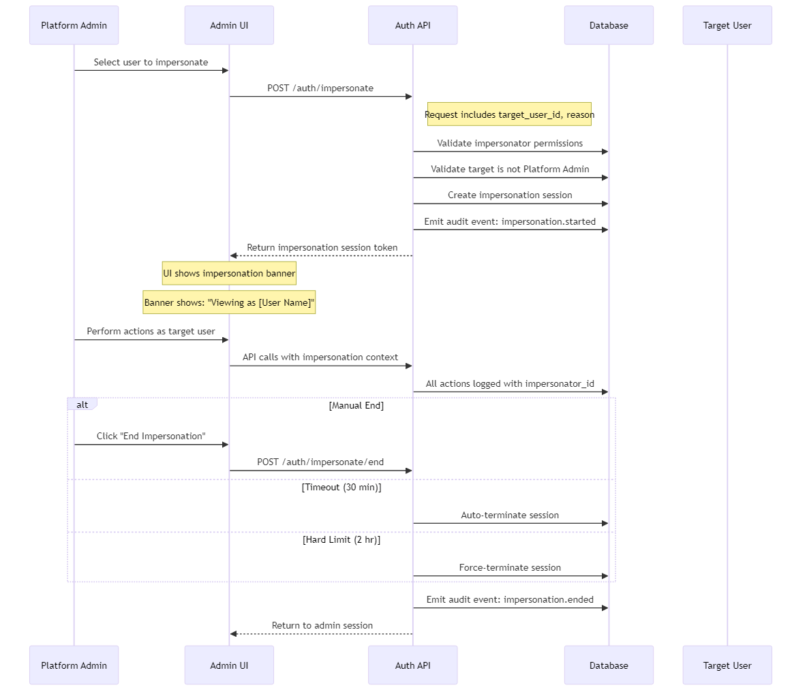
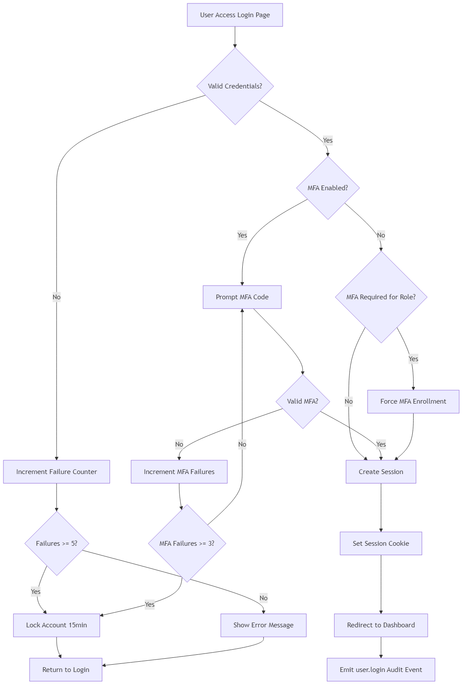
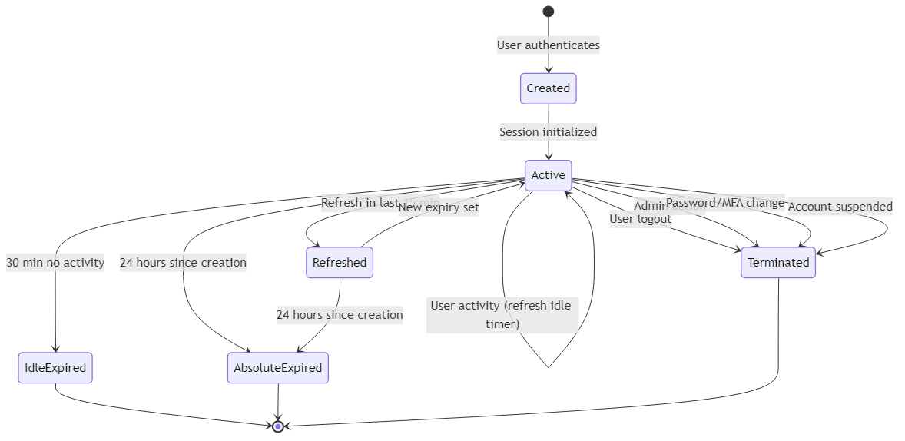



---

# 4.1 Persona Matrix

## 1. Purpose

This section defines the user personas for NewPOPSys v1.38. Each persona represents a distinct user class with specific responsibilities, permission levels, and system interactions. The persona matrix serves as the authoritative reference for role-based access control (RBAC) implementation.

**Authoritative Source**: SUPP-001 - Shared Foundations - Persona Workflows JTBD Screens

---

## 2. Persona Overview

NewPOPSys supports nine (9) distinct personas organized across four hierarchical levels:

| Level | Count | Personas |
|-------|-------|----------|
| PSP Level | 3 | Platform Admin, PSP Admin, Production Operator |
| Brand Level | 3 | Brand Admin, Campaign Manager, Regional Manager |
| Store Level | 2 | Store Manager, Store Operator |
| System Level | 1 | Integration User |

---

## 3. Persona Matrix

### 3.1 PSP Level Personas

| ID | Persona Name | Role Level | Primary Responsibility | Permission Level | Key Screens/Modules |
|----|--------------|------------|------------------------|------------------|---------------------|
| P01 | Platform Admin | PSP | Full system configuration, tenant management, user impersonation for support, security and audit access | All Privileged + Impersonate | Tenant config; System settings; User impersonation; Security dashboard; Full audit log |
| P02 | PSP Admin | PSP | Brand onboarding, PSP-level settings, user management, reporting and exports | PSP All Privileged | Brand onboarding; PSP settings; User management; Campaign list/totals; Exports center; Webhook/API logs |
| P03 | Production Operator | PSP | Update order statuses, create shipments and tracking, process batches, view fulfillment queues | Status & Shipping Updates | Store order list+filters; Order detail; Batch manager; Shipments+tracking; Issues/Reorders queue |

### 3.2 Brand Level Personas

| ID | Persona Name | Role Level | Primary Responsibility | Permission Level | Key Screens/Modules |
|----|--------------|------------|------------------------|------------------|---------------------|
| P04 | Brand Admin | Brand | Full brand configuration, all campaigns access, store management, user permissions | Brand Level Privileged | All Campaign Manager screens + Brand config; Store management; User permissions; Full brand reporting |
| P05 | Campaign Manager | Brand | Build new campaigns, manage assigned campaigns, define kits and photo rules, review proofs and approve | Must be assigned to campaigns | Campaign builder; Store selector; Kit/items editor; Photo rules; Dashboard; Store detail; Review queue; Retake queue; Exports/reports |
| P06 | Regional Manager | Brand | Oversee assigned stores, exception queue management, approve/reject proofs, escalate to Brand Admin | Store Compliance for segment | Exception queue (assigned stores); Store compliance dashboard; Review queue; Retake queue; Waivers/Reopen; Escalation tools |

### 3.3 Store Level Personas

| ID | Persona Name | Role Level | Primary Responsibility | Permission Level | Key Screens/Modules |
|----|--------------|------------|------------------------|------------------|---------------------|
| P07 | Store Manager | Store | Manage store team, approve replacement requests, view all store campaigns, full execution permissions | Full Store Privileges | All Store Operator screens + Team management; Replacement approvals; Store analytics; Full store campaign history |
| P08 | Store Operator | Store | Complete surveys, update status, request replacements (needs Store Manager approval), view assigned campaigns | View Only + Execution | My tasks; Campaign detail; Receive/verify; Issue/reorder request; Pre-install checklist; Install + proof capture; Completion survey + attestation; Retake queue; Deinstall task |

### 3.4 System Level Personas

| ID | Persona Name | Role Level | Primary Responsibility | Permission Level | Key Screens/Modules |
|----|--------------|------------|------------------------|------------------|---------------------|
| P09 | Integration User | System | Inbound API writes, webhook consumption, export triggers, MIS integration | API & Webhook Service Account | API endpoints; Webhook subscriptions; Export triggers; Integration logs |

---

## 4. Permission Hierarchy

```
Platform Admin (P01)
    └── PSP Admin (P02)
            └── Production Operator (P03)
            └── Brand Admin (P04)
                    └── Campaign Manager (P05)
                    └── Regional Manager (P06)
                            └── Store Manager (P07)
                                    └── Store Operator (P08)

Integration User (P09) - Parallel service account with API-scoped access
```

---

## 5. Key Constraints

| Constraint | Description | Affected Personas |
|------------|-------------|-------------------|
| Campaign Assignment | Campaign Managers can only manage campaigns explicitly assigned to them | P05 |
| Store Assignment | Regional Managers only see stores within their assigned segment | P06 |
| Approval Workflow | Store Operators require Store Manager approval for replacement requests | P08 |
| Impersonation | Only Platform Admin may impersonate other users for support | P01 |

---

## 6. References

- **SUPP-001**: Shared Foundations - Persona Workflows JTBD Screens (authoritative source)
- **Section 4.2**: Permission Matrix (detailed RBAC grid)
- **Section 4.3**: Authentication Flows

---

*Document Version: 1.0*
*Last Updated: 2026-01-01*
*IEEE 830 Compliant*


---

# 4.2 Permission Matrix

> **SRS Section**: 4.2 | **Version**: 1.0 | **Status**: Draft
> **Source**: [SUPP-003 - RBAC and Permissions Matrix](../../02_SUPPs/Shared_Foundations/SUPP-003%20-%20Shared%20Foundations%20-%20RBAC%20and%20Permissions%20Matrix.md)
> **Last Updated**: 2026-01-01

---

## 4.2.1 Purpose

This section defines the Role-Based Access Control (RBAC) permission matrix for NewPOPSys v1. It specifies authorized capabilities for each role across system features, completion workflows, and security controls.

## 4.2.2 Role Enumeration

The system defines eight roles via `role_enum`:

| Enum Value | Display Name | Level |
|------------|--------------|-------|
| `PLATFORM_ADMIN` | Platform Admin | PSP |
| `PSP_ADMIN` | PSP Admin | PSP |
| `PSP_OPS` | Production Operator / Support Agent | PSP |
| `BRAND_ADMIN` | Brand Admin | Brand |
| `CAMPAIGN_MANAGER` | Campaign Manager | Brand |
| `REGIONAL_MANAGER` | Regional Manager | Brand |
| `STORE_MANAGER` | Store Manager | Store |
| `STORE_OPERATOR` | Store Operator | Store |

> **Note**: Support Agent uses `PSP_OPS` with `support_scope = true` flag (read-only access).

---

## 4.2.3 Permission Matrix by Level

### 4.2.3.1 PSP Level Permissions

| Capability | Platform Admin | PSP Admin | Production Operator | Support Agent |
|------------|:--------------:|:---------:|:-------------------:|:-------------:|
| Manage tenant settings | Y | N | N | N |
| Impersonate users | Y | N | N | Y* |
| Onboard brand | Y | Y | N | N |
| Invite/manage PSP users | Y | Y | N | N |
| View all brands/campaigns | Y | Y | Y | Y |
| View orders (totals + store) | Y | Y | Y | Y |
| Update order status | Y | Y | Y | N |
| Create/update shipments | Y | Y | Y | N |
| Manage batches | Y | Y | Y | N |
| Approve/reject issues | Y | Y | Y* | N |
| Trigger exports | Y | Y | Y* | N |
| View audit logs | Y | Y | Y* | Y |
| Webhook/API configuration | Y | Y | N | N |
| Replay failed webhooks | Y | Y | N | Y* |

### 4.2.3.2 Brand Level Permissions

| Capability | Brand Admin | Campaign Manager | Regional Manager |
|------------|:-----------:|:----------------:|:----------------:|
| Full brand configuration | Y | N | N |
| Invite/manage brand users | Y | N | N |
| Create/edit stores & groups | Y | N | N |
| Create/edit layouts & surveys | Y | Y* | N |
| Create campaigns & assign stores | Y | Y | N |
| Configure verificationMode + SLA | Y | Y* | N |
| View all campaigns | Y | Y* | Y* |
| Review/approve/reject proofs | Y | Y* | Y* |
| Waive missing proofs | Y | N | Y* |
| Reopen completed store | Y | N | Y* |
| Force-complete campaign | Y | N | N |
| Approve/reject issues | Y | Y* | Y* |
| Trigger exports | Y | Y* | Y* |
| View audit logs | Y | Y* | Y* |

### 4.2.3.3 Store Level Permissions

| Capability | Store Manager | Store Operator |
|------------|:-------------:|:--------------:|
| Manage store team | Y | N |
| View all store campaigns | Y | Y* |
| Execute tasks (receive/install) | Y | Y |
| Upload proofs + completion survey | Y | Y |
| Submit replacement requests | Y | Y* |
| Approve replacement requests | Y | N |
| View store reports | Y | N |
| Trigger exports | Y* | N |
| View audit logs | Y* | N |

### 4.2.3.4 System (Integration User)

| Capability | Integration User |
|------------|:----------------:|
| Inbound API writes (orders/shipments) | Y |
| Webhook consumption | Y |
| Export triggers | Y* |
| Create/edit stores (via API) | Y* |
| View orders/shipments | Y |
| Update order status | Y |
| Create/update shipments | Y |

**Legend**: Y = Full access | Y* = Scoped/limited access | N = No access

---

## 4.2.4 Completion Authority Matrix

| Action | PLATFORM_ADMIN | PSP_ADMIN | PSP_OPS | BRAND_ADMIN | CAMPAIGN_MANAGER | REGIONAL_MANAGER | STORE_MANAGER | STORE_OPERATOR |
|--------|:--------------:|:---------:|:-------:|:-----------:|:----------------:|:----------------:|:-------------:|:--------------:|
| Normal submit completion | Y | Y | N | Y | Y* | Y* | Y | Y |
| Request replacement items | Y | Y | N | Y | Y* | Y* | Y | Y* |
| Approve replacement requests | Y | Y | N | Y | N | N | Y | N |
| Approve/reject photos | Y | Y | N | Y | Y* | Y* | N | N |
| Waive missing proofs | Y | Y | N | Y | N | Y* | N | N |
| Reopen completed store | Y | Y | N | Y | N | Y* | N | N |
| Force-complete campaign | Y | Y | N | Y | N | N | N | N |
| Approve reorders | Y | Y | Y* | Y | N | Y* | N | N |

**Audit Requirements**:
- All completion actions require attestation
- Rejection requires reason code
- Waiver/reopen requires written justification
- Force-complete snapshots incomplete stores

---

## 4.2.5 Security Requirements

### 4.2.5.1 Multi-Factor Authentication

| Role | MFA Requirement |
|------|-----------------|
| PLATFORM_ADMIN | **Required** (TOTP/WebAuthn) |
| PSP_ADMIN | **Required** (TOTP/WebAuthn) |
| BRAND_ADMIN | **Required** (TOTP/WebAuthn) |
| PSP_OPS | Recommended (tenant policy) |
| REGIONAL_MANAGER | Recommended (tenant policy) |
| CAMPAIGN_MANAGER | Optional (brand policy) |
| STORE_MANAGER | Optional (brand policy) |
| STORE_OPERATOR | Optional (brand policy) |

### 4.2.5.2 Impersonation Controls

| Impersonator | Target Scope | Mode | Session Limit |
|--------------|--------------|------|---------------|
| Platform Admin | All users except Platform Admins | Full | 30 min (2 hr max) |
| Support Agent | Store Users only | Read-only | 30 min (2 hr max) |

- All impersonation sessions emit audit events (start/end with reason)
- Original user sees banner when being impersonated
- All other roles cannot impersonate

### 4.2.5.3 API Security

| Control | Requirement |
|---------|-------------|
| API key storage | Hashed; plaintext shown only at creation |
| Key rotation | Supported with revocation |
| Idempotency | Required for all integration writes |
| Rate limiting | Per-key limits with anomaly detection |
| Audit trail | All permissioned writes emit immutable AuditEvents |

---

## 4.2.6 Traceability

| Requirement ID | Description | Source |
|----------------|-------------|--------|
| RBAC-001 | Eight-role enumeration | SUPP-003 Section: Default Roles |
| RBAC-002 | PSP-level permission matrix | SUPP-003 Section: PSP Level Permissions |
| RBAC-003 | Brand-level permission matrix | SUPP-003 Section: Brand Level Permissions |
| RBAC-004 | Store-level permission matrix | SUPP-003 Section: Store Level Permissions |
| RBAC-005 | Completion authority rules | SUPP-003 Section: Completion Authority |
| RBAC-006 | MFA requirements | SUPP-003 Section: Authentication |
| RBAC-007 | Impersonation controls | SUPP-003 Section: Impersonation Controls |
| RBAC-008 | API security controls | SUPP-003 Section: API Security |

---

*Document Status: Draft | IEEE 830 Compliant*


---

# 4.3 Authentication Flows

> **SRS Section**: 4.3 | **Version**: 1.0 | **Status**: Draft
> **System**: NewPOPSys v1.38
> **Source**: [SUPP-003 - RBAC and Permissions Matrix](../../02_SUPPs/Shared_Foundations/SUPP-003%20-%20Shared%20Foundations%20-%20RBAC%20and%20Permissions%20Matrix.md)
> **Last Updated**: 2026-01-01

---

## 4.3.1 Purpose

This section specifies the authentication mechanisms, session management policies, and security flows for NewPOPSys v1.38. It defines requirements for user authentication (web UI), API key authentication (integrations), multi-factor authentication (MFA), password policies, session lifecycle, and user impersonation.

## 4.3.2 Scope

This specification covers:
- Session-based authentication for web UI users
- API key authentication for integration accounts
- Multi-factor authentication requirements and flows
- Password complexity and lifecycle policies
- Session management including expiration and refresh
- User impersonation flow for Platform Admin support

---

## 4.3.3 Authentication Methods

### 4.3.3.1 Session-Based Authentication (Web UI)

The primary authentication method for human users accessing NewPOPSys via web browser.

| Attribute | Specification |
|-----------|---------------|
| **Method** | Email + Password |
| **Session Type** | Server-side session with secure cookie |
| **Cookie Attributes** | `HttpOnly`, `Secure`, `SameSite=Strict` |
| **Session ID** | Cryptographically random, 256-bit minimum |
| **Transport** | HTTPS only (TLS 1.2+) |

### 4.3.3.2 API Key Authentication (Integrations)

Authentication method for Integration User service accounts and external system integrations.

| Attribute | Specification |
|-----------|---------------|
| **Method** | API Key (Bearer token) |
| **Key Format** | Prefix `npop_` + 64-character hex string |
| **Header** | `Authorization: Bearer npop_<key>` |
| **Scope** | PSP-tenant-wide, with per-key permission set |
| **Storage** | bcrypt hash stored; plaintext shown only at creation |

---

## 4.3.4 Password Policy

### 4.3.4.1 Password Requirements

| Requirement | Specification |
|-------------|---------------|
| **Minimum Length** | 12 characters |
| **Complexity** | Must contain: uppercase, lowercase, digit, special character |
| **Prohibited Patterns** | Common passwords (dictionary check), username substring, sequential characters |
| **Hash Algorithm** | bcrypt with cost factor 12 |
| **Salt** | Per-password random salt (built into bcrypt) |

### 4.3.4.2 Password Lifecycle

| Policy | Admin Roles | Non-Admin Roles |
|--------|-------------|-----------------|
| **Rotation Period** | 90 days mandatory | 180 days recommended |
| **Password History** | Last 12 passwords | Last 6 passwords |
| **Expiration Warning** | 14 days before | 7 days before |
| **Grace Period** | None (immediate lockout) | 7 days (password change required at login) |

### 4.3.4.3 Password Reset Flow


---

## 4.3.5 Multi-Factor Authentication (MFA)

### 4.3.5.1 MFA Requirements by Role

| Role | MFA Requirement | Supported Methods |
|------|-----------------|-------------------|
| PLATFORM_ADMIN | **Mandatory** | TOTP, WebAuthn |
| PSP_ADMIN | **Mandatory** | TOTP, WebAuthn |
| BRAND_ADMIN | **Mandatory** | TOTP, WebAuthn |
| PSP_OPS (Production Operator) | Recommended (tenant policy) | TOTP, WebAuthn |
| PSP_OPS (Support Agent) | Recommended (tenant policy) | TOTP, WebAuthn |
| REGIONAL_MANAGER | Recommended (tenant policy) | TOTP, WebAuthn |
| CAMPAIGN_MANAGER | Optional (brand policy) | TOTP |
| STORE_MANAGER | Optional (brand policy) | TOTP |
| STORE_OPERATOR | Optional (brand policy) | TOTP |

### 4.3.5.2 MFA Method Specifications

#### TOTP (Time-Based One-Time Password)

| Attribute | Specification |
|-----------|---------------|
| **Algorithm** | HMAC-SHA1 (RFC 6238) |
| **Digits** | 6 |
| **Period** | 30 seconds |
| **Drift Tolerance** | +/- 1 period (90-second window) |
| **Secret Length** | 160 bits (32-character base32) |
| **Recovery Codes** | 10 single-use codes, 16 characters each |

#### WebAuthn (Recommended for Admin Roles)

| Attribute | Specification |
|-----------|---------------|
| **Authenticator Type** | Platform or roaming authenticator |
| **Attestation** | None required (privacy-preserving) |
| **User Verification** | Required |
| **Resident Key** | Preferred but not required |
| **Supported Algorithms** | ES256, RS256 |

### 4.3.5.3 MFA Enrollment Flow



### 4.3.5.4 MFA Login Flow



---

## 4.3.6 Session Management

### 4.3.6.1 Session Lifecycle Parameters

| Parameter | Web UI Sessions | API Sessions |
|-----------|-----------------|--------------|
| **Session Duration** | 8 hours | N/A (stateless) |
| **Idle Timeout** | 30 minutes | N/A |
| **Absolute Timeout** | 24 hours | N/A |
| **Refresh Window** | Last 15 minutes of session | N/A |
| **Concurrent Sessions** | 5 per user | Unlimited API keys |

### 4.3.6.2 Session Token Specifications

| Attribute | Specification |
|-----------|---------------|
| **Session ID Format** | UUID v4 |
| **Token Entropy** | 256 bits minimum |
| **Storage** | Server-side (Redis/database) |
| **Client Cookie** | Session ID only (no sensitive data) |

### 4.3.6.3 Session Refresh Flow


### 4.3.6.4 Session Invalidation Triggers

| Trigger | Action | Audit Event |
|---------|--------|-------------|
| User logout | Invalidate current session | `user.logout` |
| Password change | Invalidate all sessions | `user.password_changed` |
| Password reset | Invalidate all sessions | `user.password_reset` |
| MFA enrollment/reset | Invalidate all sessions | `user.mfa_updated` |
| Admin-initiated | Invalidate specific session | `session.admin_terminated` |
| Account suspension | Invalidate all sessions | `user.suspended` |
| Role change | Invalidate all sessions | `user.role_changed` |

---

## 4.3.7 Account Security Controls

### 4.3.7.1 Failed Login Handling

| Threshold | Action |
|-----------|--------|
| 3 failures | CAPTCHA challenge required |
| 5 failures | Account lockout (15 minutes) |
| 10 failures (cumulative) | Account lockout (1 hour) + admin notification |
| 20 failures (24-hour period) | Account disabled + security team notification |

### 4.3.7.2 Lockout Recovery Flow


---

## 4.3.8 API Key Authentication

### 4.3.8.1 API Key Lifecycle

| Operation | Access | Audit Event |
|-----------|--------|-------------|
| Create key | PSP Admin, Platform Admin | `api_key.created` |
| View key (masked) | Key owner, PSP Admin | None |
| Rotate key | Key owner, PSP Admin | `api_key.rotated` |
| Revoke key | Key owner, PSP Admin | `api_key.revoked` |
| Delete key | PSP Admin | `api_key.deleted` |

### 4.3.8.2 API Key Creation Flow



### 4.3.8.3 API Key Permission Scoping

| Scope Level | Description |
|-------------|-------------|
| **Tenant-wide** | Access to all brands within PSP tenant (default) |
| **Brand-scoped** | Restricted to specific brand(s) (v1.1 consideration) |
| **Endpoint-scoped** | Restricted to specific API endpoints |

### 4.3.8.4 API Rate Limiting

| Tier | Requests/Minute | Burst Limit | Anomaly Threshold |
|------|-----------------|-------------|-------------------|
| Standard | 100 | 150 | 500% of baseline |
| High-volume | 500 | 750 | 300% of baseline |
| Unlimited | No limit | N/A | 1000% of baseline |

---

## 4.3.9 User Impersonation

### 4.3.9.1 Impersonation Authorization

| Impersonator Role | Target Scope | Session Mode | Time Limit |
|-------------------|--------------|--------------|------------|
| PLATFORM_ADMIN | All users except other Platform Admins | Full access | 30 min (2 hr max) |
| Support Agent (PSP_OPS + support_scope) | Store Users only | Read-only | 30 min (2 hr max) |
| All other roles | Cannot impersonate | N/A | N/A |

### 4.3.9.2 Impersonation Flow



### 4.3.9.3 Impersonation Session Constraints

| Constraint | Specification |
|------------|---------------|
| **Visible Actions** | Target user sees banner "Your account is being accessed by support" |
| **Action Attribution** | All actions show impersonator in audit trail |
| **Prohibited Actions** | Cannot change password, MFA, or security settings of target |
| **Session Inheritance** | Impersonator inherits target's permissions (not elevated) |
| **Concurrent Limit** | One impersonation session per impersonator |

### 4.3.9.4 Impersonation Audit Trail

All impersonation sessions generate the following audit events:

| Event | Data Captured |
|-------|---------------|
| `impersonation.started` | impersonator_id, target_user_id, reason, session_id, timestamp |
| `impersonation.action` | session_id, action_type, resource, timestamp |
| `impersonation.ended` | session_id, end_reason (manual/timeout/hard_limit), timestamp |

---

## 4.3.10 Authentication Flow Diagrams

### 4.3.10.1 Complete Login Flow



### 4.3.10.2 API Authentication Flow


### 4.3.10.3 Session Lifecycle State Machine



---

## 4.3.11 Security Requirements Summary

### 4.3.11.1 Cryptographic Requirements

| Function | Algorithm | Key Size |
|----------|-----------|----------|
| Password hashing | bcrypt | Cost factor 12 |
| Session tokens | CSPRNG | 256 bits |
| API keys | CSPRNG | 256 bits (64 hex chars) |
| TOTP secrets | CSPRNG | 160 bits |
| TLS | TLS 1.2+ | 256-bit AES minimum |

### 4.3.11.2 Compliance Requirements

| Requirement | Implementation |
|-------------|----------------|
| Audit logging | All authentication events logged immutably |
| Log retention | 7 years per COMPLIANCE retention class |
| Failed attempt tracking | Stored per account with expiration |
| Session termination | Immediate on security-relevant changes |

---

## 4.3.12 Traceability Matrix

| Requirement ID | Description | Source |
|----------------|-------------|--------|
| AUTH-001 | Email + password authentication (v1) | SUPP-003: Locked Inputs |
| AUTH-002 | bcrypt password hashing with cost factor 12 | SUPP-003: Security Requirements |
| AUTH-003 | Password complexity (12+ chars, complexity) | SUPP-003: Authentication |
| AUTH-004 | 90-day password rotation for admin roles | SUPP-003: Authentication |
| AUTH-005 | MFA mandatory for Platform/PSP/Brand Admins | SUPP-003: Authentication |
| AUTH-006 | MFA methods: TOTP and WebAuthn | SUPP-003: Authentication |
| AUTH-007 | 5-failure lockout with 15-min cooldown | SUPP-003: Audit & Compliance |
| AUTH-008 | Impersonation: Platform Admin full, Support read-only | SUPP-003: Impersonation Controls |
| AUTH-009 | Impersonation session 30-min limit (2-hr max) | SUPP-003: Impersonation Controls |
| AUTH-010 | Impersonation audit trail (start/end with reason) | SUPP-003: Impersonation Controls |
| AUTH-011 | API keys hashed, shown only at creation | SUPP-003: API Security |
| AUTH-012 | API key rotation and revocation supported | SUPP-003: API Security |
| AUTH-013 | Rate limits and anomaly detection per API key | SUPP-003: API Security |
| AUTH-014 | Audit log retention 7 years | SUPP-003: Audit & Compliance |

---

## 4.3.13 References

- **Section 4.1**: Persona Matrix (user classes)
- **Section 4.2**: Permission Matrix (RBAC authorization)
- **Section 12.2**: Security Non-Functional Requirements
- **SUPP-003**: Shared Foundations - RBAC and Permissions Matrix

---

*Document Version: 1.0*
*Last Updated: 2026-01-01*
*IEEE 830 Compliant*


---

# PSP Admin Persona

**Document ID:** SRS-4.4.2
**Version:** 1.0
**Date:** 2026-01-01
**System:** NewPOPSys v1.38
**Category:** PSP Level Persona

---

## 1. Persona Overview

| Attribute | Value |
|-----------|-------|
| Persona ID | PSP-002 |
| Role Name | PSP Admin |
| Level | PSP (Platform & Print Service Provider) |
| Primary Responsibility | Brand onboarding, PSP-level settings, user management, reporting and exports |
| Permission Level | PSP All Privileged |

### 1.1 Role Description

The PSP Admin manages operations for a Print Service Provider tenant within the NewPOPSys platform. This persona handles brand client onboarding, configures PSP-level settings, manages internal users, oversees reporting, and maintains integration configurations. The PSP Admin serves as the primary administrative contact between the PSP organization and its brand clients.

---

## 2. Jobs to Be Done (JTBD)

### 2.1 Primary Jobs

| Job ID | Job Statement | Priority |
|--------|---------------|----------|
| JTBD-PSPA-01 | Onboard new brand clients to the PSP tenant | Critical |
| JTBD-PSPA-02 | Configure and maintain PSP-level settings | High |
| JTBD-PSPA-03 | Manage PSP user accounts and permissions | High |
| JTBD-PSPA-04 | Generate and export operational reports | High |
| JTBD-PSPA-05 | Monitor campaign totals and fulfillment status | Medium |
| JTBD-PSPA-06 | Configure and monitor API/webhook integrations | Medium |

### 2.2 Job Details

**JTBD-PSPA-01: Brand Onboarding**
- When a new brand client signs with our PSP, I want to onboard them quickly so that they can begin creating campaigns and managing their stores.

**JTBD-PSPA-02: PSP Configuration**
- When operational requirements change, I want to update PSP settings so that our workflows align with business needs.

**JTBD-PSPA-03: User Management**
- When team members join or leave, I want to manage their access efficiently so that security is maintained and operations continue smoothly.

**JTBD-PSPA-04: Reporting and Exports**
- When stakeholders need operational data, I want to generate comprehensive reports so that informed decisions can be made.

**JTBD-PSPA-06: Integration Management**
- When connecting to external systems (MIS, ERP), I want to configure reliable integrations so that data flows automatically between systems.

---

## 3. Primary Workflows

### 3.1 Brand Onboarding Workflow

1. Receive brand onboarding request with requirements
2. Create brand configuration in PSP tenant
3. Configure brand-specific settings and defaults
4. Create Brand Admin user account(s)
5. Provide onboarding documentation and training resources
6. Verify brand access and initial configuration
7. Hand off to Brand Admin for store and campaign setup

### 3.2 User Management Workflow

1. Receive user access request or change notification
2. Verify authorization for requested access level
3. Create, modify, or deactivate user account
4. Assign appropriate role and permissions
5. Notify user of account status
6. Document changes in system log

### 3.3 Reporting and Export Workflow

1. Identify reporting requirements
2. Access exports center
3. Configure report parameters and filters
4. Generate report or schedule recurring export
5. Review output for accuracy
6. Distribute to stakeholders or integrate with external systems

### 3.4 Integration Configuration Workflow

1. Receive integration requirements
2. Configure API credentials and endpoints
3. Set up webhook subscriptions
4. Test integration connectivity
5. Monitor API/webhook logs for issues
6. Troubleshoot and resolve integration errors

---

## 4. Key Screens Accessed

| Screen/Module | Purpose | Access Frequency |
|---------------|---------|------------------|
| Brand Onboarding | Create and configure new brand clients | As needed |
| PSP Settings | Manage PSP-level configuration | Weekly |
| User Management | Create and manage user accounts | Weekly |
| Campaign List/Totals | Overview of all campaigns and metrics | Daily |
| Exports Center | Generate and manage data exports | Daily |
| Webhook/API Logs | Monitor integration health and debug issues | Daily |

---

## 5. Permission Scope

### 5.1 Permission Summary

| Permission Category | Access Level |
|--------------------|--------------|
| PSP Configuration | Full Read/Write |
| Brand Onboarding | Full CRUD |
| User Management | PSP-level users |
| Campaign Visibility | All PSP campaigns (read) |
| Reporting | Full Access |
| Exports | Full Access |
| API/Webhook Config | Full Read/Write |
| Audit Logs | PSP-level access |

### 5.2 Permission Constraints

- Cannot access Platform Admin functions
- Cannot impersonate users in other PSP tenants
- Cannot modify system-wide platform settings
- Brand-level campaign editing requires Brand Admin delegation

---

## 6. Success Metrics

| Metric ID | Metric Name | Target | Measurement Method |
|-----------|-------------|--------|-------------------|
| PSPA-M01 | Brand Onboarding Time | < 24 hours | Time from request to active brand |
| PSPA-M02 | User Provisioning Time | < 2 hours | Time from request to active account |
| PSPA-M03 | Report Generation Success | 100% | Successful export completions |
| PSPA-M04 | Integration Uptime | 99.5% | API/webhook availability |
| PSPA-M05 | Support Ticket Resolution | < 4 hours | Time to resolve brand-reported issues |

---

## 7. Related Documents

- SRS-4.2 Permission Matrix
- SRS-4.1 Persona Matrix
- SRS-4.4.1 Platform Admin Persona
- SUPP-001 Shared Foundations - Persona Workflows JTBD Screens

---

*Document generated per IEEE 830 SRS format for NewPOPSys v1.38*


---

# Production Operator Persona

**Document ID:** SRS-4.4.3
**Version:** 1.0
**Date:** 2026-01-01
**System:** NewPOPSys v1.38
**Category:** PSP Level Persona

---

## 1. Persona Overview

| Attribute | Value |
|-----------|-------|
| Persona ID | PSP-003 |
| Role Name | Production Operator |
| Level | PSP (Platform & Print Service Provider) |
| Primary Responsibility | Update order statuses, create shipments and tracking, process batches, view fulfillment queues |
| Permission Level | Status and Shipping Updates |

### 1.1 Role Description

The Production Operator is responsible for the day-to-day fulfillment operations within a PSP. This persona manages the production lifecycle from campaign publication through final shipment, including batch processing, order status management, shipment creation, tracking updates, and handling issues and reorders. The Production Operator ensures timely and accurate delivery of campaign materials to stores.

---

## 2. Jobs to Be Done (JTBD)

### 2.1 Primary Jobs

| Job ID | Job Statement | Priority |
|--------|---------------|----------|
| JTBD-PO-01 | Review campaign totals and plan production/kitting | Critical |
| JTBD-PO-02 | Assign and manage production batches | Critical |
| JTBD-PO-03 | Progress order statuses through fulfillment stages | Critical |
| JTBD-PO-04 | Create shipments and add tracking information | Critical |
| JTBD-PO-05 | Process issues, reorders, and replacement shipments | High |
| JTBD-PO-06 | Export fulfillment data packages | Medium |

### 2.2 Job Details

**JTBD-PO-01: Production Planning**
- When a campaign is published, I want to review store orders and totals so that I can plan production and kitting efficiently.

**JTBD-PO-02: Batch Management**
- When processing orders, I want to assign them to batches (PRODUCTION, PICK_PACK, SHIP_WAVE, CUSTOM) so that I can track and manage work in logical groups.

**JTBD-PO-03: Order Status Management**
- When orders progress through production, I want to update statuses accurately so that stakeholders have visibility into fulfillment progress.

**JTBD-PO-04: Shipment Creation**
- When orders are ready to ship, I want to create shipments with tracking so that stores can monitor delivery and we have proof of shipment.

**JTBD-PO-05: Issue Resolution**
- When stores report issues or request replacements, I want to process them according to campaign approval policy so that stores receive correct materials.

---

## 3. Primary Workflows

### 3.1 Canonical Fulfillment Workflow

1. Campaign published triggers system to generate assignments and store orders
2. Receive notification (email/webhook/in-app) of new campaign orders
3. Review campaign totals and store orders
4. Confirm production/kitting plan
5. Assign batches (PRODUCTION / PICK_PACK / SHIP_WAVE / CUSTOM)
6. Progress order statuses through fulfillment stages
7. Create shipments (partial shipments allowed)
8. Add tracking numbers to shipments
9. Update shipment and order status (UI or API)
10. Close fulfillment when complete

### 3.2 Issues and Reorders Workflow

1. Receive issue or reorder request from queue
2. Review request details and supporting evidence
3. Verify approval per campaign approval policy
4. Approve or reject request
5. If approved, create replacement order
6. Process replacement through fulfillment
7. Ship replacement with tracking
8. Update request status to resolved

### 3.3 Export Workflow

1. Identify export requirements (orders/shipments/execution/reorders)
2. Access export function
3. Configure export parameters and date ranges
4. Generate export package
5. Distribute to stakeholders or integrate with external systems (MIS)
6. Archive export for records

---

## 4. Key Screens Accessed

| Screen/Module | Purpose | Access Frequency |
|---------------|---------|------------------|
| Store Order List + Filters | View and filter all store orders | Continuous |
| Order Detail | View complete order information and update status | Continuous |
| Batch Manager | Create, assign, and manage production batches | Daily |
| Shipments + Tracking | Create shipments and add tracking numbers | Daily |
| Issues/Reorders Queue | Process replacement requests and issues | Daily |

---

## 5. Permission Scope

### 5.1 Permission Summary

| Permission Category | Access Level |
|--------------------|--------------|
| Order Viewing | All PSP orders (read) |
| Order Status Updates | Full Write |
| Batch Management | Full CRUD |
| Shipment Creation | Full CRUD |
| Tracking Updates | Full Write |
| Issues/Reorders | Approve/Fulfill per policy |
| Exports | Fulfillment packages |
| Campaign Configuration | No Access |
| User Management | No Access |

### 5.2 Permission Constraints

- Cannot modify campaign configurations or settings
- Cannot access user management functions
- Cannot access PSP or platform administrative settings
- Issue/reorder approvals limited by campaign approval policy
- Cannot delete orders (only update status)

---

## 6. Success Metrics

| Metric ID | Metric Name | Target | Measurement Method |
|-----------|-------------|--------|-------------------|
| PO-M01 | Order Processing Time | < 48 hours | Time from order creation to shipment |
| PO-M02 | Shipment Accuracy | 99.5% | Correct items shipped vs ordered |
| PO-M03 | Tracking Update Timeliness | < 4 hours | Time from shipment to tracking entry |
| PO-M04 | Issue Resolution Time | < 24 hours | Time from issue report to resolution |
| PO-M05 | Late Shipment Rate | < 2% | Shipments past campaign shipping SLA |
| PO-M06 | Batch Completion Rate | 100% | Batches completed within target date |

---

## 7. Batch Types Reference

| Batch Type | Description |
|------------|-------------|
| PRODUCTION | Items in active production/printing |
| PICK_PACK | Items being picked and packed for shipment |
| SHIP_WAVE | Items grouped for shipping wave |
| CUSTOM | User-defined batch type for special handling |

---

## 8. Related Documents

- SRS-4.2 Permission Matrix
- SRS-4.1 Persona Matrix
- SRS-4.4.1 Platform Admin Persona
- SRS-4.4.2 PSP Admin Persona
- SUPP-001 Shared Foundations - Persona Workflows JTBD Screens

---

*Document generated per IEEE 830 SRS format for NewPOPSys v1.38*


---

# Platform Admin Persona

**Document ID:** SRS-4.4.1
**Version:** 1.0
**Date:** 2026-01-01
**System:** NewPOPSys v1.38
**Category:** PSP Level Persona

---

## 1. Persona Overview

| Attribute | Value |
|-----------|-------|
| Persona ID | PSP-001 |
| Role Name | Platform Admin |
| Level | PSP (Platform & Print Service Provider) |
| Primary Responsibility | Full system configuration, tenant management, user impersonation for support, security and audit access |
| Permission Level | All Privileged + Impersonate |

### 1.1 Role Description

The Platform Admin is the highest-privilege user within the NewPOPSys platform. This persona is responsible for system-wide configuration, multi-tenant management, security oversight, and provides escalated support through user impersonation capabilities. Platform Admins ensure the platform operates securely and reliably across all PSP tenants.

---

## 2. Jobs to Be Done (JTBD)

### 2.1 Primary Jobs

| Job ID | Job Statement | Priority |
|--------|---------------|----------|
| JTBD-PA-01 | Configure and maintain system-wide platform settings | Critical |
| JTBD-PA-02 | Manage PSP tenant onboarding and configuration | Critical |
| JTBD-PA-03 | Provide escalated support via user impersonation | High |
| JTBD-PA-04 | Monitor security events and system audit logs | Critical |
| JTBD-PA-05 | Manage platform-level user accounts and permissions | High |

### 2.2 Job Details

**JTBD-PA-01: System Configuration**
- When I need to configure platform behavior, I want to access centralized settings so that all tenants operate under consistent policies.

**JTBD-PA-02: Tenant Management**
- When a new PSP joins the platform, I want to onboard them efficiently so that they can begin operations with proper isolation and configuration.

**JTBD-PA-03: Support Escalation**
- When a user reports an issue I cannot reproduce, I want to impersonate their session so that I can diagnose and resolve problems accurately.

**JTBD-PA-04: Security Oversight**
- When security events occur, I want immediate visibility into audit logs so that I can respond to threats and maintain compliance.

---

## 3. Primary Workflows

### 3.1 Tenant Onboarding Workflow

1. Receive new PSP onboarding request
2. Create tenant configuration in system settings
3. Configure tenant-specific settings and limits
4. Create initial PSP Admin user account
5. Verify tenant isolation and access controls
6. Document configuration in audit log

### 3.2 User Impersonation Workflow

1. Receive escalated support request
2. Verify request legitimacy and document reason
3. Access user impersonation interface
4. Impersonate target user session
5. Diagnose reported issue
6. Exit impersonation and document findings
7. Resolve issue or escalate further

### 3.3 Security Monitoring Workflow

1. Access security dashboard
2. Review security events and alerts
3. Investigate anomalous activities
4. Take corrective action as needed
5. Document findings and actions in audit log
6. Update security policies if required

---

## 4. Key Screens Accessed

| Screen/Module | Purpose | Access Frequency |
|---------------|---------|------------------|
| Tenant Config | Create and manage PSP tenant configurations | As needed |
| System Settings | Configure platform-wide settings and policies | Weekly |
| User Impersonation | Access user sessions for support purposes | As needed |
| Security Dashboard | Monitor security events and threats | Daily |
| Full Audit Log | Review comprehensive system activity logs | Daily |

---

## 5. Permission Scope

### 5.1 Permission Summary

| Permission Category | Access Level |
|--------------------|--------------|
| System Configuration | Full Read/Write |
| Tenant Management | Full CRUD |
| User Management | All tenants |
| Audit Logs | Full Access |
| User Impersonation | Enabled |
| Security Settings | Full Read/Write |
| API/Webhook Configuration | Full Access |

### 5.2 Permission Constraints

- All impersonation sessions are logged with reason codes
- Security-critical changes require confirmation
- Audit log entries cannot be deleted or modified
- Password and credential access is restricted even during impersonation

---

## 6. Success Metrics

| Metric ID | Metric Name | Target | Measurement Method |
|-----------|-------------|--------|-------------------|
| PA-M01 | Tenant Onboarding Time | < 4 hours | Time from request to active tenant |
| PA-M02 | Support Escalation Resolution | < 2 hours | Time to resolve impersonation-assisted tickets |
| PA-M03 | Security Incident Response | < 30 minutes | Time from alert to initial response |
| PA-M04 | System Uptime | 99.9% | Platform availability monitoring |
| PA-M05 | Audit Log Completeness | 100% | Verification of logged actions |

---

## 7. Related Documents

- SRS-4.2 Permission Matrix
- SRS-4.1 Persona Matrix
- SUPP-001 Shared Foundations - Persona Workflows JTBD Screens

---

*Document generated per IEEE 830 SRS format for NewPOPSys v1.38*


---

# Brand Admin Persona

**Document ID:** SRS-4.4.1
**Version:** 1.0
**System:** NewPOPSys v1.38
**Category:** Brand Level Persona
**Last Updated:** 2026-01-01

---

## 1. Persona Overview

### 1.1 Role Definition

The Brand Admin is the highest-authority user within a brand's organizational hierarchy. This persona has full administrative control over brand configuration, campaign management, store operations, and user permissions. Brand Admins serve as the primary point of accountability for all POP marketing execution activities within their brand.

### 1.2 Primary Responsibility

Full brand configuration, all campaigns access, store management, and user permissions administration.

### 1.3 Permission Level

**Brand Level Privileged** - Complete read/write access to all brand resources, including:
- All campaign data regardless of assignment
- All store records within the brand
- All user accounts at brand and store levels
- Brand-wide configuration settings
- Full reporting and export capabilities

---

## 2. Jobs to Be Done (JTBD)

### 2.1 Primary Jobs

| Job ID | Job Statement | Priority |
|--------|---------------|----------|
| BA-J01 | Configure brand-level settings and defaults to ensure consistent campaign execution | Critical |
| BA-J02 | Manage all campaigns across the brand portfolio without assignment restrictions | Critical |
| BA-J03 | Administer user accounts and permission assignments for Campaign Managers and Regional Managers | Critical |
| BA-J04 | Monitor brand-wide compliance and performance through comprehensive reporting | High |
| BA-J05 | Apply waivers or force-complete campaigns when business exceptions require (with audit trail) | High |
| BA-J06 | Escalate critical issues to PSP Admin when platform-level intervention is needed | Medium |

### 2.2 Functional Requirements

- **FR-BA-001:** The system shall provide Brand Admin access to all campaigns without requiring explicit assignment.
- **FR-BA-002:** The system shall allow Brand Admin to create, modify, and deactivate user accounts at brand and store levels.
- **FR-BA-003:** The system shall enable Brand Admin to configure brand-wide defaults for photo rules, verification modes, and SLAs.
- **FR-BA-004:** The system shall generate audit logs for all waiver and force-complete actions performed by Brand Admin.

---

## 3. Primary Workflows

### 3.1 Campaign Management Workflow

1. Define campaign parameters: type (expiring vs. core branding), timeline, instructions, verificationMode (STRICT/FAST), verification SLA, deinstall rules.
2. Define kit contents: items with required location slot mappings; attach mockups/reference images; configure photo rules (defaults + overrides).
3. Select target stores using all/region/group/custom includes and exclusions; preview selection recipe.
4. Publish campaign to initiate store assignments and order generation.
5. Monitor dashboard metrics: completion percentage, late shipping, anomalies, issue counts, rejection counts.
6. Review proofs (photo + slot packet); reject specific photos with reason codes; approve when satisfied.
7. Apply waivers or force-complete when business conditions require (reason + audit mandatory).

### 3.2 User Administration Workflow

1. Access brand user management interface.
2. Create or modify Campaign Manager accounts with campaign assignments.
3. Create or modify Regional Manager accounts with store segment assignments.
4. Review and adjust permission levels as organizational needs change.
5. Deactivate user accounts upon role termination.

---

## 4. Key Screens Accessed

| Screen/Module | Purpose | Access Frequency |
|---------------|---------|------------------|
| Campaign Builder | Create and configure new campaigns | Weekly |
| Store Selector | Define store participation for campaigns | Weekly |
| Kit/Items Editor | Configure kit contents and location mappings | Weekly |
| Photo Rules | Set brand defaults and campaign overrides | As needed |
| Dashboard | Monitor campaign performance metrics | Daily |
| Store Detail | View individual store execution status | Daily |
| Review Queue | Approve or reject proof submissions | Daily |
| Retake Queue | Monitor and manage photo retake requests | Daily |
| Brand Config | Configure brand-level settings and defaults | Monthly |
| Store Management | Administer store records and attributes | As needed |
| User Permissions | Manage brand and store user accounts | As needed |
| Full Brand Reporting | Generate comprehensive performance reports | Weekly |
| Exports/Reports | Export data for external analysis | As needed |

---

## 5. Permission Scope

### 5.1 Data Access

| Resource Type | Create | Read | Update | Delete |
|---------------|--------|------|--------|--------|
| Brand Configuration | Yes | Yes | Yes | No |
| Campaigns (All) | Yes | Yes | Yes | Yes |
| Stores | Yes | Yes | Yes | Yes |
| Users (Brand Level) | Yes | Yes | Yes | Yes |
| Users (Store Level) | Yes | Yes | Yes | Yes |
| Reports | Yes | Yes | N/A | N/A |
| Audit Logs | No | Yes | No | No |

### 5.2 Administrative Actions

- Assign/unassign Campaign Managers to campaigns
- Assign/unassign Regional Managers to store segments
- Apply completion waivers with mandatory reason documentation
- Force-complete campaigns with mandatory reason documentation
- Configure verification mode (STRICT/FAST) per campaign
- Set brand-wide photo rule defaults

---

## 6. Success Metrics

### 6.1 Key Performance Indicators

| Metric ID | Metric Name | Target | Measurement Frequency |
|-----------|-------------|--------|----------------------|
| BA-KPI-01 | Campaign Completion Rate | >= 95% | Per campaign |
| BA-KPI-02 | Average Time to Proof Approval | <= 24 hours | Weekly |
| BA-KPI-03 | Exception Resolution Time | <= 48 hours | Weekly |
| BA-KPI-04 | User Account Accuracy | 100% active users valid | Monthly |
| BA-KPI-05 | Waiver Usage Rate | <= 5% of completions | Per campaign |
| BA-KPI-06 | Late Shipping Incidents | <= 3% of orders | Per campaign |

### 6.2 Quality Indicators

- Zero unauthorized access incidents from misconfigured permissions
- Complete audit trail for all administrative actions
- All waivers documented with valid business justification

---

## 7. References

- SUPP-001: Shared Foundations - Persona Workflows JTBD Screens
- SRS-4.1: Persona Matrix
- SRS-4.2: Permission Matrix

---

*Document Control: This persona specification is part of the NewPOPSys v1.38 SRS documentation suite.*


---

# Campaign Manager Persona

**Document ID:** SRS-4.4.2
**Version:** 1.0
**System:** NewPOPSys v1.38
**Category:** Brand Level Persona
**Last Updated:** 2026-01-01

---

## 1. Persona Overview

### 1.1 Role Definition

The Campaign Manager is responsible for building, configuring, and managing POP marketing campaigns within assigned scope. This persona focuses on campaign creation, kit definition, store selection, proof review, and performance monitoring. Campaign Managers operate with restricted access limited to campaigns explicitly assigned to them by a Brand Admin.

### 1.2 Primary Responsibility

Build new campaigns, manage assigned campaigns, define kits and photo rules, review proofs, and approve campaign completions.

### 1.3 Permission Level

**Must be assigned to campaigns** - Access is explicitly scoped to:
- Campaigns where the user has been granted assignment
- Stores participating in assigned campaigns
- Execution data related to assigned campaigns only
- No access to brand-wide configuration or user management

---

## 2. Jobs to Be Done (JTBD)

### 2.1 Primary Jobs

| Job ID | Job Statement | Priority |
|--------|---------------|----------|
| CM-J01 | Build and configure new campaigns with complete specifications | Critical |
| CM-J02 | Define kit contents with accurate item-to-location slot mappings | Critical |
| CM-J03 | Select appropriate stores for campaign participation | Critical |
| CM-J04 | Review and approve/reject proof photo submissions | Critical |
| CM-J05 | Monitor campaign performance and identify execution issues | High |
| CM-J06 | Manage retake requests and ensure photo quality standards | High |
| CM-J07 | Generate campaign-specific reports for stakeholder communication | Medium |

### 2.2 Functional Requirements

- **FR-CM-001:** The system shall restrict Campaign Manager access to only campaigns with explicit assignment.
- **FR-CM-002:** The system shall provide Campaign Manager with full campaign builder capabilities for assigned campaigns.
- **FR-CM-003:** The system shall enable Campaign Manager to reject specific photos with mandatory reason codes.
- **FR-CM-004:** The system shall display real-time campaign metrics on the Campaign Manager dashboard.
- **FR-CM-005:** The system shall allow Campaign Manager to export reports for assigned campaigns only.

---

## 3. Primary Workflows

### 3.1 Campaign Creation Workflow

1. **Define Campaign Parameters**
   - Set campaign type: expiring (promotional) or core branding (permanent)
   - Configure timeline: start date, end date, key milestones
   - Write installation instructions and special handling notes
   - Select verification mode: STRICT (requires review) or FAST (auto-complete)
   - Set verification SLA (time allowed for proof review)
   - Define deinstall rules if applicable

2. **Define Kit Configuration**
   - Add items to campaign kit
   - Map each item to required location slots
   - Attach mockup images and reference photos
   - Configure photo rules: required angles, minimum count, quality standards
   - Set defaults and define any campaign-specific overrides

3. **Select Target Stores**
   - Choose selection method: all stores, by region, by group, or custom list
   - Apply inclusion criteria
   - Apply exclusion criteria
   - Preview final store selection recipe
   - Validate store count and distribution

4. **Publish Campaign**
   - Review complete campaign configuration
   - Initiate publish action
   - System generates store assignments and orders
   - PSP receives notification for production planning

### 3.2 Proof Review Workflow

1. Access Review Queue for assigned campaigns.
2. Open proof submission (photo + slot packet).
3. Evaluate photos against quality standards and mockup references.
4. For acceptable submissions: approve proof to complete store execution.
5. For unacceptable submissions:
   - Reject specific photos (not entire submission)
   - Select mandatory reason code for each rejection
   - Store receives retake notification
6. Monitor Retake Queue for resubmissions.
7. Repeat review process until satisfied or waiver applied (by Brand Admin).

### 3.3 Campaign Monitoring Workflow

1. Access Dashboard for assigned campaigns.
2. Review key metrics: completion %, late shipping, anomalies, issue counts, rejection counts.
3. Drill into Store Detail for underperforming locations.
4. Identify patterns requiring intervention.
5. Generate reports for stakeholder updates.
6. Escalate systemic issues to Brand Admin.

---

## 4. Key Screens Accessed

| Screen/Module | Purpose | Access Frequency |
|---------------|---------|------------------|
| Campaign Builder | Create and configure campaign parameters | Weekly |
| Store Selector | Define store participation criteria | Weekly |
| Kit/Items Editor | Configure kit contents and slot mappings | Weekly |
| Photo Rules | Set photo requirements and quality standards | Weekly |
| Dashboard | Monitor campaign performance metrics | Daily |
| Store Detail | View individual store execution status | Daily |
| Review Queue | Approve or reject proof submissions | Daily |
| Retake Queue | Monitor and manage photo retake requests | Daily |
| Exports/Reports | Generate campaign-specific reports | Weekly |

---

## 5. Permission Scope

### 5.1 Data Access

| Resource Type | Create | Read | Update | Delete |
|---------------|--------|------|--------|--------|
| Campaigns (Assigned) | Yes | Yes | Yes | No |
| Campaigns (Unassigned) | No | No | No | No |
| Kits (Assigned Campaigns) | Yes | Yes | Yes | Yes |
| Stores (Assigned Campaigns) | No | Yes | No | No |
| Proofs (Assigned Campaigns) | No | Yes | Yes | No |
| Reports (Assigned Campaigns) | Yes | Yes | N/A | N/A |
| Brand Configuration | No | No | No | No |
| User Management | No | No | No | No |

### 5.2 Campaign Actions

- Create new campaigns (pending Brand Admin assignment for activation)
- Modify campaign configuration before and during execution
- Approve proof submissions
- Reject individual photos with reason codes
- Request retakes from stores
- Export campaign data and reports

### 5.3 Restricted Actions

- Cannot access campaigns without explicit assignment
- Cannot apply completion waivers (Brand Admin only)
- Cannot force-complete campaigns (Brand Admin only)
- Cannot manage user accounts or permissions
- Cannot modify brand-level configuration

---

## 6. Success Metrics

### 6.1 Key Performance Indicators

| Metric ID | Metric Name | Target | Measurement Frequency |
|-----------|-------------|--------|----------------------|
| CM-KPI-01 | Campaign On-Time Launch Rate | 100% | Per campaign |
| CM-KPI-02 | Proof Review Turnaround | <= 24 hours | Daily |
| CM-KPI-03 | First-Pass Approval Rate | >= 80% | Per campaign |
| CM-KPI-04 | Retake Resolution Time | <= 48 hours | Weekly |
| CM-KPI-05 | Campaign Completion Rate | >= 95% | Per campaign |
| CM-KPI-06 | Store Participation Accuracy | 100% correct selection | Per campaign |

### 6.2 Quality Indicators

- Zero campaigns launched with incomplete kit definitions
- All rejections include valid reason codes
- Dashboard reviewed daily for active campaigns
- Escalations to Brand Admin documented appropriately

---

## 7. References

- SUPP-001: Shared Foundations - Persona Workflows JTBD Screens
- SRS-4.1: Persona Matrix
- SRS-4.2: Permission Matrix

---

*Document Control: This persona specification is part of the NewPOPSys v1.38 SRS documentation suite.*


---

# Regional Manager Persona

**Document ID:** SRS-4.4.3
**Version:** 1.0
**System:** NewPOPSys v1.38
**Category:** Brand Level Persona
**Last Updated:** 2026-01-01

---

## 1. Persona Overview

### 1.1 Role Definition

The Regional Manager operates with an exception-first workflow, focusing on store compliance within an assigned geographic segment or store group. This persona monitors execution quality, manages exception queues, reviews proofs, and escalates critical issues to Brand Admin. Regional Managers serve as the primary compliance oversight for their assigned store portfolio.

### 1.2 Primary Responsibility

Oversee assigned stores, manage exception queues, approve/reject proofs, and escalate issues to Brand Admin.

### 1.3 Permission Level

**Store Compliance for segment** - Access scoped to:
- Stores explicitly assigned to the Regional Manager's segment
- Campaign execution data for assigned stores only
- Exception and compliance queues filtered to assigned stores
- Limited administrative actions (waivers where policy allows)

---

## 2. Jobs to Be Done (JTBD)

### 2.1 Primary Jobs

| Job ID | Job Statement | Priority |
|--------|---------------|----------|
| RM-J01 | Monitor exception queue to identify and resolve store execution issues | Critical |
| RM-J02 | Review and approve/reject proof submissions for assigned stores | Critical |
| RM-J03 | Track store compliance rates across assigned segment | Critical |
| RM-J04 | Request retakes and reopen stores for corrective action | High |
| RM-J05 | Apply completion waivers where policy allows (with documented reason) | High |
| RM-J06 | Escalate critical issues to Brand Admin via in-app notification | High |
| RM-J07 | Identify patterns of non-compliance for regional coaching | Medium |

### 2.2 Functional Requirements

- **FR-RM-001:** The system shall filter all queues and dashboards to show only stores assigned to the Regional Manager.
- **FR-RM-002:** The system shall prioritize exception queue items by severity and time overdue.
- **FR-RM-003:** The system shall enable Regional Manager to apply waivers only where brand policy permits.
- **FR-RM-004:** The system shall provide in-app escalation with comment and notification trigger to Brand Admin.
- **FR-RM-005:** The system shall log all waiver applications with user ID, timestamp, and mandatory reason.

---

## 3. Primary Workflows

### 3.1 Exception Queue Workflow (Primary)

The Regional Manager operates from an exception-first model, prioritizing resolution of issues over routine monitoring.

1. **Access Exception Queue**
   - View filtered list of stores with outstanding exceptions
   - Sort by severity: critical > high > medium > low
   - Sort by time: most overdue first

2. **Exception Types Handled**
   - **Overdue Execution:** Store has not completed installation by deadline
   - **Missing Proofs:** Installation marked complete but photos not submitted
   - **Rejected Proofs:** Photos previously rejected, awaiting retake
   - **Deinstall Overdue:** Campaign expired, deinstall not completed (if enabled)
   - **Severe Anomalies:** Significant discrepancies flagged by system

3. **Resolution Actions**
   - Contact store for status update (external to system)
   - Request retakes for quality issues
   - Reopen store execution for corrective action
   - Apply completion waiver (where policy allows, reason required)
   - Escalate to Brand Admin for issues beyond authority

### 3.2 Proof Review Workflow

1. Access Review Queue filtered to assigned stores.
2. Open proof submission (photo + slot packet).
3. Evaluate photos against quality standards and requirements.
4. For acceptable submissions: approve to complete store execution.
5. For unacceptable submissions:
   - Reject specific photos with reason codes
   - Store receives retake notification automatically
6. Monitor Retake Queue for resubmissions.
7. Escalate persistent quality issues to Brand Admin.

### 3.3 Escalation Workflow

1. Identify issue requiring Brand Admin intervention:
   - Policy exceptions beyond Regional Manager authority
   - Systemic issues affecting multiple stores
   - Critical compliance failures
   - Resource or timeline conflicts

2. Initiate in-app escalation:
   - Add detailed comment describing issue
   - Select escalation type/category
   - System triggers notification to Brand Admin

3. Track escalation status in queue.
4. Receive resolution notification and implement as directed.

---

## 4. Key Screens Accessed

| Screen/Module | Purpose | Access Frequency |
|---------------|---------|------------------|
| Exception Queue | Primary work queue for compliance issues | Multiple times daily |
| Store Compliance Dashboard | Overview of segment performance metrics | Daily |
| Review Queue | Approve or reject proof submissions | Daily |
| Retake Queue | Monitor and manage photo retake requests | Daily |
| Waivers/Reopen | Apply waivers and reopen store execution | As needed |
| Escalation Tools | Initiate and track Brand Admin escalations | As needed |

---

## 5. Permission Scope

### 5.1 Data Access

| Resource Type | Create | Read | Update | Delete |
|---------------|--------|------|--------|--------|
| Stores (Assigned Segment) | No | Yes | Limited | No |
| Stores (Other Segments) | No | No | No | No |
| Campaigns | No | Yes | No | No |
| Proofs (Assigned Stores) | No | Yes | Yes | No |
| Exception Queue (Assigned) | No | Yes | Yes | No |
| Waivers | Yes* | Yes | No | No |
| Escalations | Yes | Yes | Yes | No |

*Waiver creation restricted by brand policy configuration.

### 5.2 Compliance Actions

- Approve proof submissions for assigned stores
- Reject individual photos with reason codes
- Request retakes from stores
- Reopen store execution for corrective action
- Apply completion waivers (where brand policy allows)
- Create escalations to Brand Admin with comments

### 5.3 Restricted Actions

- Cannot modify campaign configuration
- Cannot access stores outside assigned segment
- Cannot manage user accounts or permissions
- Cannot override brand policy restrictions on waivers
- Cannot force-complete without waiver authority

---

## 6. Success Metrics

### 6.1 Key Performance Indicators

| Metric ID | Metric Name | Target | Measurement Frequency |
|-----------|-------------|--------|----------------------|
| RM-KPI-01 | Exception Queue Clearance Rate | >= 90% within SLA | Daily |
| RM-KPI-02 | Segment Compliance Rate | >= 95% | Weekly |
| RM-KPI-03 | Proof Review Turnaround | <= 24 hours | Daily |
| RM-KPI-04 | Escalation Resolution Time | <= 48 hours | Weekly |
| RM-KPI-05 | Waiver Usage Rate | <= 5% of completions | Per campaign |
| RM-KPI-06 | Repeat Exception Rate | <= 10% | Monthly |

### 6.2 Quality Indicators

- Exception queue reviewed minimum twice daily
- All waivers documented with valid business justification
- Escalations include complete context for Brand Admin
- Zero stores in segment exceed maximum overdue threshold

---

## 7. References

- SUPP-001: Shared Foundations - Persona Workflows JTBD Screens
- SRS-4.1: Persona Matrix
- SRS-4.2: Permission Matrix

---

*Document Control: This persona specification is part of the NewPOPSys v1.38 SRS documentation suite.*


---

# Store Manager Persona Specification

**Document ID:** SRS-PERSONA-STORE-MGR
**Version:** 1.0
**Date:** 2026-01-01
**System:** NewPOPSys v1.38
**Classification:** Store Level

---

## 1. Persona Overview

### 1.1 Role Definition

The Store Manager is the primary authority at the store level, responsible for team management, campaign execution oversight, and approval workflows within their assigned store location.

### 1.2 Primary Responsibility

Manage store team, approve replacement requests, view all store campaigns, and exercise full execution permissions for store-level operations.

### 1.3 Permission Level

**Full Store Privileges** - Complete access to all store-level functions including team management, approval workflows, analytics, and campaign history.

---

## 2. Jobs to be Done (JTBD)

| Job ID | Job Statement | Priority |
|--------|---------------|----------|
| JTBD-SM-01 | Oversee and manage store team members executing campaigns | High |
| JTBD-SM-02 | Approve or reject replacement requests submitted by Store Operators | High |
| JTBD-SM-03 | Monitor all active and historical campaigns for the store | Medium |
| JTBD-SM-04 | Ensure timely completion of campaign installations and surveys | High |
| JTBD-SM-05 | Review store analytics and performance metrics | Medium |
| JTBD-SM-06 | Escalate issues requiring Brand or Regional Manager intervention | Low |

---

## 3. Primary Workflows

### 3.1 Campaign Execution Workflow

1. Receive campaign notification and review instructions, mockups, and due dates
2. Receive/Verify: confirm order-level receipt; record item-level anomalies (missing/damaged/incorrect) with photos/evidence as required
3. Submit major packaging damage as a single request (PSP may expand into item lines)
4. Complete pre-install checklist: safety, old campaign removal, readiness acknowledgements
5. Install per item and location slot; upload proof photos as-you-go; meet brand's required minimums and suggested angles
6. Complete completion survey with attestation checkbox (userId + timestamp)
7. If photos rejected: retake only rejected photos; resubmit until satisfied/waived
8. If campaign expires: complete deinstall task and end survey

### 3.2 Approval Workflow

1. Review pending replacement requests from Store Operators
2. Evaluate request validity against campaign requirements
3. Approve or reject with documented reason
4. Track approved requests through fulfillment

### 3.3 Team Management Workflow

1. View team roster and role assignments
2. Monitor individual operator task progress
3. Reassign tasks as needed for coverage

---

## 4. Key Screens/APIs Accessed

### 4.1 Screens

| Screen | Purpose | Access Level |
|--------|---------|--------------|
| My Tasks | View and manage personal task assignments | Full |
| Campaign Detail | Review campaign instructions, mockups, timeline | Full |
| Receive/Verify | Confirm order receipt and record anomalies | Full |
| Issue/Reorder Request | Submit and manage replacement requests | Full |
| Pre-Install Checklist | Complete safety and readiness checks | Full |
| Install + Proof Capture | Execute installation with photo documentation | Full |
| Completion Survey + Attestation | Submit final survey and attestation | Full |
| Retake Queue | Manage rejected photo retakes | Full |
| Deinstall Task | Execute campaign removal when required | Full |
| Team Management | Manage store team roster and assignments | Full |
| Replacement Approvals | Review and approve/reject operator requests | Full |
| Store Analytics | View store performance metrics | Full |
| Store Campaign History | Access historical campaign records | Full |

### 4.2 API Endpoints

| Endpoint Category | Operations | Access |
|-------------------|------------|--------|
| `/store/team` | GET, POST, PUT | Full |
| `/store/campaigns` | GET | Full |
| `/store/orders` | GET, PUT | Full |
| `/store/replacements` | GET, POST, PUT (approve/reject) | Full |
| `/store/surveys` | GET, POST, PUT | Full |
| `/store/proofs` | GET, POST | Full |
| `/store/analytics` | GET | Full |

---

## 5. Permission Scope

### 5.1 Permission Matrix

| Permission | Granted | Notes |
|------------|---------|-------|
| View all store campaigns | Yes | Full visibility |
| Execute campaign tasks | Yes | All workflow steps |
| Submit replacement requests | Yes | Direct submission |
| Approve replacement requests | Yes | For Store Operator requests |
| Manage store team | Yes | Roster and assignments |
| View store analytics | Yes | Performance dashboards |
| View campaign history | Yes | Full historical access |
| Escalate to Brand/Regional | Yes | Via in-app comments |
| Access other stores | No | Single store scope |
| Brand configuration | No | Store level only |

### 5.2 Data Scope

- **Store Scope:** Single assigned store
- **Campaign Visibility:** All campaigns assigned to store
- **User Management:** Store team members only
- **Historical Access:** Full store history

---

## 6. Success Metrics

| Metric ID | Metric | Target | Measurement |
|-----------|--------|--------|-------------|
| SM-M01 | Campaign completion rate | >= 95% | Completed on-time / Total assigned |
| SM-M02 | Replacement approval turnaround | < 4 hours | Request to decision time |
| SM-M03 | Photo rejection rate | < 10% | Rejected photos / Total submitted |
| SM-M04 | Team task completion | >= 90% | Operator tasks completed on-time |
| SM-M05 | Anomaly documentation rate | 100% | Anomalies with photos / Total anomalies |
| SM-M06 | Deinstall compliance | >= 98% | On-time deinstalls / Required deinstalls |

---

## 7. References

- SUPP-001: Shared Foundations - Persona Workflows JTBD Screens
- SRS 4.1: Persona Matrix
- SRS 4.2: Permission Matrix

---

**Document Control**

| Version | Date | Author | Description |
|---------|------|--------|-------------|
| 1.0 | 2026-01-01 | System | Initial persona specification |


---

# Store Operator Persona Specification

**Document ID:** SRS-PERSONA-STORE-OPR
**Version:** 1.0
**Date:** 2026-01-01
**System:** NewPOPSys v1.38
**Classification:** Store Level

---

## 1. Persona Overview

### 1.1 Role Definition

The Store Operator is the front-line execution role responsible for completing campaign surveys, performing installations, and documenting proof of execution at the store level.

### 1.2 Primary Responsibility

Complete surveys, update status, request replacements (requires Store Manager approval), and view assigned campaigns.

### 1.3 Permission Level

**View Only + Execution** - Limited to viewing assigned campaigns and executing designated workflow tasks. Replacement requests require Store Manager approval.

---

## 2. Jobs to be Done (JTBD)

| Job ID | Job Statement | Priority |
|--------|---------------|----------|
| JTBD-SO-01 | Complete campaign installation tasks according to brand specifications | High |
| JTBD-SO-02 | Capture and upload proof photos meeting quality requirements | High |
| JTBD-SO-03 | Document item anomalies (missing/damaged/incorrect) with evidence | High |
| JTBD-SO-04 | Submit replacement requests for defective or missing items | Medium |
| JTBD-SO-05 | Complete pre-install checklists and safety acknowledgements | High |
| JTBD-SO-06 | Retake rejected photos until approved or waived | Medium |
| JTBD-SO-07 | Execute deinstall tasks when campaigns expire | Medium |

---

## 3. Primary Workflows

### 3.1 Campaign Execution Workflow

1. Receive campaign notification and review instructions, mockups, and due dates
2. Receive/Verify: confirm order-level receipt; record item-level anomalies (missing/damaged/incorrect) with photos/evidence as required
3. Submit major packaging damage as a single request (PSP may expand into item lines)
4. Complete pre-install checklist: safety, old campaign removal, readiness acknowledgements
5. Install per item and location slot; upload proof photos as-you-go; meet brand's required minimums and suggested angles
6. Complete completion survey with attestation checkbox (userId + timestamp)
7. Submission goes to review if STRICT mode, or completes immediately if FAST mode
8. If photos rejected: retake only rejected photos; resubmit until satisfied/waived
9. If campaign expires: complete deinstall task and end survey; proof optional/required per campaign

### 3.2 Replacement Request Workflow

1. Identify missing, damaged, or incorrect item during receive/verify
2. Document issue with required photos/evidence
3. Submit replacement request
4. Request enters Store Manager approval queue
5. Track request status (pending/approved/rejected)
6. Receive replacement upon fulfillment

### 3.3 Photo Retake Workflow

1. Receive notification of rejected photos with reason codes
2. Navigate to retake queue
3. Capture new photos addressing rejection reasons
4. Submit retakes for re-review
5. Repeat until approved or waived by reviewer

---

## 4. Key Screens/APIs Accessed

### 4.1 Screens

| Screen | Purpose | Access Level |
|--------|---------|--------------|
| My Tasks | View personal task assignments and deadlines | View + Execute |
| Campaign Detail | Review campaign instructions, mockups, timeline | View Only |
| Receive/Verify | Confirm order receipt and record anomalies | Execute |
| Issue/Reorder Request | Submit replacement requests (requires approval) | Execute |
| Pre-Install Checklist | Complete safety and readiness checks | Execute |
| Install + Proof Capture | Execute installation with photo documentation | Execute |
| Completion Survey + Attestation | Submit final survey and attestation | Execute |
| Retake Queue | View and address rejected photo retakes | Execute |
| Deinstall Task | Execute campaign removal when required | Execute |

### 4.2 API Endpoints

| Endpoint Category | Operations | Access |
|-------------------|------------|--------|
| `/store/campaigns` | GET (assigned only) | Read |
| `/store/tasks` | GET, PUT (own tasks) | Read/Update |
| `/store/orders` | GET (assigned) | Read |
| `/store/replacements` | POST (submit only) | Create |
| `/store/surveys` | GET, POST, PUT (own) | Full |
| `/store/proofs` | GET, POST (own) | Full |
| `/store/checklists` | GET, POST, PUT | Execute |

---

## 5. Permission Scope

### 5.1 Permission Matrix

| Permission | Granted | Notes |
|------------|---------|-------|
| View assigned campaigns | Yes | Assigned campaigns only |
| Execute campaign tasks | Yes | Own task assignments |
| Submit replacement requests | Yes | Requires Store Manager approval |
| Approve replacement requests | No | Store Manager only |
| Manage store team | No | Store Manager only |
| View store analytics | No | Store Manager only |
| View campaign history | Limited | Own completed tasks only |
| Escalate to Brand/Regional | No | Via Store Manager |
| Access other stores | No | Single store scope |
| View other operator tasks | No | Own tasks only |

### 5.2 Data Scope

- **Store Scope:** Single assigned store
- **Campaign Visibility:** Assigned campaigns only
- **Task Visibility:** Own assignments only
- **Historical Access:** Own completed work only

---

## 6. Success Metrics

| Metric ID | Metric | Target | Measurement |
|-----------|--------|--------|-------------|
| SO-M01 | Task completion rate | >= 95% | Completed on-time / Total assigned |
| SO-M02 | Photo quality pass rate | >= 90% | Approved first-try / Total submitted |
| SO-M03 | Anomaly documentation compliance | 100% | Documented with photos / Total reported |
| SO-M04 | Checklist completion rate | 100% | Completed / Required |
| SO-M05 | Retake turnaround time | < 24 hours | Rejection to retake submission |
| SO-M06 | Survey completion accuracy | >= 98% | Valid submissions / Total submissions |

---

## 7. References

- SUPP-001: Shared Foundations - Persona Workflows JTBD Screens
- SRS 4.1: Persona Matrix
- SRS 4.2: Permission Matrix

---

**Document Control**

| Version | Date | Author | Description |
|---------|------|--------|-------------|
| 1.0 | 2026-01-01 | System | Initial persona specification |


---

# Integration User Persona Specification

**Document ID:** SRS-PERSONA-SYS-INT
**Version:** 1.0
**Date:** 2026-01-01
**System:** NewPOPSys v1.38
**Classification:** System Level

---

## 1. Persona Overview

### 1.1 Role Definition

The Integration User is a system-level service account persona designed for automated machine-to-machine communication, enabling external systems to interact with NewPOPSys via APIs and webhooks.

### 1.2 Primary Responsibility

Inbound API writes, webhook consumption, export triggers, and MIS (Management Information System) integration.

### 1.3 Permission Level

**API & Webhook Service Account** - Programmatic access for system integration operations without interactive UI access.

---

## 2. Jobs to be Done (JTBD)

| Job ID | Job Statement | Priority |
|--------|---------------|----------|
| JTBD-INT-01 | Receive and process inbound data from external MIS systems | High |
| JTBD-INT-02 | Consume webhook events for real-time system synchronization | High |
| JTBD-INT-03 | Trigger and retrieve bulk data exports | Medium |
| JTBD-INT-04 | Write order and shipment updates from fulfillment systems | High |
| JTBD-INT-05 | Synchronize store and campaign data with external platforms | Medium |
| JTBD-INT-06 | Provide audit trail for all automated operations | High |

---

## 3. Primary Workflows

### 3.1 Inbound Data Synchronization Workflow

1. External system authenticates via API credentials (service account token)
2. System validates request payload against schema
3. Data written to appropriate NewPOPSys entities
4. Validation and business rule checks applied
5. Success/failure response returned with transaction ID
6. Operation logged to audit trail

### 3.2 Webhook Consumption Workflow

1. NewPOPSys event triggers webhook dispatch
2. External system endpoint receives webhook payload
3. Integration User credentials validate origin
4. External system processes event data
5. Acknowledgment returned to NewPOPSys
6. Retry logic applied for failed deliveries

### 3.3 Export Trigger Workflow

1. Integration User initiates export request via API
2. System validates export scope and permissions
3. Export job queued for processing
4. Completion webhook dispatched when ready
5. Export package retrieved via secure download URL
6. Export logged with access audit

### 3.4 Order/Shipment Update Workflow

1. Fulfillment system authenticates as Integration User
2. Order status update or shipment creation submitted
3. System validates against existing order records
4. Status progression rules enforced
5. Affected records updated with timestamps
6. Downstream notifications triggered (stores, brands)

---

## 4. Key Screens/APIs Accessed

### 4.1 Screens

The Integration User persona does not access interactive UI screens. All operations are conducted via programmatic API interfaces.

| Screen | Purpose | Access Level |
|--------|---------|--------------|
| N/A | Service account - no UI access | None |

### 4.2 API Endpoints

| Endpoint Category | Operations | Access |
|-------------------|------------|--------|
| `/api/v1/orders` | GET, POST, PUT | Full |
| `/api/v1/shipments` | GET, POST, PUT | Full |
| `/api/v1/tracking` | POST, PUT | Full |
| `/api/v1/stores` | GET | Read |
| `/api/v1/campaigns` | GET | Read |
| `/api/v1/exports` | POST, GET | Full |
| `/api/v1/webhooks` | GET, POST (registration) | Full |
| `/api/v1/status` | PUT | Update |
| `/api/v1/batches` | GET, POST, PUT | Full |

### 4.3 Webhook Events

| Event Category | Direction | Description |
|----------------|-----------|-------------|
| `order.created` | Outbound | New order generated |
| `order.status_changed` | Outbound | Order status transition |
| `shipment.created` | Outbound | Shipment record created |
| `shipment.tracking_updated` | Outbound | Tracking information added |
| `campaign.published` | Outbound | Campaign activated |
| `export.completed` | Outbound | Export package ready |
| `store.data_sync` | Inbound | Store data from external system |
| `fulfillment.update` | Inbound | Status from fulfillment system |

---

## 5. Permission Scope

### 5.1 Permission Matrix

| Permission | Granted | Notes |
|------------|---------|-------|
| API authentication | Yes | Service account tokens |
| Inbound data writes | Yes | Validated payloads only |
| Webhook registration | Yes | Own endpoints only |
| Export initiation | Yes | Scoped by tenant |
| Order status updates | Yes | Valid transitions only |
| Shipment creation | Yes | Linked to valid orders |
| Interactive UI access | No | API only |
| User management | No | System operations only |
| Configuration changes | No | Data operations only |
| Impersonation | No | Own identity only |

### 5.2 Data Scope

- **Tenant Scope:** Configured per service account
- **Operation Scope:** API and webhook operations only
- **Audit Scope:** All operations logged with service account identity
- **Rate Limiting:** Subject to API rate limits per account

### 5.3 Security Requirements

| Requirement | Specification |
|-------------|---------------|
| Authentication | Bearer token (OAuth 2.0 client credentials) |
| Token Expiry | Configurable, default 1 hour |
| IP Allowlisting | Optional per service account |
| Request Signing | HMAC-SHA256 for webhook payloads |
| TLS | Required (TLS 1.2+) |
| Audit Logging | All operations with timestamp, IP, payload hash |

---

## 6. Success Metrics

| Metric ID | Metric | Target | Measurement |
|-----------|--------|--------|-------------|
| INT-M01 | API availability | >= 99.9% | Uptime percentage |
| INT-M02 | API response time (p95) | < 500ms | 95th percentile latency |
| INT-M03 | Webhook delivery rate | >= 99.5% | Successful / Attempted |
| INT-M04 | Data validation pass rate | >= 99% | Valid payloads / Total |
| INT-M05 | Export completion rate | 100% | Completed / Initiated |
| INT-M06 | Authentication failure rate | < 0.1% | Failed auth / Total requests |
| INT-M07 | Rate limit compliance | 100% | Requests within limits |

---

## 7. Integration Patterns

### 7.1 Supported Integration Types

| Pattern | Description | Use Case |
|---------|-------------|----------|
| REST API | Synchronous request/response | Real-time data operations |
| Webhooks | Event-driven push notifications | Status change notifications |
| Batch Export | Scheduled bulk data extraction | Reporting, analytics |
| Batch Import | Bulk data ingestion | Store/campaign sync |

### 7.2 Error Handling

| Scenario | Behavior |
|----------|----------|
| Invalid payload | 400 Bad Request with validation errors |
| Authentication failure | 401 Unauthorized |
| Rate limit exceeded | 429 Too Many Requests with Retry-After |
| Server error | 500 with correlation ID for support |
| Webhook delivery failure | Exponential backoff retry (max 5 attempts) |

---

## 8. References

- SUPP-001: Shared Foundations - Persona Workflows JTBD Screens
- SRS 4.1: Persona Matrix
- SRS 4.2: Permission Matrix
- API Specification Documentation

---

**Document Control**

| Version | Date | Author | Description |
|---------|------|--------|-------------|
| 1.0 | 2026-01-01 | System | Initial persona specification |

